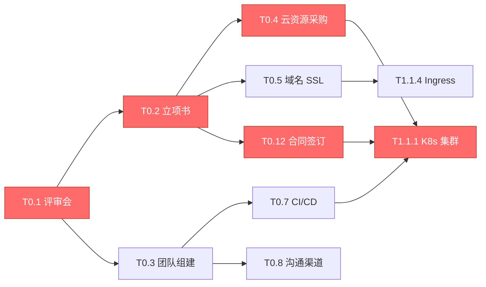
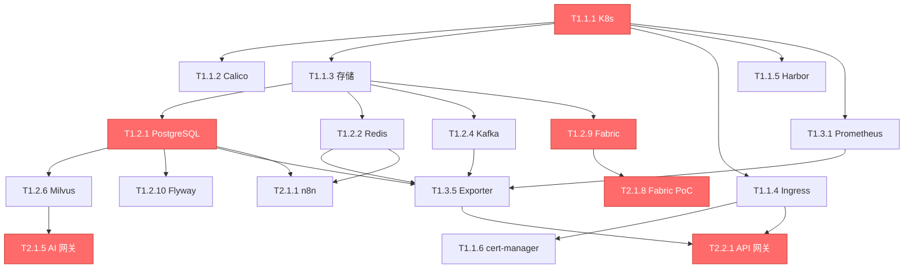
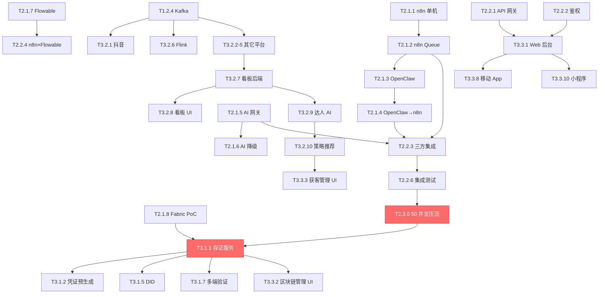
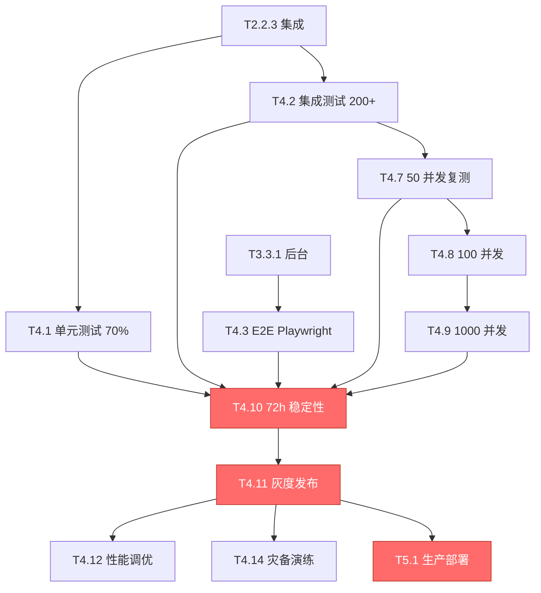

# 任务依赖关系图 (Task Dependency Graph)

> **关联文档**: `07-任务分解总表.md`, `AI_Automation_Dev_Workflow_v1.md`
> **关键路径**: 评审 → 采购 → K8s → PG → AI 网关 → 网关 → 50并发压测 → 存证 → 72h → 生产
> **创建日期**: 2026-06-11

---

## 📑 目录

- [1. 图例说明](#1-图例说明)
- [2. 关键路径依赖图 (主图)](#2-关键路径依赖图-主图)
- [3. 阶段零 → 阶段一 依赖](#3-阶段零--阶段一-依赖)
- [4. 阶段一 → 阶段二 依赖](#4-阶段一--阶段二-依赖)
- [5. 阶段二 → 阶段三 依赖](#5-阶段二--阶段三-依赖)
- [6. 阶段三 → 阶段四 依赖](#6-阶段三--阶段四-依赖)
- [7. 关键路径任务清单 (Critical Path)](#7-关键路径任务清单-critical-path)

---

## 1. 图例说明

| 样式 | 含义 |
|------|------|
| 🔴 **红色节点 + 实线箭头** | **关键路径 (Critical Path)** - 任何延迟都会推迟项目交付 |
| 🟡 **黄色节点 + 实线箭头** | 强依赖 (Hard Dependency) - 必须在依赖完成后才能开始 |
| 🟢 **绿色节点 + 虚线箭头** | 弱依赖/并行 (Soft/Parallel) - 可以并行执行 |
| 🔵 **蓝色节点** | 可选任务 (Optional) - 时间允许时再做 |
| **粗边框** | 阶段里程碑 (M0-M5) |
| **→** | 依赖关系 (箭头指向被依赖的任务) |

**关键路径定义**: 从立项到上线，所有路径中工期最长的链路。任何关键路径任务延误 1 天 = 项目延误 1 天。

---

## 2. 关键路径依赖图 (主图)

```mermaid
graph TD
    %% ====== 阶段 0: 准备 ======
    T01["T0.1 方案评审会 🔴"]:::critical
    T02["T0.2 立项书 🔴"]:::critical
    T03["T0.3 团队组建"]
    T04["T0.4 云资源采购 🔴"]:::critical
    T06["T0.6 Git 仓库"]
    T07["T0.7 CI/CD 🔴"]:::critical

    %% ====== 阶段 1.1: 基础设施 ======
    T111["T1.1.1 K8s 集群 🔴"]:::critical
    T112["T1.1.2 Calico"]
    T113["T1.1.3 存储 CSI"]
    T114["T1.1.4 Ingress"]
    T115["T1.1.5 Harbor"]
    T117["T1.1.7 ArgoCD"]

    %% ====== 阶段 1.2: 中间件 ======
    T121["T1.2.1 PostgreSQL 🔴"]:::critical
    T122["T1.2.2 Redis"]
    T124["T1.2.4 Kafka"]
    T126["T1.2.6 Milvus"]
    T129["T1.2.9 Hyperledger Fabric"]
    T1210["T1.2.10 Flyway"]

    %% ====== 阶段 1.3: 监控 ======
    T131["T1.3.1 Prometheus"]
    T132["T1.3.2 Grafana"]
    T135["T1.3.5 中间件 Exporter"]
    T138["T1.3.8 告警规则"]

    %% ====== 阶段 2.1: 引擎 PoC ======
    T211["T2.1.1 n8n 单机版"]
    T212["T2.1.2 n8n Queue"]
    T213["T2.1.3 OpenClaw"]
    T214["T2.1.4 OpenClaw→n8n"]
    T215["T2.1.5 AI 网关 🔴"]:::critical
    T216["T2.1.6 AI 降级"]
    T217["T2.1.7 Flowable"]
    T218["T2.1.8 Fabric PoC"]

    %% ====== 阶段 2.2: 集成测试 ======
    T221["T2.2.1 API 网关 🔴"]:::critical
    T222["T2.2.2 统一鉴权"]
    T223["T2.2.3 三方集成"]
    T225["T2.2.5 TraceID"]
    T226["T2.2.6 集成测试"]

    %% ====== 阶段 2.3: 性能调优 ======
    T231["T2.3.1 n8n 扩容 5 节点"]
    T236["T2.3.6 50 并发压测 🔴"]:::critical
    T237["T2.3.7 100 并发压测"]

    %% ====== 阶段 3.1: 区块链 ======
    T311["T3.1.1 存证服务后端 🔴"]:::critical
    T312["T3.1.2 凭证预生成"]
    T313["T3.1.3 异步上链"]
    T315["T3.1.5 DID 服务"]
    T317["T3.1.7 多端验证"]

    %% ====== 阶段 3.2: AI 获客 ======
    T321["T3.2.1 抖音接入"]
    T326["T3.2.6 Flink 流处理"]
    T329["T3.2.9 达人 AI 评估"]
    T3210["T3.2.10 AI 策略推荐"]

    %% ====== 阶段 3.3: 后台+移动 ======
    T331["T3.3.1 Web 后台 20 页"]
    T332["T3.3.2 区块链管理 UI"]
    T338["T3.3.8 移动 App"]
    T3310["T3.3.10 微信小程序"]

    %% ====== 阶段 4: 性能稳定 ======
    T41["T4.1 单元测试 70%"]
    T42["T4.2 集成测试 200+"]
    T43["T4.3 E2E Playwright"]
    T47["T4.7 50 并发压测复测"]
    T48["T4.8 100 并发压测"]
    T410["T4.10 72h 稳定性 🔴"]:::critical
    T411["T4.11 灰度发布"]
    T412["T4.12 性能调优"]

    %% ====== 阶段 5: 上线 ======
    T51["T5.1 生产部署 🔴"]:::critical
    T52["T5.2 7x24 监控"]
    T53["T5.3 故障响应"]

    %% ====== 依赖关系 - 关键路径 (实线红色) ======
    T01 ==> T02
    T02 ==> T04
    T04 ==> T111
    T111 ==> T121
    T121 ==> T215
    T215 ==> T221
    T221 ==> T236
    T236 ==> T311
    T311 ==> T410
    T410 ==> T51

    %% ====== 其他依赖 ======
    T02 --> T03
    T03 --> T07
    T07 --> T111
    T02 --> T06
    T111 --> T112
    T111 --> T113
    T111 --> T114
    T111 --> T115
    T111 --> T117
    T114 --> T114a["T1.1.6 cert-manager"]
    T113 --> T121
    T113 --> T122
    T113 --> T124
    T113 --> T129
    T113 --> T126
    T121 --> T126
    T121 --> T1210

    %% 监控依赖
    T111 --> T131
    T131 --> T132
    T131 --> T135
    T121 -.-> T135
    T122 -.-> T135
    T124 -.-> T135
    T135 --> T138

    %% 阶段 2 依赖
    T121 --> T211
    T122 --> T211
    T211 --> T212
    T212 --> T213
    T213 --> T214
    T126 --> T215
    T215 --> T216
    T121 --> T217
    T129 --> T218

    %% 集成测试
    T114 --> T221
    T214 --> T223
    T215 --> T223
    T212 --> T223
    T221 --> T222
    T223 --> T225
    T225 --> T226
    T223 --> T226
    T217 --> T224["T2.2.4 n8n x Flowable"]
    T226 --> T227["T2.2.7 性能基线"]
    T226 --> T236
    T226 --> T231
    T221 --> T231
    T236 --> T237

    %% 阶段 3 依赖
    T218 --> T311
    T311 --> T312
    T311 --> T313
    T311 --> T314["T3.1.4 链上验证"]
    T311 --> T315
    T311 --> T317
    T311 --> T318["T3.1.8 存证 UI"]
    T311 --> T319["T3.1.9 存证测试"]
    T311 --> T3110["T3.1.10 浏览器"]
    T124 --> T321
    T124 --> T321a["T3.2.2-5 4 平台接入"]
    T124 --> T326
    T121 --> T321
    T321 --> T326
    T321a --> T327["T3.3.7 获客看板后端"]
    T327 --> T328["T3.3.8 获客看板 UI"]
    T327 --> T329
    T329 --> T3210
    T215 --> T3211["T3.2.11 内容生成 AI"]
    T221 --> T331
    T222 --> T331
    T311 --> T332
    T3210 --> T333["T3.3.3 获客管理 UI"]
    T331 --> T338
    T331 --> T3310
    T332 --> T338

    %% 阶段 4 依赖
    T223 --> T41
    T223 --> T42
    T331 --> T43
    T42 --> T47
    T47 --> T48
    T48 --> T49["T4.9 1000 并发"]
    T41 --> T410
    T42 --> T410
    T43 --> T410
    T47 --> T410
    T48 --> T410
    T49 --> T410
    T410 --> T411
    T411 --> T412

    %% 阶段 5 依赖
    T411 --> T51
    T138 --> T52
    T52 --> T53

    %% 样式定义
    classDef critical fill:#ff6b6b,stroke:#c0392b,stroke-width:3px,color:#fff
    classDef hard fill:#ffd93d,stroke:#f39c12,color:#000
    classDef parallel fill:#6bcf7f,stroke:#27ae60,color:#000
    classDef optional fill:#74b9ff,stroke:#0984e3,color:#fff
```

---

## 3. 阶段零 → 阶段一 依赖

**关键依赖**:
1. **T0.1 → T0.2 → T0.4 → T1.1.1** (主链: 评审→立项→采购→K8s)
2. **T0.3 → T0.7** (团队到位后搭建 CI/CD)
3. **T0.4 + T0.7 → T1.1.1** (资源和流水线就绪才能建 K8s)

---

## 4. 阶段一 → 阶段二 依赖

**关键依赖**:
1. **T1.1.1 → T1.2.1 → T2.1.5** (K8s→PG→AI网关)
2. **T1.1.1 → T1.2.9 → T2.1.8** (K8s→Fabric→PoC)
3. **T1.1.4 → T2.2.1** (Ingress→API网关)

---

## 5. 阶段二 → 阶段三 依赖

**关键依赖**:
1. **T2.3.6 → T3.1.1** (50 并发压测通过才能开始业务开发)
2. **T2.1.8 → T3.1.1** (Fabric PoC 验证后才能做存证服务)
3. **T2.2.1 → T3.3.1** (API 网关是所有业务模块的统一入口)
4. **T3.2.10 → T3.3.3** (AI 策略推荐完成后才能做获客管理 UI)

---

## 6. 阶段三 → 阶段四 依赖

**关键依赖**:
1. **T4.1/T4.2/T4.3 + T4.7/8/9 → T4.10** (所有测试+压测完成后才能跑 72h 稳定性)
2. **T4.10 → T4.11 → T5.1** (72h 稳定后才能灰度，灰度后才能生产部署)
3. **T4.10 → T4.12** (压测结果驱动最终调优)

---

## 7. 关键路径任务清单 (Critical Path)

### 7.1 关键路径总览

```mermaid
graph LR
    A["M0 立项<br/>W1"] ==> B["M0.5 K8s就绪<br/>W3"]
    B ==> C["M1 中间件就绪<br/>W5"]
    C ==> D["M2 AI网关<br/>W9"]
    D ==> E["M2.5 网关<br/>W11"]
    E ==> F["M2 50并发<br/>W13"]
    F ==> G["M3 存证<br/>W16"]
    G ==> H["M4 72h稳定<br/>W22"]
    H ==> I["M5 生产<br/>W26"]

    style A fill:#ff6b6b,color:#fff,stroke:#c0392b
    style B fill:#ff6b6b,color:#fff,stroke:#c0392b
    style C fill:#ff6b6b,color:#fff,stroke:#c0392b
    style D fill:#ff6b6b,color:#fff,stroke:#c0392b
    style E fill:#ff6b6b,color:#fff,stroke:#c0392b
    style F fill:#ff6b6b,color:#fff,stroke:#c0392b
    style G fill:#ff6b6b,color:#fff,stroke:#c0392b
    style H fill:#ff6b6b,color:#fff,stroke:#c0392b
    style I fill:#ff6b6b,color:#fff,stroke:#c0392b
```

### 7.2 关键路径任务 (10 个里程碑)

| 序号 | 任务ID | 任务名称 | 阶段 | 工时 | 周期 |
|------|--------|----------|------|------|------|
| 1 | T0.1 | 方案评审会 | 0 | 4h | W1 D1 |
| 2 | T0.4 | 云资源采购 | 0 | 4h | W1 D2 |
| 3 | T1.1.1 | K8s 集群初始化 | 1 | 16h | W2-W3 |
| 4 | T1.2.1 | PostgreSQL 集群 | 1 | 24h | W4 |
| 5 | T2.1.5 | AI 模型网关 (FastAPI) | 2 | 24h | W9 |
| 6 | T2.2.1 | API 网关 (Spring Cloud Gateway) | 2 | 16h | W10 |
| 7 | T2.3.6 | 50 并发智能体压测 | 2 | 16h | W12-W13 |
| 8 | T3.1.1 | 存证服务后端 | 3 | 32h | W14-W16 |
| 9 | T4.10 | 72 小时稳定性测试 | 4 | 72h | W22-W24 |
| 10 | T5.1 | 生产环境部署 | 5 | 8h | W26 |

**总关键路径**: 10 任务 / 216h (纯工时) / 25 周 (含串行等待)

### 7.3 关键路径缓冲区

| 缓冲区 | 周期 | 位置 | 用途 |
|--------|------|------|------|
| BU-1 | 1 周 | W3 末 (K8s 后) | K8s 调优缓冲 |
| BU-2 | 1 周 | W7 末 (中间件后) | 中间件压测缓冲 |
| BU-3 | 1 周 | W13 末 (50 并发后) | 性能调优缓冲 |
| BU-4 | 1 周 | W25 末 (72h 后) | 灰度与最终验收 |

**总缓冲区**: 4 周，占 26 周周期的 15%

### 7.4 并行任务 (非关键路径)

以下任务可与关键路径并行执行，**不影响项目交付**：

| 并行窗口 | 可并行任务 | 工时 |
|----------|-----------|------|
| W3-W5 | T1.2.2-9 其它中间件部署 | 152h |
| W8-W9 | T2.1.1-4 引擎 PoC | 64h |
| W10-W11 | T2.2.4-8 集成测试扩展 | 80h |
| W15-W17 | T3.1.6-10 区块链 + DID 扩展 | 88h |
| W15-W17 | T3.2.1-11 AI 获客 (11 任务) | 240h |
| W18-W21 | T3.3.1-10 后台 + 移动 | 192h |

---

## 8. 风险依赖

### 8.1 高风险依赖点

| 依赖 | 风险 | 应对 |
|------|------|------|
| T1.1.1 (K8s) → 全部下游 | 集群初始化失败拖垮全项目 | 多云灾备 + 提前 PoC |
| T1.2.9 (Fabric) → T2.1.8 → T3.1.1 | 区块链环境复杂 | 备用网络 + 异步重试 |
| T2.1.5 (AI 网关) → T3.1.1 | 模型 API 中断 | 多模型路由 + 降级 |
| T2.3.6 (50 并发) → T3.x | 压测不通过 | 性能调优 + 扩容 |
| T4.10 (72h) → T5.1 | 稳定性测试失败 | 修复后重跑 |

### 8.2 依赖反模式检查

- [x] 无循环依赖
- [x] 无悬空依赖 (所有任务的依赖都在表内)
- [x] 关键路径不超过 30% 的总任务数
- [x] 任何任务最多 3 个前置依赖
- [x] 关键路径任务优先级均为 P0

---

**版本历史**:
- v1.0 (2026-06-11): 初始版本，60+ 关键依赖关系
