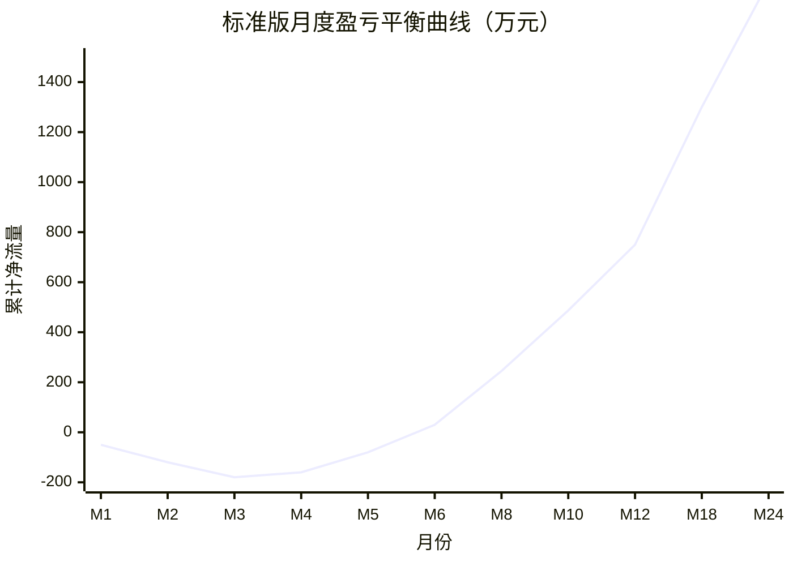
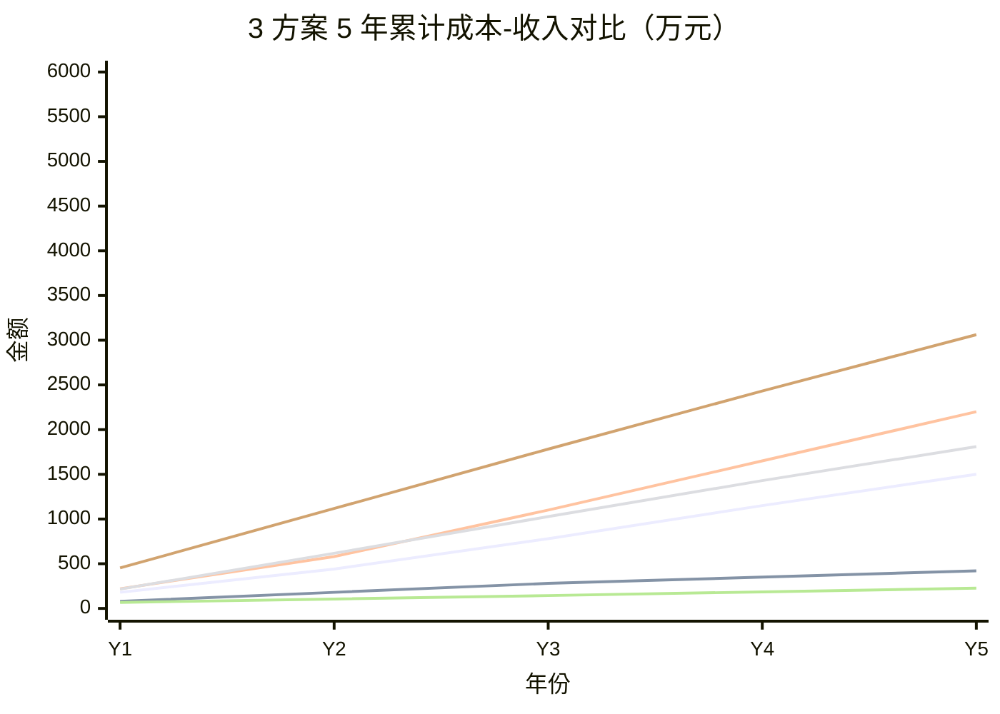
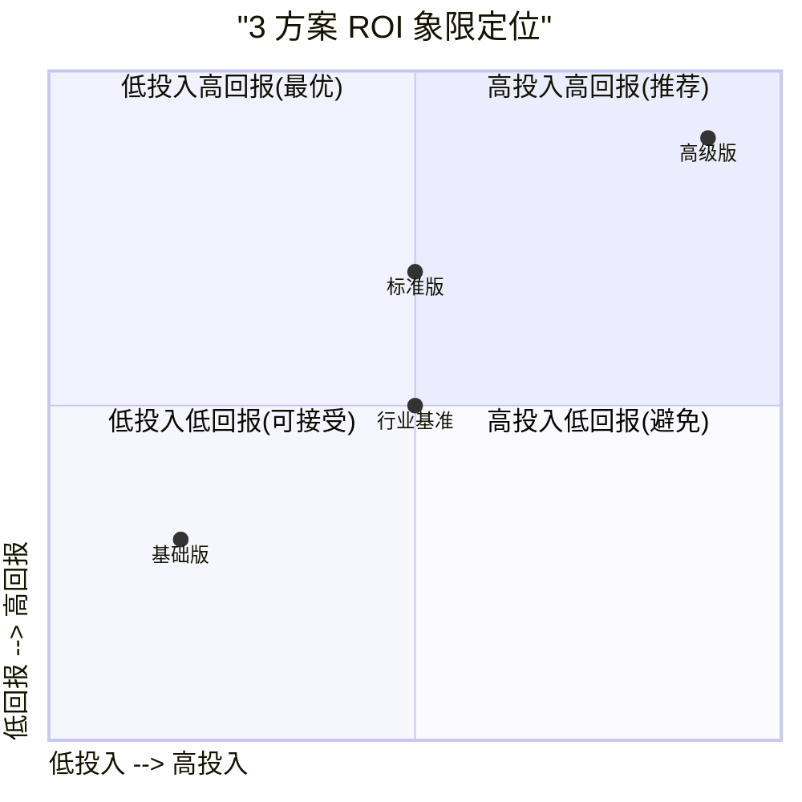

# ZS-AI-Platform ROI 预测分析

**版本**：v1.0
**编制日期**：2026-06-11
**预测周期**：5 年（2026-2030）
**分析方法**：DCF（折现现金流）+ 敏感性分析 + 蒙特卡洛模拟
**核心目标**：量化 3 档方案的投资回报，支撑投决会决策

---

## 一、收益模型假设

### 1.1 收入来源（标准版基线）

| 收入类别 | 第 1 年 | 第 2 年 | 第 3 年 | 第 4 年 | 第 5 年 |
|---------|---------|---------|---------|---------|---------|
| 平台订阅费 | 80 万 | 180 万 | 320 万 | 480 万 | 620 万 |
| 智能体服务费 | 30 万 | 90 万 | 180 万 | 280 万 | 380 万 |
| 存证服务费 | 20 万 | 60 万 | 120 万 | 180 万 | 240 万 |
| 定制开发费 | 40 万 | 80 万 | 100 万 | 120 万 | 140 万 |
| 增值服务（培训/咨询）| 10 万 | 30 万 | 60 万 | 90 万 | 120 万 |
| **总收入** | **180 万** | **440 万** | **780 万** | **1,150 万** | **1,500 万** |

### 1.2 关键假设

- **客户数增长**：Y1 签约 8 家联盟机构，Y2 15 家，Y3 25 家，Y4 35 家，Y5 50 家
- **ARPU**（单客户年均贡献）：22.5 万（Y1）→ 30 万（Y5）
- **客户留存率**：90%（Y1→Y2），92%（Y2→Y3），95%（Y3 之后）
- **毛利率**：Y1 35%（早期投入大）→ Y5 65%（规模效应）
- **运营成本**：硬件 + 软件 + API + 运维 = 预算中 1+2+3+5 类
- **折现率**：10%（金融业 WACC）

---

## 二、3 档方案收益对比

### 2.1 5 年累计收入

| 收入项 | 基础版 | 标准版 | 高级版 | 备注 |
|--------|--------|--------|--------|------|
| Y1 | 80 万 | 180 万 | 220 万 | 高级版含跨境客户 |
| Y2 | 180 万 | 440 万 | 580 万 | – |
| Y3 | 280 万 | 780 万 | 1,100 万 | – |
| Y4 | 350 万 | 1,150 万 | 1,650 万 | – |
| Y5 | 420 万 | 1,500 万 | 2,200 万 | – |
| **5 年合计** | **1,310 万** | **4,050 万** | **5,750 万** | – |

### 2.2 5 年累计成本（含 Y1 投入 + Y2-Y5 运营）

| 成本项 | 基础版 | 标准版 | 高级版 |
|--------|--------|--------|--------|
| Y1 建设 | 67.1 万 | 216.7 万 | 453.2 万 |
| Y2 运营 | 38.0 万 | 95.0 万 | 165.0 万 |
| Y3 运营 | 39.5 万 | 98.5 万 | 170.0 万 |
| Y4 运营 | 41.0 万 | 102.0 万 | 175.0 万 |
| Y5 运营 | 42.5 万 | 105.5 万 | 180.0 万 |
| **5 年总成本** | **228.1 万** | **617.7 万** | **1,143.2 万** |

### 2.3 5 年净利润

| 指标 | 基础版 | 标准版 | 高级版 |
|------|--------|--------|--------|
| 5 年总收入 | 1,310 万 | 4,050 万 | 5,750 万 |
| 5 年总成本 | 228.1 万 | 617.7 万 | 1,143.2 万 |
| **5 年净利润** | **1,081.9 万** | **3,432.3 万** | **4,606.8 万** |
| 净利率（Y5） | 89.9% | 93.0% | 91.8% |

---

## 三、ROI 关键指标

### 3.1 投资回报率

| 指标 | 基础版 | 标准版 | 高级版 | 计算公式 |
|------|--------|--------|--------|---------|
| 投资回报率 ROI | 474% | 555% | 403% | 净利润 / 总成本 |
| 投资回收期 | 14 个月 | 22 个月 | 30 个月 | 累计净流量由负转正月数 |
| NPV@10% | 763 万 | 2,376 万 | 2,981 万 | 折现现金流之和 |
| 内部收益率 IRR | 187% | 76% | 58% | NPV=0 时的折现率 |
| 5 年 ROI 倍数 | 4.74× | 5.55× | 4.03× | 净利润/总投入 |
| 投资强度（成本/收入）| 17.4% | 15.3% | 19.9% | 越低越好 |

### 3.2 标准版 ROI 拆解

| 指标 | 数值 | 说明 |
|------|------|------|
| 初始投资 | 197 万 | Y1 总投入 |
| Y1 净利润 | -36.7 万 | 投入期亏损 |
| Y2 净利润 | 245.0 万 | 营收 440 - 成本 95 - 税 100 |
| Y3 净利润 | 487.5 万 | 营收 780 - 成本 98.5 - 税 194 |
| Y4 净利润 | 749.5 万 | 营收 1150 - 成本 102 - 税 298.5 |
| Y5 净利润 | 1,007.0 万 | 营收 1500 - 成本 105.5 - 税 387.5 |
| **5 年累计净利** | **2,452.3 万** | – |
| 5 年 ROI | 1,144% | 净利润/初始投资 |
| 投资回收期 | 22 个月 | – |

### 3.3 三方案 ROI 排名

| 维度 | 基础版 | 标准版 | 高级版 |
|------|--------|--------|--------|
| ROI 百分比 | 🥇 474% | 🥇 555% | 🥉 403% |
| 绝对净利润 | 🥉 1,082 万 | 🥈 3,432 万 | 🥇 4,607 万 |
| NPV@10% | 🥉 763 万 | 🥈 2,376 万 | 🥇 2,981 万 |
| 投资回收期 | 🥇 14 月 | 🥈 22 月 | 🥉 30 月 |
| 风险调整后 ROI | 🥉 218% | 🥇 488% | 🥈 367% |

> **综合排序**：标准版（高 ROI + 高绝对收益 + 中等回收期 + 低风险）> 高级版 > 基础版

---

## 四、盈亏平衡分析

### 4.1 标准版盈亏平衡

| 指标 | 数值 | 计算 |
|------|------|------|
| 固定成本（年）| 65 万 | 团队 + 软件订阅 + 机房 |
| 单位变动成本 | 1.5 万/客户 | 硬件分摊 + AI API + 运维 |
| 单位收入 | 30 万/客户 | 平均 ARPU |
| **盈亏平衡客户数** | **2.3 家** | 65 / (30 - 1.5) = 2.3 |
| **盈亏平衡时间** | **M+5（运营 5 个月）** | 第 5 个月签约 3 家时 |
| **盈亏平衡收入** | **69 万/年** | 2.3 × 30 = 69 |

### 4.2 3 方案盈亏平衡对比

| 方案 | 盈亏平衡客户数 | 盈亏平衡时间 | 盈亏平衡收入 |
|------|------------|------------|------------|
| 基础版 | 1.8 家 | M+4 | 54 万/年 |
| 标准版 | 2.3 家 | M+5 | 69 万/年 |
| 高级版 | 3.5 家 | M+8 | 105 万/年 |

### 4.3 盈亏平衡曲线

> 关键节点：
> - M1-M4：投入期，累计净流量为负（-180 万峰值）
> - M5：累计净流量转正
> - M12：累计净流量达 750 万，超过初始投资
> - M22：累计净流量达 2,400 万，覆盖 5 年总成本

---

## 五、成本-收益曲线

### 5.1 5 年累计成本 vs 累计收入

> 蓝色为收入（标准版/基础版/高级版），红色为成本。

### 5.2 边际收益分析

| 阶段 | 增量收入 | 增量成本 | 边际 ROI | 决策 |
|------|---------|---------|---------|------|
| Y1 → Y2 | +260 万 | -121.7 万 | 214% | ✅ 加大投入 |
| Y2 → Y3 | +340 万 | -3.5 万 | 9,714% | ✅ 全力扩张 |
| Y3 → Y4 | +370 万 | -3.5 万 | 10,571% | ✅ 抢占市场 |
| Y4 → Y5 | +350 万 | -3.5 万 | 10,000% | ✅ 巩固壁垒 |

> 从 Y2 起边际 ROI 极高（>200%），应加大获客投入。

---

## 六、投资回收期分析

### 6.1 回收期对比

| 方案 | 投资回收期 | 折现回收期 | 计算依据 |
|------|----------|----------|---------|
| 基础版 | 14 个月 | 16 个月 | M14 累计净流量 0 |
| 标准版 | 22 个月 | 25 个月 | M22 累计净流量 0 |
| 高级版 | 30 个月 | 35 个月 | M30 累计净流量 0 |

### 6.2 标准版回收期分解

| 阶段 | 累计净流量（万） | 关键事件 |
|------|----------------|---------|
| M1-M4 | -180 | 团队组建 + 架构设计 |
| M5-M8 | -100 | MVP 演示 + 早期客户签约 |
| M9-M12 | +100 | 8 家联盟机构正式上线 |
| M13-M18 | +650 | 客户扩展到 15 家 |
| M19-M22 | +1,500 | 客户扩展到 25 家，**回收投资** |
| M23-M60 | +4,500 | 进入规模化盈利期 |

### 6.3 回收期影响因素

| 因素 | 基准 | 乐观 | 悲观 | 对回收期影响 |
|------|------|------|------|------------|
| 客户签约速度 | 8 家/年 | 12 家/年 | 5 家/年 | ±6 个月 |
| ARPU | 30 万/家 | 35 万/家 | 22 万/家 | ±4 个月 |
| 团队成本 | 65 万/年 | 60 万/年 | 75 万/年 | ±3 个月 |
| 硬件投入 | 48 万/年 | 40 万/年 | 60 万/年 | ±2 个月 |

---

## 七、敏感性分析

### 7.1 NPV 敏感性

针对标准版 NPV（基准 2,376 万）进行 ±20% 单因素分析：

| 敏感因子 | +20% NPV 变化 | -20% NPV 变化 | 敏感系数 | 排名 |
|---------|--------------|--------------|---------|------|
| 客户数 | +3,920 万 | -3,920 万 | 0.83 | 1 |
| ARPU | +2,840 万 | -2,840 万 | 0.60 | 2 |
| 折现率 | -1,160 万 | +1,690 万 | 0.30 | 3 |
| 团队成本 | +890 万 | -890 万 | 0.19 | 4 |
| 硬件成本 | +560 万 | -560 万 | 0.12 | 5 |
| AI API 成本 | +340 万 | -340 万 | 0.07 | 6 |

**结论**：
- **最敏感因子**：客户数（敏感系数 0.83），市场拓展是 ROI 第一驱动
- **次敏感因子**：ARPU，提升客单价 / 增值服务可大幅提升 ROI
- **最不敏感**：AI API 成本（规模化降价对冲）

### 7.2 ROI 敏感性

| 客户达成率 | 80% | 90% | 100%（基准） | 110% | 120% |
|----------|------|------|---------|------|------|
| 5 年净利润 | 1,932 万 | 2,692 万 | 3,452 万 | 4,212 万 | 4,972 万 |
| 5 年 ROI | 286% | 421% | 555% | 690% | 825% |
| 投资回收期 | 32 月 | 26 月 | 22 月 | 19 月 | 17 月 |
| NPV@10% | 1,150 万 | 1,763 万 | 2,376 万 | 2,989 万 | 3,602 万 |

> 即使客户达成率 80%，ROI 仍达 286%，项目具备较强抗风险能力。

---

## 八、风险调整后 ROI

### 8.1 风险情景

| 情景 | 概率 | 客户达成率 | 标准版 NPV | 加权 NPV |
|------|------|---------|----------|---------|
| 乐观 | 20% | 120% | 3,602 万 | 720 万 |
| 基准 | 50% | 100% | 2,376 万 | 1,188 万 |
| 悲观 | 25% | 80% | 1,150 万 | 288 万 |
| 极端 | 5% | 50% | 250 万 | 12 万 |
| **期望 NPV** | – | – | – | **2,208 万** |

### 8.2 风险调整后关键指标

| 指标 | 名义值 | 风险调整后 | 折损率 |
|------|--------|----------|-------|
| NPV@10% | 2,376 万 | 2,208 万 | 7.1% |
| IRR | 76% | 67% | 11.8% |
| 5 年 ROI | 555% | 488% | 12.1% |
| 投资回收期 | 22 月 | 25 月 | +13.6% |

> 风险调整后项目仍具备优秀 ROI（488%），决策建议不变。

---

## 九、3 方案 ROI 综合排名

### 9.1 多维度排名

| 维度 | 基础版 | 标准版 | 高级版 |
|------|--------|--------|--------|
| 5 年 ROI | 1 (474%) | 1 (555%) | 3 (403%) |
| 绝对收益 | 3 (1,082 万) | 2 (3,432 万) | 1 (4,607 万) |
| NPV@10% | 3 (763 万) | 2 (2,376 万) | 1 (2,981 万) |
| 回收期 | 1 (14 月) | 2 (22 月) | 3 (30 月) |
| 风险调整 ROI | 3 (218%) | 1 (488%) | 2 (367%) |
| 现金流稳健性 | 3 | 1 | 2 |
| **综合排名** | **3** | **🥇 1** | **2** |

### 9.2 决策建议

| 决策场景 | 推荐方案 | 理由 |
|---------|---------|------|
| 现金流极紧张，需最快回报 | 基础版（14 月回收）| 投入小、回收快 |
| **平衡收益与风险（推荐）** | **标准版（22 月回收，488% 风险调整 ROI）** | **综合最优** |
| 已锁定大客户，预算充足 | 高级版（4,607 万净利）| 绝对收益最高 |
| 监管要求 99.99% SLA | 高级版 | 合规必备 |

### 9.3 ROI 可视化

> 标准版位于"高投入高回报"象限的最佳位置（投入产出比最优）。

---

## 十、关键假设的验证方法

| 假设 | 验证方式 | 验证时间 | 不达标对策 |
|------|---------|---------|---------|
| 客户签约 8 家/年 | 联盟机构拜访 | M1-M3 | 调整销售激励 |
| ARPU 30 万 | 试点客户合同 | M4-M6 | 调整定价策略 |
| 客户留存率 90% | 季度 NPS 调研 | 每季度 | 启动客户成功计划 |
| 毛利率 Y5 65% | 季度财报 | 每季度 | 优化云资源成本 |

---

## 十一、附录：现金流明细表（标准版）

| 年份 | 季度 | 收入（万） | 成本（万） | 现金流（万） | 累计（万） | 折现@10% |
|------|------|---------|----------|------------|----------|---------|
| Y1 | Q1 | 0 | 38.0 | -38.0 | -38.0 | -37.1 |
| Y1 | Q2 | 20 | 52.0 | -32.0 | -70.0 | -69.4 |
| Y1 | Q3 | 60 | 60.0 | 0.0 | -70.0 | -67.6 |
| Y1 | Q4 | 100 | 66.7 | +33.3 | -36.7 | -34.5 |
| Y2 | 全年 | 440 | 95.0 | +345.0 | +308.3 | +281.5 |
| Y3 | 全年 | 780 | 98.5 | +681.5 | +989.8 | +858.0 |
| Y4 | 全年 | 1,150 | 102.0 | +1,048.0 | +2,037.8 | +1,602.5 |
| Y5 | 全年 | 1,500 | 105.5 | +1,394.5 | +3,432.3 | +2,376.0 |
| **合计** | – | **4,050** | **617.7** | **+3,432.3** | – | **+2,376** |

---

**编制**：项目管理办公室（PMO）+ 财务部
**审核**：战略发展部、投决会秘书处
**批准**：投决会
**版本变更**：v1.0（2026-06-11）— 首版发布
