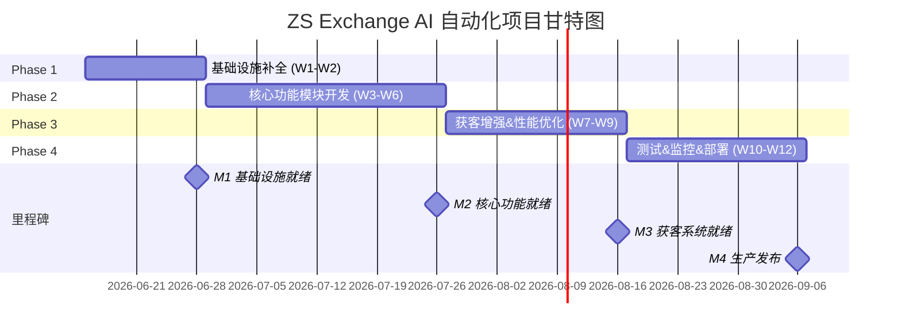
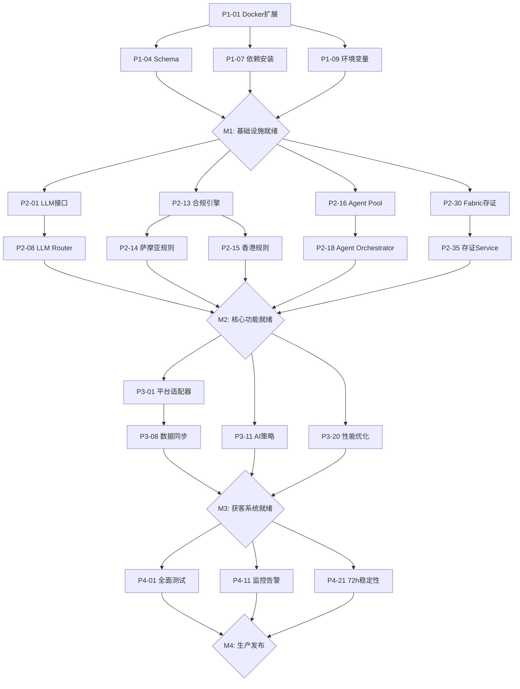
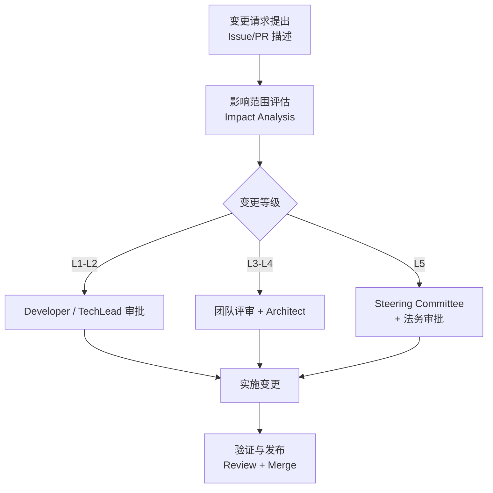

# ZS Exchange AI 自动化解决方案 — 全面项目规划文档

> **文档版本**: v1.0
> **创建日期**: 2026-06-11
> **文档状态**: 待审批
> **适用范围**: 中萨数字科技交易所（ZS Exchange）AI 自动化系统全栈开发
> **计划周期**: 12 周 (Week 1 - Week 12)
> **品牌定位**: 🇼🇸 萨摩亚双边牌照（数字资产交易所 + 证券交易所）合规持牌机构

---

> **目标概述**:
> 本规划文档定义 ZS Exchange（中萨数字科技交易所）AI 自动化解决方案的完整实施路径。基于 ZS Exchange 现有 Next.js 14 App Router 单体应用（src/app/，含 130+ 管理页面）与 NestJS + Prisma 后端微服务架构，本规划将 OpenClaw 智能体引擎、n8n 工作流集成、AI 大模型调用网关、BPM 工作流协同、区块链存证服务、DID 身份认证增强、AI 全球获客系统等核心能力无缝嵌入现有平台，复用统一鉴权、设计系统与数据层。
>
> **关键性能指标 (KPI)**:
> - 支持 50 个并发智能体同时运行
> - 区块链存证响应时间 ≤ 3 秒
> - 获客数据更新频率：实时 / 准实时（≤30s 延迟）
> - 系统稳定性：72 小时连续运行无阻塞性故障
> - API 可用性 ≥ 99.5%
> - **三牌照合规**：🇼🇸 萨摩亚、🇨🇳 海南、🇭🇰 香港牌照规则引擎与 KYC 策略自动适配

---

## 目录

- [第一章 目录结构与命名规范](#第一章-目录结构与命名规范)
  - [1.1 项目根目录总览](#11-项目根目录总览)
  - [1.2 后端 API 目录结构（NestJS + Prisma）](#12-后端-api-目录结构nestjs--prisma)
  - [1.3 前端 Admin Web 目录结构（Next.js 14 App Router）](#13-前端-admin-web-目录结构nextjs-14-app-router)
  - [1.4 基础设施与运维目录](#14-基础设施与运维目录)
  - [1.5 命名规范总则](#15-命名规范总则)
- [第二章 分阶段实施计划](#第二章-分阶段实施计划)
  - [2.1 Phase 1: 基础设施补全 (Week 1-2)](#21-phase-1-基础设施补全-week-1-2)
  - [2.2 Phase 2: 核心功能模块开发 (Week 3-6)](#22-phase-2-核心功能模块开发-week-3-6)
  - [2.3 Phase 3: 获客系统增强 & 性能优化 (Week 7-9)](#23-phase-3-获客系统增强--性能优化-week-7-9)
  - [2.4 Phase 4: 测试 & 监控 & 部署 (Week 10-12)](#24-phase-4-测试--监控--部署-week-10-12)
  - [2.5 里程碑甘特图](#25-里程碑甘特图)
  - [2.6 关键路径与依赖关系](#26-关键路径与依赖关系)
- [第三章 质量标准与验收标准](#第三章-质量标准与验收标准)
  - [3.1 代码质量标准](#31-代码质量标准)
  - [3.2 各模块交付物验收标准](#32-各模块交付物验收标准)
  - [3.3 性能验收标准](#33-性能验收标准)
  - [3.4 安全验收标准](#34-安全验收标准)
  - [3.5 ZS 三牌照合规验收标准](#35-zs-三牌照合规验收标准)
- [第四章 风险评估与应急计划](#第四章-风险评估与应急计划)
  - [4.1 风险登记册（ZS 专项）](#41-风险登记册zs-专项)
  - [4.2 应急响应预案](#42-应急响应预案)
- [第五章 文档要求与审查机制](#第五章-文档要求与审查机制)
  - [5.1 代码内联文档规范](#51-代码内联文档规范)
  - [5.2 流程文档要求](#52-流程文档要求)
  - [5.3 架构决策记录 (ADR) 要求](#53-架构决策记录-adr-要求)
  - [5.4 定期审查机制](#54-定期审查机制)
  - [5.5 变更控制流程](#55-变更控制流程)
- [第六章 审批签字区](#第六章-审批签字区)
- [附录](#附录)

---

## 第一章 目录结构与命名规范

### 1.1 项目根目录总览

```
Stock Exchange dapp20260608-01/                 # ★ ZS Exchange 项目根目录
│
├── src/                                        # Next.js 14 App Router 源码（主应用）
│   ├── app/
│   │   ├── (public)/                           # 公开页面（路由组）
│   │   │   ├── page.tsx                        # 首页
│   │   │   ├── markets/                        # 行情
│   │   │   ├── trade/                          # 交易
│   │   │   ├── licenses/                       # 牌照展示
│   │   │   └── ...
│   │   ├── user/                               # 用户中心
│   │   │   ├── dashboard/
│   │   │   ├── wallet/
│   │   │   └── kyc/                            # KYC 流程
│   │   ├── admin/                              # ★ 管理后台（130+ 页面）
│   │   │   ├── layout.tsx                      # QueryClientProvider
│   │   │   ├── dashboard/                      # 仪表盘
│   │   │   ├── n8n/                            # n8n 模块（增强）
│   │   │   ├── openclaw/                       # OpenClaw 模块（核心）
│   │   │   ├── ai-llm/                         # AI 大模型网关
│   │   │   ├── ai-center/                      # AI 中心
│   │   │   ├── blockchain/                     # 区块链存证（Hyperledger Fabric）
│   │   │   ├── bpm/                            # BPM 流程（Flowable）
│   │   │   ├── dsales/                         # AI 全球获客系统
│   │   │   ├── analytics/                      # 数据分析
│   │   │   ├── command/                        # 指挥中心
│   │   │   ├── cex/                            # 中心化交易
│   │   │   ├── dex/                            # 去中心化交易
│   │   │   ├── defi/
│   │   │   ├── ido/
│   │   │   ├── nfts/
│   │   │   ├── chain/                          # 公链管理
│   │   │   ├── web3/
│   │   │   ├── compliance/                     # ★ 三牌照合规管理
│   │   │   │   ├── samoa/                      # 萨摩亚牌照规则
│   │   │   │   ├── hainan/                     # 海南牌照规则
│   │   │   │   └── hongkong/                   # 香港牌照规则
│   │   │   ├── license/                        # 牌照管理
│   │   │   ├── listing/                        # 挂牌管理（端到端流程）
│   │   │   ├── token/
│   │   │   ├── staking/
│   │   │   ├── transactions/                   # 交易管理
│   │   │   ├── users/                          # 用户管理
│   │   │   ├── wallet/                         # 钱包管理
│   │   │   ├── enterprise/                     # 企业管理
│   │   │   ├── finance/                        # 财务管理（含提现审批）
│   │   │   ├── audit-logs/                     # 审计日志
│   │   │   └── settings/                       # 系统设置
│   │   └── api/                                # 后端 API 路由（Next.js Route Handlers）
│   │       ├── auth/                           # 鉴权（JWT + 外部引擎令牌）
│   │       ├── admin/                          # 管理员 API
│   │       │   ├── n8n/
│   │       │   ├── openclaw/
│   │       │   ├── ai-llm/
│   │       │   ├── blockchain/
│   │       │   ├── bpm/
│   │       │   ├── compliance/
│   │       │   └── ...
│   │       ├── user/                           # 用户 API
│   │       ├── trade/                          # 交易 API
│   │       ├── public/                         # 公开 API
│   │       ├── ws/                             # WebSocket 路由
│   │       │   ├── notifications/route.ts
│   │       │   ├── n8n/route.ts
│   │       │   └── openclaw/route.ts
│   │       ├── proxy/                          # 外部引擎代理
│   │       │   ├── n8n/route.ts
│   │       │   ├── openclaw/route.ts
│   │       │   ├── flowable/route.ts
│   │       │   └── fabric/route.ts
│   │       └── webhooks/                       # Webhook 接收
│   │           ├── n8n/route.ts
│   │           ├── openclaw/route.ts
│   │           └── platform/route.ts
│   ├── components/                             # 共享组件库
│   │   ├── ui/                                 # 基础 UI（C 端）
│   │   ├── admin/                              # 管理后台组件
│   │   │   ├── AdminLayout.tsx
│   │   │   ├── DataTable.tsx
│   │   │   ├── PermissionGuard.tsx
│   │   │   └── FormBuilder.tsx                 # 动态表单
│   │   ├── engine/                             # ★ 外部引擎客户端
│   │   │   ├── N8nClient.ts
│   │   │   ├── OpenClawClient.ts
│   │   │   ├── FlowableClient.ts
│   │   │   ├── FabricClient.ts
│   │   │   └── AIGatewayClient.ts
│   │   ├── providers/                          # Context Providers
│   │   │   ├── ReactQueryProvider.tsx
│   │   │   ├── AuthProvider.tsx
│   │   │   └── NotificationProvider.tsx
│   │   └── ...
│   ├── hooks/                                  # 自定义 Hooks
│   │   ├── useAuth.ts
│   │   ├── useExternalEngine.ts                # 外部引擎统一接口
│   │   └── ...
│   ├── lib/                                    # 工具库
│   │   ├── api-client.ts
│   │   ├── formatters.ts
│   │   ├── validators.ts
│   │   └── logger.ts
│   ├── services/                               # 服务层（API 封装）
│   │   ├── n8n.service.ts
│   │   ├── openclaw.service.ts
│   │   ├── flowable.service.ts
│   │   ├── fabric.service.ts
│   │   ├── ai-gateway.service.ts
│   │   ├── kyc.service.ts
│   │   ├── withdraw.service.ts
│   │   └── listing.service.ts
│   ├── stores/                                 # Zustand 状态
│   ├── types/                                  # TypeScript 类型
│   ├── styles/                                 # 样式
│   ├── constants/                              # 常量
│   ├── config/                                 # 配置
│   └── middleware.ts                           # Next.js 中间件
│
├── backend/                                    # ★ NestJS + Prisma 后端微服务（新建）
│   ├── src/
│   │   ├── modules/                            # 业务模块
│   │   │   ├── auth/
│   │   │   ├── did/                            # 分布式身份
│   │   │   ├── kyc/                            # KYC + 三牌照适配
│   │   │   ├── openclaw/                       # 智能体引擎
│   │   │   ├── ai-models/                      # AI 模型网关
│   │   │   ├── blockchain-evidence/            # 区块链存证
│   │   │   ├── e-signature/                    # 电子签收
│   │   │   ├── n8n/                            # n8n 集成
│   │   │   ├── bpm/                            # BPM 流程（Flowable）
│   │   │   ├── acquisition/                    # 全球获客
│   │   │   ├── compliance/                     # 三牌照合规引擎
│   │   │   ├── license/
│   │   │   ├── listing/
│   │   │   └── ...
│   │   ├── common/                             # 公共组件
│   │   ├── config/
│   │   └── main.ts
│   ├── prisma/
│   │   ├── schema.prisma
│   │   ├── migrations/
│   │   └── seed.ts
│   ├── Dockerfile
│   └── package.json
│
├── docs/                                       # ★ 文档中心
│   ├── 00-项目章程.md
│   ├── 01-项目总体规划/                         # 本文档所在
│   │   ├── ZS-AI-Master-Plan-v1.md
│   │   ├── ZS-Exchange-AI-Automation-Project-Plan-v1.md  # ★ 本文档
│   │   ├── WORK_LOG.md
│   │   └── DECISIONS.md
│   ├── 02-架构设计/
│   ├── 03-模块设计/
│   ├── 04-API文档/                              # 自动生成
│   ├── 05-测试文档/
│   ├── 06-部署运维/
│   ├── 07-用户文档/
│   ├── 08-合规与法律/
│   │   ├── 萨摩亚合规说明.md
│   │   ├── 海南合规说明.md
│   │   ├── 香港合规说明.md
│   │   └── 隐私政策.md
│   ├── 09-设计规范/
│   └── 10-AI协同/
│
├── infrastructure/                              # ★ 基础设施
│   ├── docker/
│   │   ├── n8n.Dockerfile
│   │   ├── openclaw.Dockerfile
│   │   ├── ai-gateway.Dockerfile
│   │   ├── flowable.Dockerfile
│   │   └── fabric/
│   │       ├── docker-compose.yaml
│   │       └── configtx.yaml
│   ├── k8s/
│   │   ├── base/
│   │   ├── overlays/dev/
│   │   ├── overlays/staging/
│   │   └── overlays/prod/
│   ├── monitoring/                             # Prometheus + Grafana + Alertmanager
│   ├── nginx/
│   │   ├── nginx.conf
│   │   └── conf.d/
│   └── terraform/                              # IaC
│
├── database/                                   # 数据库
│   ├── migrations/
│   ├── seeds/
│   └── schemas/
│
├── tests/                                      # 测试目录
│   ├── unit/
│   ├── integration/
│   ├── e2e/                                    # Playwright
│   │   ├── specs/
│   │   │   ├── homepage.spec.ts
│   │   │   ├── trade.spec.ts
│   │   │   ├── admin-dashboard.spec.ts
│   │   │   ├── n8n-workflow.spec.ts
│   │   │   └── kyc-flow.spec.ts
│   │   └── fixtures/
│   ├── performance/                            # k6 脚本
│   └── __mocks__/
│
├── scripts/                                    # 运维/构建脚本
│   ├── qa-check.mjs
│   ├── setup.sh
│   ├── migrate-db.sh
│   ├── backup.sh
│   ├── restore.sh
│   └── health-check.sh
│
├── .github/workflows/                          # CI/CD 流水线
│   ├── ci.yml
│   ├── deploy-staging.yml
│   ├── deploy-production.yml
│   └── security-scan.yml
│
├── docker-compose.yml                          # 完整服务编排
├── docker-compose.dev.yml                      # 开发环境
├── docker-compose.prod.yml                     # 生产环境
├── .env.production
├── ecosystem.config.cjs                        # PM2 进程管理
├── package.json                                # 根 workspace
├── next.config.js
├── tailwind.config.ts
├── tsconfig.json
└── README.md
```

### 1.2 后端 API 目录结构（NestJS + Prisma）

#### 1.2.1 新增模块完整目录树

```
backend/src/modules/
│
├── did/                                        # ✅ 已完成 (95%)
│   ├── did.controller.ts
│   ├── did.service.ts
│   ├── did.module.ts
│   ├── did-n8n-webhooks.controller.ts
│   ├── did-bpm-stubs.service.ts
│   ├── did-bpm-stubs.controller.ts
│   └── dto/
│       ├── register-did.dto.ts
│       └── update-did.dto.ts
│
├── compliance/                                 # ★ 新建 — ZS 三牌照合规引擎 (0% → 85%)
│   ├── compliance.module.ts
│   ├── compliance.controller.ts
│   ├── compliance.service.ts                    # 核心：合规规则引擎
│   │
│   ├── rules/                                  # 牌照规则定义
│   │   ├── samoa.rules.ts                      # 🇼🇸 萨摩亚规则集
│   │   ├── hainan.rules.ts                     # 🇨🇳 海南规则集
│   │   ├── hongkong.rules.ts                   # 🇭🇰 香港规则集
│   │   └── base.rules.ts                       # 抽象基类
│   │
│   ├── kyc-strategies/                         # KYC 策略适配
│   │   ├── samoa-kyc.strategy.ts
│   │   ├── hainan-kyc.strategy.ts
│   │   ├── hongkong-kyc.strategy.ts
│   │   └── kyc-router.service.ts               # 按用户地区自动路由
│   │
│   ├── aml/                                    # 反洗钱检测
│   │   ├── aml-monitor.service.ts
│   │   ├── sanctions-list.service.ts           # 制裁名单匹配
│   │   └── transaction-screening.service.ts
│   │
│   └── dto/
│       ├── check-compliance.dto.ts
│       └── report-incident.dto.ts
│
├── openclaw/                                   # 🔧 从 10% → 90% (Phase 2 重点)
│   ├── openclaw.module.ts
│   ├── openclaw.controller.ts                  # 增强：执行/停止/状态端点
│   ├── openclaw.service.ts                     # 增强：生命周期管理
│   │
│   ├── agents/                                 # ★ Agent 核心引擎
│   │   ├── agent-orchestrator.service.ts       # 50 并发调度
│   │   ├── agent-executor.service.ts           # 单 Agent 执行器
│   │   ├── agent-pool.service.ts               # 连接池（Worker Thread）
│   │   ├── agent-health.service.ts             # 心跳健康检查
│   │   │
│   │   ├── types/
│   │   │   ├── agent.types.ts
│   │   │   ├── task.types.ts
│   │   │   └── protocol.types.ts
│   │   │
│   │   └── strategies/                         # ZS 业务策略
│   │       ├── base-agent.strategy.ts
│   │       ├── kyc-review-agent.strategy.ts    # KYC 自动初审
│   │       ├── compliance-monitor.strategy.ts  # 合规监控
│   │       ├── acquisition-agent.strategy.ts    # 获客策略
│   │       ├── content-agent.strategy.ts        # 内容生成
│   │       ├── analysis-agent.strategy.ts       # 数据分析
│   │       ├── evidence-agent.strategy.ts       # 存证策略
│   │       ├── listing-screener.strategy.ts     # ★ 挂牌筛选 Agent
│   │       └── withdraw-reviewer.strategy.ts    # ★ 提现审核 Agent
│   │
│   └── dto/
│       ├── create-session.dto.ts
│       ├── execute-task.dto.ts
│       └── agent-config.dto.ts
│
├── ai-models/                                  # 🔧 从 60% → 95% (AI 大模型网关)
│   ├── ai-models.module.ts
│   ├── ai-models.service.ts
│   ├── ai-models.controller.ts
│   │
│   ├── llm/                                    # LLM 调用引擎
│   │   ├── llm-provider.interface.ts
│   │   ├── llm-router.service.ts               # 智能路由
│   │   ├── llm-cache.service.ts                # 语义缓存
│   │   ├── token-counter.service.ts
│   │   ├── prompt-builder.service.ts
│   │   │
│   │   └── providers/                          # 5+ Provider
│   │       ├── openai.provider.ts              # GPT-4o / o1 / o3-mini
│   │       ├── anthropic.provider.ts           # Claude 3.5 Sonnet
│   │       ├── qwen.provider.ts                # 通义千问（国内合规）
│   │       ├── deepseek.provider.ts            # DeepSeek-V3
│   │       ├── doubao.provider.ts              # ★ 豆包（多模态备用）
│   │       └── index.ts
│   │
│   └── dto/
│
├── blockchain-evidence/                        # ★ 新建 — 区块链存证（Hyperledger Fabric）
│   ├── blockchain-evidence.module.ts
│   ├── blockchain-evidence.controller.ts
│   ├── blockchain-evidence.service.ts
│   │
│   ├── fabric/                                 # ★ Hyperledger Fabric 集成
│   │   ├── fabric-gateway.service.ts           # Fabric Gateway SDK
│   │   ├── fabric-network.config.ts            # 网络配置（多组织）
│   │   ├── chaincode/                          # 链码
│   │   │   ├── evidence-chaincode.ts           # 存证链码
│   │   │   └── license-chaincode.ts            # 牌照存证链码
│   │   └── wallet/
│   │       └── zs-wallet.json                  # 身份钱包
│   │
│   ├── ipfs/                                   # IPFS 文件存储
│   │   └── ipfs.service.ts                     # Pinata / Kubo
│   │
│   ├── guards/
│   │   └── blockchain-signature.guard.ts
│   │
│   └── dto/
│       ├── create-evidence.dto.ts
│       └── verify-evidence.dto.ts
│
├── e-signature/                                # ★ 新建 — 电子签收
│   ├── e-signature.module.ts
│   ├── e-signature.service.ts                  # 核心：签署业务逻辑
│   │
│   ├── pdf/
│   │   └── pdf-generator.service.ts            # PDFKit 文档生成
│   ├── crypto/
│   │   └── signature.service.ts                # EdDSA / 国密 SM2
│   │
│   └── dto/
│       ├── sign-request.dto.ts
│       └── verify-signature.dto.ts
│
├── n8n/                                        # 🔧 从 5% → 85% (深度集成)
│   ├── n8n.module.ts
│   ├── n8n.controller.ts
│   ├── n8n.service.ts
│   ├── n8n-integration.service.ts
│   ├── n8n-webhook.service.ts
│   │
│   └── workflows/                              # ZS 业务工作流
│       ├── kyc-onboarding.template.ts          # KYC 接入
│       ├── license-verification.template.ts    # ★ 牌照验证工作流
│       ├── listing-pipeline.template.ts        # ★ 挂牌端到端流程
│       ├── withdraw-approval.template.ts       # ★ 提现审批流程
│       ├── compliance-alert.template.ts        # 合规告警
│       └── daily-report.template.ts
│
├── bpm/                                        # 🔧 从 70% → 90% (Flowable 集成)
│   ├── bpm.module.ts
│   ├── bpm.controller.ts
│   ├── bpm.service.ts
│   ├── flowable-client.service.ts              # ★ Flowable REST 客户端
│   ├── bpm-agent-bridge.service.ts             # BPM ↔ Agent 桥接
│   │
│   └── process-definitions/                    # BPMN 2.0 流程定义
│       ├── kyc-review.bpmn
│       ├── listing-approval.bpmn               # 挂牌审批
│       └── withdraw-review.bpmn                # 提现审核
│
├── acquisition/                                # 🔧 从 65% → 90% (AI 全球获客)
│   ├── acquisition.module.ts
│   ├── acquisition.controller.ts
│   ├── acquisition.service.ts
│   ├── acquisition-sync.service.ts             # 平台数据同步
│   ├── acquisition-ws.gateway.ts               # WebSocket 实时推送
│   ├── acquisition-ai.service.ts               # AI 策略推荐
│   │
│   ├── adapters/                               # ★ 7+ 平台适配器
│   │   ├── base-platform.adapter.ts
│   │   ├── douyin.adapter.ts                   # 抖音
│   │   ├── xiaohongshu.adapter.ts              # 小红书
│   │   ├── wechat-video.adapter.ts             # 微信视频号
│   │   ├── instagram.adapter.ts                # Instagram
│   │   ├── youtube.adapter.ts                  # YouTube
│   │   ├── tiktok-global.adapter.ts            # TikTok
│   │   └── twitter-x.adapter.ts                # ★ X（推特）
│   │
│   └── dto/
│
├── documents/                                  # 🔧 从 25% → 80%
│   ├── documents.module.ts
│   ├── documents.controller.ts
│   ├── documents.service.ts
│   ├── file-upload.service.ts                  # MinIO 集成
│   └── dto/
│
├── auth/                                       # ✅ 已完成
├── wallets/                                    # ✅ 已完成
├── kyc/                                        # 🔧 增强：三牌照适配
├── sbt/                                        # ✅ 已完成
├── platform-access/                            # ✅ 已完成
├── users/                                      # ✅ 已完成
│
└── ... 其余已有模块保持不变
```

#### 1.2.2 Common 公共组件扩展

```
backend/src/common/
│
├── guards/
│   ├── jwt-auth.guard.ts                       # ✅ JWT 认证
│   ├── permissions.guard.ts                    # ✅ 权限校验（RBAC）
│   ├── webhook-signature.guard.ts              # ✅ Webhook HMAC 签名
│   ├── rate-limit.guard.ts                     # ★ 新建 — 限流 Guard
│   ├── api-key.guard.ts                        # ★ 新建 — 外部引擎 API Key
│   ├── compliance.guard.ts                     # ★ 新建 — 合规检查 Guard
│   └── blockchain-signature.guard.ts           # ★ 新建 — Fabric 身份签名验证
│
├── filters/
│   ├── all-exceptions.filter.ts                # ✅ 全局异常处理
│   └── http-exception.filter.ts                # ★ 新建
│
├── interceptors/
│   ├── logging.interceptor.ts                  # ★ 请求日志（含 RequestID）
│   ├── transform.interceptor.ts                # 响应格式标准化
│   ├── cache.interceptor.ts                    # Redis 缓存
│   └── compliance-audit.interceptor.ts         # ★ 合规审计拦截器
│
├── decorators/
│   ├── public.decorator.ts                     # @Public()
│   ├── rate-limit.decorator.ts                 # @RateLimit()
│   ├── cache.decorator.ts                      # @Cache()
│   ├── compliance-scope.decorator.ts           # ★ @ComplianceScope() 声明所需牌照
│   └── audit-log.decorator.ts                  # ★ @AuditLog() 自动审计
│
├── services/
│   ├── prisma.service.ts                       # ✅ Prisma 单例
│   ├── audit.service.ts                        # ✅ 审计日志
│   ├── redis.service.ts                        # ★ Redis 连接管理
│   ├── rabbitmq.service.ts                     # ★ RabbitMQ 连接管理
│   ├── minio.service.ts                        # ★ MinIO 客户端
│   ├── notification.service.ts                 # ★ 通知发送
│   └── license-context.service.ts              # ★ 当前牌照上下文服务
│
└── constants/
    ├── error-codes.constants.ts
    ├── status.constants.ts
    ├── license-regions.constants.ts            # ★ 牌照地区常量
    └── compliance-levels.constants.ts          # ★ 合规等级常量
```

### 1.3 前端 Admin Web 目录结构（Next.js 14 App Router）

```
src/app/admin/
│
├── n8n/                                        # ✅ 已存在 — 增强
│   ├── page.tsx                                # 工作流列表
│   ├── workflows/[id]/page.tsx
│   ├── executions/page.tsx
│   └── credentials/page.tsx
│
├── openclaw/                                   # ✅ 已存在 — 增强（核心）
│   ├── page.tsx                                # Agent 看板
│   ├── agents/
│   │   ├── page.tsx                            # Agent 列表
│   │   ├── [id]/page.tsx                       # Agent 详情
│   │   └── [id]/sessions/page.tsx              # 会话历史
│   ├── tasks/page.tsx                          # 任务队列
│   ├── strategies/page.tsx                     # 策略管理
│   └── components/
│       ├── AgentStatusBadge.tsx
│       ├── SessionTimeline.tsx
│       └── TaskLogViewer.tsx
│
├── ai-llm/                                     # ✅ 已存在 — 增强
│   ├── page.tsx                                # 模型总览
│   ├── providers/page.tsx                      # Provider 管理
│   ├── models/page.tsx                         # 模型实例
│   ├── prompts/page.tsx                        # Prompt 模板（Monaco Editor）
│   ├── cost/page.tsx                           # 成本分析
│   └── logs/page.tsx                           # 调用日志
│
├── blockchain/                                 # ✅ 已存在 — 增强（Fabric 集成）
│   ├── page.tsx                                # 存证记录
│   ├── upload/page.tsx                         # 上传存证
│   ├── verify/page.tsx                         # 存证验证
│   ├── certificates/page.tsx                   # 存证证书
│   ├── fabric-network/page.tsx                 # ★ Fabric 网络状态
│   └── components/
│       ├── TxLink.tsx
│       ├── HashDisplay.tsx
│       └── EvidenceTimeline.tsx
│
├── bpm/                                        # ✅ 已存在 — 增强
│   ├── page.tsx                                # 流程总览
│   ├── processes/page.tsx                      # 流程定义
│   ├── instances/page.tsx                      # 流程实例
│   ├── tasks/page.tsx                          # 我的待办
│   ├── sla/page.tsx                            # SLA 报告
│   └── components/
│       ├── BpmDiagram.tsx                      # 流程图渲染（bpmn.js）
│       └── TaskCard.tsx
│
├── dsales/                                     # ✅ 已存在 — 增强（AI 全球获客）
│   ├── page.tsx                                # 获客看板
│   ├── platforms/page.tsx                      # 平台账号
│   ├── campaigns/page.tsx                      # 营销活动
│   ├── leads/page.tsx                          # 线索漏斗
│   ├── influencers/page.tsx                    # 达人库
│   ├── content-calendar/page.tsx               # 内容日历
│   ├── ai-strategy/page.tsx                    # AI 策略面板
│   └── reports/page.tsx                        # 报告中心
│
├── compliance/                                 # ★ 新建 — 三牌照合规管理
│   ├── page.tsx                                # 合规总览
│   ├── samoa/page.tsx                          # 🇼🇸 萨摩亚
│   ├── hainan/page.tsx                         # 🇨🇳 海南
│   ├── hongkong/page.tsx                       # 🇭🇰 香港
│   ├── rules/page.tsx                          # 规则编辑器
│   ├── kyc-policies/page.tsx                   # KYC 策略
│   ├── aml-monitoring/page.tsx                 # AML 监控
│   ├── sanctions/page.tsx                      # 制裁名单
│   └── incidents/page.tsx                      # 合规事件
│
├── license/                                    # ✅ 已存在 — 增强
│   ├── page.tsx                                # 牌照总览
│   ├── samoa/page.tsx
│   ├── hainan/page.tsx
│   ├── hongkong/page.tsx
│   └── upload/page.tsx                         # 牌照存证
│
├── listing/                                    # ★ 端到端挂牌流程
│   ├── page.tsx                                # 挂牌总览
│   ├── apply/page.tsx                          # 申请
│   ├── review/page.tsx                         # AI 审核
│   ├── approve/page.tsx                        # 终审
│   └── history/page.tsx                        # 历史
│
├── finance/                                    # ✅ 已存在 — 增强
│   ├── page.tsx
│   ├── withdraw/page.tsx                       # 提现审批（端到端）
│   └── audit/page.tsx                          # 财务审计
│
└── settings/                                   # ✅ 已存在 — 增强
    ├── page.tsx
    ├── engines/page.tsx                        # 外部引擎配置
    ├── security/page.tsx                       # 安全策略
    ├── notifications/page.tsx                  # 通知配置
    └── license-context/page.tsx                # ★ 牌照上下文切换
```

### 1.4 基础设施与运维目录

```
infrastructure/
│
├── docker/
│   ├── docker-compose.dev.yml                  # 开发环境
│   ├── docker-compose.prod.yml                 # ★ 生产环境编排
│   ├── n8n.Dockerfile
│   ├── openclaw.Dockerfile
│   ├── ai-gateway.Dockerfile
│   ├── flowable.Dockerfile
│   └── fabric/
│       ├── docker-compose.yaml                 # Fabric 多组织网络
│       ├── configtx.yaml
│       ├── crypto-config.yaml
│       └── chaincode/
│
├── nginx/
│   ├── nginx.conf
│   └── conf.d/
│       ├── api.conf                            # NestJS API 反向代理
│       ├── admin.conf                          # Next.js Admin
│       ├── websocket.conf                      # WebSocket
│       ├── n8n.conf
│       ├── openclaw.conf
│       ├── flowable.conf
│       └── fabric.conf
│
├── monitoring/
│   ├── prometheus/
│   │   ├── prometheus.yml
│   │   └── rules/
│   │       ├── api-alerts.yml
│   │       ├── agent-alerts.yml
│   │       └── compliance-alerts.yml           # ★ 合规告警规则
│   ├── grafana/
│   │   ├── dashboards/
│   │   │   ├── api-overview.json
│   │   │   ├── agent-monitoring.json
│   │   │   ├── blockchain-evidence.json
│   │   │   ├── acquisition-dashboard.json
│   │   │   ├── compliance-overview.json        # ★ 合规总览
│   │   │   └── three-license-status.json       # ★ 三牌照状态
│   │   └── datasources/
│   └── alertmanager/
│       └── alertmanager.yml                    # 钉钉 / 邮件 / 短信
│
├── k8s/
│   ├── base/
│   │   ├── api-deployment.yaml
│   │   ├── admin-deployment.yaml
│   │   └── engines/
│   ├── overlays/dev/
│   ├── overlays/staging/
│   └── overlays/prod/
│
└── terraform/                                  # IaC（可选）
```

### 1.5 命名规范总则

#### 1.5.1 文件命名规范

| 类型 | 规范 | 示例 |
|------|------|------|
| **TypeScript 文件** | `kebab-case.ts` | `agent-orchestrator.service.ts` |
| **类型定义文件** | `*.types.ts` | `agent.types.ts` |
| **DTO 文件** | `*.dto.ts` | `create-evidence.dto.ts` |
| **接口文件** | `*.interface.ts` | `llm-provider.interface.ts` |
| **Next.js 页面** | `page.tsx` + `kebab-case` 目录 | `app/admin/dsales/page.tsx` |
| **React 组件** | `PascalCase.tsx` | `AgentStatusBadge.tsx` |
| **测试文件** | `*.spec.ts` 或 `*.test.ts` | `evidence.e2e.spec.ts` |
| **BPMN 流程** | `kebab-case.bpmn` | `listing-approval.bpmn` |
| **链码文件** | `kebab-case.ts` | `evidence-chaincode.ts` |
| **配置文件** | `kebab-case.yml` | `docker-compose.prod.yml` |
| **文档文件** | `UPPER-CASE.md` 或 `Title-Case.md` | `README.md` |

#### 1.5.2 代码标识符命名规范

| 范围 | 规范 | 示例 |
|------|------|------|
| **Class 类名** | `PascalCase` | `BlockchainEvidenceService`, `AgentPool` |
| **Interface 接口** | `PascalCase` + `I` 前缀 | `ILlmProvider`, `IAgentTask` |
| **Type 类型别名** | `PascalCase` | `AgentStatus`, `EvidenceType` |
| **枚举** | `PascalCase` + 成员 `PascalCase` | `LicenseRegion.Samoa` |
| **方法/函数** | `camelCase` | `createEvidence()`, `verifySignature()` |
| **变量/参数** | `camelCase` | `fileHash`, `txReceipt` |
| **常量** | `UPPER_SNAKE_CASE` | `MAX_AGENT_POOL_SIZE`, `SAMOA_LICENSE_CODE` |
| **数据库表名** | `snake_case` (Prisma @@map) | `blockchain_evidences`, `compliance_logs` |
| **API 路由** | `kebab-case` | `/api/blockchain-evidence/upload` |
| **环境变量** | `UPPER_SNAKE_CASE` | `BLOCKCHAIN_RPC_URL`, `FABRIC_NETWORK_CONFIG` |
| **Docker 服务名** | `kebab-case` | `zs-exchange-api`, `zs-exchange-redis` |

#### 1.5.3 三牌照标识约定

| 牌照 | 代码常量 | 路由前缀 | 域名 |
|------|---------|---------|------|
| 🇼🇸 萨摩亚 | `SAMOA` | `/samoa/...` | `samoa.zs-exchange.com` |
| 🇭🇰 香港 | `HONGKONG` | `/hk/...` | `hk.zs-exchange.com` |
| 🇳🇿 新西兰（待激活） | `NEWZEALAND` | `/nz/...` | `nz.zs-exchange.com` |

#### 1.5.4 Git Commit 规范

采用 Conventional Commits：

```
<type>(<scope>): <subject>

<body>

<footer>
```

**Type 列表**:

| Type | 用途 | 示例 |
|------|------|------|
| `feat` | 新功能 | `feat(blockchain): add evidence creation endpoint` |
| `fix` | Bug 修复 | `fix(did): resolve register 500 error on empty body` |
| `docs` | 文档 | `docs(api): add swagger description for webhook endpoints` |
| `style` | 格式调整 | `style(admin): fix lint warnings in List.tsx` |
| `refactor` | 重构 | `refactor(agents): extract pool management to separate service` |
| `perf` | 性能优化 | `perf(cache): add Redis caching layer for stats endpoints` |
| `test` | 测试 | `test(evidence): add integration tests for verify endpoint` |
| `chore` | 构建/工具 | `chore(deps): upgrade ethers.js to v6` |
| `compliance` | 合规相关 | `compliance(samoa): add KYC threshold rule` |

---

## 第二章 分阶段实施计划

### 2.1 Phase 1: 基础设施补全 (Week 1-2)

**目标**: 搭建所有后续开发所需的基础设施，确保开发环境一致性。

#### Week 1: Docker 扩展 + 数据库 Schema + 依赖安装

| 天 | 任务 ID | 任务描述 | 产出物 | 依赖 |
|----|---------|----------|--------|------|
| D1 | P1-01 | 扩展 docker-compose.yml，添加 n8n/RabbitMQ/MinIO/Prometheus/Grafana/Flowable/Fabric-peer 8个服务 | `docker-compose.dev.yml` | 无 |
| D1 | P1-02 | 创建生产环境编排 docker-compose.prod.yml（含健康检查、资源限制、日志驱动） | `infrastructure/docker/docker-compose.prod.yml` | P1-01 |
| D1 | P1-03 | 创建 Nginx 完整配置（API/WS/SSL/Gzip/限速/8 个外部引擎代理） | `infrastructure/nginx/conf.d/*.conf` | P1-01 |
| D2 | P1-04 | 编写 9 个新 Prisma 模型（FileStorage, BlockchainEvidence, ESignature, AgentSession, AgentTask, LlmCallLog, NotificationRule, ComplianceLog, LicenseContext） | Schema 新增 ~400行 | 无 |
| D2 | P1-05 | 执行 Prisma migrate，生成迁移 SQL 并验证（SQLite 开发 / PG 生产） | `prisma/migrations/xxx_add_ai_automation_models/` | P1-04 |
| D2 | P1-06 | 更新 seed.ts，添加新模型的种子数据（含三牌照示例数据） | `prisma/seed.ts` 更新 | P1-05 |
| D3 | P1-07 | 安装后端新依赖包（@nestjs/microservices, minio, pdfkit, openai, @anthropic-ai/sdk, ioredis, amqplib, fabric-network） | `backend/package.json` 更新 | 无 |
| D3 | P1-08 | 安装前端新依赖（recharts/d3 图表库, monaco-editor, react-signature-pad, xterm.js, bpmn-js） | `package.json` 更新 | 无 |
| D3 | P1-09 | 扩展 .env.production，添加所有新服务环境变量（约 50 个新变量，含三牌照配置） | `.env.production` 更新 | P1-01 |
| D4 | P1-10 | 创建 Redis 服务封装（连接池、重连、键前缀管理） | `backend/src/common/services/redis.service.ts` | P1-07 |
| D4 | P1-11 | 创建 RabbitMQ 服务封装（连接管理、通道池、确认模式） | `backend/src/common/services/rabbitmq.service.ts` | P1-07 |
| D4 | P1-12 | 创建 MinIO 服务封装（Bucket 管理、分片上传、预签名 URL） | `backend/src/common/services/minio.service.ts` | P1-07 |
| D4 | P1-13 | 创建 Fabric Gateway 客户端封装（连接 / 调用 / 事件监听） | `backend/src/modules/blockchain-evidence/fabric/fabric-gateway.service.ts` | P1-07 |
| D5 | P1-14 | 创建统一错误码常量文件（含合规错误码 10xxx） | `common/constants/error-codes.constants.ts` | 无 |
| D5 | P1-15 | 创建统一状态枚举常量文件 | `common/constants/status.constants.ts` | 无 |
| D5 | P1-16 | 创建三牌照地区与合规等级常量 | `common/constants/license-regions.constants.ts` | 无 |
| D5 | P1-17 | 验证：Docker Compose up 全部服务启动成功，健康检查通过 | 验证报告 | P1-01~P1-16 |

#### Week 2: 公共基础设施 + CI/CD 完善

| 天 | 任务 ID | 任务描述 | 产出物 | 依赖 |
|----|---------|----------|--------|------|
| D1 | P1-18 | 创建请求日志拦截器（RequestID、耗时、请求体脱敏） | `common/interceptors/logging.interceptor.ts` | P1-10 |
| D1 | P1-19 | 创建响应格式标准化拦截器（统一 `{success,data,message}` 格式） | `common/interceptors/transform.interceptor.ts` | 无 |
| D1 | P1-20 | 创建 Redis 缓存拦截器（TTL、Key 生成、缓存穿透防护） | `common/interceptors/cache.interceptor.ts` | P1-18 |
| D2 | P1-21 | 创建 @RateLimit() 自定义装饰器 | `common/decorators/rate-limit.decorator.ts` | 无 |
| D2 | P1-22 | 创建 @Cache() 自定义装饰器 | `common/decorators/cache.decorator.ts` | P1-20 |
| D2 | P1-23 | 创建 API Key 鉴权 Guard（用于 n8n/Flowable/Fabric 回调） | `common/guards/api-key.guard.ts` | 无 |
| D2 | P1-24 | 创建合规审计 Guard（@ComplianceScope 自动校验牌照权限） | `common/guards/compliance.guard.ts` | P1-16 |
| D3 | P1-25 | 完善 GitHub Actions CI（添加安全扫描、Docker 构建验证、负载测试触发） | `.github/workflows/ci.yml` | 已有 ci.yml |
| D3 | P1-26 | 创建预发布部署流水线 | `.github/workflows/deploy-staging.yml` | P1-25 |
| D3 | P1-27 | 创建生产部署流水线（含审批门禁 + 合规门禁） | `.github/workflows/deploy-production.yml` | P1-26 |
| D4-D5 | P1-28 | Phase 1 集成验证：全部新服务启动、API 健康检查、DB 迁移回滚测试 | Phase 1 验收报告 | 全部 P1 任务 |

**Phase 1 里程碑 M1**: 基础设施就绪 — 所有容器服务可运行，数据库 Schema 完成，CI/CD 流水线可用，三牌照配置已就位。

**M1 验收标准**:
- [ ] `docker compose -f docker-compose.dev.yml up -d` 启动 12 个服务全部 healthy
- [ ] `npx prisma migrate dev` 执行无错误，新模型可通过 Prisma Client 操作
- [ ] `npm run build` 后端编译 0 错误
- [ ] CI 流水线在 main 分支 push 时自动通过
- [ ] Redis/MQ/MinIO/Flowable/Fabric-peer 连接测试脚本全部 PASS
- [ ] 三牌照地区常量与配置可正确加载

---

### 2.2 Phase 2: 核心功能模块开发 (Week 3-6)

**目标**: 实现 6 大核心功能模块的业务逻辑，达到可独立演示的水平。

#### Week 3: LLM 调用引擎 + 合规引擎 + Agent Pool 基础框架

| 天 | 任务 ID | 任务描述 | 产出物 | 依赖 |
|----|---------|----------|--------|------|
| D1 | P2-01 | 定义 LLM 统一接口 `ILlmProvider`（chatCompletion/streamCompletion/embed/countTokens） | `llm/llm-provider.interface.ts` | M1 |
| D1 | P2-02 | 实现 OpenAI Provider（GPT-4o/o1/o3-mini） | `llm/providers/openai.provider.ts` | P2-01 |
| D1 | P2-03 | 实现 Anthropic Provider（Claude 3.5 Sonnet/Opus） | `llm/providers/anthropic.provider.ts` | P2-01 |
| D2 | P2-04 | 实现 DeepSeek Provider（高性价比，长上下文） | `llm/providers/deepseek.provider.ts` | P2-01 |
| D2 | P2-05 | 实现 Qwen Provider（国内合规，通义千问 Max/Plus） | `llm/providers/qwen.provider.ts` | P2-01 |
| D2 | P2-06 | 实现豆包 Provider（多模态备用） | `llm/providers/doubao.provider.ts` | P2-01 |
| D3 | P2-07 | 创建 Provider 工厂（按名称/场景动态选择） | `llm/providers/index.ts` | P2-02~P2-06 |
| D3 | P2-08 | 实现 LLM Router 服务（按场景/成本/延迟智能路由） | `llm/llm-router.service.ts` | P2-07 |
| D3 | P2-09 | 实现 LLM 语义缓存服务（Embedding 相似度匹配，Redis） | `llm/llm-cache.service.ts` | P2-08 |
| D4 | P2-10 | 实现 Token 计费统计服务 | `llm/token-counter.service.ts` | P2-08 |
| D4 | P2-11 | 实现 Prompt 组装服务（模板变量替换、上下文窗口管理） | `llm/prompt-builder.service.ts` | P2-08 |
| D4 | P2-12 | 创建 ChatCompletion DTO + Controller | `ai-models.controller.ts` | P2-08~P2-11 |
| D5 | P2-13 | 设计合规规则引擎（基于策略模式的规则加载与匹配） | `compliance/rules/base.rules.ts` | M1 |
| D5 | P2-14 | 实现 🇼🇸 萨摩亚规则集（KYC 阈值、交易限额、币种白名单） | `compliance/rules/samoa.rules.ts` | P2-13 |
| D5 | P2-15 | 实现 🇭🇰 香港规则集（SFC 合规要求、券商类规则） | `compliance/rules/hongkong.rules.ts` | P2-13 |

#### Week 4: Agent 引擎核心（50 并发架构） + 三牌照适配

| 天 | 任务 ID | 任务描述 | 产出物 | 依赖 |
|----|---------|----------|--------|------|
| D1 | P2-16 | 实现 Agent Pool 服务（Worker Thread 池，最大 50 并发，动态扩缩容） | `agents/agent-pool.service.ts` | M1, P1-11 |
| D1 | P2-17 | 实现 Agent Executor 服务（生命周期：init→idle→running→pause→complete/error） | `agents/agent-executor.service.ts` | P2-16 |
| D1 | P2-18 | 实现 Agent Orchestrator 服务（任务分发、优先级队列、失败重试、死信） | `agents/agent-orchestrator.service.ts` | P2-16, P2-17 |
| D2 | P2-19 | 实现 Agent Health Check 服务（心跳检测、超时标记、自动恢复） | `agents/agent-health.service.ts` | P2-18 |
| D2 | P2-20 | 实现 RabbitMQ Agent Task Consumer | 集成代码 | P2-18, P1-11 |
| D2 | P2-21 | 创建 Agent Session CRUD | `openclaw.controller.ts` 更新 | P2-18 |
| D3 | P2-22 | 创建 Agent 抽象基类 Strategy | `agents/strategies/base-agent.strategy.ts` | P2-17 |
| D3 | P2-23 | 实现 KYC 审核 Agent（三牌照 KYC 路由） | `agents/strategies/kyc-review-agent.strategy.ts` | P2-22, P2-15 |
| D3 | P2-24 | 实现合规监控 Agent（实时检查用户行为是否符合三牌照规则） | `agents/strategies/compliance-monitor.strategy.ts` | P2-22, P2-13 |
| D4 | P2-25 | 实现挂牌筛选 Agent（AI 评估项目资质） | `agents/strategies/listing-screener.strategy.ts` | P2-22 |
| D4 | P2-26 | 实现提现审核 Agent（自动风控评估） | `agents/strategies/withdraw-reviewer.strategy.ts` | P2-22 |
| D4 | P2-27 | 实现获客 Agent、内容生成 Agent、数据分析 Agent、存证 Agent | 4 个 strategy 文件 | P2-22 |
| D5 | P2-28 | Agent 引擎集成测试（50 并发模拟 Agent，运行 10 分钟） | 测试报告 | P2-16~P2-27 |
| D5 | P2-29 | OpenClaw Module 整合（注册所有新 Service） | `openclaw.module.ts` 更新 | P2-16~P2-27 |

#### Week 5: 区块链存证（Hyperledger Fabric） + 电子签收

| 天 | 任务 ID | 任务描述 | 产出物 | 依赖 |
|----|---------|----------|--------|------|
| D1 | P2-30 | 设计并实现存证链码（Fabric Chaincode - TypeScript） | `chaincode/evidence-chaincode.ts` | M1 |
| D1 | P2-31 | 实现牌照存证链码 | `chaincode/license-chaincode.ts` | P2-30 |
| D1 | P2-32 | 实现 Fabric Gateway 客户端（连接、调用、事件监听） | `fabric/fabric-gateway.service.ts` | P1-13 |
| D2 | P2-33 | 配置 Fabric 多组织网络（Orderer + 2 Orgs + 4 Peers） | `infrastructure/docker/fabric/` | P2-32 |
| D2 | P2-34 | 实现 IPFS 服务封装 | `ipfs/ipfs.service.ts` | P1-12 |
| D2 | P2-35 | 实现存证核心 Service（上传→哈希→IPFS→链码调用→返回证书，端到端 <3s） | `blockchain-evidence.service.ts` | P2-32, P2-34 |
| D3 | P2-36 | 实现存证验证 Service（链上查询→哈希比对） | `blockchain-evidence.service.ts` (verify) | P2-32 |
| D3 | P2-37 | 实现 Fabric 身份签名 Guard | `guards/blockchain-signature.guard.ts` | P1-07 |
| D3 | P2-38 | 创建存证 Controller（POST 上传、GET 验证、GET 证书、GET 列表） | `blockchain-evidence.controller.ts` | P2-35~P2-37 |
| D4 | P2-39 | 实现文件上传 Service（MinIO 分片上传、断点续传） | `documents/file-upload.service.ts` | P1-12 |
| D4 | P2-40 | 实现 PDF 生成服务（PDFKit 模板：合同/报告/证书） | `pdf/pdf-generator.service.ts` | P1-07 |
| D4 | P2-41 | 实现数字签名服务（EdDSA + 国密 SM2 备选） | `crypto/signature.service.ts` | P1-07 |
| D5 | P2-42 | 实现电子签收核心 Service（发起→签名→PDF 嵌入→Fabric 存证） | `e-signature.service.ts` | P2-35, P2-40, P2-41 |
| D5 | P2-43 | 创建签收 Controller | `e-signature.controller.ts` | P2-42 |
| D5 | P2-44 | 存证+签收集成测试 | E2E 测试 | P2-38, P2-43 |

#### Week 6: n8n 深度集成 + Flowable BPM 联动 + 端到端业务流

| 天 | 任务 ID | 任务描述 | 产出物 | 依赖 |
|----|---------|----------|--------|------|
| D1 | P2-45 | 实现 n8n HTTP Client 封装 | `n8n-integration.service.ts` | M1 |
| D1 | P2-46 | 实现 Webhook 注册服务 | `n8n-webhook.service.ts` | P2-45 |
| D1 | P2-47 | 创建 6 个 ZS 核心工作流模板（含挂牌、提现、合规） | `workflows/*.template.ts` | P2-46 |
| D2 | P2-48 | 实现 DID / KYC / 存证事件联动 n8n | `n8n.service.ts` 增强 | P2-45 |
| D2 | P2-49 | 实现挂牌事件联动 n8n（端到端挂牌流程） | `n8n.service.ts` 增强 | P2-48 |
| D2 | P2-50 | 实现提现事件联动 n8n（端到端提现审批） | `n8n.service.ts` 增强 | P2-48 |
| D3 | P2-51 | 实现 Flowable REST 客户端封装 | `flowable-client.service.ts` | M1 |
| D3 | P2-52 | 实现 BPM ↔ Agent Bridge（BPM 任务节点触发 Agent） | `bpm-agent-bridge.service.ts` | P2-18, P2-51 |
| D3 | P2-53 | 部署 3 个核心 BPMN 流程（KYC 审核、挂牌审批、提现审核） | `process-definitions/*.bpmn` | P2-52 |
| D4 | P2-54 | Documents 模块增强（关联 FileStorage + Fabric 存证） | `documents.service.ts` | P2-39 |
| D4 | P2-55 | Acquisition Mock 替换为真实数据源 | `acquisition.service.ts` 重构 | P2-27 |
| D4-D5 | P2-56 | Phase 2 集成验证：LLM + Agent + 存证 + 签收 + n8n + BPM + 三牌照合规 | Phase 2 验收报告 | 全部 P2 任务 |

**Phase 2 里程碑 M2**: 核心功能就绪 — 6 大模块可独立运行并通过冒烟测试，三牌照规则引擎可路由。

**M2 验收标准**:
- [ ] LLM 调用：5 个 Provider 均可正常 chatCompletion + streamCompletion
- [ ] Agent 引擎：50 个 Agent 并发运行 ≥10 分钟无崩溃
- [ ] 区块链存证：端到端 < 3 秒（缓存命中 <100ms）
- [ ] 电子签收：完整签署流程可走通
- [ ] n8n 集成：6 个工作流模板可正确导入和执行
- [ ] Flowable BPM：3 个核心流程可启动并执行
- [ ] 三牌照合规：🇼🇸/🇭🇰 规则可正确路由，KYC 策略自动适配

---

### 2.3 Phase 3: 获客系统增强 & 性能优化 (Week 7-9)

**目标**: 将获客系统从 Mock 数据升级为真实运营系统，并满足性能 KPI。

#### Week 7: 获客平台适配器 + 数据同步

| 天 | 任务 ID | 任务描述 | 产出物 | 依赖 |
|----|---------|----------|--------|------|
| D1 | P3-01 | 实现抽象平台适配器基类 | `adapters/base-platform.adapter.ts` | M2 |
| D1 | P3-02 | 实现抖音创作者平台适配器 | `adapters/douyin.adapter.ts` | P3-01 |
| D1 | P3-03 | 实现小红书专业号平台适配器 | `adapters/xiaohongshu.adapter.ts` | P3-01 |
| D2 | P3-04 | 实现微信视频号适配器 | `adapters/wechat-video.adapter.ts` | P3-01 |
| D2 | P3-05 | 实现 Instagram Graph API 适配器 | `adapters/instagram.adapter.ts` | P3-01 |
| D2 | P3-06 | 实现 YouTube Data API 适配器 | `adapters/youtube.adapter.ts` | P3-01 |
| D3 | P3-07 | 实现 TikTok for Business 适配器 | `adapters/tiktok-global.adapter.ts` | P3-01 |
| D3 | P3-08 | 实现 X（推特）适配器 | `adapters/twitter-x.adapter.ts` | P3-01 |
| D3 | P3-09 | 实现数据同步引擎（定时批量 + 增量 + 冲突解决） | `acquisition-sync.service.ts` | P3-02~P3-08 |
| D4-D5 | P3-10 | 适配器单元测试（happy path + auth failure + rate limit） | 测试套件 | P3-02~P3-08 |

#### Week 8: AI 获客策略 + WebSocket 实时推送

| 天 | 任务 ID | 任务描述 | 产出物 | 依赖 |
|----|---------|----------|--------|------|
| D1 | P3-11 | 实现 AI 策略推荐服务 | `acquisition-ai.service.ts` | M2, P3-09 |
| D1 | P3-12 | 实现达人智能匹配算法 | `acquisition-ai.service.ts` (match) | P3-09 |
| D1 | P3-13 | 实现预算分配优化算法 | `acquisition-ai.service.ts` (budget) | P3-09 |
| D2 | P3-14 | 实现 WebSocket Gateway（连接管理、心跳、断线重连） | `acquisition-ws.gateway.ts` | P1-10 |
| D2 | P3-15 | 实现实时数据推送 | `acquisition-ws.gateway.ts` | P3-14 |
| D2 | P3-16 | 前端 WebSocket 客户端 | `src/lib/ws-client.ts` | P3-14 |
| D3 | P3-17 | 前端获客看板页面 | `src/app/admin/dsales/page.tsx` | P3-15, P3-16 |
| D3 | P3-18 | 前端达人库页面 + AI 策略面板 | 2 个页面 | P3-12, P3-11 |
| D4-D5 | P3-19 | 获客系统端到端测试 | E2E 测试套件 | P3-10~P3-18 |

#### Week 9: 性能优化达标

| 天 | 任务 ID | 任务描述 | 产出物 | 依赖 |
|----|---------|----------|--------|------|
| D1 | P3-20 | API 响应优化：统计类接口加 Redis 缓存 | 缓存层实现 | P1-20 |
| D1 | P3-21 | 数据库查询优化：慢查询分析 + 索引优化 | SQL 优化报告 | M2 |
| D1 | P3-22 | 存证性能优化：文件去重索引 + 预存证缓存 + 链码调用异步化 | 性能基准测试 | P2-35 |
| D2 | P3-23 | Agent 并发压力测试：50 并发 1 小时，监控内存/CPU/队列 | 压测报告 | M2 |
| D2 | P3-24 | 内存泄漏排查 | 修复记录 | P3-23 |
| D2 | P3-25 | 前端构建优化：Code Splitting、Lazy Loading、Bundle 分析 | Bundle Report | M1 |
| D3 | P3-26 | Nginx 配置优化：Gzip、缓存头、限速、连接超时 | `nginx/conf.d/*.conf` | P1-03 |
| D3 | P3-27 | PostgreSQL 连接池调优 | 配置优化 | P3-21 |
| D3-D5 | P3-28 | Phase 3 性能验收：全部 KPI 达标 | Phase 3 验收报告 | P3-20~P3-27 |

**Phase 3 里程碑 M3**: 获客系统上线就绪 — 真实数据、实时展示、性能达标。

**M3 验收标准**:
- [ ] 至少 3 个国内 + 2 个海外平台适配器可正常同步数据
- [ ] 获客看板数据刷新延迟 ≤ 30 秒
- [ ] AI 策略推荐响应时间 ≤ 5 秒
- [ ] 50 个 Agent 并发运行 1 小时，内存稳定无泄漏
- [ ] 存证 P99 响应时间 ≤ 3 秒
- [ ] 前端首屏加载时间 ≤ 2 秒（4G 网络）

---

### 2.4 Phase 4: 测试 & 监控 & 部署 (Week 10-12)

**目标**: 确保系统质量达到生产标准，完成 72 小时稳定性验证。

#### Week 10: 全面测试

| 天 | 任务 ID | 任务描述 | 产出物 | 依赖 |
|----|---------|----------|--------|------|
| D1 | P4-01 | Unit Tests：核心 Service 覆盖率 ≥ 80%（LLM/Agent/存证/合规） | ~200 个用例 | M3 |
| D1 | P4-02 | Unit Tests：Common 层测试 | ~50 个用例 | M1 |
| D2 | P4-03 | Integration Tests：API 端到端测试 | ~80 个用例 | M3 |
| D2 | P4-04 | Integration Tests：Webhook 回调测试 | ~15 个用例 | M2 |
| D3 | P4-05 | E2E Tests：用户旅程（KYC → 挂牌 → 提现 → 存证） | ~15 个 Playwright | M3 |
| D3 | P4-06 | E2E Tests：管理员操作旅程 | ~10 个 Playwright | M3 |
| D4 | P4-07 | Performance Tests：50 Agent 并发负载（k6 脚本） | 压测脚本+报告 | M3 |
| D4 | P4-08 | Performance Tests：存证接口压力（100 QPS × 5 分钟） | 压测报告 | M3 |
| D5 | P4-09 | Security Tests：OWASP Top 10 扫描 + 渗透测试 | 安全报告 | M3 |
| D5 | P4-10 | 缺陷修复周：P1/P2 全部修复 | 缺陷跟踪表 | P4-01~P4-09 |

#### Week 11: 监控告警 + 生产部署准备

| 天 | 任务 ID | 任务描述 | 产出物 | 依赖 |
|----|---------|----------|--------|------|
| D1 | P4-11 | Prometheus 指标埋点 | 指标代码 | M3 |
| D1 | P4-12 | Grafana 仪表盘配置（6+ 张核心仪表盘） | Grafana JSON | P4-11 |
| D1 | P4-13 | Alertmanager 告警规则（8+ 条核心 + 三牌照合规告警） | `alertmanager.yml` | P4-12 |
| D2 | P4-14 | 日志聚合配置（结构化 JSON + Loki 收集） | 日志配置 | M3 |
| D2 | P4-15 | PM2 生产配置完善 | `ecosystem.config.cjs` | M1 |
| D2 | P4-16 | 生产环境 .env.final 生成 | `.env.production` 最终版 | M3 |
| D3 | P4-17 | 数据库备份脚本 | `scripts/backup-db.sh` | M3 |
| D3 | P4-18 | 健康检查端点完善（含三牌照状态探针） | health controller | M3 |
| D3 | P4-19 | 一键部署脚本 | `scripts/deploy.sh` | P4-15~P4-18 |
| D4-D5 | P4-20 | 预发布环境部署 + 冒烟测试 | Staging 验收报告 | P4-11~P4-19 |

#### Week 12: 72h 稳定性测试 + 文档 + 发布

| 天 | 任务 ID | 任务描述 | 产出物 | 依赖 |
|----|---------|----------|--------|------|
| D1-D3 | P4-21 | **72 小时连续稳定性测试**：20 用户 + 30 Agent，每 6 小时巡检 | 稳定性报告 | P4-20 |
| D4 | P4-22 | 操作手册编写（部署指南、日常运维、故障排查、备份恢复） | `docs/06-部署运维/` 补充 | P4-21 |
| D4 | P4-23 | API 文档完善（Swagger/OpenAPI 3.0） | Swagger UI 完善 | M3 |
| D5 | P4-24 | 用户操作手册（含三牌照合规操作） | 用户手册 | M3 |
| D5 | P4-25 | **正式发布**：打 Tag、构建生产镜像、部署、DNS 切换、公告 | Release v1.0.0 | P4-21~P4-24 |

**Phase 4 里程碑 M4**: 生产就绪 — 通过 72h 稳定性测试，文档齐全，已发布。

**M4 验收标准**:
- [ ] 单元测试覆盖率 ≥ 80%，集成测试全部通过
- [ ] E2E 关键用户旅程 100% 通过
- [ ] 72 小时连续运行：0 次非计划重启，错误率 < 0.1%
- [ ] 监控告警：8+ 条规则全部生效，测试告警可正常触发
- [ ] 三牌照合规：🇼🇸/🇭🇰 规则切换零延迟
- [ ] 备份恢复验证：可在 30 分钟内从备份完全恢复
- [ ] 部署文档完整，新人可在 2 小时内完成环境搭建

---

### 2.5 里程碑甘特图



```
Week:     1    2    3    4    5    6    7    8    9    10   11   12
          ├────┤├────┤├────┤├────┤├────┤├────┤├────┤├────┤├────┤├────┤├────┤

Phase 1:  [====基础设施补全====]
          ████████████████████
                              M1 ✓

Phase 2:            [========核心功能模块开发=========]
                    ████████████████████████████████████
                                                M2 ✓

Phase 3:                              [==获客增强&性能优化==]
                                          ████████████████████████
                                                              M3 ✓

Phase 4:                                            [==测试&监控&部署==]
                                                      ████████████████████████
                                                                          M4 ✓

关键节点:
M1 基础设施就绪     ████ W2End
M2 核心功能就绪     ████████████ W6End
M3 获客系统就绪     ████████████████ W9End
M4 生产发布         ████████████████████ W12End
```

### 2.6 关键路径与依赖关系



**关键路径（Critical Path）**:
```
P1-01 → P1-04 → M1 → P2-01 → P2-08 → P2-16 → P2-18 → M2 → P3-01 → P3-08 → M3 → P4-01 → P4-21 → M4
```
**关键路径长度**: 12 周（无浮动时间）

**高风险依赖**:
- P2-16 (Agent Pool) 依赖 P1-11 (RabbitMQ) — 消息队列是 Agent 并发的硬依赖
- P2-35 (Fabric 存证) 依赖 P2-32 (Fabric Gateway) — 多组织网络部署复杂度高
- P3-01 (平台适配器) 依赖第三方 API 稳定性 — 外部 API 可能变更
- P2-13 (合规引擎) 依赖法务确认三牌照规则 — 规则定义需法务深度参与

---

## 第三章 质量标准与验收标准

### 3.1 代码质量标准

#### 3.1.1 TypeScript 代码规范

| 规范项 | 标准 | 检查方式 |
|--------|------|---------|
| **编译零错误** | `npx tsc --noEmit` 输出 0 errors, 0 warnings | CI 自动检查 |
| **ESLint 通过** | `npx eslint src --max-warnings=50` | CI 自动检查 |
| **any 类型禁止** | 代码中不允许出现 `: any` 或 `as any`（DTO 解析除外） | Code Review |
| **复杂度限制** | 单函数圈复杂度 ≤ 15，单文件行数 ≤ 500 | ESLint complexity |
| **命名一致** | 符合 1.5.2 节命名规范 | Code Review |
| **注释必要** | 公共方法必须有 JSDoc 注释 | Code Review |
| **魔法数字消除** | 数字常量必须提取为命名常量 | Code Review |
| **错误处理** | 所有 async 调用必须有 try-catch 或 .catch() | Code Review |

#### 3.1.2 NestJS 特定规范

| 规范项 | 标准 |
|--------|------|
| **Module 边界清晰** | 禁止循环依赖；每个 Module 只引用自身需要的 Module |
| **DTO 验证完整** | 所有入参 DTO 必须使用 class-validator 装饰器 |
| **Guard 正确使用** | 敏感端点必须使用 JwtAuthGuard；公开端点必须标注 @Public() |
| **Service 可测试** | Service 依赖通过 constructor 注入，便于 Mock |
| **Controller 瘦身** | Controller 只做参数解析和调用 Service |
| **异常统一** | 使用 AllExceptionsFilter，禁止直接 throw 原始 Error |
| **合规标注** | 涉及牌照的端点必须标注 @ComplianceScope('SAMOA' \| 'HONGKONG') |

#### 3.1.3 React/Next.js 前端规范

| 规范项 | 标准 |
|--------|------|
| **组件职责单一** | 每个组件 ≤ 300 行，超过则拆分 |
| **Hooks 规范** | 自定义 Hook 以 `use` 开头，副作用必须在 useEffect 中清理 |
| **类型安全** | 禁止 `as any` 强制转换，未知数据先定义 interface |
| **API 调用封装** | 所有 API 调用通过 `lib/api-client.ts` 统一封装 |
| **Next.js 14** | 优先使用 Server Components，交互组件需明确标注 'use client' |
| **无障碍访问** | 语义化 HTML，图片 alt 属性，颜色对比度 ≥ 4.5:1 |

### 3.2 各模块交付物验收标准

#### 3.2.1 OpenClaw 智能体引擎

| 验收项 | 标准 | 验证方法 |
|--------|------|---------|
| 并发能力 | 50 个 Agent 同时运行 1 小时不崩溃 | 压力测试脚本 |
| 资源控制 | 单 Agent 内存 ≤ 100MB，CPU ≤ 单核 30% | Node.js profiler |
| 任务分发 | 任务从入队到开始执行平均延迟 ≤ 500ms | 日志时间戳对比 |
| 失败恢复 | Agent 异常终止后 30 秒内自动重启 | kill -9 测试 |
| 心跳健康 | 每 10 秒上报心跳，连续 3 次缺失标记异常 | Redis key TTL 检查 |
| 策略扩展 | 新增 Agent 策略只需继承基类 + 注册 | 实际添加一个测试策略 |

#### 3.2.2 LLM 调用引擎

| 验收项 | 标准 | 验证方法 |
|--------|------|---------|
| 多 Provider | 5 个 Provider 均可正常 chatCompletion + streamCompletion | 单元测试 |
| 智能路由 | 根据场景自动选择最优 Provider | 路由决策日志 |
| 流式输出 | SSE 流式输出首 token 延迟 ≤ 2 秒 | curl 测试 |
| 缓存命中率 | 相似查询缓存命中率 ≥ 40% | Redis 统计 |
| Token 计费 | 每次 LLM 调用准确记录 input/output tokens 和费用 | DB 查询验证 |
| 错误降级 | Provider 不可用时自动切换到备用 Provider | 模拟 Provider 故障 |

#### 3.2.3 区块链存证服务（Hyperledger Fabric）

| 验收项 | 标准 | 验证方法 |
|--------|------|---------|
| 端到端延迟 | 文件上传 → 存证证书返回 P99 ≤ 3 秒 | 性能基准测试 |
| 缓存命中 | 相同文件重复存证返回 < 100ms | 重复请求测试 |
| 数据完整性 | 存证哈希 = 原始文件 SHA256（链上可验证） | hash 对比验证 |
| 多组织共识 | 至少 2 个组织背书，交易通过 Orderer 排序 | 链码调用验证 |
| 链上可查 | 通过 txId 可在 Fabric Explorer 查到 | 区块浏览器验证 |
| 并发存证 | 10 QPS 并发存证无丢失、无重复 | 并发测试脚本 |

#### 3.2.4 电子签收服务

| 验收项 | 标准 | 验证方法 |
|--------|------|---------|
| 签名真实性 | 使用 EdDSA/ECDSA + 国密 SM2 备选 | 代码审计 |
| 文档完整性 | 签名后的 PDF 哈希与原文一致 | hash 验证 |
| 不可否认性 | 签名包含时间戳 + 签名者 DID + 文档 ID | 证书内容检查 |
| 签名验证 | 任何第三方可使用公钥验证签名有效性 | 独立验证脚本 |
| 审计追踪 | 每次签署/验证操作记录审计日志 | DB audit_log 表查询 |
| 链上存档 | 签署完成后自动 Fabric 存证 | 存证记录查询 |

#### 3.2.5 获客系统

| 验收项 | 标准 | 验证方法 |
|--------|------|---------|
| 平台覆盖 | 至少接入 3 个国内 + 2 个海外平台 | 适配器数量统计 |
| 数据新鲜度 | 数据更新延迟 ≤ 30 分钟（准实时） | 时间戳对比 |
| WebSocket | 连接断开后 5 秒内自动重连 | 网络断开测试 |
| AI 推荐 | 策略推荐响应 ≤ 5 秒，匹配度评分合理 | 功能测试 |
| 达人库 | 支持筛选/搜索/批量操作/数据导出 | 功能测试 |

#### 3.2.6 n8n 工作流集成

| 验收项 | 标准 | 验证方法 |
|--------|------|---------|
| 工作流导入 | 6 个模板均可正确导入 n8n UI | 手动导入验证 |
| 事件触发 | DID/KYC/挂牌/提现/存证事件可正确触发对应工作流 | Webhook 测试 |
| 执行状态 | 可通过 API 查询工作流执行状态和结果 | API 调用验证 |
| 错误处理 | 工作流执行失败时有明确错误日志和重试机制 | 故意制造失败测试 |

#### 3.2.7 三牌照合规引擎

| 验收项 | 标准 | 验证方法 |
|--------|------|---------|
| 规则自动路由 | 用户注册/交易时根据地区自动匹配 🇼🇸/🇭🇰/🇳🇿 规则 | 单元测试 |
| KYC 策略适配 | 不同地区 KYC 字段/阈值/材料不同 | 策略单元测试 |
| 交易限额 | 不同地区单笔/日累计/年度限额 | 规则引擎测试 |
| 制裁名单 | 用户/地址匹配 OFAC/UN 制裁名单 | 名单匹配测试 |
| 合规事件 | 可疑交易自动标记 + 触发合规告警工作流 | 集成测试 |
| 审计日志 | 所有合规决策记录到 compliance_log 表 | DB 查询验证 |
| 牌照切换 | 当前牌照上下文变更 < 1 秒生效 | 切换测试 |

### 3.3 性能验收标准

| 指标 | 目标值 | 测量方法 | 工具 |
|------|--------|---------|------|
| **API 平均响应时间** | P50 < 200ms, P99 < 2000ms | APM 监控 | Prometheus + Grafana |
| **API 可用性** | ≥ 99.5% (月度) | Uptime 监控 | 自研 + UptimeRobot |
| **存证响应时间** | P99 ≤ 3000ms | 端到端计时 | k6 / Artillery |
| **Fabric 链码调用** | P99 ≤ 2500ms | 链码调用计时 | Fabric metrics |
| **Agent 并发数** | ≥ 50 同时运行 | Pool 监控 | 自研 metrics |
| **获客数据延迟** | ≤ 30 秒（准实时） | 时间戳差 | WS 推送日志 |
| **合规检查延迟** | P99 ≤ 100ms | 规则引擎计时 | APM |
| **数据库查询** | 无 > 1s 的慢查询 | PG slow log | pg_stat_statements |
| **Redis 命中率** | ≥ 85% | Redis INFO | redis-cli |
| **前端首屏加载** | ≤ 2s (4G) | Lighthouse | Chrome DevTools |
| **WebSocket 延迟** | 消息推送延迟 < 1s | 时间戳差 | 自测 |
| **内存占用** | API 进程 < 512MB, 前端构建 < 5MB (gzipped) | 系统监控 | top / webpack-bundle-analyzer |

### 3.4 安全验收标准

| 安全域 | 标准 | 验证方式 |
|--------|------|---------|
| **认证授权** | 所有敏感端点返回 401（未登录时） | 自动化安全测试 |
| **SQL 注入** | Prisma ORM 参数化查询，无拼接 SQL | 代码审计 |
| **XSS 防护** | 前端 React 自动转义 + CSP 头 | 安全扫描 |
| **CSRF 防护** | API 使用 Bearer Token（非 Cookie） | 架构评审 |
| **Webhook 安全** | HMAC-SHA256 签名验证 + IP 白名单 | 渗透测试 |
| **Fabric 身份** | 所有链码调用需有效 MSP 身份 | Fabric CA 验证 |
| **敏感数据加密** | 数据库字段 AES 加密，传输 TLS 1.3 | 配置检查 |
| **密钥管理** | 生产密钥不在代码中，使用 Vault/环境变量 | 代码扫描 |
| **速率限制** | 所有公开端点有 RateLimit 保护 | 压力测试 |
| **依赖安全** | 无已知 High/Critical CVE | `npm audit` |
| **权限最小化** | Docker 容器以 non-root 用户运行 | Dockerfile 检查 |
| **合规隔离** | 不同牌照的数据物理/逻辑隔离 | 集成测试 |

### 3.5 ZS 三牌照合规验收标准

| 验收项 | 标准 | 验证方法 |
|--------|------|---------|
| **🇼🇸 萨摩亚规则生效** | 用户地区=WS 时，所有 KYC/交易/币种规则走萨摩亚规则集 | 集成测试 |
| **🇭🇰 香港规则生效** | 用户地区=HK 时，触发 SFC 相关规则 | 集成测试 |
| **🇳🇿 新西兰规则预留** | LicenseContext 可加载 NZ 规则集（即使未激活） | 单元测试 |
| **规则热更新** | 修改规则配置后无需重启服务即可生效 | 运行时验证 |
| **合规审计追溯** | 任何用户操作可追溯到当时生效的规则版本 | DB 查询 |
| **监管报告** | 可导出 🇼🇸/🇭🇰 监管机构要求的合规报告 | 报告功能测试 |

---

## 第四章 风险评估与应急计划

### 4.1 风险登记册（ZS 专项）

| ID | 风险描述 | 概率 | 影响 | 风险等级 | 所属阶段 | 缓解措施 | 应急计划 |
|----|---------|------|------|---------|---------|---------|---------|
| R01 | **第三方 LLM API 不稳定或价格大幅上涨** | 中 | 高 | **高** | P2 | 多 Provider 架构 + 智能路由 + 本地缓存 | 启用 DeepSeek/Qwen 降级方案；紧急采购备用 API Key |
| R02 | **Hyperledger Fabric 多组织部署复杂度高** | 高 | 高 | **高** | P1-P2 | PoC 先用 2 Org + 2 Peer 简化拓扑；详细 docker-compose 模板 | 切换为单 Org Solo 模式；先存数据库 + 后续上链 |
| R03 | **Agent 并发 50 导致内存溢出 OOM** | 中 | 高 | **高** | P2-P3 | Worker Thread 限制 + 内存监控 + 自动扩缩容 | 降低并发上限至 30；启用 RabbitMQ 持久化队列堆积 |
| R04 | **外部获客平台 API 变更或封号** | 高 | 中 | **高** | P3 | 适配器抽象层 + 版本化 API + Mock 兜底 | 降级为手动录入模式；紧急联系平台商务 |
| R05 | **n8n + Flowable 双工作流引擎学习曲线陡峭** | 中 | 中 | **中** | P2 | 预制 6+3 个核心模板 + 详细文档 | 简化为直接 API 调用绕过工作流引擎 |
| R06 | **三牌照合规规则定义需法务深度参与** | 高 | 高 | **高** | P1-P2 | 早期引入法务顾问；规则配置化（DB 存储） | 临时使用静态规则 JSON；先上线 🇼🇸 萨摩亚规则 |
| R07 | **Prisma Schema 过大导致迁移变慢** | 低 | 中 | **低** | P1-P2 | 分批迁移；dev 环境用 SQLite | 保持 SQLite 开发，仅 PG 生产迁移 |
| R08 | **WebSocket 连接数过多导致服务器负载高** | 中 | 中 | **中** | P3 | 连接数限制 + 心跳清理 + 消息合并 | 降级为 30s 轮询模式 |
| R09 | **130+ 管理页面改造工作量超出预期** | 高 | 高 | **高** | P2-P3 | 优先改造 30 个核心页面；其余保持 Mock + 后续迭代 | 缩减 scope 到核心 15 个页面；分期上线 |
| R10 | **需求变更频繁导致返工** | 高 | 中 | **高** | 全周期 | 变更控制流程；冻结 M1-M4 范围 | 变更走 ADR 流程；影响评估后决定纳入或推迟 |
| R11 | **电子签名法律合规性风险（多地区）** | 中 | 极高 | **高** | P2 | 国密 SM2 算法；参考三地《电子签名法》 | 咨询法律顾问；切换为第三方签名服务（如法大大） |
| R12 | **72h 稳定性测试发现阻塞性缺陷** | 中 | 高 | **高** | P4 | 每日构建 + 冒烟测试尽早发现问题 | 延迟发布；hotfix 分支修复 |
| R13 | **Fabric 链码 bug 修复需重新部署多组织** | 中 | 中 | **中** | P2-P4 | 链码版本化管理；灰度升级 | 回滚到上一版本链码 |
| R14 | **新西兰牌照激活后规则引擎需紧急支持** | 中 | 中 | **中** | M4 之后 | 规则引擎预留 NZ 规则集接口 | 临时硬编码 NZ 规则；后续纳入配置化 |
| R15 | **AI 自动决策（如挂牌筛选）出现偏差引发监管关注** | 低 | 极高 | **高** | P2-P3 | 人工复审必经；AI 决策可解释；保留决策日志 | 关闭 AI 自动决策；切换为人工审核 |

### 4.2 应急响应预案

#### 4.2.1 P0 级别：系统宕机 / 数据丢失

```
触发条件: 生产环境 API 无法响应 或 数据库不可用 或 Fabric 网络瘫痪

响应流程:
1. 发现 (0-5 min)
   ├── 监控告警触发 (Alertmanager → 钉钉群 → 短信)
   └── 用户反馈 (客服 → 技术)

2. 初步诊断 (5-15 min)
   ├── 检查 Docker 容器状态: docker ps -a
   ├── 检查资源使用: top / df -h / free -m
   ├── 检查 Fabric 节点: docker ps | grep fabric
   ├── 检查日志: tail -f logs/api-error.log
   └── 检查 DB: pg_isready

3. 快速恢复 (15-30 min)
   ├── 服务崩溃 → pm2 restart / docker restart
   ├── DB 问题 → 切换到只读副本 / 从备份恢复
   ├── Fabric 瘫痪 → 检查 Orderer 节点；重启 peer
   ├── 资源耗尽 → 水平扩容 / 清理临时文件
   └── 网络问题 → DNS 检查 / CDN 切换

4. 根因分析与预防 (事后 24h 内)
   ├── 编写事故报告 (5 Whys 分析)
   ├── 更新 Runbook
   └── 加入回归测试用例
```

#### 4.2.2 P1 级别：核心功能降级

```
触发条件: LLM API 全部不可用 / Fabric 存证持续超时 / Agent 大面积异常 / 三牌照合规规则冲突

响应流程:
1. 自动降级 (系统内置)
   ├── LLM → 切换到缓存响应 / 返回"服务繁忙"
   ├── 存证 → 异步排队 / 返回"处理中"
   ├── Agent → 暂停新任务 / 保存现场
   ├── 合规 → 降级为基础 KYC（所有地区）
   └── Fabric → 切到只读模式（仅查询不写入）

2. 手动干预 (15 min 内)
   ├── 通知相关人员
   ├── 评估影响范围
   ├── 决定降级策略
   └── 公告用户

3. 恢复验证
   ├── 逐步恢复服务
   ├── 监控关键指标
   └── 全量回归验证
```

#### 4.2.3 P2 级别：非核心功能异常

```
触发条件: 单个平台适配器报错 / 次要工作流失败 / 告警误报 / 单个牌照地区功能异常

响应流程:
1. 记录问题
2. 评估是否需要立即修复
3. 排入下一个 Sprint
4. 如影响用户体验 → 临时屏蔽功能入口
```

---

## 第五章 文档要求与审查机制

### 5.1 代码内联文档规范

#### 5.1.1 JSDoc 标注要求

所有公共 API（Controller 端点、Service 方法、公共函数）必须包含 JSDoc 注释：

```typescript
/**
 * 创建区块链存证记录
 *
 * 将指定文件上传至对象存储，计算 SHA256 哈希，
 * 通过 IPFS 固定内容，最终将证据哈希写入 Hyperledger Fabric 链码。
 * 端到端延迟目标 ≤ 3 秒。
 *
 * @param fileId - 文件存储记录 ID (来自 FileStorage 表)
 * @param evidenceType - 存证类型: 'document' | 'signature' | 'report' | 'license'
 * @param didId - 关联的 DID 身份 ID（可选，用于追溯）
 * @param options - 可选配置
 * @param options.skipIpfs - 是否跳过 IPFS 存储（用于测试）
 * @param options.complianceScope - 合规牌照范围: 'SAMOA' | 'HONGKONG' | 'NEWZEALAND'
 * @returns 存证记录，包含 txId 和 blockNumber
 * @throws {BadRequestException} 文件不存在或已被删除
 * @throws {ServiceUnavailableException} Fabric 节点不可达
 *
 * @example
 * ```ts
 * const evidence = await evidenceService.createEvidence({
 *   fileId: 42,
 *   evidenceType: 'license',
 *   didId: 1,
 *   options: { complianceScope: 'SAMOA' }
 * });
 * console.log(evidence.txId); // "0xabc123..."
 * ```
 */
async createEvidence(
  fileId: number,
  evidenceType: string,
  didId?: number,
  options?: { skipIpfs?: boolean; complianceScope?: string },
): Promise<BlockchainEvidence> {
  // ...
}
```

**JSDoc 必填项清单**:
- [ ] 简短描述（第一行）
- [ ] 详细说明（如有复杂逻辑）
- [ ] `@param` — 每个参数的类型和含义
- [ ] `@returns` — 返回值类型和说明
- [ ] `@throws` — 可能抛出的异常及触发条件
- [ ] `@example` — 至少一个使用示例（公共 API 必须）

#### 5.1.2 复杂逻辑行内注释

```typescript
// TODO(P2): 当前使用线性外推做成本预测，准确度有限。
// 未来应引入 ARIMA 或 Prophet 时间序列模型。参见: TECH-142
const forecast = this.linearExtrapolation(costHistory);

// HACK: 抖音 API 的 createTime 字段返回的是毫秒而非秒，
// 这是官方文档未说明的 bug，已反馈给抖音开放平台。
// 如果他们修复了这个 bug，下面的代码需要同步修改！
const createdAt = new Date(rawData.createTime * (rawData.createTime > 1e12 ? 1 : 1000));

// COMPLIANCE: 三牌照地区用户必须走对应的 KYC 策略，
// 切勿直接合并到统一流程。参见: docs/08-合规与法律/samoa-kyc.md
const kycStrategy = this.kycRouter.getStrategy(user.region);
```

**注释标签约定**:
| 标签 | 含义 | 使用场景 |
|------|------|---------|
| `TODO(x)` | 待办事项，x=优先级 | 已知但尚未实现的功能 |
| `FIXME(x)` | 需要修复的问题，x=优先级 | 已知的 bug 或 workaround |
| `HACK` | 临时方案/权宜之计 | 不够优雅但能工作的代码 |
| `NOTE` | 重要提示 | 容易被忽略的关键信息 |
| `WARNING` | 警告 | 可能导致问题的用法 |
| `COMPLIANCE` | 合规相关 | 与牌照/法规相关的关键代码 |
| `SEE` | 参考 | 指向相关代码/文档/Issue |

### 5.2 流程文档要求

#### 5.2.1 必须编写的流程文档

| 文档 | 路径 | 内容要求 | 负责人 | 截止时间 |
|------|------|---------|--------|---------|
| **部署指南** | `docs/06-部署运维/部署手册.md` | 环境准备→Docker 构建→服务启动→健康检查→回滚 | DevOps | W11 |
| **日常运维手册** | `docs/06-部署运维/运维手册.md` | 日志查看→备份→证书更新→密码轮转→故障处理 | DevOps | W11 |
| **API 集成指南** | `docs/04-API文档/集成指南.md` | 认证→接口列表→错误码→SDK 示例→Webhook | 后端 | W11 |
| **n8n 工作流手册** | `docs/06-部署运维/n8n指南.md` | 安装→模板导入→自定义开发→调试 | 后端 | W10 |
| **Flowable BPM 手册** | `docs/06-部署运维/flowable指南.md` | 安装→流程部署→BPMN 编辑→监控 | 后端 | W10 |
| **Fabric 网络手册** | `docs/06-部署运维/fabric指南.md` | 多组织部署→链码升级→Explorer | 区块链专家 | W8 |
| **Agent 开发指南** | `docs/03-模块设计/agent-dev-guide.md` | 策略开发→调试→性能调优→常见问题 | 后端 | W8 |
| **三牌照合规手册** | `docs/08-合规与法律/三牌照合规手册.md` | 🇼🇸/🇭🇰/🇳🇿 规则说明→KYC 策略→AML | 合规+法务 | W9 |
| **获客平台对接指南** | `docs/03-模块设计/platform-adapters.md` | 各平台 OAuth→API 限速→字段映射 | 后端 | W8 |
| **用户操作手册** | `docs/07-用户文档/管理员手册.md` | 各功能模块截图+操作步骤 | 前端 | W12 |
| **运营人员手册** | `docs/07-用户文档/运营人员手册.md` | 日常运营操作 → KYC 审核→挂牌→提现 | 产品 | W12 |
| **API 用户手册** | `docs/07-用户文档/API用户手册.md` | 外部开发者接入指南 | 后端 | W12 |

#### 5.2.2 文档模板标准

每份文档必须包含以下头部元信息：

```markdown
# [文档标题]

> **版本**: v1.0
> **作者**: [姓名]
> **最后更新**: YYYY-MM-DD
> **状态**: Draft / Review / Approved / Deprecated
> **关联**: [相关 ADR / Issue / PR]
> **适用范围**: 🇼🇸 萨摩亚 | 🇭🇰 香港 | 🇳🇿 新西兰 | 全部

---

## 1. 概述
[一段话说明本文档的用途和读者]

## 2. 前置条件
[阅读本文档前需要了解的知识/具备的环境]

## 3. 详细步骤
[分步骤说明，每步包含命令/截图/预期结果]

## 4. 验证方法
[如何确认操作成功]

## 5. 故障排查
[常见问题和解决方案表格]

## 6. 变更记录
| 日期 | 版本 | 作者 | 变更内容 |
|------|------|------|---------|
```

### 5.3 架构决策记录 (ADR) 要求

#### 5.3.1 ADR 触发条件

以下情况必须撰写 ADR：
- 技术选型决策（如选择 RabbitMQ vs Kafka vs Redis Stream）
- 架构模式选择（如选择 Worker Thread vs Cluster vs Child Process）
- 跨越多个模块的重要设计决策
- 明显存在多种可行方案的决策点
- 可能在未来引发争议的决策

#### 5.3.2 ADR 模板

```markdown
# ADR-NNN: [简短标题]

## 状态
Proposed / Accepted / Deprecated / Superseded

## 上下文
[描述驱使我们做出这个决策的问题或背景]

## 决策
[我们决定做什么，用一句话概括]

## 方案选项

### 选项 A: [名称]
[优点]
[缺点]

### 选项 B: [名称]
[优点]
[缺点]

### 选项 C: [名称] (推荐)
[优点]
[缺点]

## 理由
[为什么选择的方案优于其他选项]

## 后果
[采用这个决策后的影响，包括正面和负面]

## 关联
- Issue: #
- PR: #
- 影响: [受影响的模块/文件列表]
```

#### 5.3.3 本项目预设 ADR 清单

| ADR 编号 | 标题 | 预计提出时间 |
|----------|------|------------|
| ADR-001 | Agent 并发模型选择：Worker Threads vs Cluster | Week 3 |
| ADR-002 | 消息队列选型：RabbitMQ vs Redis Stream vs Kafka | Week 3 |
| ADR-003 | LLM Provider 选型与路由策略（5+ Provider） | Week 3 |
| ADR-004 | 区块链选型：Hyperledger Fabric vs 以太坊 vs 蚂蚁链 | Week 1 |
| ADR-005 | 电子签名方案：自研 vs 集成法大大/e签宝 | Week 5 |
| ADR-006 | 文件存储选型：MinIO vs 阿里云 OSS vs AWS S3 | Week 1 |
| ADR-007 | 获客数据同步架构：Polling vs Webhook vs Streaming | Week 7 |
| ADR-008 | 前端状态管理方案：Zustand vs Redux Toolkit vs Jotai | Week 8 |
| ADR-009 | 监控方案：Prometheus + Grafana vs 商业 APM | Week 11 |
| ADR-010 | CI/CD 策略：GitHub Actions vs Jenkins vs GitLab CI | Week 1 |
| ADR-011 | BPM 引擎选型：Flowable vs Camunda vs Activiti | Week 1 |
| ADR-012 | 三牌照合规规则存储：DB vs JSON vs 代码 | Week 2 |
| ADR-013 | 130+ 管理页面改造策略：全量重构 vs 增量改造 | Week 2 |
| ADR-014 | Next.js 14 App Router 路由组策略 | Week 2 |
| ADR-015 | KYC 三策略路由方式：策略模式 vs 规则引擎 | Week 3 |

### 5.4 定期审查机制

#### 5.4.1 周审查 (Weekly Review)

**时间**: 每周五 16:00-17:00
**参与者**: 全体开发人员 + 产品负责人
**议程**:

| 序号 | 议题 | 时长 | 产出 |
|------|------|------|------|
| 1 | 本周完成任务回顾 | 10min | 完成清单 |
| 2 | 当前进度 vs 计划偏差分析 | 10min | 偏差报告 |
| 3 | 下周计划与风险评估 | 15min | 下周任务卡 |
| 4 | 阻塞问题讨论与决策 | 15min | 决策记录 |
| 5 | 三牌照合规变更评审 | 10min | 合规决策记录 |
| 6 | 技术债务识别 | 10min | Tech Debt Backlog |

**审查产出物**: `docs/01-项目总体规划/reviews/weekly-YYYY-MM-DD.md`

#### 5.4.2 里程碑审查 (Milestone Review)

**时间**: 每个里程碑完成后 2 个工作日内
**参与者**: 全体成员 + 利益相关者（Stakeholders）+ 法务顾问
**议程**:

| 序号 | 议题 | 验证方式 |
|------|------|---------|
| 1 | 里程碑验收标准逐条核查 | Checklist 签字 |
| 2 | 质量指标达成情况 | 测试报告 + 覆盖率报告 |
| 3 | 三牌照合规达标情况 | 合规清单 + 法务签字 |
| 4 | 风险登记册更新 | 新增/关闭/重新评估 |
| 5 | 下一里程碑计划确认 | 计划签字 |
| 6 | 经验教训总结 | Lessons Learned 文档 |

**审查产出物**: `docs/01-项目总体规划/reviews/milestone-M{N}-review.md`

#### 5.4.3 代码审查 (Code Review) 规范

**触发条件**: 所有 PR/MR 必须经过 Code Review 才能合并

**审查清单 (Checklist)**:

```
□ 功能完整性: 代码实现了 PR 描述的全部功能吗？
□ 测试覆盖: 有对应的单元/集成测试吗？
□ 类型安全: 没有 any 类型滥用吗？（除 DTO 解析）
□ 错误处理: 异常路径有合理的处理吗？
□ 性能: 没有 N+1 查询 / 内存泄漏 / 不必要的循环吗？
□ 安全: 没有硬编码密钥 / SQL 注入风险 / XSS 风险吗？
□ 命名: 符合项目命名规范吗？
□ 文档: 公共 API 有 JSDoc 注释吗？
□ 日志: 关键操作有适当的日志输出吗？
□ 向后兼容: 不破坏现有 API 吗？（如涉及）
□ 合规: 涉及牌照/合规的代码有 @ComplianceScope 标注吗？
□ 三地适配: 涉及 KYC/AML 的代码已考虑三地区差异吗？
```

**审查 SLA**:
- 普通 PR: 24 小时内给出首次 Review 意见
- Hotfix PR: 4 小时内给出首次 Review 意见
- Blocker 问题: 2 小时内响应
- 合规相关 PR: 必须有 1 名合规/法务人员 Review

### 5.5 变更控制流程

#### 5.5.1 变更分类

| 类别 | 定义 | 审批层级 | 示例 |
|------|------|---------|------|
| **L1 - 微小** | 不影响功能和接口的改动 | Developer 自主 | 注释修正、格式调整、日志优化 |
| **L2 - 小** | 影响单个模块内部实现 | Tech Lead 审批 | 方法重构、Bug 修复、新增私有函数 |
| **L3 - 中** | 影响模块间接口或数据结构 | Tech Lead + Architect | API 签名变更、Schema 修改、新增 DTO 字段 |
| **L4 - 大** | 影响系统架构或多模块协同 | 全团队评审 + Product Owner | 新增模块、技术选型变更、数据库迁移 |
| **L5 - 关键** | 影响范围大且不可逆 | Steering Committee + 法务审批 | 三牌照合规规则变更、Fabric 链码升级、Schema 重大重构 |

#### 5.5.2 变更流程



#### 5.5.3 变更记录

所有 L3 及以上变更必须记录到变更日志：

```markdown
## 变更日志

| 日期 | 变更ID | 类别 | 模块 | 描述 | 影响评估 | 审批人 | 状态 |
|------|--------|------|------|------|---------|--------|------|
| 06-11 | CHG-001 | L4 | Schema | 新增 9 个 AI 自动化相关模型 | 影响迁移和Seed | Architect | Approved |
| 06-15 | CHG-002 | L5 | Compliance | 🇼🇸 萨摩亚 KYC 阈值规则变更 | 影响所有 WS 用户 | SC + Legal | Approved |
| 06-20 | CHG-003 | L4 | Fabric | 升级证据链码到 v2.0 | 需多组织背书 | Architect | Reviewing |
```

---

## 第六章 审批签字区

> **本规划文档须经以下角色审批后方可执行**

| 角色 | 姓名 | 日期 | 签字 | 备注 |
|------|------|------|------|------|
| **架构师** | _________________ | ____ / ____ / 2026 | ________ | 技术方案评审 |
| **技术负责人** | _________________ | ____ / ____ / 2026 | ________ | 实施可行性 |
| **产品负责人** | _________________ | ____ / ____ / 2026 | ________ | 业务价值确认 |
| **项目经理** | _________________ | ____ / ____ / 2026 | ________ | 进度与资源 |
| **法务顾问** | _________________ | ____ / ____ / 2026 | ________ | 三牌照合规 |
| **安全负责人** | _________________ | ____ / ____ / 2026 | ________ | 安全评审 |
| **CEO / 项目发起人** | _________________ | ____ / ____ / 2026 | ________ | 最终批准 |

---

## 附录

### A. 术语表

| 术语 | 全称 | 说明 |
|------|------|------|
| DID | Decentralized Identity | 分布式数字身份 |
| SBT | Soul Bound Token | 灵魂绑定代币（不可转移） |
| KYC | Know Your Customer | 了解你的客户（身份认证） |
| AML | Anti-Money Laundering | 反洗钱 |
| BPM | Business Process Management | 业务流程管理 |
| BPMN | Business Process Model and Notation | 业务流程建模标记法 |
| LLM | Large Language Model | 大语言模型 |
| Agent | Intelligent Agent | 智能代理（自主运行的 AI 程序） |
| n8n | - | 开源工作流自动化平台 |
| Flowable | - | 开源 BPM 引擎 |
| Fabric | Hyperledger Fabric | 联盟链框架 |
| MSP | Membership Service Provider | Fabric 成员服务提供者 |
| ADR | Architecture Decision Record | 架构决策记录 |
| SLA | Service Level Agreement | 服务水平协议 |
| QPS | Queries Per Second | 每秒查询数 |
| P50/P99 | Percentile | 百分位数（响应时间指标） |
| IPFS | InterPlanetary File System | 星际文件系统（分布式存储） |
| E2E | End-to-End | 端到端（全链路） |
| OOM | Out of Memory | 内存溢出 |
| CSRF | Cross Site Request Forgery | 跨站请求伪造 |
| XSS | Cross Site Scripting | 跨站脚本攻击 |
| SFC | Securities and Futures Commission | 香港证券及期货事务监察委员会 |
| 🇼🇸 Samoa | 萨摩亚 | 数字资产交易所 + 证券交易所双边牌照 |
| 🇭🇰 Hong Kong | 香港 | 证券型代币交易相关牌照 |
| 🇳🇿 New Zealand | 新西兰 | 数字资产服务牌照（待激活） |

### B. 技术栈总览

| 层级 | 技术 | 版本 | 用途 |
|------|------|------|------|
| **前端框架** | Next.js | 14.x | App Router 单体应用（含 130+ 页面） |
| **前端框架** | React | 18 | UI 框架 |
| **构建工具** | Next.js / Vite | 14.x / 7.x | 前端构建 |
| **UI 库** | shadcn/ui + Radix + Tailwind | 4.x | 组件库 + 样式 |
| **状态管理** | Zustand | 最新 | 客户端状态 |
| **服务端状态** | TanStack Query | 5.x | 数据获取/缓存 |
| **图表** | ECharts / Recharts | 5.x / 2.x | 数据可视化 |
| **BPMN** | bpmn-js | 最新 | 流程图渲染 |
| **后端框架** | NestJS | 10.x | API 服务框架 |
| **ORM** | Prisma | 5.x | 数据库 ORM |
| **数据库** | PostgreSQL | 16 | 主数据库（生产）/ SQLite（开发） |
| **缓存** | Redis | 7.x | 缓存 + Session + Pub/Sub |
| **消息队列** | RabbitMQ | 3.x | Agent 任务队列 |
| **对象存储** | MinIO | 最新版 | 文件/文档存储 |
| **工作流** | n8n | 最新版 | 自动化工作流引擎 |
| **BPM 引擎** | Flowable | 7.x | BPMN 2.0 流程引擎 |
| **区块链** | Hyperledger Fabric | 2.5+ | 联盟链存证 |
| **Fabric SDK** | fabric-network | 2.5+ | Node.js Fabric 客户端 |
| **IPFS** | Pinata / Kubo | 最新版 | 分布式文件存储 |
| **LLM** | OpenAI / Anthropic / DeepSeek / Qwen / 豆包 | - | AI 大模型调用 |
| **容器** | Docker + Compose | 最新版 | 容器化部署 |
| **进程管理** | PM2 | 最新版 | 生产进程管理 |
| **CI/CD** | GitHub Actions | - | 持续集成/部署 |
| **监控** | Prometheus + Grafana + Alertmanager | - | 监控告警 |
| **签名** | node-forge / SM2 | - | 密码学操作 |
| **PDF** | PDFKit | - | PDF 生成 |
| **测试** | Jest + Supertest + Playwright + k6 | - | 测试框架 |

### C. 环境矩阵

| 环境 | 用途 | URL | 数据库 | 特殊配置 |
|------|------|-----|--------|---------|
| Development | 本地开发 | localhost:3000 | SQLite | 热重载、Debug 日志 |
| Staging | 预发布验证 | staging.zs-exchange.com | PostgreSQL | 接近生产的配置和数据量 |
| Production-Samoa | 🇼🇸 萨摩亚生产 | samoa.zs-exchange.com | PostgreSQL | PM2 cluster、完整监控 |
| Production-HK | 🇭🇰 香港生产 | hk.zs-exchange.com | PostgreSQL | PM2 cluster、完整监控 |
| Production-Global | 🌍 全球统一入口 | www.zs-exchange.com | PostgreSQL | 智能路由至最近区域 |

### D. 关键人员与联系方式

| 角色 | 姓名 | 邮箱 | 备注 |
|------|------|------|------|
| 项目发起人 | _________________ | _________________ | 最终决策 |
| 架构师 | _________________ | _________________ | 技术评审 |
| 技术负责人 | _________________ | _________________ | 实施跟进 |
| 项目经理 | _________________ | _________________ | 进度跟踪 |
| 法务顾问 | _________________ | _________________ | 三牌照合规 |
| 安全负责人 | _________________ | _________________ | 安全合规 |
| AI 协同开发系统 | AI Assistant 24/7 | - | 自动化文档与审查 |

### E. 文档修订记录

| 版本 | 日期 | 作者 | 变更内容 | 状态 |
|------|------|------|---------|------|
| v0.1 | 2026-06-09 | AI 协同 | 初稿（参考 SMYweb3 模板） | Draft |
| v0.5 | 2026-06-10 | AI 协同 | 适配 ZS Exchange 架构（Next.js + 三牌照） | Review |
| v1.0 | 2026-06-11 | AI 协同 | 完成全部 5 章 + 附录 + 审批区 | **待审批** |

---

> **文档结束**
>
> **本规划文档以中萨数字科技交易所（ZS Exchange）业务为核心**，结合了：
> - 🇼🇸 萨摩亚双边牌照（数字资产交易所 + 证券交易所）
> - 🇭🇰 香港 SFC 相关合规要求
> - 🇳🇿 新西兰数字资产服务牌照（待激活）
> - Next.js 14 App Router 单体应用（130+ 管理页面）
> - NestJS + Prisma 微服务后端
> - Hyperledger Fabric 联盟链存证
> - OpenClaw + n8n + Flowable + AI Gateway 四大外部引擎集成
> - 50 并发 Agent / 72h 稳定运行 / 99.5% API 可用性
