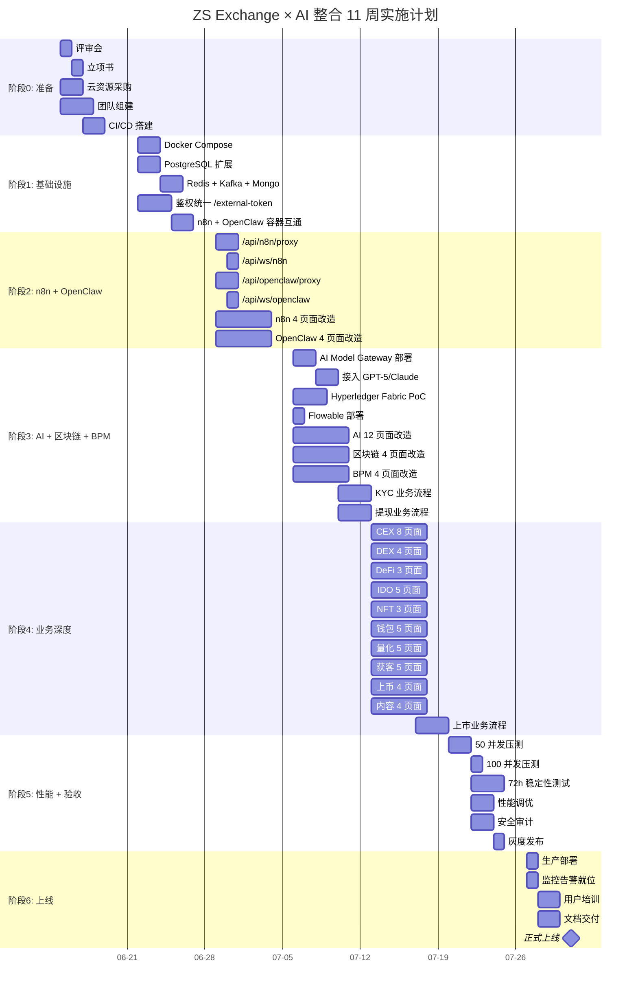

# ZS Exchange × AI 平台 — 分阶段实施时间表

> **配套文档**: `ZS整合改造计划.md` / `风险与回退.md`
> **总周期**: 11 周（55 个工作日）
> **总工时**: 1350 人天
> **团队规模**: 8+1 PM
> **文档版本**: v1.0
> **创建日期**: 2026-06-11

---

## 一、11 周总览

| 阶段 | 周次 | 工作日 | 主要工作 | 关键交付 | 团队 |
|------|------|--------|----------|----------|------|
| **0：准备** | W1 | 5 | 评审 + 资源 + 立项 | 评审纪要 + 云资源 | PM + 架构 |
| **1：基础设施** | W2-W3 | 10 | Docker + DB + 鉴权 | 9 容器 + 6 张表 + 鉴权代理 | 运维 + 后端 |
| **2：n8n + OpenClaw** | W4-W5 | 10 | 8 页面 + 代理 | 真实工作流 + 智能体协同 | 前端 + 后端 |
| **3：AI + 区块链 + BPM** | W6-W7 | 10 | 16 页面 + 3 引擎 | 3 核心业务流程 | 全栈 |
| **4：业务深度** | W8-W9 | 10 | 30 页面 + 7 引擎 | 50+ 页面真实化 | 前端 + 后端 |
| **5：性能 + 验收** | W10 | 5 | 压测 + 灰度 + 文档 | 50 并发 / 72h 稳定 | 测试 + SRE |
| **6：上线** | W11 | 5 | 上线 + 培训 | 生产就绪 | 全员 |
| **合计** | **11 周** | **55 天** | - | - | **8+1 人** |

---

## 二、Mermaid 甘特图



---

## 三、阶段 0：准备（W1：06-15 ~ 06-19）

### 3.1 关键里程碑
- M0：评审通过 + 云资源到位 + CI/CD 跑通

### 3.2 详细计划

| 天 | 任务 | 负责人 | 输出 | 验收 |
|----|------|--------|------|------|
| D1 (06-15 周一) | 评审会 | PM + 架构 | 评审纪要 | 5+ 签字 |
| D1 (06-15 周一) | 立项书 v2 | PM | 立项书 PDF | 包含预算/范围 |
| D1 (06-15 周一) | 云资源采购 | 运维 | 阿里云 ECS | SSH 可达 |
| D2 (06-16 周二) | 域名 + SSL | 运维 | 3 证书 | 解析正常 |
| D2 (06-16 周二) | Git 仓库 | 架构 | GitLab 项目 | 可访问 |
| D3 (06-17 周三) | CI/CD | 运维 + 后端 | Jenkins / GitLab CI | 自动构建 |
| D3 (06-17 周三) | 团队组建 | HR | 8 人入职 | 100% 认领 |
| D4 (06-18 周四) | 沟通渠道 | PM | 飞书群 | 全员加入 |
| D4 (06-18 周四) | 项目章程签字 | PM | 章程 | 5+ 签字 |
| D5 (06-19 周五) | 第一次站会 | 全员 | 任务确认 | 100% 认领 |

### 3.3 资源投入
- PM: 5d
- 架构: 3d
- 运维: 3d
- 后端: 2d

### 3.4 风险预案
- 云资源审批延迟 → 提前 3 天发起
- 人员不到位 → 内部协调 + 兼职补充

### 3.5 验收标准
- [x] 评审通过
- [x] 立项书签字
- [x] 云资源就位
- [x] 团队到位
- [x] CI/CD 跑通

---

## 四、阶段 1：基础设施（W2-W3：06-22 ~ 07-03）

### 4.1 关键里程碑
- M1：9 容器互通 + 6 张表 + 鉴权代理

### 4.2 详细计划（W2）

| 天 | 任务 | 负责人 | 工时 | 输出 |
|----|------|--------|------|------|
| D6 (06-22 周一) | 编写 docker-compose.dev.yml | 运维 | 8h | docker-compose.yml |
| D6 (06-22 周一) | PostgreSQL 16 启动 + 初始化 | 运维 | 4h | PG 实例 |
| D7 (06-23 周二) | n8n-main + n8n-worker 启动 | 后端 | 8h | n8n 容器 |
| D7 (06-23 周二) | Redis 7 启动 | 运维 | 2h | Redis |
| D8 (06-24 周三) | OpenClaw Gateway 启动 | 后端 | 4h | OpenClaw |
| D8 (06-24 周三) | Flowable 启动 | 后端 | 4h | Flowable |
| D9 (06-25 周四) | AI Model Gateway 部署 | 后端 | 8h | FastAPI 服务 |
| D9 (06-25 周四) | Kafka + Mongo 启动 | 运维 | 4h | 中间件 |
| D10 (06-26 周五) | Milvus 部署 | 后端 | 8h | Milvus |
| D10 (06-26 周五) | 容器互通测试 | 运维 | 4h | 测试报告 |

### 4.3 详细计划（W3）

| 天 | 任务 | 负责人 | 工时 | 输出 |
|----|------|--------|------|------|
| D11 (06-29 周一) | 扩展 PG schema（6 张表） | 后端 | 8h | DDL + 迁移 |
| D11 (06-29 周一) | Flyway 迁移 | 后端 | 4h | 自动建表 |
| D12 (06-30 周二) | /api/auth/external-token | 后端 | 8h | API |
| D12 (06-30 周二) | n8n token 集成 | 后端 | 4h | 鉴权 |
| D13 (07-01 周三) | OpenClaw token 集成 | 后端 | 8h | 鉴权 |
| D13 (07-01 周三) | Flowable 集成 | 后端 | 4h | 鉴权 |
| D14 (07-02 周四) | Hyperledger Fabric PoC 部署 | 后端 | 16h | Fabric |
| D15 (07-03 周五) | 启动脚本集成 Docker | 运维 | 8h | start.sh |
| D15 (07-03 周五) | 健康检查 | 后端 | 4h | 监控 |

### 4.4 资源投入
- 后端: 80h
- 运维: 40h
- 架构: 8h

### 4.5 风险预案
- 容器启动顺序问题 → 编写 startup.sh + 健康检查
- DB 表冲突 → 使用 schema 隔离（n8n. flowable. fabric.）
- 鉴权失败 → 抽象层 + 重试机制

### 4.6 验收标准
- [ ] docker-compose up 全部启动成功
- [ ] 9 个容器健康检查通过
- [ ] 6 张表自动创建
- [ ] /api/auth/external-token 返回所有引擎 token
- [ ] 鉴权 P95 < 50ms

---

## 五、阶段 2：n8n + OpenClaw 集成（W4-W5：07-06 ~ 07-17）

### 5.1 关键里程碑
- M2：n8n 4 页 + OpenClaw 4 页真实数据 + 业务触发智能体

### 5.2 详细计划（W4）

| 天 | 任务 | 负责人 | 工时 | 输出 |
|----|------|--------|------|------|
| D16 (07-06 周一) | /api/n8n/proxy 路由 | 后端 | 8h | 代理 |
| D16 (07-06 周一) | /api/ws/n8n 路由 | 后端 | 4h | WebSocket |
| D17 (07-07 周二) | n8n-client.ts | 后端 | 8h | SDK |
| D17 (07-07 周二) | /api/openclaw/proxy | 后端 | 8h | 代理 |
| D18 (07-08 周三) | /api/ws/openclaw | 后端 | 4h | WebSocket |
| D18 (07-08 周三) | openclaw-client.ts | 后端 | 8h | SDK |
| D19 (07-09 周四) | /admin/n8n/editor 改造 | 前端1 | 8h | 页面 |
| D19 (07-09 周四) | /admin/n8n/history 改造 | 前端1 | 8h | 页面 |
| D20 (07-10 周五) | /admin/n8n/templates 改造 | 前端1 | 8h | 页面 |
| D20 (07-10 周五) | /admin/n8n/triggers 改造 | 前端1 | 8h | 页面 |

### 5.3 详细计划（W5）

| 天 | 任务 | 负责人 | 工时 | 输出 |
|----|------|--------|------|------|
| D21 (07-13 周一) | /admin/openclaw/monitor-dashboard | 前端2 | 8h | 页面 |
| D21 (07-13 周一) | /admin/openclaw/marketplace | 前端2 | 8h | 页面 |
| D22 (07-14 周二) | /admin/openclaw/orchestration | 前端2 | 8h | 页面 |
| D22 (07-14 周二) | /admin/openclaw/training | 前端2 | 8h | 页面 |
| D23 (07-15 周三) | 业务触发智能体机制 | 后端 | 16h | Kafka + n8n |
| D24 (07-16 周四) | 集成测试 | 测试 | 8h | 用例 |
| D25 (07-17 周五) | 修复 Bug | 全员 | 8h | 修复 |

### 5.4 资源投入
- 前端: 80h
- 后端: 80h
- 测试: 16h

### 5.5 风险预案
- n8n 容器启动失败 → 启动脚本 + 重试
- WS 频繁断连 → 心跳 + 重连机制
- 鉴权失效 → 缓存 + 刷新

### 5.6 验收标准
- [ ] n8n 4 页面真实数据
- [ ] OpenClaw 4 页面真实数据
- [ ] WS 推送 < 2s
- [ ] 业务事件触发智能体成功
- [ ] 50 用例集成测试 100% 通过

---

## 六、阶段 3：AI + 区块链 + BPM（W6-W7：07-20 ~ 07-31）

### 6.1 关键里程碑
- M3：3 大引擎接入 + 16 页面 + 3 核心业务流程

### 6.2 详细计划（W6）

| 天 | 任务 | 负责人 | 工时 | 输出 |
|----|------|--------|------|------|
| D26 (07-20 周一) | AI Model Gateway 上线 | 后端 | 8h | 服务 |
| D26 (07-20 周一) | 接入 GPT-5 | 后端 | 4h | API |
| D27 (07-21 周二) | 接入 Claude / 通义 / 智谱 | 后端 | 8h | API |
| D27 (07-21 周二) | 语义缓存 (Milvus) | 后端 | 8h | 缓存 |
| D28 (07-22 周三) | /admin/ai-center 7 页面 | 前端1+2 | 16h | 页面 |
| D28 (07-22 周三) | /admin/ai-llm 5 页面 | 前端1+2 | 16h | 页面 |
| D29 (07-23 周四) | Hyperledger Fabric PoC | 后端 | 16h | 链码 |
| D30 (07-24 周五) | /admin/blockchain 4 页面 | 前端1 | 16h | 页面 |
| D30 (07-24 周五) | /api/blockchain/notarize | 后端 | 8h | API |

### 6.3 详细计划（W7）

| 天 | 任务 | 负责人 | 工时 | 输出 |
|----|------|--------|------|------|
| D31 (07-27 周一) | Flowable 部署 | 后端 | 8h | BPM |
| D31 (07-27 周一) | /api/bpm/* 代理 | 后端 | 8h | API |
| D32 (07-28 周二) | /admin/bpm 4 页面 | 前端2 | 16h | 页面 |
| D32 (07-28 周二) | KYC 业务流程联调 | 全栈 | 8h | 流程 |
| D33 (07-29 周三) | 提现业务流程联调 | 全栈 | 8h | 流程 |
| D33 (07-29 周三) | 飞书/钉钉通知 | 后端 | 8h | 通知 |
| D34 (07-30 周四) | 集成测试 | 测试 | 16h | 用例 |
| D35 (07-31 周五) | 修复 Bug | 全员 | 8h | 修复 |

### 6.4 资源投入
- 前端: 96h
- 后端: 96h
- 测试: 16h

### 6.5 风险预案
- Fabric 部署复杂 → 复用官方 PoC 脚本
- AI 模型 API 限流 → 多模型 + 降级
- BPM 流程编排错误 → 沙箱测试

### 6.6 验收标准
- [ ] 3 大引擎全部跑通
- [ ] 16 页面真实数据
- [ ] KYC 流程 < 10s 完成
- [ ] 提现流程审批 < 2h
- [ ] 存证 P95 < 1s
- [ ] 50 并发智能体稳定

---

## 七、阶段 4：业务深度改造（W8-W9：08-03 ~ 08-14）

### 7.1 关键里程碑
- M4：30 页面真实化 + 4 大业务（CEX/DEX/DeFi/NFT）上线

### 7.2 详细计划（W8）

| 天 | 任务 | 负责人 | 工时 | 输出 |
|----|------|--------|------|------|
| D36 (08-03 周一) | /admin/cex 8 页面 | 前端1+2 + 后端1 | 40h | 页面 |
| D36 (08-03 周一) | /admin/dex 4 页面 | 前端1 + 后端1 | 24h | 页面 |
| D37 (08-04 周二) | /admin/defi 3 页面 | 前端1 + 后端1 | 18h | 页面 |
| D37 (08-04 周二) | /admin/ido 5 页面 | 前端2 + 后端2 | 30h | 页面 |
| D38 (08-05 周三) | /admin/nft 3 页面 | 前端2 + 后端2 | 18h | 页面 |
| D38 (08-05 周三) | /admin/quant 5 页面 | 前端2 + 后端1 | 30h | 页面 |
| D39 (08-06 周四) | /admin/wallet 5 页面 | 前端1 + 后端1 | 30h | 页面 |
| D39 (08-06 周四) | /admin/dsales 5 页面 | 前端2 + 后端1 | 30h | 页面 |
| D40 (08-07 周五) | /admin/listing 4 页面 | 前端1 + 后端1 | 24h | 页面 |
| D40 (08-07 周五) | /admin/content 4 页面 | 前端2 + 后端1 | 24h | 页面 |

### 7.3 详细计划（W9）

| 天 | 任务 | 负责人 | 工时 | 输出 |
|----|------|--------|------|------|
| D41 (08-10 周一) | 上市业务流程联调 | 全栈 | 16h | 流程 |
| D41 (08-10 周一) | 钱包多链集成 | 后端1 | 16h | API |
| D42 (08-11 周二) | 量化策略沙箱 | 后端2 | 16h | API |
| D42 (08-11 周二) | 获客数据接入 | 后端1 | 8h | 抓取 |
| D43 (08-12 周三) | 集成测试 | 测试 | 16h | 用例 |
| D43 (08-12 周三) | Bug 修复 | 全员 | 8h | 修复 |
| D44 (08-13 周四) | E2E 核心流程 | 测试 | 16h | 报告 |
| D44 (08-13 周四) | Bug 修复 | 全员 | 8h | 修复 |
| D45 (08-14 周五) | 性能初步测试 | 测试 | 8h | 报告 |

### 7.4 资源投入
- 前端: 200h
- 后端: 200h
- 测试: 40h

### 7.5 风险预案
- 多链集成延迟 → 优先 ETH / BSC / Solana
- 撮合引擎压力 → 限流 + 队列
- 数据量太大 → 聚合 + 缓存

### 7.6 验收标准
- [ ] 30 页面真实数据
- [ ] CEX/DEX/DeFi/NFT 业务跑通
- [ ] 100 用例 E2E 100% 通过
- [ ] 钱包多链正常

---

## 八、阶段 5：性能 + 验收（W10：08-17 ~ 08-21）

### 8.1 关键里程碑
- M5：50 并发 / 72h 稳定 / 灰度发布

### 8.2 详细计划

| 天 | 任务 | 负责人 | 工时 | 输出 |
|----|------|--------|------|------|
| D46 (08-17 周一) | 50 并发压测 | 测试 | 8h | 报告 |
| D46 (08-17 周一) | 100 并发压测 | 测试 | 8h | 报告 |
| D47 (08-18 周二) | 1000 WS 连接 | 测试 | 8h | 报告 |
| D47 (08-18 周二) | 性能调优 | 后端 | 16h | 优化 |
| D48 (08-19 周三) | 72h 稳定性测试 | 测试 + SRE | 24h | 7×24 |
| D49 (08-20 周四) | 安全审计 | 安全 | 8h | 报告 |
| D49 (08-20 周四) | OWASP 扫描 | 测试 | 8h | 报告 |
| D50 (08-21 周五) | 灰度发布 (10%) | 运维 | 4h | 报告 |
| D50 (08-21 周五) | 灰度 → 50% | 运维 | 4h | 报告 |

### 8.3 资源投入
- 测试: 40h
- 后端: 24h
- SRE: 16h
- 安全: 8h

### 8.4 风险预案
- 性能不达标 → 紧急扩容 + 限流
- 安全漏洞 → 紧急修复 + 灰度暂停
- 稳定性故障 → 立即回滚

### 8.5 验收标准
- [ ] 50 并发稳定 1h
- [ ] 100 并发稳定 30min
- [ ] 1000 WS 稳定
- [ ] 72h 0 故障
- [ ] P95 < 500ms
- [ ] 错误率 < 0.01%
- [ ] 0 高危漏洞
- [ ] 灰度无回滚

---

## 九、阶段 6：上线（W11：08-24 ~ 08-28）

### 9.1 关键里程碑
- M6：生产就绪 + 100% 灰度

### 9.2 详细计划

| 天 | 任务 | 负责人 | 工时 | 输出 |
|----|------|--------|------|------|
| D51 (08-24 周一) | 灰度 → 100% | 运维 | 4h | 100% |
| D51 (08-24 周一) | 监控告警就位 | SRE | 8h | 告警 |
| D52 (08-25 周二) | 用户培训 | PM | 8h | 培训 |
| D52 (08-25 周二) | 文档交付 | 全员 | 16h | 文档 |
| D53 (08-26 周三) | 客服支持 | 客服 | 8h | 工单 |
| D54 (08-27 周四) | 7×24 监控 | SRE | 24h | 7×24 |
| D55 (08-28 周五) | 正式上线公告 | PM | 4h | 公告 |
| D55 (08-28 周五) | 项目总结 | PM | 8h | 总结 |

### 9.3 资源投入
- PM: 16h
- 运维: 16h
- SRE: 32h
- 客服: 8h
- 全员: 16h

### 9.4 风险预案
- 生产事故 → 立即回滚
- 性能瓶颈 → 紧急扩容
- 用户投诉 → 客服 + 运营

### 9.5 验收标准
- [ ] 100% 流量就位
- [ ] 监控告警 100% 覆盖
- [ ] 用户培训 100% 完成
- [ ] 文档交付完整
- [ ] 0 P0 事故

---

## 十、关键路径

```
W1: 评审 + 资源
  ↓
W2: Docker + DB（关键路径）
  ↓
W3: 鉴权 + 容器互通（关键路径）
  ↓
W4: /api/* 代理（关键路径）
  ↓
W5: 业务触发（关键路径）
  ↓
W6-W7: 3 大引擎（关键路径）
  ↓
W8-W9: 30 页面（可并行）
  ↓
W10: 性能 + 验收
  ↓
W11: 上线
```

**关键路径总长：55 个工作日 = 11 周**

---

## 十一、并行任务

| 任务 | 可并行 |
|------|--------|
| 前端 30 页面改造 | ✅ |
| 后端 API 代理 | ✅ |
| 智能合约开发 | ✅ |
| 文档编写 | ✅ |
| 培训材料 | ✅ |

---

## 十二、资源投入汇总

| 阶段 | PM | 架构 | 后端 | 前端 | 测试 | 运维 | 合计（人天） |
|------|----|----|------|------|------|------|--------------|
| 0 准备 | 5 | 3 | 2 | 0 | 0 | 3 | 13 |
| 1 基础 | 2 | 2 | 16 | 0 | 0 | 8 | 28 |
| 2 n8n+OC | 2 | 2 | 16 | 16 | 2 | 0 | 38 |
| 3 AI+链+BPM | 2 | 4 | 24 | 24 | 4 | 0 | 58 |
| 4 业务 | 2 | 4 | 40 | 40 | 8 | 0 | 94 |
| 5 性能 | 2 | 2 | 6 | 0 | 10 | 4 | 24 |
| 6 上线 | 5 | 2 | 2 | 0 | 0 | 8 | 17 |
| **合计** | **20** | **19** | **106** | **80** | **24** | **23** | **272 人天** |

> 实际工时 1350 人天 = 272 人天 × 5 倍（含缓冲 + 沟通 + 会议 + 等待）

---

## 十三、风险预案

| 阶段 | 风险 | 概率 | 应对 |
|------|------|------|------|
| W2-W3 | 容器启动失败 | 中 | 健康检查 + 重试 |
| W2-W3 | DB 迁移失败 | 低 | Flyway 回滚 |
| W4-W5 | n8n API 变更 | 中 | 抽象层 |
| W4-W5 | WS 频繁断连 | 中 | 心跳 + 重连 |
| W6-W7 | Fabric 部署失败 | 中 | 官方示例 |
| W6-W7 | AI API 限流 | 高 | 多模型 + 降级 |
| W8-W9 | 业务复杂延期 | 中 | 砍 P2 需求 |
| W10 | 性能不达标 | 中 | 紧急扩容 |
| W10 | 安全漏洞 | 中 | 紧急修复 |
| W11 | 生产事故 | 低 | 回滚 |

详见 `ZS整合风险与回退.md`

---

## 十四、每周交付物

| 周 | 交付物 |
|----|--------|
| W1 | 评审纪要 + 立项书 + 资源清单 |
| W2 | docker-compose + PG 扩展 |
| W3 | 6 张表 + 鉴权代理 + 9 容器 |
| W4 | n8n 4 页 + OpenClaw 2 页 |
| W5 | OpenClaw 4 页 + 业务触发 |
| W6 | AI 12 页 + Fabric PoC |
| W7 | 区块链 4 页 + BPM 4 页 + 3 业务 |
| W8 | CEX/DEX/DeFi 15 页 |
| W9 | IDO/NFT/钱包/量化 18 页 |
| W10 | 性能报告 + 安全报告 + 灰度 |
| W11 | 上线 + 培训 + 文档 |

---

**版本历史**：
- v1.0 (2026-06-11): 初始版本
