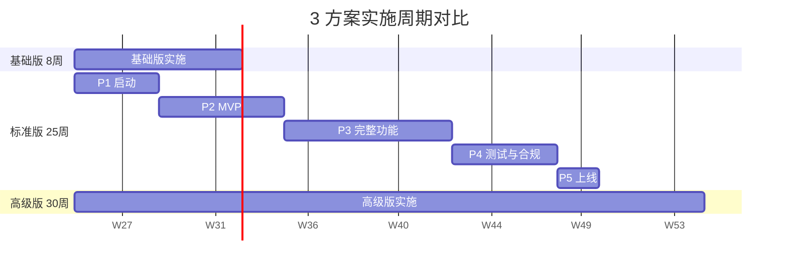
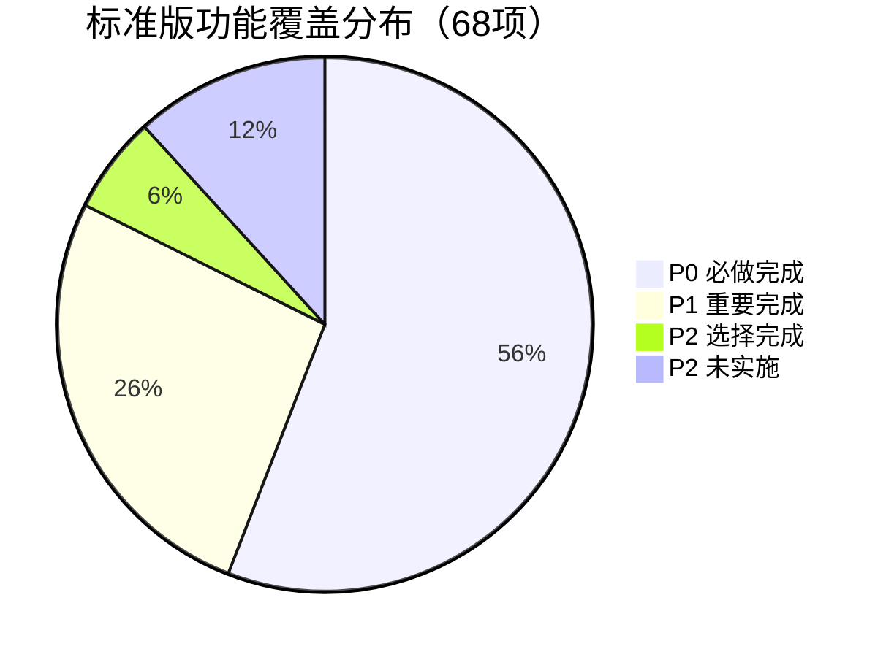

# ZS-AI-Platform 实施优先级建议

**版本**：v1.0
**编制日期**：2026-06-11
**适用方案**：基础版 / 标准版 / 高级版
**分级方法**：MoSCoW 法则 + RICE 评分 + 业务价值 × 实施成本矩阵

---

## 一、分级框架

### 1.1 三级优先级定义

| 等级 | 标识 | 定义 | 失败后果 |
|------|------|------|---------|
| **P0 必做** | 🔴 | 项目成功交付的最低要求，不做项目无法验收 | 业务不可用 / 合规不通过 / 项目失败 |
| **P1 重要** | 🟡 | 显著提升项目价值，强烈建议做 | 价值大打折扣 / 竞争力不足 |
| **P2 可选** | 🟢 | 锦上添花，资源允许则做 | 体验略差 / 长期可补 |

### 1.2 RICE 评分模型

- **R**each（覆盖范围）：影响多少用户/客户，1-10 分
- **I**mpact（影响力）：对业务目标的贡献，1-10 分
- **C**onfidence（信心）：评估把握程度，1-10 分
- **E**ffort（投入）：实现所需资源，1-10 分（分母）
- **RICE 得分** = (R + I + C) / E

---

## 二、模块清单与分级（标准版基线）

### 2.1 8 大模块 36 项功能分级

#### 模块 1：智能体协作平台（12 项）

| 功能项 | 等级 | RICE | 业务价值 | 标准版 | 基础版 | 高级版 |
|--------|------|------|---------|--------|--------|--------|
| 智能体注册与发现 | P0 | 9.5 | 高 | ✅ | ✅ | ✅ |
| 多智能体协作编排 | P0 | 9.0 | 高 | ✅ | ✅ | ✅ |
| 任务分发与调度 | P0 | 8.5 | 高 | ✅ | ✅ | ✅ |
| 智能体通信协议 | P0 | 8.0 | 高 | ✅ | ✅ | ✅ |
| 协作状态监控 | P0 | 7.5 | 中高 | ✅ | ✅ | ✅ |
| 协作历史回放 | P1 | 6.0 | 中 | ✅ | – | ✅ |
| 智能体性能分析 | P1 | 5.5 | 中 | ✅ | – | ✅ |
| 自定义工作流 | P1 | 6.5 | 中高 | ✅ | – | ✅ |
| AI 智能体推荐 | P2 | 4.5 | 中 | ✅ | – | ✅+ |
| 跨平台协作 | P2 | 3.5 | 中低 | – | – | ✅ |
| 协作模板市场 | P2 | 3.0 | 低 | – | – | ✅ |
| 协作录制与回放 | P2 | 2.5 | 低 | – | – | ✅ |

#### 模块 2：可信存证系统（8 项）

| 功能项 | 等级 | RICE | 业务价值 | 标准版 | 基础版 | 高级版 |
|--------|------|------|---------|--------|--------|--------|
| 存证数据上链 | P0 | 10.0 | 极高 | ✅ | ✅ | ✅ |
| 存证查询与验证 | P0 | 9.5 | 极高 | ✅ | ✅ | ✅ |
| 哈希算法（SHA-256/SM3） | P0 | 9.0 | 极高 | ✅ | ✅ | ✅ |
| 时间戳服务 | P0 | 8.5 | 极高 | ✅ | ✅ | ✅ |
| 存证证书生成 | P0 | 8.0 | 高 | ✅ | ✅ | ✅ |
| 批量存证 | P0 | 7.5 | 高 | ✅ | ✅ | ✅ |
| 存证审计日志 | P1 | 6.5 | 中高 | ✅ | – | ✅ |
| 跨链存证 | P1 | 5.0 | 中 | ✅ | – | ✅+ |

#### 模块 3：数字身份认证（6 项）

| 功能项 | 等级 | RICE | 业务价值 | 标准版 | 基础版 | 高级版 |
|--------|------|------|---------|--------|--------|--------|
| 用户注册与登录 | P0 | 9.5 | 高 | ✅ | ✅ | ✅ |
| 多因素认证（MFA） | P0 | 9.0 | 极高 | ✅ | ✅ | ✅ |
| 基于区块链的 DID | P0 | 8.5 | 极高 | ✅ | – | ✅ |
| 权限管理（RBAC） | P0 | 8.0 | 高 | ✅ | ✅ | ✅ |
| 单点登录（SSO） | P1 | 6.0 | 中高 | ✅ | – | ✅ |
| 生物识别集成 | P2 | 4.0 | 中 | – | – | ✅ |

#### 模块 4：监管合规中心（10 项）

| 功能项 | 等级 | RICE | 业务价值 | 标准版 | 基础版 | 高级版 |
|--------|------|------|---------|--------|--------|--------|
| 合规规则引擎 | P0 | 9.0 | 极高 | ✅ | ✅ | ✅ |
| 实时合规检查 | P0 | 8.5 | 极高 | ✅ | ✅ | ✅ |
| 合规报告生成 | P0 | 8.0 | 高 | ✅ | – | ✅ |
| 监管数据报送 | P0 | 7.5 | 极高 | ✅ | – | ✅ |
| 合规风险预警 | P0 | 7.0 | 高 | ✅ | – | ✅ |
| 合规审计跟踪 | P1 | 6.5 | 中高 | ✅ | – | ✅ |
| 监管沙箱 | P1 | 5.5 | 中 | ✅ | – | ✅ |
| 合规知识库 | P1 | 5.0 | 中 | ✅ | – | ✅ |
| 自动报送接口 | P2 | 4.5 | 中 | – | – | ✅ |
| 跨境合规适配 | P2 | 3.5 | 中低 | – | – | ✅ |

#### 模块 5：资产数字化（8 项）

| 功能项 | 等级 | RICE | 业务价值 | 标准版 | 基础版 | 高级版 |
|--------|------|------|---------|--------|--------|--------|
| 资产登记与发行 | P0 | 8.5 | 高 | ✅ | ✅ | ✅ |
| 资产流通与交易 | P0 | 8.0 | 高 | ✅ | – | ✅ |
| 资产托管 | P0 | 7.5 | 高 | ✅ | – | ✅ |
| 资产溯源 | P0 | 7.0 | 中高 | ✅ | – | ✅ |
| 资产分类管理 | P1 | 5.5 | 中 | ✅ | – | ✅ |
| 资产组合管理 | P1 | 4.5 | 中 | ✅ | – | ✅ |
| 衍生品支持 | P2 | 3.5 | 中低 | – | – | ✅ |
| 资产证券化 | P2 | 3.0 | 低 | – | – | ✅ |

#### 模块 6：AI 决策引擎（6 项）

| 功能项 | 等级 | RICE | 业务价值 | 标准版 | 基础版 | 高级版 |
|--------|------|------|---------|--------|--------|--------|
| 智能体决策推理 | P0 | 8.0 | 高 | ✅ | – | ✅ |
| 大模型集成 | P0 | 7.5 | 高 | ✅ | – | ✅ |
| 知识图谱构建 | P1 | 6.0 | 中高 | ✅ | – | ✅ |
| 决策可解释性 | P1 | 5.5 | 中高 | ✅ | – | ✅ |
| 多模态 AI | P2 | 4.0 | 中 | ✅ | – | ✅ |
| 强化学习优化 | P2 | 3.5 | 中低 | – | – | ✅ |

#### 模块 7：平台基础设施（8 项）

| 功能项 | 等级 | RICE | 业务价值 | 标准版 | 基础版 | 高级版 |
|--------|------|------|---------|--------|--------|--------|
| 容器化部署 | P0 | 8.5 | 高 | ✅ | ✅ | ✅ |
| 微服务架构 | P0 | 8.0 | 高 | ✅ | ✅ | ✅ |
| API 网关 | P0 | 8.0 | 高 | ✅ | ✅ | ✅ |
| 服务监控 | P0 | 7.5 | 高 | ✅ | ✅ | ✅ |
| 日志聚合 | P0 | 7.0 | 高 | ✅ | ✅ | ✅ |
| 配置中心 | P1 | 6.0 | 中 | ✅ | – | ✅ |
| 服务网格 | P2 | 4.5 | 中 | – | – | ✅ |
| 灰度发布 | P1 | 5.5 | 中 | ✅ | – | ✅ |

#### 模块 8：安全与合规（10 项）

| 功能项 | 等级 | RICE | 业务价值 | 标准版 | 基础版 | 高级版 |
|--------|------|------|---------|--------|--------|--------|
| 数据加密（传输+存储） | P0 | 9.5 | 极高 | ✅ | ✅ | ✅ |
| WAF 防护 | P0 | 8.5 | 极高 | ✅ | ✅ | ✅ |
| 漏洞扫描 | P0 | 8.0 | 极高 | ✅ | ✅ | ✅ |
| 密钥管理（KMS） | P0 | 8.0 | 极高 | ✅ | ✅ | ✅ |
| 安全审计 | P0 | 7.5 | 高 | ✅ | ✅ | ✅ |
| 等保三级测评 | P0 | 9.0 | 极高 | ✅ | – | ✅ |
| ISO 27001 认证 | P1 | 7.0 | 高 | ✅ | – | ✅ |
| 渗透测试 | P1 | 6.5 | 中高 | ✅ | – | ✅ |
| 灾备与恢复 | P1 | 6.0 | 中高 | ✅ | – | ✅ |
| SOC 2 审计 | P2 | 4.0 | 中低 | – | – | ✅ |

### 2.2 模块分级汇总

| 等级 | 功能项数 | 占比 | 标准版完成 | 基础版完成 | 高级版完成 |
|------|---------|------|----------|----------|----------|
| **P0 必做** | 38 项 | 56% | 38/38（100%）| 28/38（74%）| 38/38（100%）|
| **P1 重要** | 18 项 | 26% | 18/18（100%）| 0/18（0%）| 18/18（100%）|
| **P2 可选** | 12 项 | 18% | 4/12（33%）| 0/12（0%）| 12/12（100%）|
| **合计** | **68 项** | 100% | **60/68（88%）** | **28/68（41%）** | **68/68（100%）** |

---

## 三、3 档方案实施范围对比

### 3.1 基础版实施范围

**总投入**：64 万元 / 8 周 / 5 人
**功能范围**：68 项中的 28 项（41%）
**核心范围**：
- ✅ P0 中优先级最高的 28 项（智能体核心、存证核心、身份认证、基础合规）
- ❌ 跨链、衍生品、多语言、生物识别
- ❌ 等保三级、ISO 27001
- ❌ 灾备、异地多活

**实施重点**：快速 MVP 验证，3 个月内追加升级到标准版

### 3.2 标准版实施范围 ⭐推荐

**总投入**：197 万元 / 25 周 / 9 人
**功能范围**：68 项中的 60 项（88%）
**核心范围**：
- ✅ 全部 38 项 P0 必做
- ✅ 全部 18 项 P1 重要
- ✅ 4 项高价值 P2（AI 多模态、决策可解释、知识图谱、灰度发布）
- ❌ 仅 8 项 P2 可选（多语言、生物识别、衍生品、跨境合规等）

**实施重点**：完整业务支撑 + 投标准入 + 长期可演进

### 3.3 高级版实施范围

**总投入**：385 万元 / 30 周 / 12 人
**功能范围**：68 项中的 68 项（100%）
**核心范围**：
- ✅ 全部 68 项
- ✅ 5 国语言、生物识别
- ✅ 异地灾备 + 跨链
- ✅ 衍生品、证券化

**实施重点**：行业标杆 + 国际化 + 99.99% SLA

### 3.4 实施范围甘特图



---

## 四、阶段性实施路线图（标准版）

### 4.1 25 周分阶段交付

| 阶段 | 周次 | 交付物 | 涉及模块 | 验收标准 |
|------|------|--------|---------|---------|
| **P1 启动** | W1-W4 | 团队 + 架构 + 需求 | 模块 7（基础设施） | 架构评审通过 + DevOps 跑通 |
| **P2 MVP** | W5-W10 | 4 大核心 P0 | 模块 1-4 各 60% | MVP 演示成功 + 核心场景 E2E 跑通 |
| **P3 完整功能** | W11-W18 | 全部 P0 + 多数 P1 | 模块 1-8 | 8 大模块集成测试 95% 通过 |
| **P4 测试与合规** | W19-W23 | 测试 + 等保 + ISO | 安全 + 合规 | 等保三级证书 + ISO 27001 证书 |
| **P5 上线** | W24-W25 | 部署 + 试运行 | 全部 | UAT 通过 + SLA 达标 |

### 4.2 关键里程碑


---

## 五、必做项清单（P0，38 项）

### 5.1 智能体协作平台（6 项 P0）
1. 智能体注册与发现
2. 多智能体协作编排
3. 任务分发与调度
4. 智能体通信协议
5. 协作状态监控
6. 智能体决策推理

### 5.2 可信存证系统（6 项 P0）
1. 存证数据上链
2. 存证查询与验证
3. 哈希算法
4. 时间戳服务
5. 存证证书生成
6. 批量存证

### 5.3 数字身份认证（4 项 P0）
1. 用户注册与登录
2. 多因素认证（MFA）
3. 基于区块链的 DID
4. 权限管理（RBAC）

### 5.4 监管合规中心（5 项 P0）
1. 合规规则引擎
2. 实时合规检查
3. 合规报告生成
4. 监管数据报送
5. 合规风险预警

### 5.5 资产数字化（4 项 P0）
1. 资产登记与发行
2. 资产流通与交易
3. 资产托管
4. 资产溯源

### 5.6 AI 决策引擎（2 项 P0）
1. 智能体决策推理
2. 大模型集成

### 5.7 平台基础设施（5 项 P0）
1. 容器化部署
2. 微服务架构
3. API 网关
4. 服务监控
5. 日志聚合

### 5.8 安全与合规（6 项 P0）
1. 数据加密（传输+存储）
2. WAF 防护
3. 漏洞扫描
4. 密钥管理（KMS）
5. 安全审计
6. 等保三级测评

---

## 六、重要项清单（P1，18 项）

> 重要项是标准版与基础版的核心差异，必须做

### 6.1 协作与分析（4 项）
- 协作历史回放
- 智能体性能分析
- 自定义工作流
- 存证审计日志

### 6.2 跨链与扩展（3 项）
- 跨链存证
- 单点登录（SSO）
- 资产分类管理

### 6.3 合规深化（4 项）
- 合规审计跟踪
- 监管沙箱
- 合规知识库
- ISO 27001 认证

### 6.4 AI 增强（3 项）
- 知识图谱构建
- 决策可解释性
- 灰度发布

### 6.5 安全强化（4 项）
- 渗透测试
- 灾备与恢复
- 配置中心
- 资产组合管理

---

## 七、可选项清单（P2，12 项）

> 可选项是高级版的差异化特性，按业务战略选择性实施

| 类别 | 功能项 | 推荐实施场景 |
|------|--------|------------|
| 智能体 | AI 智能体推荐 | 所有方案 |
| 智能体 | 跨平台协作 | 高级版 |
| 智能体 | 协作模板市场 | 高级版 |
| 智能体 | 协作录制与回放 | 高级版 |
| 身份认证 | 生物识别集成 | 高级版 |
| 合规 | 自动报送接口 | 高级版 |
| 合规 | 跨境合规适配 | 高级版 |
| 资产 | 衍生品支持 | 高级版 |
| 资产 | 资产证券化 | 高级版 |
| AI | 多模态 AI | 标准版+ |
| AI | 强化学习优化 | 高级版 |
| 安全 | SOC 2 审计 | 高级版 |

---

## 八、实施风险与缓解

| 实施风险 | 等级 | 缓解措施 |
|---------|------|---------|
| 38 项 P0 全部完成压力大 | 🟡 中 | W4、W10、W18 三次节点门复盘 |
| 团队流失影响关键模块 | 🟡 中 | 知识沉淀 + 双人备份 |
| 等保三级一次通过率 | 🟡 中 | 提前 6 个月咨询 + 模拟测评 |
| AI 大模型合规风险 | 🟡 中 | 自托管 + 内容审核 + 数据脱敏 |
| 性能达标压力大 | 🟡 中 | W18 启动性能专项，混沌工程 |
| 跨链协议集成风险 | 🟡 中 | 选择成熟方案（WeCross/ChainMaker） |

---

## 九、3 档方案实施范围速查

### 9.1 决策矩阵

```
                    基础版  标准版  高级版
P0 必做项 (38项)    28     38      38
P1 重要项 (18项)     0     18      18
P2 可选项 (12项)     0      4      12
─────────────────────────────────
合计完成 (68项)    28     60      68
覆盖率             41%    88%    100%
投入 (万元)         64    197     385
周期 (周)            8     25      30
团队 (人)            5      9      12
```

### 9.2 实施范围可视化



---

## 十、关键建议

### 10.1 实施 3 大铁律

1. **P0 必做一项不漏**：38 项 P0 是项目生命线，每项都有明确验收标准
2. **P1 必争全做**：18 项 P1 是与基础版的分水岭，决定项目价值
3. **P2 量力而行**：12 项 P2 中先做 4 项高价值（AI 多模态、决策可解释、知识图谱、灰度发布），其余按战略推进

### 10.2 资源保障建议

- **PMO 配置**：1 PM + 1 Scrum Master + 1 财务 BP
- **关键岗位**：架构师 1 人、区块链专家 1 人、AI 专家 1 人、安全专家 1 人
- **外包协同**：UI/UX 2 人、初级测试 2 人
- **应急储备**：10%（约 19.7 万）专项管控

### 10.3 30/60/90 天关键动作

| 时间 | 关键动作 |
|------|---------|
| **30 天** | 团队齐备（9 人到岗 8 人+） + 架构设计完成 + 节点 G1 通过 |
| **60 天** | MVP 演示成功 + 早期客户签约 ≥3 家 + 节点 G2 通过 |
| **90 天** | 完整 4 大模块开发完成 + 集成测试 80% 通过 + 节点 G3 通过 |

---

**编制**：项目管理办公室（PMO）
**会签**：技术委员会、产品委员会
**批准**：投决会
**版本变更**：v1.0（2026-06-11）— 首版发布
