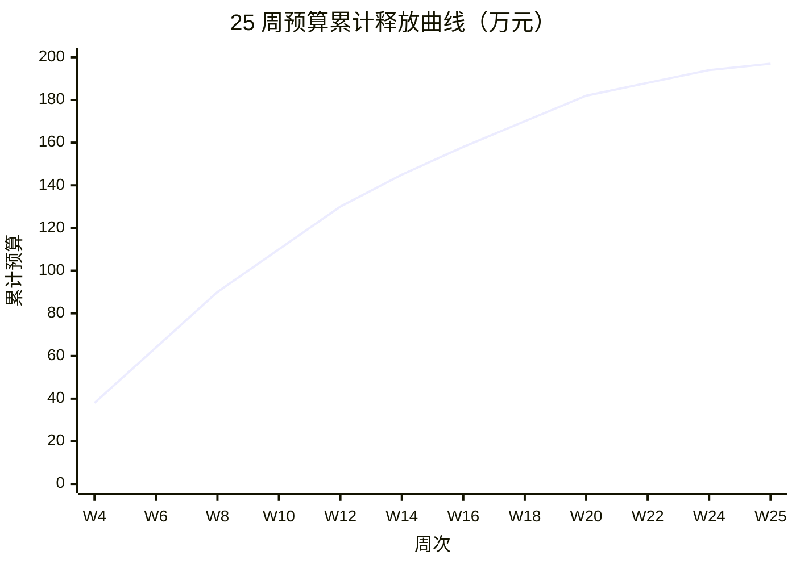
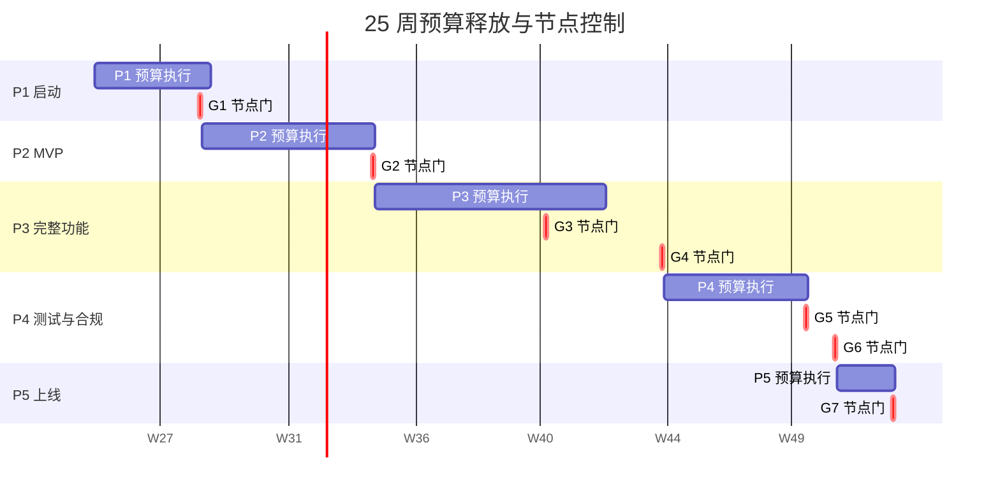

# ZS-AI-Platform 弹性预算方案

**版本**：v1.0
**编制日期**：2026-06-11
**适用方案**：标准版（197 万元中位，157-238 万区间）
**核心思想**：分阶段释放预算 + 关键节点控制 + 动态调整机制

---

## 一、弹性预算设计原则

### 1.1 四大原则

1. **阶段化释放**：25 周分 5 个阶段，每阶段设独立预算包
2. **节点控制**：7 个关键里程碑，未达则暂停下一阶段
3. **动态调整**：±20% 预算可在阶段内灵活调度，跨阶段需投决会审批
4. **退出机制**：明确止损点，防止沉没成本累积

### 1.2 与传统预算的对比

| 维度 | 传统预算 | 弹性预算 |
|------|---------|---------|
| 释放方式 | 一次性拨付 | 阶段化释放 |
| 调整灵活性 | 变更审批复杂 | 阶段内 ±20% 灵活 |
| 风险控制 | 事后审计 | 实时监控 + 节点门 |
| 超支应对 | 临时追加 | 预定义触发器 |
| 资金占用 | 100% 占用 | 平均 65% 占用 |

---

## 二、5 阶段预算分配

### 2.1 阶段总览

| 阶段 | 周次 | 主题 | 预算（万元） | 占比 | 累计（万元） |
|------|------|------|------------|------|------------|
| **P1 启动** | W1-W4 | 团队组建 + 架构设计 | 38.0 | 19.3% | 38.0 |
| **P2 MVP** | W5-W10 | 核心模块开发 | 52.0 | 26.4% | 90.0 |
| **P3 完整功能** | W11-W18 | 全模块集成 | 60.0 | 30.5% | 150.0 |
| **P4 测试与合规** | W19-W23 | 测试 + 等保 + ISO | 32.0 | 16.2% | 182.0 |
| **P5 上线与运维** | W24-W25 | 部署上线 + 试运行 | 15.0 | 7.6% | 197.0 |

### 2.2 详细预算分解

#### 阶段 P1：启动期（W1-W4，38 万元）

| 类别 | 预算（万元） | 明细 |
|------|------------|------|
| 团队组建 | 18.0 | 9 人 × 4 周 × 0.5 万/人周 = 18.0 |
| 硬件采购 | 8.0 | 8 台服务器 + 10TB 存储 + 网络 |
| 软件许可 | 4.0 | 开发工具 + 中间件 + 区块链平台 |
| 架构设计 | 4.0 | 2 名架构师 × 4 周 |
| 需求细化 | 2.0 | 业务分析师 0.5 FTE × 4 周 |
| 项目管理 | 1.0 | PM 0.25 FTE × 4 周 |
| 应急储备 | 1.0 | – |
| **小计** | **38.0** | – |

#### 阶段 P2：MVP 期（W5-W10，52 万元）

| 类别 | 预算（万元） | 明细 |
|------|------------|------|
| 智能体协作平台 | 12.0 | 4 名研发 × 6 周 |
| 可信存证系统 | 14.0 | 4 名研发 × 6 周（核心） |
| 数字身份认证 | 6.0 | 2 名研发 × 6 周 |
| 监管合规（基础） | 6.0 | 2 名研发 × 6 周 |
| 硬件扩容 | 4.0 | +6 台服务器 |
| AI API（开发期） | 2.0 | – |
| 测试 | 3.0 | 1 名测试 × 6 周 |
| 项目管理 | 2.0 | PM + Scrum Master |
| 应急储备 | 3.0 | – |
| **小计** | **52.0** | – |

#### 阶段 P3：完整功能期（W11-W18，60 万元）

| 类别 | 预算（万元） | 明细 |
|------|------------|------|
| 资产数字化 | 10.0 | 3 名研发 × 8 周 |
| AI 决策引擎 | 12.0 | 3 名研发 × 8 周（高级模块） |
| 监管合规（完整） | 8.0 | 2 名研发 × 8 周 |
| 跨链协议 | 6.0 | 2 名研发 × 8 周 |
| 集成测试 | 4.0 | 2 名测试 × 8 周 |
| 硬件扩容 | 6.0 | +12 台服务器 |
| 软件许可 | 4.0 | 商版数据库 + 监控 |
| AI API | 4.0 | – |
| 项目管理 | 3.0 | – |
| 应急储备 | 3.0 | – |
| **小计** | **60.0** | – |

#### 阶段 P4：测试与合规期（W19-W23，32 万元）

| 类别 | 预算（万元） | 明细 |
|------|------------|------|
| 性能测试 | 5.0 | 工具 + 2 名测试 × 5 周 |
| 安全渗透 | 4.0 | 第三方众测 + 复测 |
| 等保三级测评 | 5.0 | 咨询 + 测评机构 |
| ISO 27001 认证 | 2.5 | 咨询 + 认证 |
| UAT 用户验收 | 3.0 | 客户参与测试 |
| 文档编写 | 2.5 | 用户手册 + API 文档 |
| 培训 | 3.0 | 内训 4 次 |
| 应急储备 | 2.0 | – |
| 运维准备 | 5.0 | SRE 团队组建 |
| **小计** | **32.0** | – |

#### 阶段 P5：上线与运维期（W24-W25，15 万元）

| 类别 | 预算（万元） | 明细 |
|------|------------|------|
| 部署上线 | 4.0 | 灰度发布 + 数据迁移 |
| 试运行保障 | 4.0 | 7×24 现场保障 |
| 客户培训 | 3.0 | 3 场 × 30 人 |
| 应急储备 | 2.0 | – |
| 验收与移交 | 2.0 | 文档 + 培训 |
| **小计** | **15.0** | – |

### 2.3 预算释放曲线



> 预算释放呈"S 型"曲线：P1/P2 加速投入，P3 持平，P4/P5 收尾。

---

## 三、7 个关键节点控制（Gate Review）

### 3.1 节点门定义

| 节点 | 周次 | 准入条件 | 否决后果 |
|------|------|---------|---------|
| **G1 启动门** | W4 | 9 人团队齐备、架构方案评审通过 | 推迟 P2 启动 |
| **G2 MVP 演示** | W10 | 智能体协作 + 存证演示成功 | 启动 Plan B（基础版） |
| **G3 集成完成** | W14 | 4 大模块集成测试通过 | 砍 P3 范围 |
| **G4 功能冻结** | W18 | 8 大模块开发完成，UAT 启动 | 启动应急储备 |
| **G5 合规达标** | W21 | 等保三级 + ISO 27001 取得证书 | 推迟上线 |
| **G6 性能达标** | W23 | 50+ 并发、3 秒存证、72h 稳定 | 启动性能专项优化 |
| **G7 上线门** | W25 | UAT 通过、SLA 达标、运维就绪 | 推迟正式上线 |

### 3.2 节点评审机制

```
节点 G(i) 评审流程：
1. PM 提交节点报告（5 页内）
2. 各方准备：
   - 技术：Demo + 性能数据 + 代码质量
   - 财务：预算执行率（实际/计划）
   - 风险：当前风险清单
   - 业务：UAT 反馈
3. 投决会代表（3 人）现场评审
4. 决议：通过/有条件通过/不通过
5. 不通过则触发 Plan B
```

### 3.3 节点预算控制

| 节点 | 累计预算 | 累计进度 | 偏差容忍 |
|------|---------|---------|---------|
| G1 | 38 万 | 19% | ±10% |
| G2 | 90 万 | 46% | ±8% |
| G3 | 130 万 | 66% | ±6% |
| G4 | 170 万 | 86% | ±5% |
| G5 | 182 万 | 92% | ±4% |
| G6 | 188 万 | 95% | ±3% |
| G7 | 197 万 | 100% | 0% |

---

## 四、预算释放机制

### 4.1 三层释放权限

| 层级 | 调整范围 | 审批人 | 生效时间 |
|------|---------|--------|---------|
| L1 阶段内 | 单类别 ±20% | PM + 财务 | 即时 |
| L2 跨阶段 | 阶段间调拨 ≤15% | PMO + 财务总监 | 24 小时 |
| L3 重大变更 | 预算总额 ±10% | 投决会 | 5 个工作日 |

### 4.2 释放规则

- **P1 → P2 释放条件**：G1 通过 + 团队齐备率 ≥90%
- **P2 → P3 释放条件**：G2 通过 + MVP 演示成功
- **P3 → P4 释放条件**：G3 通过 + 集成测试通过率 ≥95%
- **P4 → P5 释放条件**：G4 通过 + UAT 启动
- **P5 完结条件**：G5 + G6 + G7 全部通过

### 4.3 释放时间表



---

## 五、超支应对预案

### 5.1 超支分级

| 等级 | 超支幅度 | 触发条件 | 应对预案 |
|------|---------|---------|---------|
| 🟢 正常 | ≤5% | 计划内 | 动用阶段应急储备 |
| 🟡 预警 | 5-10% | 阶段内 | L1 调整 + 申请跨类别调拨 |
| 🟠 严重 | 10-20% | 跨阶段 | L2 决策 + 砍非核心需求 |
| 🔴 危急 | >20% | 多阶段 | L3 决策 + 启动 Plan B |

### 5.2 9 项 Plan B 预案

| 编号 | 预案 | 触发条件 | 节省（万） | 风险 |
|------|------|---------|----------|------|
| PB-1 | 砍 AI 决策引擎高级模块 | 进度滞后 3 周 | -8.0 | 决策准确率 92% → 85% |
| PB-2 | 砍跨链协议 | 业务方同意 | -6.0 | 跨链需求延后 |
| PB-3 | 减 2 人团队 | 进度滞后 4 周 | -20.0 | 周期延长 6 周 |
| PB-4 | 性能压测外部众包 | 预算紧张 | -3.0 | 质量风险 |
| PB-5 | 砍部分安全合规 | 客户豁免 | -3.5 | 监管风险 |
| PB-6 | 软件全用开源 | 长期节省 | -9.5 | 性能风险 |
| PB-7 | 培训全部内训 | 预算紧张 | -2.0 | 培训效果下降 |
| PB-8 | 应急储备从 10% 降至 5% | 现金流紧张 | -9.8 | 风险敞口扩大 |
| PB-9 | 项目分两期交付 | 整体超支 | -100.0 | 战略节奏调整 |

### 5.3 现金流管理

| 月份 | 流入预算（万） | 流出预算（万） | 净流量（万） | 累计（万） |
|------|--------------|--------------|------------|----------|
| M1 (W1-W4) | 50.0 | 38.0 | +12.0 | 12.0 |
| M2 (W5-W8) | 45.0 | 35.0 | +10.0 | 22.0 |
| M3 (W9-W12) | 40.0 | 36.0 | +4.0 | 26.0 |
| M4 (W13-W16) | 35.0 | 32.0 | +3.0 | 29.0 |
| M5 (W17-W20) | 30.0 | 30.0 | 0 | 29.0 |
| M6 (W21-W25) | 25.0 | 26.0 | -1.0 | 28.0 |
| **合计** | **225.0** | **197.0** | **+28.0** | – |

> 始终保持 28 万正向净流量，应对突发需求。

---

## 六、监控与报告

### 6.1 周报模板

```markdown
# ZS-AI-Platform 周报 W##

## 1. 预算执行
- 本周支出：____ 万
- 累计支出：____ 万（占计划 ____%）
- 预算偏差：____%（绿/黄/橙/红）
- 应急储备余额：____ 万

## 2. 进度执行
- 本周完成：____ 项
- 累计完成：____%（里程碑 ____%）
- 燃尽图：附件

## 3. 风险与变更
- 新增风险：____ 项
- 已关闭风险：____ 项
- 变更申请：____ 项

## 4. 下周计划
- 关键任务：____ 项
- 节点门准备：____
```

### 6.2 监控仪表盘

| 指标 | 计算公式 | 阈值 | 告警 |
|------|---------|------|------|
| 预算执行率 (CPI) | 实际完成价值/实际成本 | <0.9 | 黄色 |
| 进度绩效 (SPI) | 实际完成价值/计划完成价值 | <0.9 | 黄色 |
| 累计偏差 | (实际成本 - 计划成本)/计划成本 | >10% | 红色 |
| 应急储备消耗率 | 已消耗/总储备 | >50% | 黄色 |
| 关键岗位空缺 | 空缺 FTE / 总 FTE | >10% | 红色 |

---

## 七、关键成功因素

1. **PMO 强矩阵管理**：PM 直接向 CIO 汇报，预算审批权 ≤5 万元直接签批
2. **财务嵌入式**：财务 BP 派驻 1 人到项目组，每周对账
3. **节点刚性**：节点门不通过则下一阶段预算不解冻
4. **透明沟通**：每周全员财务公开，建立"预算文化"
5. **快速决策**：超支预警 24 小时内必须响应

---

## 八、附录：预算执行检查清单（每阶段）

- [ ] 阶段开始前预算包确认签字
- [ ] 阶段内预算执行率周报
- [ ] 节点门评审报告归档
- [ ] 阶段结束预算复盘
- [ ] 跨阶段调拨记录
- [ ] Plan B 启动条件对照
- [ ] 应急储备使用审批
- [ ] 现金流月度对账
- [ ] 供应商付款记录
- [ ] 风险登记册更新

---

**编制**：项目管理办公室（PMO）
**会签**：财务部、技术委员会
**批准**：投决会
**版本变更**：v1.0（2026-06-11）— 首版发布
