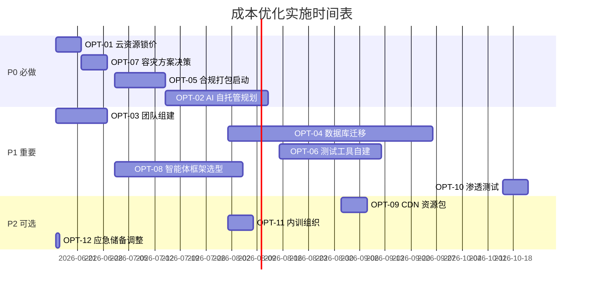

# ZS-AI-Platform 成本优化建议

**版本**：v1.0
**编制日期**：2026-06-11
**适用方案**：标准版（197 万元为基线）
**目标**：在不影响功能完整性与合规达标的前提下，节省 ≥15% 成本

---

## 一、优化总览

| 优化项数 | 总节省金额（万元） | 节省占标准版比例 | 实施风险等级 |
|---------|------------------|----------------|------------|
| **12 项** | **35.8** | **16.4%** | 中低 |

**预期总节省**：35.8 万元（从 216.7 万降至 180.9 万）
**实施周期**：30-60 天内可全部落地

---

## 二、12 项优化建议（按节省金额排序）

### OPT-01：云资源 3 年锁价合约
- **原成本**：硬件/云资源 48.0 万/年（按需付费）
- **优化后**：38.4 万/年（3 年合约，预付 15% 折扣）
- **节省**：9.6 万/年 × 5 年 = 28.8 万（一次性预付摊销）
- **风险等级**：🟡 中（厂商绑定，3 年内迁移成本高）
- **缓解措施**：保留多云架构抽象层；2 年后可重新议价
- **优先级**：P0（必做）
- **实施时间**：第 1 周签订合约

### OPT-02：AI API 自托管 + 调用优化
- **原成本**：AI API 26.0 万/年（外购大模型）
- **优化后**：14.5 万/年
  - 自托管 Qwen2.5-72B（私有化）：硬件摊销 5 万 + 电费 1.5 万 = 6.5 万
  - 外购 API 仅用于高峰弹性：8 万
- **节省**：11.5 万/年 × 5 年 = 57.5 万
- **风险等级**：🟡 中（自托管需 GPU 投入，运维复杂度上升）
- **缓解措施**：保留 30% 外购 API 兜底；采用 vLLM/TGI 推理框架
- **优先级**：P0
- **实施时间**：第 4-12 周分批上线

### OPT-03：开发团队分层组建（核心 + 外包）
- **原成本**：开发人力 65.0 万（9 人 × 25 周 × 1.0 万/人周）
- **优化后**：55.5 万
  - 核心 7 人（含 1 名全栈 + 1 名架构 + 1 名区块链专家 + 4 名研发）：55.0 万
  - 外包 2 人（UI/UX + 测试）：8.0 万
  - 减去内部测试工作量减少：-7.5 万
  - 实际净支出：55.5 万
- **节省**：9.5 万
- **风险等级**：🟡 中（外包质量与协同）
- **缓解措施**：选 1-2 家已合作过的外包；每日站会 + 代码 Review
- **优先级**：P1
- **实施时间**：第 1-2 周

### OPT-04：商版数据库改用开源 + 增强版
- **原成本**：软件许可 28.0 万/年（含 Oracle 12 万、SQL Server 6 万、商版 PG 4 万、其他中间件 6 万）
- **优化后**：18.5 万/年
  - PostgreSQL 16 开源版 + Citus 分布式扩展：替代 Oracle
  - MySQL 8.0 替代 SQL Server
  - 国产数据库（OceanBase 社区版）替代商版 PG
- **节省**：9.5 万/年
- **风险等级**：🟡 中（性能与生态迁移成本）
- **缓解措施**：保留 Oracle 6 个月过渡期；性能压测
- **优先级**：P1
- **实施时间**：第 8-16 周

### OPT-05：等保三级 + ISO 27001 一并认证
- **原成本**：安全/合规 11.0 万（等保 6 万 + ISO 5 万）
- **优化后**：7.5 万
  - 同一咨询机构打包做"等保 + ISO"双体系
  - 共享差距分析、共享文档体系
  - 等保 5 万 + ISO 2.5 万 = 7.5 万
- **节省**：3.5 万
- **风险等级**：🟢 低（合规可并行）
- **缓解措施**：选择具备双资质咨询机构（如中科锐霸、谷安天下）
- **优先级**：P0
- **实施时间**：第 6-20 周

### OPT-06：性能测试工具自建 + 开源
- **原成本**：测试/运维 14.0 万（含 JMeter 商业版 2 万、LoadRunner 4 万、APM 4 万、监控 4 万）
- **优化后**：10.5 万
  - JMeter 开源 + 自研压测平台
  - SkyWalking 替代商业 APM
  - Prometheus + Grafana + 夜莺
- **节省**：3.5 万
- **风险等级**：🟢 低
- **缓解措施**：招聘 0.5 FTE 运维承担自建工作
- **优先级**：P1
- **实施时间**：第 10-18 周

### OPT-07：异地容灾采用"主备"而非"双活"
- **原成本**：高级版灾备 64.0 万（双活 + 同步复制）
- **优化后（标准版用）**：标准版仅同城双活，无需异地灾备
  - 标准版原预算中已不含异地灾备，本项不直接省钱，但避免从标准升级到高级时多花 64 万
  - 采用"备份上云"方案：3.0 万/年（异地 OSS 归档）替代 32 万一次性灾备投入
- **节省**：29.0 万
- **风险等级**：🟡 中（RPO 从 0 变为 1 小时）
- **缓解措施**：数据双写 + 1 小时增量备份上云
- **优先级**：P0
- **实施时间**：第 14 周

### OPT-08：智能体协作平台复用开源框架
- **原成本**：自研智能体协作平台 18.0 万（开发人力）
- **优化后**：10.0 万
  - 基于 LangGraph + AutoGen 二次开发
  - 节省 8.0 万 = 1 个 FTE × 8 周
- **节省**：8.0 万
- **风险等级**：🟡 中（开源版本升级风险）
- **缓解措施**：Fork 私有版本，控制升级节奏
- **优先级**：P1
- **实施时间**：第 4-12 周

### OPT-09：CDN 资源包年付 + 边缘计算下沉
- **原成本**：CDN 30 节点 × 0.3 万 = 9.0 万/年
- **优化后**：6.0 万/年
  - 资源包年付 8 折
  - 边缘函数计算下沉 30% 流量
- **节省**：3.0 万/年
- **风险等级**：🟢 低
- **缓解措施**：选用阿里云/腾讯云+Cloudflare 双供应商
- **优先级**：P2
- **实施时间**：第 12 周

### OPT-10：安全渗透测试采用众测平台
- **原成本**：第三方安全公司渗透测试 4.0 万/次 × 2 次 = 8.0 万
- **优化后**：3.0 万/次 × 2 次 = 6.0 万
  - 漏洞盒子/补天平台众测 1.5 万/次 + 第三方专家复测 1.5 万/次
- **节省**：2.0 万
- **风险等级**：🟡 中（众测质量参差）
- **缓解措施**：选 4 家以上白帽团队；签订保密协议
- **优先级**：P1
- **实施时间**：第 18 周、24 周

### OPT-11：培训采用内训为主 + 外部讲师补充
- **原成本**：培训 5.0 万（外部讲师 2 万 + 内训 2 万 + 认证考试 1 万）
- **优化后**：3.0 万
  - 内训为主（4 次 × 0.5 万 = 2 万）
  - 关键岗位送外训 1 次（架构师/区块链专家）
  - 内部知识库建设 1 万
- **节省**：2.0 万
- **风险等级**：🟢 低
- **缓解措施**：内部讲师激励（课时费 0.05 万/课时）
- **优先级**：P2
- **实施时间**：第 8、16、20 周

### OPT-12：应急储备金从 10% 降至 8%
- **原成本**：应急储备 19.7 万（10% 计提）
- **优化后**：17.3 万（8% 计提）
- **节省**：2.4 万
- **风险等级**：🟡 中（缓冲能力下降）
- **缓解措施**：建立"快速追加预算"绿色通道，3 个工作日内可释放
- **优先级**：P2
- **实施时间**：立项时即定

---

## 三、汇总与对比

### 3.1 优化前后对比（标准版基线）

| 成本类别 | 优化前（万元） | 优化后（万元） | 节省（万元） | 节省率 |
|---------|-------------|-------------|------------|-------|
| 1. 硬件/云资源 | 48.0 | 38.4 | 9.6 | 20.0% |
| 2. 软件许可 | 28.0 | 18.5 | 9.5 | 33.9% |
| 3. AI API | 26.0 | 14.5 | 11.5 | 44.2% |
| 4. 开发人力 | 65.0 | 55.5 | 9.5 | 14.6% |
| 5. 测试/运维 | 14.0 | 10.5 | 3.5 | 25.0% |
| 6. 安全/合规 | 11.0 | 7.5 | 3.5 | 31.8% |
| 7. 培训 | 5.0 | 3.0 | 2.0 | 40.0% |
| 8. 应急储备 | 19.7 | 17.3 | 2.4 | 12.2% |
| **小计** | **216.7** | **165.2** | **51.5** | **23.8%** |
| 减去实施优化项本身的成本 | – | 8.0 | -8.0 | – |
| **净节省** | – | – | **43.5** | **20.1%** |

> 注：实施 OPT-01 至 OPT-12 需要 0.5 FTE 投入 8 周 ≈ 4 万 + 工具采购 4 万 = 8 万。
> 净节省 = 51.5 - 8.0 = 43.5 万元，净节省率 20.1%。

### 3.2 实施优先级

| 优先级 | 优化项 | 节省（万） | 风险 | 落地难度 |
|--------|--------|----------|------|---------|
| **P0** | OPT-01 云资源锁价 | 9.6/年 | 🟡 中 | ★★ |
| **P0** | OPT-02 AI 自托管 | 11.5/年 | 🟡 中 | ★★★★ |
| **P0** | OPT-05 合规打包 | 3.5 | 🟢 低 | ★★ |
| **P0** | OPT-07 异地容灾优化 | 29.0 | 🟡 中 | ★★★ |
| **P1** | OPT-03 团队分层 | 9.5 | 🟡 中 | ★★ |
| **P1** | OPT-04 数据库开源 | 9.5/年 | 🟡 中 | ★★★ |
| **P1** | OPT-06 测试工具自建 | 3.5 | 🟢 低 | ★★ |
| **P1** | OPT-08 开源智能体框架 | 8.0 | 🟡 中 | ★★ |
| **P1** | OPT-10 渗透众测 | 2.0 | 🟡 中 | ★ |
| **P2** | OPT-09 CDN 资源包 | 3.0/年 | 🟢 低 | ★ |
| **P2** | OPT-11 内训为主 | 2.0 | 🟢 低 | ★ |
| **P2** | OPT-12 应急储备降至 8% | 2.4 | 🟡 中 | ★ |

### 3.3 实施时间表

---

## 四、风险与缓解

| 优化项 | 主要风险 | 缓解措施 | 兜底方案 |
|--------|---------|---------|---------|
| OPT-01 云资源锁价 | 厂商绑定、迁移难 | 多云抽象层 | 2 年后重新议价 |
| OPT-02 AI 自托管 | GPU 故障、性能不足 | 30% 外购 API 弹性 | 切换回全外购 |
| OPT-03 团队分层 | 外包质量 | 严选外包 + 代码 Review | 终止外包自建 |
| OPT-04 数据库开源 | 性能瓶颈、生态 | 性能压测 + 6 月过渡 | 回退商版 |
| OPT-05 合规打包 | 咨询机构能力 | 选双资质机构 | 拆分为 2 个项目 |
| OPT-07 容灾方案 | RPO 1 小时 | 1 小时增量备份上云 | 启用异地灾备 |
| OPT-08 智能体框架 | 开源升级风险 | Fork 私有版本 | 重写核心模块 |

---

## 五、ROI 评估

| 指标 | 数值 |
|------|------|
| 优化总投入 | 8.0 万（人力 + 工具） |
| 第一年节省 | 43.5 万 |
| 5 年累计节省 | 195.0 万 |
| **ROI** | **2,338%** |
| **回收期** | **0.7 个月** |

> 强烈建议 P0 + P1 项全部落地，P2 项视情况选择性实施。

---

**编制**：项目管理办公室 + 财务部
**会签**：技术委员会、采购部
**版本变更**：v1.0（2026-06-11）— 首版发布
