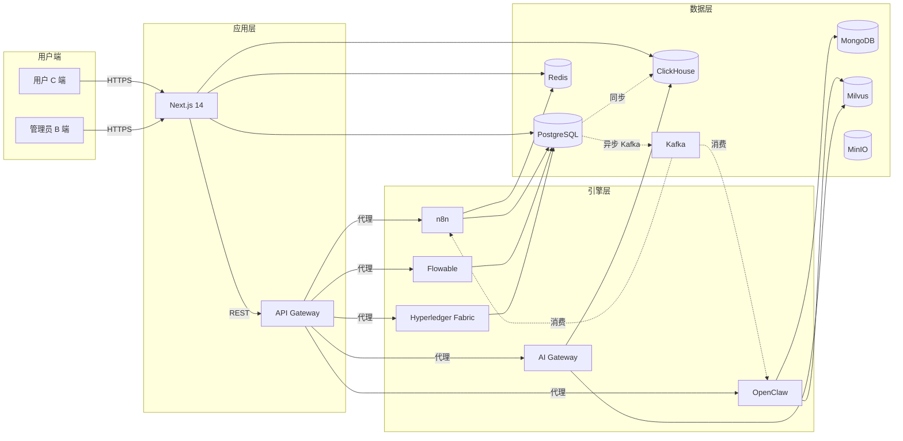

# ZS Exchange × AI 平台 — 数据流转规则

> **配套文档**: `ZS整合改造计划.md` / `接口开发需求.md`
> **目标**: 明确 10+ 核心数据实体的流转关系、缓存策略、一致性保证
> **文档版本**: v1.0
> **创建日期**: 2026-06-11

---

## 一、ER 图（核心实体关系）

```mermaid
erDiagram
    USER ||--o{ KYC : "提交"
    USER ||--o{ ORDER : "创建"
    USER ||--o{ WALLET : "拥有"
    USER ||--o{ NOTARIZATION : "发起"
    USER }o--o{ AGENT : "使用"
    AGENT ||--o{ AGENT_SESSION : "产生"
    AGENT ||--o{ LLM_LOG : "调用"
    WORKFLOW ||--o{ WORKFLOW_EXEC : "执行"
    WORKFLOW ||--o{ TRIGGER : "监听"
    BPM_PROCESS ||--o{ BPM_TASK : "包含"
    NOTARIZATION ||--|| FABRIC_TX : "对应"
    POOL ||--o{ POSITION : "包含"
    NFT_SERIES ||--o{ NFT : "归属"
    TOKEN ||--o{ MARKET_DATA : "产生"

    USER {
        bigint id PK
        string email
        string did
        string kyc_status
        timestamp created_at
    }
    KYC {
        bigint id PK
        bigint user_id FK
        string status
        jsonb documents
        string agent_id
    }
    ORDER {
        bigint id PK
        bigint user_id FK
        string symbol
        decimal price
        decimal qty
        string status
    }
    WALLET {
        bigint id PK
        bigint user_id FK
        string chain
        string address
        decimal balance
    }
    AGENT {
        bigint id PK
        string agent_id UK
        string name
        string model
        jsonb skills
        string status
    }
    AGENT_SESSION {
        bigint id PK
        string session_id UK
        string agent_id FK
        jsonb messages
    }
    LLM_LOG {
        bigint id PK
        string user_id
        string agent_id
        string model
        int tokens
        decimal cost
        int latency_ms
    }
    WORKFLOW {
        bigint id PK
        string workflow_id UK
        string name
        jsonb nodes
    }
    WORKFLOW_EXEC {
        bigint id PK
        string execution_id UK
        string workflow_id FK
        string status
        int duration_ms
    }
    TRIGGER {
        bigint id PK
        string trigger_id UK
        string workflow_id FK
        string type
        jsonb config
    }
    BPM_PROCESS {
        bigint id PK
        string process_key
        string instance_id UK
        bigint user_id FK
        string status
    }
    BPM_TASK {
        bigint id PK
        string task_id UK
        string process_id FK
        string assignee
        string status
    }
    NOTARIZATION {
        bigint id PK
        string cert_id UK
        string biz_type
        string file_hash
        string did
        string status
    }
    FABRIC_TX {
        bigint id PK
        string tx_hash UK
        bigint block_num
        string cert_id FK
    }
    POOL {
        bigint id PK
        string pool_id UK
        string token0
        string token1
        decimal tvl
    }
    POSITION {
        bigint id PK
        bigint user_id FK
        string pool_id FK
        decimal amount
    }
    NFT_SERIES {
        bigint id PK
        string series_id UK
        string name
        int total
    }
    NFT {
        bigint id PK
        string token_id UK
        string series_id FK
        bigint owner_id FK
    }
    TOKEN {
        bigint id PK
        string symbol UK
        string chain
        int decimals
    }
    MARKET_DATA {
        bigint id PK
        string symbol
        decimal price
        timestamp time
    }
```



---

## 二、核心数据实体（10+）

### 2.1 实体清单

| # | 实体 | 表名 | 存储 | 容量预估 | 增长率 |
|---|------|------|------|----------|--------|
| 1 | 用户 | `users` | PG | 1000 万 | 1 万/天 |
| 2 | KYC 审核 | `kyc_records` | PG | 1000 万 | 1 万/天 |
| 3 | 钱包地址 | `wallets` | PG | 5000 万 | 5 万/天 |
| 4 | 订单 | `orders` | PG（分区） | 10 亿 | 100 万/天 |
| 5 | 智能体 | `openclaw_agents` | PG | 1 万 | 10/天 |
| 6 | 智能体会话 | `agent_sessions` | MongoDB | 5 亿 | 50 万/天 |
| 7 | LLM 调用日志 | `ai_llm_logs` | ClickHouse | 50 亿 | 500 万/天 |
| 8 | 工作流 | `n8n_workflows` | PG（n8n schema） | 1 万 | 50/天 |
| 9 | 工作流执行 | `n8n_executions` | PG（n8n schema） | 1 亿 | 100 万/天 |
| 10 | BPM 流程实例 | `flowable.ACT_HI_PROCINST` | PG（flowable schema） | 1 亿 | 50 万/天 |
| 11 | 存证凭证 | `blockchain_notarizations` | PG | 1 亿 | 100 万/天 |
| 12 | Fabric 交易 | `fabric_txs` | PG + 链上 | 1 亿 | 100 万/天 |
| 13 | 流动性池 | `dex_pools` | PG + 链上 | 10 万 | 100/天 |
| 14 | NFT 系列 | `nft_series` | PG + 链上 | 1 万 | 10/天 |
| 15 | 行情数据 | `market_data` | ClickHouse | 100 亿 | 1 亿/天 |
| 16 | 知识向量 | `vectors` | Milvus | 1 亿向量 | 100 万/天 |
| 17 | 客户获取 | `customer_acquisition_logs` | ClickHouse | 10 亿 | 1000 万/天 |
| 18 | 威胁情报 | `threat_intel` | PG + ES | 1 亿 | 10 万/天 |
| 19 | 通知 | `notifications` | PG | 1 亿 | 100 万/天 |
| 20 | 审计日志 | `audit_logs` | PG（分区） | 100 亿 | 1000 万/天 |

---

## 三、数据库表结构变更

### 3.1 新增表（10 张）

```sql
-- 1. n8n 工作流映射
CREATE TABLE n8n_workflow_mappings (
    id BIGSERIAL PRIMARY KEY,
    zs_biz_type VARCHAR(64) NOT NULL,  -- ZS 业务类型: kyc/withdraw/listing
    n8n_workflow_id VARCHAR(64) NOT NULL,
    trigger_config JSONB,
    enabled BOOLEAN DEFAULT TRUE,
    created_at TIMESTAMPTZ DEFAULT NOW(),
    updated_at TIMESTAMPTZ DEFAULT NOW()
);
CREATE INDEX idx_n8n_mapping_biz_type ON n8n_workflow_mappings(zs_biz_type);

-- 2. OpenClaw 智能体
CREATE TABLE openclaw_agents (
    id BIGSERIAL PRIMARY KEY,
    agent_id VARCHAR(64) UNIQUE NOT NULL,
    name VARCHAR(128) NOT NULL,
    type VARCHAR(32) NOT NULL,  -- chat/task/workflow
    model VARCHAR(32),
    skills JSONB,
    config JSONB,
    status VARCHAR(16) DEFAULT 'active',
    created_by VARCHAR(64),
    created_at TIMESTAMPTZ DEFAULT NOW(),
    updated_at TIMESTAMPTZ DEFAULT NOW()
);
CREATE INDEX idx_openclaw_agents_status ON openclaw_agents(status);
CREATE INDEX idx_openclaw_agents_type ON openclaw_agents(type);

-- 3. AI 模型调用日志（分区表）
CREATE TABLE ai_llm_logs (
    id BIGSERIAL,
    user_id VARCHAR(64),
    agent_id VARCHAR(64),
    model VARCHAR(32) NOT NULL,
    provider VARCHAR(32) NOT NULL,  -- openai/anthropic/zhipu
    prompt_tokens INT,
    completion_tokens INT,
    total_tokens INT,
    cost_usd DECIMAL(10,6),
    latency_ms INT,
    cache_hit BOOLEAN DEFAULT FALSE,
    request_id VARCHAR(64),
    created_at TIMESTAMPTZ DEFAULT NOW(),
    PRIMARY KEY (id, created_at)
) PARTITION BY RANGE (created_at);
-- 按月分区
CREATE TABLE ai_llm_logs_2026_06 PARTITION OF ai_llm_logs
    FOR VALUES FROM ('2026-06-01') TO ('2026-07-01');

-- 4. 区块链存证（已有，需扩展）
ALTER TABLE blockchain_notarizations
    ADD COLUMN IF NOT EXISTS fabric_tx_id VARCHAR(128),
    ADD COLUMN IF NOT EXISTS fabric_block_num BIGINT,
    ADD COLUMN IF NOT EXISTS notarization_status VARCHAR(16) DEFAULT 'pending',
    ADD COLUMN IF NOT EXISTS file_hash VARCHAR(128),
    ADD COLUMN IF NOT EXISTS did VARCHAR(128),
    ADD COLUMN IF NOT EXISTS metadata JSONB;
CREATE INDEX idx_notarize_status ON blockchain_notarizations(notarization_status);
CREATE INDEX idx_notarize_fabric_tx ON blockchain_notarizations(fabric_tx_id);

-- 5. BPM 流程映射
CREATE TABLE bpm_process_mappings (
    id BIGSERIAL PRIMARY KEY,
    zs_biz_type VARCHAR(64) NOT NULL,
    zs_biz_id VARCHAR(64) NOT NULL,
    flowable_process_key VARCHAR(128) NOT NULL,
    flowable_instance_id VARCHAR(128),
    status VARCHAR(32),
    started_at TIMESTAMPTZ,
    ended_at TIMESTAMPTZ,
    metadata JSONB,
    created_at TIMESTAMPTZ DEFAULT NOW()
);
CREATE INDEX idx_bpm_mapping_biz ON bpm_process_mappings(zs_biz_type, zs_biz_id);

-- 6. 获客数据
CREATE TABLE customer_acquisition_logs (
    id BIGSERIAL PRIMARY KEY,
    platform VARCHAR(32) NOT NULL,  -- tiktok/douyin/xiaohongshu/instagram/youtube
    account_id VARCHAR(64),
    content_id VARCHAR(64),
    views BIGINT DEFAULT 0,
    engagements BIGINT DEFAULT 0,
    conversions INT DEFAULT 0,
    spend_usd DECIMAL(10,2),
    metadata JSONB,
    created_at TIMESTAMPTZ DEFAULT NOW()
);
CREATE INDEX idx_acquisition_platform_time ON customer_acquisition_logs(platform, created_at);

-- 7. 智能体会话（MongoDB）
// db.agent_sessions.insertOne({
//   session_id: "uuid",
//   user_id: "uuid",
//   agent_id: "agent-001",
//   messages: [...],
//   memory: {...},
//   created_at: new Date(),
//   updated_at: new Date()
// })
// 创建索引
db.agent_sessions.createIndex({ session_id: 1 }, { unique: true });
db.agent_sessions.createIndex({ user_id: 1, updated_at: -1 });
db.agent_sessions.createIndex({ agent_id: 1 });

-- 8. 威胁情报
CREATE TABLE threat_intel (
    id BIGSERIAL PRIMARY KEY,
    source VARCHAR(64) NOT NULL,  -- alienvault/otx/misp/abuse.ch
    indicator_type VARCHAR(32),  -- ip/domain/url/hash
    indicator VARCHAR(256),
    threat_type VARCHAR(64),
    severity VARCHAR(16),
    confidence DECIMAL(3,2),
    metadata JSONB,
    first_seen TIMESTAMPTZ,
    last_seen TIMESTAMPTZ,
    created_at TIMESTAMPTZ DEFAULT NOW()
);
CREATE INDEX idx_threat_intel_indicator ON threat_intel(indicator);
CREATE INDEX idx_threat_intel_severity ON threat_intel(severity);

-- 9. 设备告警（IoT）
CREATE TABLE device_alerts (
    id BIGSERIAL PRIMARY KEY,
    device_id VARCHAR(64) NOT NULL,
    alert_type VARCHAR(64),
    severity VARCHAR(16),
    payload JSONB,
    status VARCHAR(16) DEFAULT 'open',
    handled_by VARCHAR(64),
    handled_at TIMESTAMPTZ,
    created_at TIMESTAMPTZ DEFAULT NOW()
);
CREATE INDEX idx_device_alerts_status ON device_alerts(status);
CREATE INDEX idx_device_alerts_device ON device_alerts(device_id);

-- 10. 通知
CREATE TABLE notifications (
    id BIGSERIAL PRIMARY KEY,
    user_id VARCHAR(64) NOT NULL,
    type VARCHAR(32),  -- system/security/trade/agent
    title VARCHAR(256),
    content TEXT,
    channel VARCHAR(32),  -- in_app/email/sms/feishu
    priority VARCHAR(16) DEFAULT 'normal',
    read_at TIMESTAMPTZ,
    metadata JSONB,
    created_at TIMESTAMPTZ DEFAULT NOW()
);
CREATE INDEX idx_notif_user_unread ON notifications(user_id, read_at) WHERE read_at IS NULL;
CREATE INDEX idx_notif_type_time ON notifications(type, created_at DESC);
```

### 3.2 跨 Schema 视图

```sql
-- n8n 业务视图
CREATE OR REPLACE VIEW v_n8n_business AS
SELECT
    m.zs_biz_type,
    m.n8n_workflow_id,
    COUNT(e.id) AS exec_count_24h,
    AVG(e.duration) AS avg_duration_ms
FROM n8n_workflow_mappings m
LEFT JOIN n8n.executions e
    ON e.workflow_id::text = m.n8n_workflow_id
    AND e.created_at > NOW() - INTERVAL '24 hours'
GROUP BY m.zs_biz_type, m.n8n_workflow_id;

-- BPM 业务视图
CREATE OR REPLACE VIEW v_bpm_business AS
SELECT
    m.zs_biz_type,
    m.status,
    COUNT(*) AS instance_count,
    AVG(EXTRACT(EPOCH FROM (m.ended_at - m.started_at))) AS avg_duration_sec
FROM bpm_process_mappings m
WHERE m.started_at > NOW() - INTERVAL '7 days'
GROUP BY m.zs_biz_type, m.status;

-- 存证业务视图
CREATE OR REPLACE VIEW v_notarization_status AS
SELECT
    biz_type,
    notarization_status,
    COUNT(*) AS count,
    AVG(EXTRACT(EPOCH FROM (updated_at - created_at))) AS avg_confirm_sec
FROM blockchain_notarizations
WHERE created_at > NOW() - INTERVAL '24 hours'
GROUP BY biz_type, notarization_status;
```

---

## 四、数据流向图

### 4.1 总体数据流



### 4.2 核心业务流程数据流

#### 流 1：KYC 审核（同步 + 异步）

```
用户提交 KYC
  ↓ 同步
PostgreSQL.users (update kyc_status='submitted')
  ↓ 异步 (Kafka topic: kyc.submitted)
OpenClaw "KYC 审核" 智能体
  ↓
n8n 工作流 (kyc-review)
  ├─→ AI Model Gateway (OCR + 人脸识别)
  ├─→ 第三方征信 API
  └─→ Hyperledger Fabric 存证 (异步)
  ↓
BPM Flowable 启动审批流
  ↓
运营人员审批
  ↓
PostgreSQL.users (update kyc_status='approved')
  ↓
WebSocket 推送 → 用户
```

#### 流 2：大额提现（同步凭证 + 异步上链）

```
用户发起提现 (≥ 10万 USDT)
  ↓ 同步 P95 < 1s
存证服务生成凭证 (内存 + DB)
  ↓ 返回 cert_id
PG.transactions (insert pending)
  ↓ 异步
Kafka topic: withdraw.requested
  ↓
n8n 工作流 (withdraw-approval)
  ├─→ AI 风控检查
  ├─→ BPM 启动审批
  └─→ 异步上链 (Worker)
  ↓
BPM 审批 (初审 → 复审 → 终审)
  ↓
BPM 完成回调
  ↓
执行链上转账
  ↓
PG.transactions (update completed)
  ↓
WebSocket 推送 → 用户
```

#### 流 3：AI 智能获客（实时流）

```
TikTok/Douyin API (5min 轮询)
  ↓
Kafka topic: raw.douyin/raw.tiktok
  ↓
Flink 实时计算 (互动率、转化率)
  ↓
ClickHouse (OLAP 存储)
  ↓
OpenClaw 智能体分析
  ↓
AI Model Gateway 生成策略
  ↓
PG.dsales_strategies (insert)
  ↓
WebSocket 推送 → /admin/dsales/network
```

#### 流 4：3D 大屏（实时推送）

```
后端定时任务 (5s)
  ↓
查询 PG + ClickHouse 聚合
  ↓
WebSocket push (./api/dashboard/live)
  ↓
前端 3D 渲染 (Three.js / Cesium)
  ↓
60fps 流畅展示
```

---

## 五、同步/异步规则

### 5.1 同步操作（用户等待）

| 场景 | 接口 | P95 要求 | 原因 |
|------|------|----------|------|
| 用户登录 | `/api/auth/login` | < 500ms | 用户感知 |
| 提交 KYC | `/api/user/kyc/submit` | < 1s | 表单交互 |
| 发起提现 | `/api/user/withdraw` | < 1s | 凭证必须立即返回 |
| 区块链存证 | `/api/blockchain/notarize` | < 1s | 凭证预生成 |
| 下单 | `/api/cex/order` | < 200ms | 交易撮合 |
| AI 对话 | `/api/ai/chat` | < 3s | 用户等待 |

### 5.2 异步操作（MQ 队列）

| 场景 | 队列 | 重试 | 死信 |
|------|------|------|------|
| KYC 提交 → 智能体 | `kyc.submitted` | 3 次 | `kyc.dlq` |
| 提现 → BPM | `withdraw.requested` | 5 次 | `withdraw.dlq` |
| 存证 → 上链 | `notarize.pending` | 3 次 | `notarize.dlq` |
| AI 分析 | `ai.analyze` | 3 次 | `ai.dlq` |
| 邮件/短信 | `notify.send` | 5 次 | `notify.dlq` |
| 区块链确认 | `fabric.confirm` | 无限（指数退避） | - |
| 智能体训练 | `agent.train` | 1 次 | `agent.dlq` |
| 数据同步 | `data.sync` | 3 次 | `data.dlq` |

### 5.3 异步触发方式

```typescript
// ZS Exchange 业务触发智能体
// src/lib/event-bus.ts
import { Kafka } from 'kafkajs';

const kafka = new Kafka({ brokers: [process.env.KAFKA_BROKER!] });
const producer = kafka.producer();

export async function emitEvent(topic: string, payload: any) {
  await producer.send({
    topic,
    messages: [{
      key: payload.bizId || payload.id,
      value: JSON.stringify(payload),
      headers: {
        traceId: getTraceId(),
        timestamp: Date.now().toString(),
      },
    }],
  });
}

// 示例：KYC 提交
await emitEvent('kyc.submitted', {
  userId: user.id,
  documents: docs,
  did: user.did,
});
```

---

## 六、缓存策略

### 6.1 缓存分层

```
┌─────────────────────────────────────┐
│ L1: 浏览器缓存 (localStorage)       │  TTL: 1h
│  - 用户偏好                          │
│  - 主题设置                          │
└─────────────────────────────────────┘
  ↓
┌─────────────────────────────────────┐
│ L2: CDN 缓存 (Cloudflare)          │  TTL: 1d
│  - 静态资源                          │
│  - 公共数据 (行情、新闻)              │
└─────────────────────────────────────┘
  ↓
┌─────────────────────────────────────┐
│ L3: API Gateway 缓存 (Redis)       │  TTL: 5min
│  - GET 请求结果                       │
│  - 限流计数                          │
└─────────────────────────────────────┘
  ↓
┌─────────────────────────────────────┐
│ L4: 应用缓存 (Redis Cluster)       │  TTL: 10min
│  - 会话                              │
│  - 热点数据                          │
│  - 排行榜                            │
└─────────────────────────────────────┘
  ↓
┌─────────────────────────────────────┐
│ L5: 数据库 (PostgreSQL)             │  持久化
└─────────────────────────────────────┘
```

### 6.2 缓存 Key 规范

```
zs:{module}:{entity}:{id}            # 实体缓存
zs:{module}:{entity}:{id}:{field}    # 字段缓存
zs:list:{module}:{entity}:{filter}   # 列表缓存
zs:count:{module}:{entity}            # 计数缓存
zs:session:{userId}                   # 会话
zs:ratelimit:{userId}:{api}          # 限流
zs:lock:{resource}                    # 分布式锁
```

### 6.3 缓存更新策略

| 场景 | 策略 | 说明 |
|------|------|------|
| 用户信息 | Cache-Aside | 读时取缓存，写时失效 |
| 行情数据 | Write-Through | 高频写，直写 Redis |
| 排行榜 | Write-Behind | 异步批量更新 |
| 智能体列表 | TTL 过期 | 5 分钟自动失效 |
| 存证凭证 | 不缓存 | 强一致 |
| 订单簿 | 不缓存 | 实时推送 |

### 6.4 AI 语义缓存

```typescript
// 接入 Milvus 实现语义缓存
import { MilvusClient } from '@zilliz/milvus2-sdk-node';

class SemanticCache {
  private milvus: MilvusClient;
  private threshold = 0.92;  // 相似度阈值

  async get(prompt: string): Promise<string | null> {
    const embedding = await this.embed(prompt);
    const result = await this.milvus.search({
      collection_name: 'semantic_cache',
      vector: embedding,
      topk: 1,
      threshold: this.threshold,
    });
    return result?.[0]?.response || null;
  }

  async set(prompt: string, response: string) {
    const embedding = await this.embed(prompt);
    await this.milvus.insert({
      collection_name: 'semantic_cache',
      data: [{
        prompt_embedding: embedding,
        response,
        created_at: Date.now(),
      }],
    });
  }

  private async embed(text: string): Promise<number[]> {
    // 调用 Embedding 模型
    return await aiGateway.embed(text);
  }
}

// 使用
const cached = await semanticCache.get(prompt);
if (cached) {
  return cached;  // 命中缓存，0 成本
}
const response = await aiGateway.chat(prompt);
await semanticCache.set(prompt, response);
return response;
```

---

## 七、数据一致性保证

### 7.1 一致性模型

| 数据类型 | 一致性 | 原因 |
|----------|--------|------|
| 账户余额 | 强一致 | 资金安全 |
| 订单状态 | 强一致 | 交易撮合 |
| 存证凭证 | 强一致 | 法律证据 |
| 用户信息 | 最终一致 | 用户体验 |
| 行情数据 | 最终一致 | 实时推送 |
| AI 日志 | 最终一致 | 分析统计 |
| 审计日志 | 最终一致 | 异步写入 |
| 威胁情报 | 最终一致 | 多源融合 |

### 7.2 分布式事务

```typescript
// Saga 模式：大额提现
import { Saga } from '@/lib/saga';

const withdrawSaga = new Saga()
  .step('freezeBalance', async (ctx) => {
    await pg.query('UPDATE wallets SET balance = balance - $1 WHERE user_id = $2', [ctx.amount, ctx.userId]);
  })
  .step('notarize', async (ctx) => {
    ctx.certId = await blockchainService.notarize({ bizType: 'withdraw', bizId: ctx.withdrawId });
  })
  .step('bpmApproval', async (ctx) => {
    ctx.bpmInstanceId = await bpmService.startProcess('withdraw-approval', ctx);
  })
  .compensate('notarize', async (ctx) => {
    await blockchainService.markInvalid(ctx.certId);
  })
  .compensate('freezeBalance', async (ctx) => {
    await pg.query('UPDATE wallets SET balance = balance + $1 WHERE user_id = $2', [ctx.amount, ctx.userId]);
  });

await withdrawSaga.execute({ userId, amount, withdrawId });
```

### 7.3 幂等性保证

```typescript
// 所有写接口必须支持幂等
// 客户端传 X-Idempotency-Key，服务端用 Redis 去重

export async function POST(req: Request) {
  const idempotencyKey = req.headers.get('X-Idempotency-Key');
  if (!idempotencyKey) {
    return Response.json({ error: 'Missing X-Idempotency-Key' }, { status: 400 });
  }

  // 查重
  const cached = await redis.get(`idemp:${idempotencyKey}`);
  if (cached) {
    return Response.json(JSON.parse(cached));
  }

  // 执行业务
  const result = await doBusiness(req);

  // 缓存 24h
  await redis.setex(`idemp:${idempotencyKey}`, 86400, JSON.stringify(result));

  return Response.json(result);
}
```

### 7.4 分布式锁

```typescript
// 防止并发问题
import { Redlock } from '@/lib/redlock';

const lock = new Redlock([redisClient]);

async function safeTransfer(fromId: string, toId: string, amount: number) {
  const release = await lock.acquire(`lock:wallet:${fromId}`, 5000);
  try {
    // 余额检查 + 转账
    await pg.query('BEGIN');
    const from = await pg.query('SELECT balance FROM wallets WHERE user_id = $1 FOR UPDATE', [fromId]);
    if (from.rows[0].balance < amount) throw new Error('Insufficient balance');
    await pg.query('UPDATE wallets SET balance = balance - $1 WHERE user_id = $2', [amount, fromId]);
    await pg.query('UPDATE wallets SET balance = balance + $1 WHERE user_id = $2', [amount, toId]);
    await pg.query('COMMIT');
  } finally {
    await release();
  }
}
```

---

## 八、数据生命周期

### 8.1 TTL 策略

| 数据类型 | 热存储 | 温存储 | 冷存储 | 删除 |
|----------|--------|--------|--------|------|
| 订单 | 30 天 (PG) | 1 年 (ClickHouse) | 5 年 (OSS) | - |
| LLM 日志 | 7 天 (PG) | 1 年 (ClickHouse) | - | 1 年后归档 |
| 存证凭证 | 永久 (PG + Fabric) | - | - | - |
| 行情数据 | 1 天 (Redis) | 1 年 (ClickHouse) | - | - |
| 审计日志 | 90 天 (PG) | 7 年 (OSS) | - | - |
| 智能体会话 | 30 天 (Mongo) | 1 年 (OSS) | - | - |
| 通知 | 7 天 (PG) | 90 天 (OSS) | - | - |
| 设备告警 | 30 天 (PG) | 1 年 (ClickHouse) | - | - |

### 8.2 数据归档

```sql
-- 每日凌晨 3 点归档
SELECT cron.schedule('archive-old-orders', '0 3 * * *', $$
  INSERT INTO orders_archive
  SELECT * FROM orders
  WHERE created_at < NOW() - INTERVAL '30 days'
    AND status IN ('completed', 'cancelled');

  DELETE FROM orders
  WHERE created_at < NOW() - INTERVAL '30 days'
    AND status IN ('completed', 'cancelled');
$$);
```

### 8.3 GDPR / 合规

```typescript
// 用户数据删除（GDPR Right to be Forgotten）
export async function deleteUserData(userId: string) {
  // 1. 软删除
  await pg.query('UPDATE users SET status = $1, deleted_at = NOW() WHERE id = $2', ['deleted', userId]);

  // 2. 30 天后硬删除（缓冲期）
  // 3. 区块链存证保留（不可删除，但标记为 invalid）
  // 4. 第三方数据请求 TikTok/Douyin API 删除
  // 5. 通知用户邮件确认
}
```

---

## 九、数据迁移与同步

### 9.1 跨 Schema 查询

```typescript
// 使用 FDW (Foreign Data Wrapper) 跨库查询
// 或使用同步表
CREATE TABLE n8n_workflow_cache (
    workflow_id VARCHAR(64) PRIMARY KEY,
    name VARCHAR(128),
    active BOOLEAN,
    updated_at TIMESTAMPTZ
);
// 定时从 n8n 库同步
```

### 9.2 数据同步规则

| 源 | 目标 | 同步方式 | 延迟 |
|----|------|----------|------|
| PG → ClickHouse | OLAP | MaterializedPostgreSQL / 自研 ETL | 1 分钟 |
| PG → ES | 搜索 | Logstash / PG logical replication | 5 秒 |
| PG → Redis | 缓存 | 业务代码触发 | 实时 |
| 链上 → PG | 资产 | 事件订阅 | 12 秒 |
| 第三方 API → Kafka | 原始 | 抓取 + 入队 | 5 分钟 |

---

## 十、关键监控指标

| 指标 | 阈值 | 告警 |
|------|------|------|
| PG 主从延迟 | > 1s | P2 |
| Redis 命中率 | < 80% | P3 |
| Kafka 积压 | > 1 万 | P2 |
| ClickHouse 慢查询 | > 5s | P3 |
| Milvus 检索 QPS | - | - |
| 存证成功率 | < 99% | P1 |
| AI 缓存命中率 | < 30% | P3 |

---

**版本历史**：
- v1.0 (2026-06-11): 初始版本
