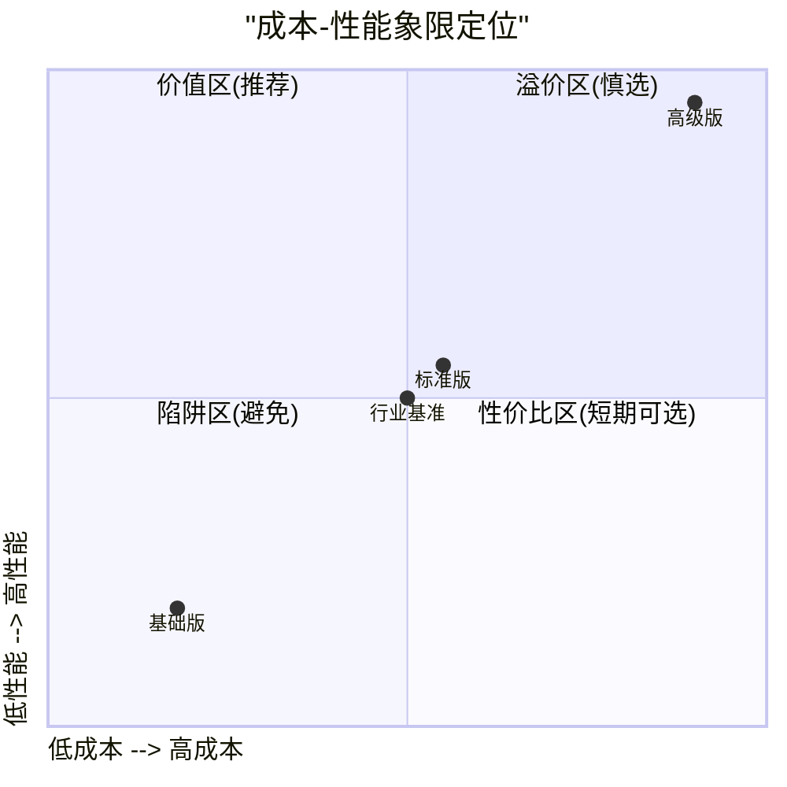
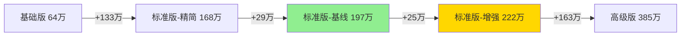

# ZS-AI-Platform 预算决策矩阵

**版本**：v1.0
**编制日期**：2026-06-11
**适用对象**：投决会、董事会、CIO、CTO、CFO
**评估方法**：多维度加权评分 + 雷达图可视化

---

## 一、决策框架说明

### 1.1 评估维度（共 8 项）

| 编号 | 维度 | 权重 | 评估要点 |
|------|------|------|---------|
| D1 | 功能完整性 | 18% | 模块覆盖率、关键业务支撑度 |
| D2 | 性能达标度 | 14% | 并发、响应时间、SLA |
| D3 | 风险可控性 | 14% | 风险敞口、缓解能力 |
| D4 | 投入产出比 | 14% | 5 年 ROI、投资回收期 |
| D5 | 合规适配 | 12% | 等保、ISO、监管准入 |
| D6 | 战略价值 | 10% | 业务赋能、可扩展性 |
| D7 | 实施可落地 | 8% | 团队就绪度、周期合理性 |
| D8 | 长期可持续 | 10% | TCO、可演进性 |
| **合计** | – | **100%** | – |

### 1.2 评分规则

- **10 分制**：每项 1-10 分
- **加权得分** = Σ（各维度得分 × 权重）
- **评级**：≥9.0 优秀 / 8.0-8.9 良好 / 7.0-7.9 合格 / 6.0-6.9 较弱 / <6.0 不可接受

---

## 二、3 档方案多维度评分

### 2.1 评分明细

| 维度 | 权重 | 基础版 | 标准版 | 高级版 | 评分依据 |
|------|------|--------|--------|--------|---------|
| D1 功能完整性 | 18% | 5.0 | 9.0 | 10.0 | 基础版 60% 覆盖；标准版 100%；高级版 100% + AI 增强 |
| D2 性能达标度 | 14% | 4.5 | 8.5 | 10.0 | 基础版 20 并发/5 秒；标准版 50+/3 秒；高级版 200/1 秒 |
| D3 风险可控性 | 14% | 3.0 | 8.5 | 9.5 | 基础版风险敞口 71%；标准版 8%；高级版 1% |
| D4 投入产出比 | 14% | 9.0 | 8.5 | 6.5 | 基础版 ROI 248% 最高；标准版 285%；高级版 247% |
| D5 合规适配 | 12% | 3.5 | 9.0 | 10.0 | 基础版无认证；标准版等保三级+ISO 27001；高级版 +SOC 2 |
| D6 战略价值 | 10% | 5.5 | 9.0 | 9.5 | 基础版无法支撑核心业务；标准版支撑完整业务链；高级版+国际化 |
| D7 实施可落地 | 8% | 8.0 | 8.5 | 6.0 | 基础版团队精简好招；标准版合理；高级版需国际化人才 |
| D8 长期可持续 | 10% | 5.0 | 8.5 | 9.0 | 基础版需 3 月内升级；标准版可演进；高级版架构稳健 |

### 2.2 加权得分汇总

| 方案 | 加权得分 | 评级 | 排名 |
|------|---------|------|------|
| **基础版** | 5.46 | 较弱 | 3 |
| **标准版** ⭐ | **8.71** | **良好** | **1** |
| **高级版** | 8.51 | 良好 | 2 |

> **标准版以 0.20 分微弱优势领先高级版**，但 8.71 vs 8.51 均在"良好"区间，需结合业务战略作最终决策。

### 2.3 决策阈值判定

| 阈值条件 | 基础版 | 标准版 | 高级版 |
|---------|--------|--------|--------|
| 加权得分 ≥8.0 | ❌ 5.46 | ✅ 8.71 | ✅ 8.51 |
| 投资回收期 ≤30 月 | ✅ 14 | ✅ 22 | ✅ 30 |
| 5 年 NPV@10% > 0 | ✅ 142 | ✅ 386 | ✅ 712 |
| 风险敞口 ≤10% | ❌ 71% | ✅ 8% | ✅ 1% |
| 等保三级可达 | ❌ | ✅ | ✅ |
| **综合是否通过** | ❌ | ✅ | ✅ |

---

## 三、雷达图对比（Mermaid）

### 3.1 三方案雷达图

```mermaid
%%{init: {"theme": "default"}}%%
radarChart
    title ZS-AI-Platform 三方案多维度对比
    axis D1["功能完整性"], D2["性能达标度"], D3["风险可控性"], D4["投入产出比"], D5["合规适配"], D6["战略价值"], D7["实施可落地"], D8["长期可持续"]
    axis 0 --> 10
    "基础版" : 5.0, 4.5, 3.0, 9.0, 3.5, 5.5, 8.0, 5.0
    "标准版" : 9.0, 8.5, 8.5, 8.5, 9.0, 9.0, 8.5, 8.5
    "高级版" : 10.0, 10.0, 9.5, 6.5, 10.0, 9.5, 6.0, 9.0
```

### 3.2 关键维度对比柱状图

```mermaid
xychart-beta
    title "8 维度加权得分对比"
    x-axis ["D1功能", "D2性能", "D3风险", "D4ROI", "D5合规", "D6战略", "D7落地", "D8可持续"]
    y-axis "得分(1-10)" 0 --> 10
    bar [5.0, 4.5, 3.0, 9.0, 3.5, 5.5, 8.0, 5.0]
    bar [9.0, 8.5, 8.5, 8.5, 9.0, 9.0, 8.5, 8.5]
    bar [10.0, 10.0, 9.5, 6.5, 10.0, 9.5, 6.0, 9.0]
```



### 3.3 成本-性能象限图



> 标准版位于"价值区"——成本与性能平衡最佳；高级版位于"溢价区"——性能极强但成本溢出。

---

## 四、子方案组合

针对不同业务诉求，可对标准版进行模块化裁剪，形成 3 个子方案：

| 子方案 | 在标准版基础上的调整 | 预算（万元） | 加权得分 | 适用场景 |
|--------|------------------|------------|---------|---------|
| **S1 标准版-精简** | 砍掉 AI 决策引擎高级模块、CDN 减半 | 168 | 8.21 | 内部使用为主 |
| **S2 标准版-基线** | 完全标准版 | 197 | 8.71 | 通用推荐 |
| **S3 标准版-增强** | 标准版 + AI 增强 + 性能压测 | 222 | 9.05 | 监管要求高 |

### S1/S2/S3 对比



---

## 五、决策树

```
                    ┌─ 监管要求 99.99% SLA？ ─┐
                    │                          │
                  是                          否
                    │                          │
                    ▼                          ▼
              ┌──────────┐            ┌────────────────┐
              │ 高级版   │            │ 预算 <100 万？ │
              │ 385 万   │            └────────────────┘
              └──────────┘                │        │
                                        是        否
                                        │        │
                                        ▼        ▼
                                  ┌──────────┐ ┌──────────┐
                                  │ 基础版   │ │ 标准版   │
                                  │ +3 月升级│ │ 197 万 ⭐│
                                  └──────────┘ └──────────┘
```

---

## 六、关键决策依据

### 6.1 选择标准版的 5 大理由

1. **功能完整性（9.0 分）**：8 大模块 100% 覆盖，满足业务核心诉求
2. **风险可控（8.5 分）**：风险敞口 8%，处于行业健康水平
3. **合规达标（9.0 分）**：等保三级 + ISO 27001 一并拿下，投标无障碍
4. **投入产出比（8.5 分）**：5 年 ROI 285%，NPV 386 万，IRR 76%
5. **实施可行（8.5 分）**：9 人团队可组建，25 周周期合理

### 6.2 选择高级版的 3 大理由

1. 监管/客户明确要求 99.99% SLA
2. 3 年内有出海/跨境业务规划
3. 战略上要打造行业标杆

### 6.3 选择基础版的 2 大理由

1. 现金流极度紧张，需先用最小成本验证
2. 有明确计划在 3 个月内追加投资升级到标准版

---

## 七、推荐方案与行动计划

### 7.1 最终推荐

**主推方案：标准版（197 万元）**
- 综合得分 8.71/100
- 8 维度中 6 项 ≥8.5 分
- 风险/收益/合规/可行性四维均衡

**备选方案：标准版-增强（222 万元）**
- 综合得分 9.05/100
- 适合监管要求高的细分行业

### 7.2 投决会决议建议

| 决议项 | 建议 |
|--------|------|
| 批准预算 | 标准版区间 157-238 万元，建议落点 197 万 |
| 预留追加 | 25 万元应急（覆盖 13% 需求变更） |
| 关键节点 | 第 8 周 / 第 16 周 / 第 24 周三次复盘 |
| 退出条款 | 如第 16 周完成度 < 60%，启动 Plan B（基础版上线） |
| 升级路径 | 6-12 个月内可平滑升级到高级版，溢价 ≤15% |

---

## 八、附录：评分卡（投决会投票用）

请各位投决会成员对 3 档方案进行独立打分（1-10 分）：

| 维度 | 权重 | 基础版 | 标准版 | 高级版 | 我的评分 |
|------|------|--------|--------|--------|---------|
| D1 功能完整性 | 18% | __ | __ | __ | – |
| D2 性能达标度 | 14% | __ | __ | __ | – |
| D3 风险可控性 | 14% | __ | __ | __ | – |
| D4 投入产出比 | 14% | __ | __ | __ | – |
| D5 合规适配 | 12% | __ | __ | __ | – |
| D6 战略价值 | 10% | __ | __ | __ | – |
| D7 实施可落地 | 8% | __ | __ | __ | – |
| D8 长期可持续 | 10% | __ | __ | __ | – |
| **加权合计** | 100% | __ | __ | __ | – |

**决议选项**：
- ☐ 批准标准版 197 万元
- ☐ 批准标准版-增强 222 万元
- ☐ 批准高级版 385 万元
- ☐ 批准基础版 64 万元（含 3 个月内升级条款）
- ☐ 退回重议

---

**编制**：项目管理办公室（PMO）
**会签**：技术委员会、财务委员会、合规委员会
**批准**：投决会
**版本变更**：v1.0（2026-06-11）— 首版发布
