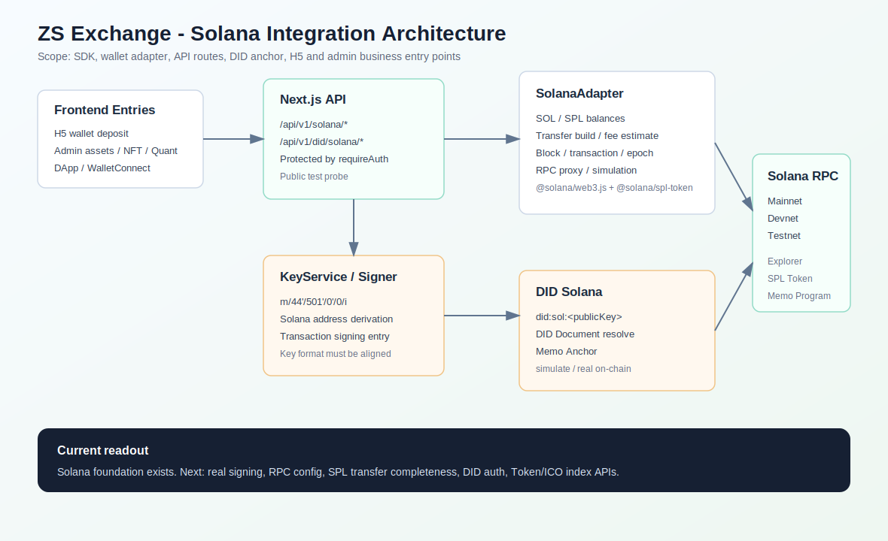
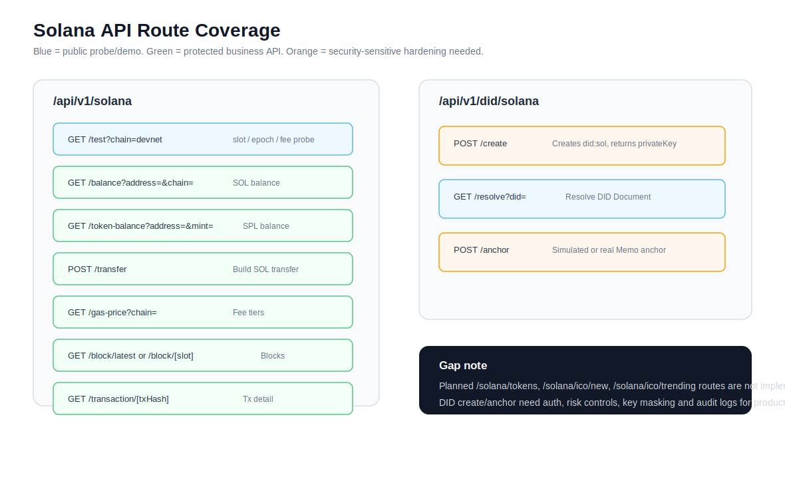
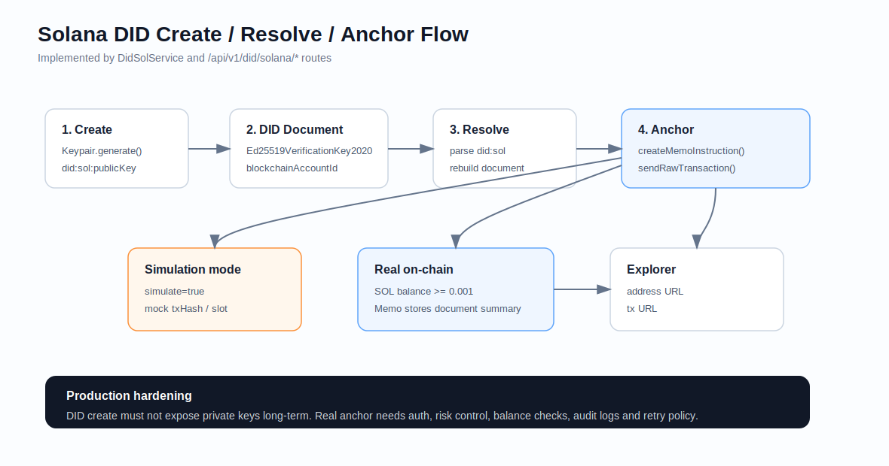

# ZS Exchange Solana 集成资料汇整报告

生成时间：2026-06-28  
范围：本报告汇整当前项目内已经出现的 Solana 相关文档、依赖、后端 API、钱包链适配器、DID 上链、测试脚本与周边业务引用。这里的 “solanad” 按上下文理解为 Solana 相关资料。

## 图片总览







## 1. 总体结论

当前项目已经完成了 Solana 接入的基础骨架，核心能力集中在 5 个层面：

| 层级 | 当前状态 | 关键文件 |
| --- | --- | --- |
| SDK 依赖 | 已安装官方 Solana SDK 与 SPL 依赖 | `package.json` |
| 链适配器 | 已实现 `SolanaAdapter`，覆盖网络、余额、SPL、转账构建、手续费、区块、交易查询、RPC 透传 | `src/lib/wallet/chains/solana-adapter.ts` |
| 钱包密钥 | 已支持 Solana 地址派生与交易签名入口 | `src/lib/wallet/key/key.service.ts`, `src/lib/wallet/key/solana-signer.ts` |
| API 路由 | 已暴露余额、SPL 余额、转账构建、Gas/手续费、区块、交易、测试探针等接口 | `src/app/api/v1/solana/**` |
| DID 身份 | 已支持 `did:sol` 创建、解析、Memo Anchor 模拟/真实上链 | `src/modules/did-identity/core/methods/did-sol.service.ts`, `src/app/api/v1/did/solana/**` |

当前更像是 “Solana 链能力底座 + DID 上链能力 + API 探针” 已接入，而不是完整的 Solana 资产生产闭环。需要继续补强的重点是：真实业务鉴权联调、私钥格式一致性、SPL 转账 ATA 创建、RPC 环境变量化、链上索引/ICO 发现接口落地。

## 2. 依赖与技术栈

项目 `package.json` 中已存在：

| 包 | 版本 | 用途 |
| --- | --- | --- |
| `@solana/web3.js` | `^1.98.4` | Solana RPC、账户、公钥、交易、区块、签名结构 |
| `@solana/spl-token` | `^0.4.14` | SPL Token 账户、ATA、Mint、Token 转账 |
| `@solana/spl-memo` | `^0.2.5` | DID Anchor 的 Memo 指令 |
| `bs58` | `^6.0.0` | Solana 地址、私钥、签名 Base58 编解码 |

## 3. 链适配器能力

核心文件：`src/lib/wallet/chains/solana-adapter.ts`

### 3.1 支持网络

`SOLANA_NETWORKS` 已内置：

| key | cluster | 默认 RPC | 是否测试网 | Explorer |
| --- | --- | --- | --- | --- |
| `mainnet` | `mainnet-beta` | `https://api.mainnet-beta.solana.com`，另含 Project Serum、Ankr | 否 | `https://explorer.solana.com` |
| `testnet` | `testnet` | `https://api.testnet.solana.com` | 是 | `https://explorer.solana.com` |
| `devnet` | `devnet` | `https://api.devnet.solana.com` | 是 | `https://explorer.solana.com` |

同时支持 `addCustomNetwork/removeCustomNetwork` 添加和移除自定义 Solana 网络。

### 3.2 常量与 Token

已定义的链上程序常量包括：

- System Program
- SPL Token Program
- Token 2022 Program
- Associated Token Program
- Stake Program
- Metaplex Token Metadata Program
- Rent Program
- Clock Program

常见 SPL Token 已预置：

| Symbol | Mint |
| --- | --- |
| USDC | `EPjFWdd5AufqSSqeM2qN1xzybapC8G4wEGGkZwyTDt1v` |
| USDT | `Es9vMFrzaCERmJfrF4H2FYD4KCoNkY11McCe8BenwNYB` |
| SRM | `SRMuApVNdxXokk5GT7XD5cUUgXMBCoAz2LHeuAoKWRt` |
| RAY | `4k3Dyjzvzp8eMZWUXbBCjEvwSkkk59S5iCNLY3QrkX6R` |
| mSOL | `mSoLzYCxHdYgdzU16g5QSh3i5K3z3KZK7ytfqcJm7So` |
| stSOL | `7dHbWXmci3dT8UFYWYZweBLXgycu7Y3iL6trKn1Y7ARj` |
| ORCA | `orcaEKTdK7LKz57vaAYr9QeNsVEPfiu6QeMU1kektZE` |
| JUP | `JUPyiwrYJFskUPiHa7hkeR8VUtAeFoSYbKedZNsDvCN` |
| WIF | `EKpQGSJtjMFqKZ9KQanSqYXRcF8fBamMqgyVupLRvTUr` |
| BONK | `DezXAZ8z7PnrnRJjz3wXBoRgixCa6xjnB7YaB1pPB263` |

### 3.3 已实现方法清单

| 能力 | 方法 | 说明 |
| --- | --- | --- |
| 网络信息 | `getChainType`, `getChainInfo`, `getSupportedChains`, `setChain`, `getCurrentChain` | Solana 网络切换与信息读取 |
| 地址校验 | `isValidSolanaAddress`, `validateAddress` | Base58/PublicKey 校验，并尝试识别账户 owner |
| 原生余额 | `getNativeBalance` | 查询 SOL 余额，Lamports 转 SOL |
| SPL 余额 | `getTokenBalance`, `getAllTokenBalances` | ATA 余额读取，未创建账户时返回 0 |
| SOL 转账构建 | `buildTransfer` | 构建未签名 SOL 转账交易并估算手续费 |
| SPL 转账构建 | `buildTokenTransfer` | 构建 SPL Token 转账交易 |
| 费用 | `estimateFee`, `getGasPrice`, `getFeeForMessage` | Solana 签名费估算，分 slow/normal/fast |
| 广播 | `broadcastTransaction` | Base64 signed transaction 广播 |
| 交易查询 | `getTransactionStatus` | 查询交易状态、slot、fee、日志 |
| 区块查询 | `getBlockNumber`, `getBlockInfo`, `getLatestBlockhash`, `getSlot`, `getEpochInfo` | slot/区块/epoch 读取 |
| RPC 透传 | `request` | 封装若干 Solana RPC 方法 |
| 交易模拟 | `simulateTransaction` | Base64 交易模拟 |
| 工具函数 | `lamportsToSOL`, `solToLamports`, `formatSOL` | 单位转换 |

## 4. Solana API 路由清单

### 4.1 Solana 链 API

| 路由 | 方法 | 鉴权 | 当前能力 |
| --- | --- | --- | --- |
| `/api/v1/solana/test?chain=devnet` | GET | 否 | 联通性探针，返回 slot、epoch、gasPrice |
| `/api/v1/solana/balance?address=&chain=` | GET | 是 | 查询 SOL 原生余额 |
| `/api/v1/solana/token-balance?address=&mint=&chain=` | GET | 是 | 查询 SPL Token 余额 |
| `/api/v1/solana/transfer` | POST | 是 | 构建 SOL 转账交易，返回序列化交易和手续费 |
| `/api/v1/solana/gas-price?chain=` | GET | 是 | 查询 slow/normal/fast 手续费档位 |
| `/api/v1/solana/block/latest?chain=` | GET | 是 | 查询最新 slot 对应区块信息和 epoch |
| `/api/v1/solana/block/[blockNumber]?chain=` | GET | 是 | 查询指定 slot/block 信息 |
| `/api/v1/solana/transaction/[txHash]?chain=` | GET | 是 | 查询交易状态、费用、确认数、日志 |

### 4.2 DID Solana API

| 路由 | 方法 | 鉴权 | 当前能力 |
| --- | --- | --- | --- |
| `/api/v1/did/solana/create` | POST | 否 | 创建 `did:sol`，返回 DID Document、公钥、私钥、Explorer URL |
| `/api/v1/did/solana/resolve?did=` | GET | 否 | 解析 `did:sol` 为 DID Document |
| `/api/v1/did/solana/anchor` | POST | 否 | 使用 Memo 指令 Anchor DID；支持 `simulate=true` |

## 5. 钱包密钥与签名

### 5.1 地址派生

核心位置：`src/lib/wallet/key/key.service.ts`

`deriveSolanaAddress(walletId, password, index = 0)` 使用路径：

```text
m/44'/501'/0'/0/{index}
```

这符合 Solana 常见 BIP44 coin type `501` 路径。

### 5.2 交易签名

核心位置：`src/lib/wallet/key/solana-signer.ts`

当前 `SolanaSigner` 支持：

- `signMessage`
- `signTransaction`
- `verifyAddress`
- `generateKeyPair`

需要重点复查的风险点：`KeyService.deriveSolanaAddress` 当前返回的 privateKey 是 hex 字符串，而 `SolanaSigner` 使用 `bs58.decode(privateKey)` 读取 secret key。这两个格式存在不一致风险，真实签名链路应统一为 Solana `Keypair.secretKey` 的 base58 或明确转换为 64-byte secret key。

## 6. DID Solana 能力

核心位置：`src/modules/did-identity/core/methods/did-sol.service.ts`

已实现能力：

- `create`：生成 Keypair，构造 `did:sol:{publicKey}` 和 DID Document。
- `createFromExisting`：从 base58 privateKey 恢复 Keypair 后创建 DID。
- `resolve`：根据 DID 生成标准 DID Document。
- `parse/isSolDid/validate/fromAccount`：DID 基础解析和校验。
- `anchorDid`：通过 `@solana/spl-memo` 写入 Memo，格式为 `DID::{documentJson.slice(0, 500)}`。
- `getBalance/getTransactionHistory/getExplorerUrl/getTransactionExplorerUrl`：辅助读取与 Explorer URL。

Anchor 模式：

| 模式 | 行为 |
| --- | --- |
| `simulate=true` | 不上链，返回 mock txHash/slot，用于演示或联调 |
| `simulate=false` | 连接 RPC，检查余额，需要至少约 `0.001 SOL`，构建 Memo 交易并发送 |

## 7. 业务侧关联点

Solana 不只在底层链 API 出现，也已经扩散到多个业务域：

| 业务域 | 位置 | 说明 |
| --- | --- | --- |
| 钱包充值/地址 | `src/lib/wallet-transfer/deposit-address.service.ts` | 充值地址服务会调用 `deriveSolanaAddress` |
| H5 充值页 | `src/app/h5/wallet/deposit/page.tsx` | 前端链选项包含 `Solana`/`SOLANA` |
| DApp/WalletConnect | `src/lib/wallet/services/walletconnect-service.ts` | 定义 `solana_signMessage`, `solana_signTransaction`, `solana_signAndSendTransaction`, `solana_signAllTransactions` |
| Token 管理 | `src/lib/wallet/services/token-manager.ts` | Solana Token 列表与链标识 |
| Swap | `src/lib/wallet/services/swap-service.ts` | 出现 Solana 聚合配置入口 |
| NFT | `src/lib/wallet/services/nft-manager.ts` | Solana NFT 资源配置 |
| 桥 | `src/lib/wallet/services/bridge-service.ts` | bridge chainType 支持 `solana` |
| 域名服务 | `src/lib/wallet/services/domain-service.ts` | 支持 Solana 域名/多链域名场景 |
| 风控 | `src/lib/wallet/risk-engine/**`, `src/lib/wallet/mpc/**` | ChainType 包含 Solana，大额阈值等规则有 Solana 分支 |
| 管理后台 | `src/app/admin/**` | 多个页面将 Solana 作为资产、NFT mint、审计、链上量化数据展示对象 |

## 8. 项目内脚本与测试

### 8.1 脚本

| 脚本 | 用途 |
| --- | --- |
| `scripts/test-solana-api.ts` | 生成开发 token 后测试 `/api/health`、Solana gas price、latest block |
| `scripts/create-token.ts` | Devnet 代币创建/铸造相关脚本 |
| `scripts/add-metadata.ts` | Devnet metadata 初始化脚本 |
| `scripts/did-onchain.ts` | DID Memo 上链脚本 |
| `scripts/did-anchor-real.ts` | DID 真实 Anchor 脚本 |
| `scripts/test-did-anchor.ts` | DID Anchor 测试脚本 |
| `scripts/test-did-full.ts` | DID 创建/解析/Anchor 全流程脚本 |

### 8.2 测试

| 测试文件 | 覆盖点 |
| --- | --- |
| `src/lib/wallet/__tests__/chains/solana-adapter.test.ts` | 适配器构造、网络、地址校验、Lamports 转换、slot、区块、余额、blockhash、fee、RPC request |
| `src/lib/wallet/__tests__/key/key.service.test.ts` | `deriveSolanaAddress` 与 Solana 标准派生路径 |
| `src/lib/wallet/__tests__/mocks/solana-mock.ts` | Solana adapter mock |

注意：当前测试文件存在中文注释/描述乱码，但主体测试意图可辨识。是否能在当前分支直接通过，需要另行执行测试命令确认。

## 9. 文档资料来源

项目内 Solana 资料集中在：

| 文档 | 内容 |
| --- | --- |
| `docs/02-技术规范/Solana上链与ICO发现机制讨论.md` | Solana 上链流程、SPL Token、ICO/IDO 发现机制、链上监控服务、计划接口 |
| `docs/09-DApp 浏览器/H00-《DApp 浏览器工业级总架构》.md` | DApp 浏览器多链架构中包含 `solana` namespace 和 `window.solana` |
| `docs/09-DApp 浏览器/_H08-《DApp 浏览器 Part 8：Wallet Core 接口层 _ 真签名适配器 _ 多链签名扩展》.md` | Solana signer 扩展接口与占位 |
| `docs/10-DID身份/**` | DID 身份系统中包含 Solana DID/签名/链上 anchor 设计 |
| `src/lib/wallet/UNIFIED_CHAIN_README.md` | 统一链客户端中描述 Solana 作为后续链适配方向 |

## 10. 已发现缺口与风险

| 优先级 | 问题 | 影响 | 建议 |
| --- | --- | --- | --- |
| P0 | Solana 派生 privateKey 与 signer 期望格式不一致 | 真实交易签名可能失败 | 统一 KeyService 输出为 base58 secretKey，或在 SolanaSigner 中支持 hex seed 到 Keypair 的安全转换 |
| P0 | `/api/v1/did/solana/create` 返回 privateKey 且未鉴权 | 私钥暴露风险高 | 生产环境必须鉴权、脱敏、只返回一次或改为服务端托管密钥引用 |
| P0 | Solana API 业务接口依赖外部 RPC，未环境变量化 | RPC 稳定性和安全策略不可控 | 引入 `SOLANA_RPC_URL`/`SOLANA_DEVNET_RPC_URL`，禁用硬编码 Helius key |
| P1 | SPL 转账未处理目标 ATA 不存在时自动创建 | SPL 转账容易失败 | 在 `buildTokenTransfer` 中检测并创建目标 ATA 指令 |
| P1 | `buildTokenTransfer` 的 token amount 使用 BigInt 乘 `10 ** decimals` | 大额或小数输入可能精度错误 | 引入 decimal parser，避免 JS number 精度参与链上金额 |
| P1 | 文档规划的 `/api/v1/solana/tokens`, `/ico/new`, `/ico/trending` 尚未看到实际路由 | Solana ICO/链上发现闭环缺失 | 按 `Solana上链与ICO发现机制讨论.md` 落地 token indexer/API |
| P2 | 测试描述乱码 | 可维护性下降 | 后续统一修复测试文件编码或描述文案 |
| P2 | `requireAuth` 覆盖不一致 | 探针开放合理，但业务写操作应一致保护 | 明确 API 分级：public probe / protected wallet / admin indexer |

## 11. 推荐下一步执行顺序

1. 修复密钥格式：打通 `deriveSolanaAddress -> signSolanaTransaction -> broadcastTransaction` 的真实签名格式。
2. 将 Solana RPC 配置环境变量化：支持 mainnet/devnet/testnet 多端点、超时、重试、降级。
3. 为 `/api/v1/solana/test`、`gas-price`、`block/latest` 做健康检查脚本。
4. 补 SPL 转账完整构建：源 ATA、目标 ATA、目标不存在创建、金额精度。
5. 将 DID Solana create/anchor 接入鉴权和风控，禁止生产 API 直接返回明文私钥。
6. 落地文档中规划的 Solana Token/ICO indexer API：`tokens`, `tokens/:mint`, `ico/new`, `ico/trending`。
7. 把 H5/后台已有 Solana 展示入口与真实 API 对齐，避免继续停留在静态展示。

## 12. 可直接运行的本地检查入口

开发服务器启动后：

```bash
npm run dev
```

公开探针：

```bash
curl "http://localhost:3200/api/v1/solana/test?chain=devnet"
```

带开发 token 的脚本：

```bash
npx tsx scripts/test-solana-api.ts
```

DID 模拟 Anchor：

```bash
curl -X POST "http://localhost:3200/api/v1/did/solana/anchor" \
  -H "Content-Type: application/json" \
  -d "{\"did\":\"did:sol:<publicKey>\",\"privateKey\":\"<base58SecretKey>\",\"simulate\":true}"
```

## 13. 结论

Solana 已经不是空壳：项目中已经有官方 SDK、链适配器、Solana API、DID Solana、脚本测试和多个业务入口。但要达到交易所级可用，还需要先收敛真实签名、RPC 配置、鉴权风控、SPL 转账完整性和链上索引接口。建议把 Solana 后续开发归为 “P0 链路闭环” 来处理：先保证账户派生、签名、转账构建、广播、查询、健康检查可稳定跑通，再继续扩充 ICO/IDO、DApp Provider、NFT/Swap/Bridge 等业务能力。
