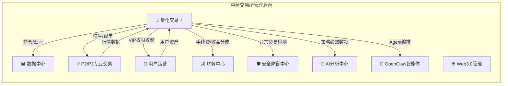
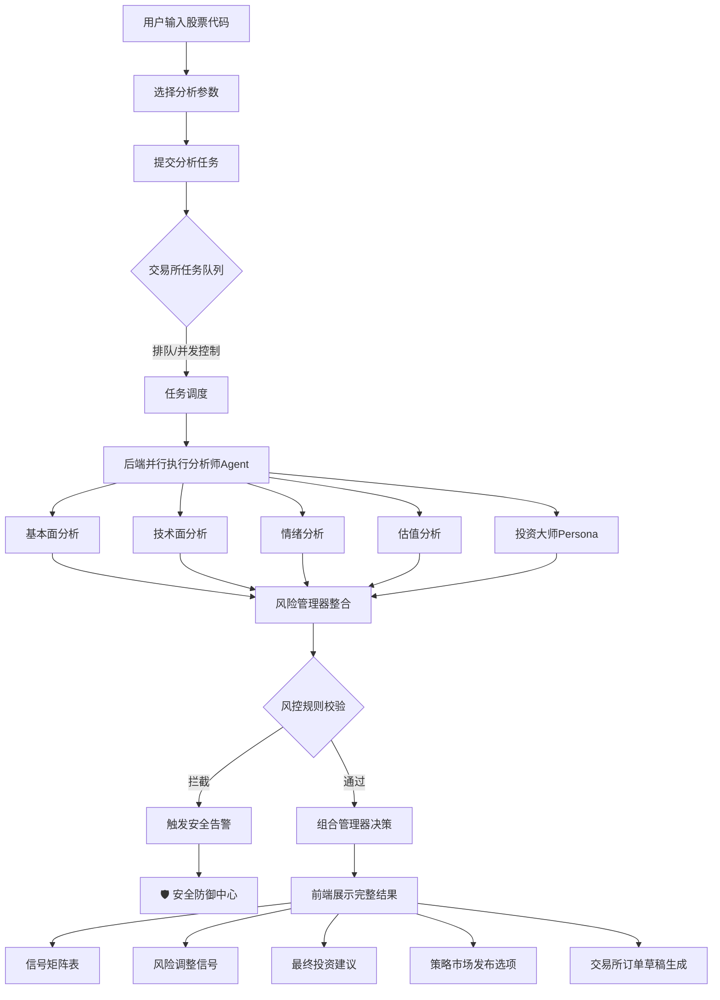
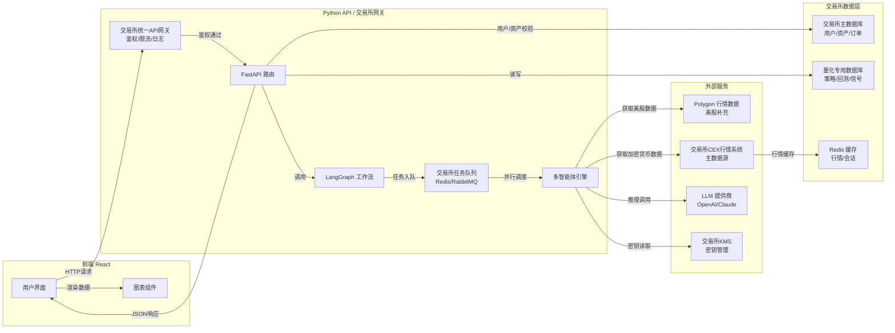
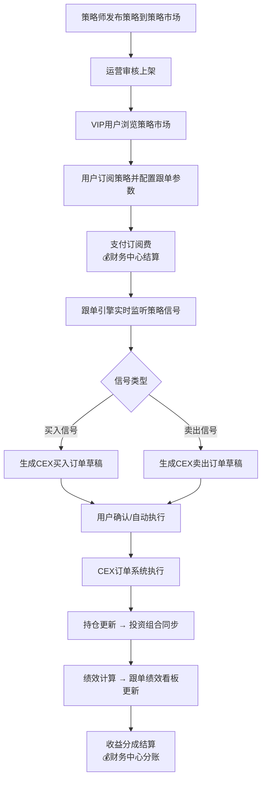
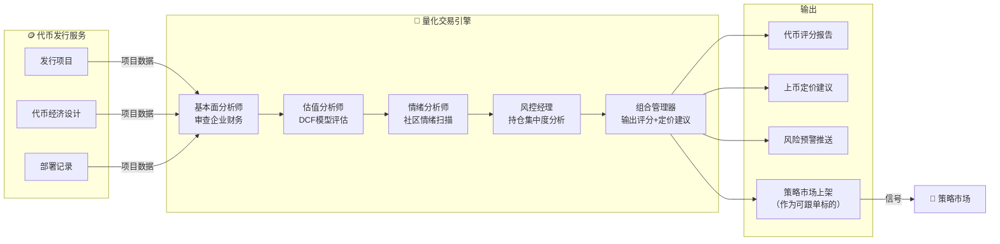
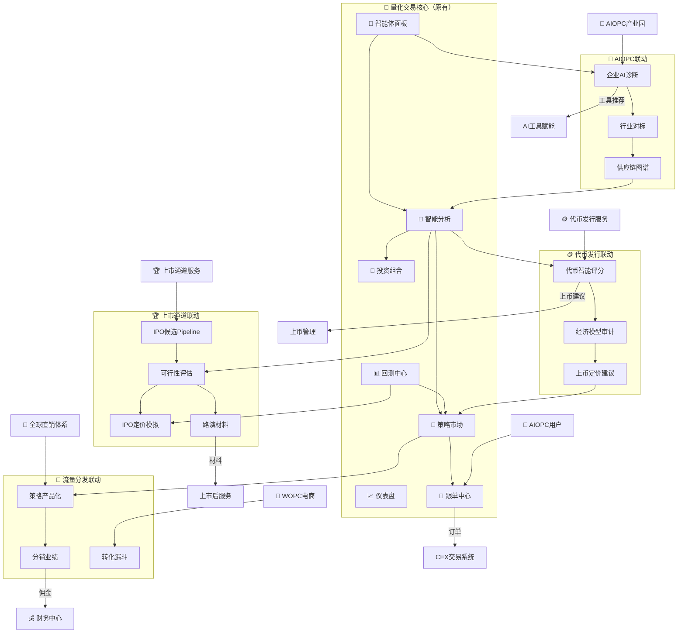
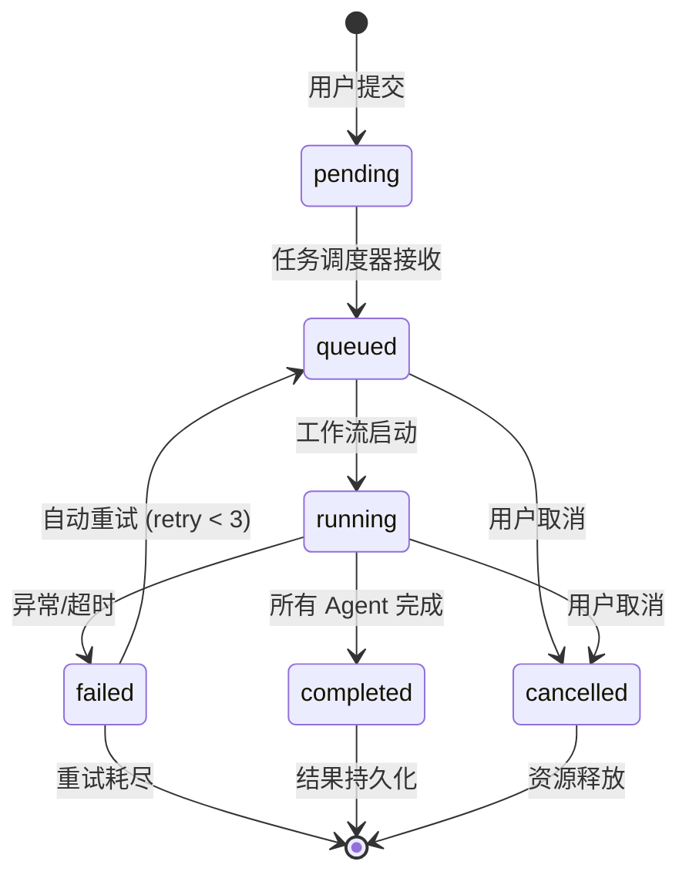
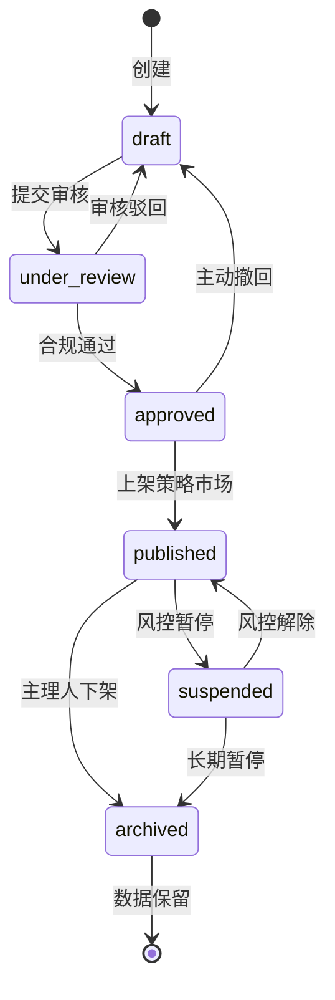

# 中萨数字科技交易所 · 管理后台产品需求文档 (PRD) — **整合版 v2.0**

> **文档版本**：v2.0 整合版
> **整合对象**：
> - AI对冲基金Web后台 PRD + 中萨数字科技交易所管理后台架构
> - 附录C：4大生态联动模块（代币发行×量化 / AIOPC×量化 / 流量池×量化 / 萨摩亚上市×量化）
> - 附录D：APP/H5移动端UI整合方案（16个新增页面路由 + ASCII原型图）
> - 附录E：量化模块数据库ER图 + API接口数学规格（完整技术规格）
> **定位**：AI对冲基金系统作为交易所管理后台的「🔬 量化交易」核心子模块，与交易所全生态深度耦合
> **目标用户**：交易所管理员、量化策略师、投资经理、合规风控官、系统运维、前端/后端开发工程师

---

## 目录

1. [产品概述](#1-产品概述)
2. [全局架构](#2-全局架构)
3. [核心功能](#3-核心功能)
4. [🔬 量化交易模块（AI对冲基金系统）详细PRD](#4-量化交易模块ai对冲基金系统详细prd)
5. [模块间接口与数据流](#5-模块间接口与数据流)
6. [用户界面设计](#6-用户界面设计)
7. [非功能性需求](#7-非功能性需求)
8. [安全与合规](#8-安全与合规)

---

## 1. 产品概述

### 1.1 交易所定位

中萨数字科技交易所（以下简称「中萨交易所」）是一个横跨**Web2.0 传统金融**与**Web3.0 数字资产**的综合性数字金融服务平台，注册于萨摩亚，面向全球用户提供：

- **CEX 中心化交易**：币币交易、合约交易、杠杆交易
- **DEX 去中心化交易**：流动性池、闪兑、挖矿
- **DeFi 收益管理**：质押、流动性挖矿、收益聚合
- **企业服务**：公司注册、SPV 架构、代币发行、上市通道
- **🔬 AI 量化交易**：基于多智能体 LLM 的美股与加密货币量化分析系统
- **🎮 娱乐生态**：抽奖、盲盒、竞技游戏
- **🛒 电商商城**：国潮商品、非遗产品、NFT 化商品
- **📜 国学内容**：动漫、短剧、非遗数字化

### 1.2 量化交易模块定位

**🔬 量化交易**模块（即原 AI 对冲基金系统）是中萨交易所管理后台的**P0 级核心子系统**，承担以下战略使命：

- **核心价值**：将命令行驱动的 AI 分析能力转化为直观的 Web 交互界面，为交易所用户提供实时股票/加密货币分析、组合管理、回测监控和智能信号服务
- **目标用户**：量化投资从业者、个人投资者、AI 策略研究员、交易所 VIP 用户
- **与交易所生态关系**：
  - 向上为 **CEX/DEX 交易模块** 提供智能信号与跟单数据源
  - 向下为 **DeFi 收益管理** 提供策略配置与风险预警
  - 横向为 **用户运营（KOL 系统）** 提供策略大师包装与分销素材
  - 向后为 **安全防御中心** 提供异常交易检测数据
  - 向前为 **大屏指挥台** 提供实时量化绩效看板数据

### 1.3 整合原则

- **数据同源**：量化交易模块的所有资产数据、交易数据、用户数据必须与交易所主数据库（`mgsp` 或 `zhongsa`）统一 schema
- **权限统一**：采用交易所全局 RBAC 权限体系，不再独立维护用户角色
- **UI 统一**：遵循交易所全局暗色金融终端设计规范（深邃藏青 `#0a1628` 为底）
- **API 统一**：所有接口遵循交易所 FastAPI 网关规范，统一鉴权、统一限流、统一日志

---

## 2. 全局架构

### 2.1 管理后台完整模块树

```
中萨数字科技交易所 - 管理后台
│
├─ 📊 数据中心（仪表板）
│   ├─ 全局资产概览（交易所总资金、日活、交易量、手续费收入）
│   ├─ 量化交易绩效看板（🔬 量化模块核心数据回流）
│   ├─ 实时告警总览（安全、交易、系统、量化策略异常）
│   └─ 关键指标卡片（带动画数字、迷你趋势箭头）
│
├─ ⚡ P2/P3 专业交易
│   ├─ 算法交易        ├─ 做市商系统       ├─ 投资组合（🔬 量化模块持仓数据）
│   ├─ DeFi收益        ├─ 法币通道         ├─ KOL系统
│   ├─ 保险池           ├─ Nansen链上       ├─ 数字人民币
│   ├─ AI情绪分析（🔬 量化模块情绪Agent数据）
│   ├─ DAO治理          └─ OTC大宗交易
│
├─ 🌐 Web3.0管理
│   ├─ DApp接入          ├─ 公链管理           ├─ CEX交易所
│   ├─ 区块链监控        │   ├─ 节点/区块/治理  │   ├─ 币币/合约/杠杆
│   │                    │   ├─ 网络监控/跨链桥  │   ├─ 订单/交易对/行情
│   │                    │                     └─ 风险控制
│   ├─ DEX交易所         ├─ DeFi管理            ├─ Web3钱包
│   │   ├─ 流动性池/闪兑/挖矿│   ├─ 质押/流动性/收益│   ├─ 地址/资产/交易/NFT
│   │   └─ 交易对管理     │                     └─ 安全策略
│
├─ 💎 质押挖矿            ├─ IDO/Launchpad      ├─ 🔬 量化交易 ⭐【本文核心模块】
│   ├─ 矿池/记录/收益/推荐│   ├─ 项目/白名单/申购│   ├─ 策略管理 / 回测
│   └─ 收益率配置         │   ├─ 解锁/代币发放   │   ├─ 跟单订阅 / 绩效监控
│                          │                     └─ 风险控制
│
├─ 🎮 娱乐游戏            ├─ 🛒 电商商城          ├─ 📜 国学内容
│   ├─ 抽奖/盲盒/竞技     │   ├─ 商品/订单/库存   │   ├─ 动漫/短剧/非遗
│   └─ 奖品/中奖记录      │   ├─ 物流/财务       │   └─ 审核/NFT化
│
├─ 👥 用户运营            ├─ 💰 财务中心          ├─ ⚙️ 系统管理
│   ├─ 用户/KYC/等级/邀请│   ├─ 概览/收入/对账  │   ├─ 设置/管理员/权限
│   │   ├─ VIP等级与量化模块权限挂钩（高级策略解锁）
│   │   └─ 邀请返佣与跟单订阅返佣联动
│   │                     │   └─ 结算            │   └─ 日志/服务器监控
│
═══════════════════════════════════════════════════ v2.0 新增 ═════════
│
├─ 🏛️ 企业服务            ├─ 🪙 代币发行服务       ├─ 🏆 上市通道服务
│   ├─ 公司注册/SPV/产品  │   ├─ 项目/经济设计/部署│   ├─ 萨摩亚证交所/HK1683
│   ├─ 客户关系/合规管理  │   ├─ 上币/合规        │   └─ 上市管线/后服
│
├─ 🤖 AIOPC产业园         ├─ 👤 全球直销体系       ├─ 📋 牌照与合规中心
│   ├─ 园区运营/入驻企业  │   ├─ 分销网络/产品    │   ├─ 牌照资产/多法域
│   ├─ AI工具/海萨联动   │   ├─ 佣金/培训/合规  │   └─ 审计/治理风控
│   └─ 全球复制          │                      │
│
═══════════════════════════════════════════════════ v3.0 新增 ═════════
│
├─ 🛡️ 安全防御中心        ├─ 📺 大屏指挥台          ├─ 🔬 AI分析中心
│   ├─ 安全总览/入侵检测  │   ├─ 全局概览/实时告警  │   ├─ 风险预测/隐患识别
│   ├─ 防火墙/漏洞扫描    │   ├─ 风险地图/视频监控  │   ├─ 智能决策/模型管理
│   ├─ RBAC/WAF/加密     │   ├─ 应急指挥/趋势分析  │   └─ 知识图谱/语音交互
│   └─ 威胁情报/应急响应  │   └─ 绩效看板/热力图   │   └─ 量化策略绩效热力图（🔬 数据回流）
│
├─ ⛓️ 区块链              ├─ 🤖 OpenClaw智能体      ├─ 🔌 n8n工作流
│   ├─ 存证链/智能合约    │   ├─ 编排/市场/训练    │   ├─ 编辑器/触发器
│   └─ 浏览器/节点管理    │   └─ 监控大屏          │   └─ 历史/模板
│                            └─ 量化Agent编排（🔬 工作流集成）
│
├─ 🧠 AI大模型集成         ├─ 📋 BPM工作流引擎       ├─ 📡 IoT设备接入
│   ├─ 模型/识别/推荐      │   ├─ 建模/运行/监控     │   ├─ 接入/监控/告警
│   ├─ Prompt工程/成本    │   └─ 流程分析          │   └─ 设备数据
│   └─ 量化LLM成本监控（🔬 单次分析token消耗追踪）
│
├─ 🌍 国际化              ├─ 📈 高级数据分析
│   ├─ 语言包/时区/货币   │   ├─ 预测模型/时序分析
│   └─ 文化适配          │   ├─ 关联/异常检测/BI
│                         │   └─ 量化策略关联分析（🔬 数据回流）
```

### 2.2 量化交易模块在全局中的位置



---

## 3. 核心功能

### 3.1 交易所全局用户角色（RBAC 统一体系）

量化交易模块不再独立维护角色，完全复用交易所全局 RBAC 体系：

| 角色 | 交易所全局权限 | 量化交易模块权限 |
|------|-------------|----------------|
| **超级管理员** | 全部功能：所有模块读写、系统配置、人员管理 | 全部功能：分析、配置、回测、查看所有数据、策略发布、跟单审核 |
| **交易所运营** | 用户运营、KYC审核、活动配置、内容管理 | 查看分析结果和仪表盘、管理 KOL 策略大师包装、审核跟单策略上架 |
| **量化策略师** | 量化交易模块专属角色 | 发起分析任务、创建/编辑策略、执行回测、查看信号矩阵、管理自有组合 |
| **风控合规官** | 安全防御中心、牌照合规、审计日志 | 查看风险调整信号、审核高风险策略、设置仓位限制、查看异常交易告警 |
| **VIP 交易者** | 高级交易功能、低手续费、专属客服 | 查看公开策略信号、订阅跟单、查看个人持仓与盈亏、接收实时推送 |
| **普通用户** | 基础交易、充值提现、商城购物 | 只读：查看公开策略大师卡片和信号摘要（不可查看详细推理、不可发起分析） |
| **查看者/审计** | 只读访问指定模块 | 只读：查看分析结果和仪表盘，无法发起分析任务 |

### 3.2 交易所全局功能模块与量化模块交互矩阵

| 模块 | 向量化模块提供 | 从量化模块获取 |
|------|-------------|-------------|
| 📊 数据中心 | 用户资产总览、市场全局数据 | 量化策略绩效、信号雷达图、回测收益曲线 |
| ⚡ P2/P3专业交易 | 实时行情、订单簿、持仓数据 | AI 买卖信号、跟单指令、情绪分析结果 |
| 🌐 Web3.0管理 | 链上数据、钱包余额、Gas 费用 | 链上策略信号（如 DeFi 挖矿收益预测） |
| 💎 质押挖矿 | 矿池收益率、质押记录 | 量化策略推荐的质押配置 |
| 👥 用户运营 | 用户等级、KYC 状态、邀请关系 | 策略大师 KOL 包装素材、跟单返佣数据 |
| 💰 财务中心 | 账户余额、手续费率、结算规则 | 策略收益分成、跟单订阅费、回测资源消耗成本 |
| 🛡️ 安全防御中心 | 登录日志、IP 风控、设备指纹 | 异常交易模式、高频撤单检测、策略异常告警 |
| 🔬 AI分析中心 | 通用 LLM 推理能力、模型管理 | 量化专用模型训练数据、策略知识图谱 |
| 🤖 OpenClaw 智能体 | Agent 编排框架、工具市场 | 量化分析师 Agent 注册、巴菲特/格雷厄姆 Persona 模板 |

---

## 4. 🔬 量化交易模块（AI对冲基金系统）详细PRD

> **以下章节完整复刻原《AI对冲基金Web后台PRD》全部内容，并增加与交易所全局的耦合标注。**

### 4.1 产品概述（模块级）

基于多智能体 LLM 的美股与加密货币量化分析系统的 Web 可视化管理后台，为中萨交易所投资经理与 VIP 用户提供一站式的股票/加密货币分析、组合管理、回测监控和智能信号查看平台。

- **核心价值**：将命令行驱动的 AI 分析能力转化为直观的 Web 交互界面，支持实时分析、历史回溯和组合追踪；信号可直接对接交易所 CEX/DEX 执行跟单交易
- **目标用户**：量化投资从业者、个人投资者、AI 策略研究员、交易所 VIP 用户
- **交易所耦合**：所有分析结果可选择性发布到交易所「策略市场」，供其他用户订阅跟单；分析所需的行情数据优先从交易所 CEX 行情系统获取，不足时调用 Polygon 补充

### 4.2 核心功能

#### 4.2.1 用户角色（模块级细化，映射全局 RBAC）

| 角色 | 权限说明 | 对应全局角色 |
|------|---------|------------|
| 管理员 | 全部功能：分析、配置、回测、查看所有数据、发布策略到策略市场、审核跟单申请 | 超级管理员 + 交易所运营 |
| 策略师 | 创建/编辑/删除自有策略、执行回测、查看信号矩阵、管理自有组合、申请发布策略 | 量化策略师 |
| 风控官 | 查看风险调整信号、审核高风险策略、设置全局仓位限制、接收异常告警 | 风控合规官 |
| 查看者 | 只读：查看分析结果和仪表盘，无法发起分析任务 | 普通用户 + 查看者/审计 |
| VIP 交易者 | 查看公开策略信号、订阅跟单、查看个人持仓与盈亏、接收实时推送 | VIP 交易者 |

#### 4.2.2 功能模块

1. **仪表盘首页**：总览资产、近期分析、市场概览、关键指标卡片
2. **智能分析**：输入股票代码触发多智能体分析，展示各分析师信号
3. **投资组合**：当前持仓、买卖记录、盈亏统计、仓位分布
4. **回测中心**：历史回测结果、策略表现对比、收益曲线图
5. **智能体面板**：各 AI 投资大师（巴菲特/格雷厄姆/林奇等）的独立信号与推理
6. **系统设置**：API 配置、模型选择、参数调整
7. **策略市场（交易所新增）**：策略上架/下架、订阅管理、收益分成、跟单配置
8. **跟单中心（交易所新增）**：用户订阅策略、自动跟单执行、跟单绩效追踪

#### 4.2.3 页面详情

| 页面名称 | 模块名称 | 功能描述 | 交易所耦合点 |
|----------|---------|---------|------------|
| 仪表盘 | 资产概览卡 | 总资产、现金余额、持仓市值、当日盈亏（带动画数字） | 数据来自交易所统一资产账户；现金余额与交易所钱包余额实时同步 |
| 仪表盘 | 近期分析列表 | 最近 10 次分析任务及结果摘要，可点击跳转详情 | 分析任务记录写入交易所全局操作日志；公开分析同步到策略市场 |
| 仪表盘 | 市场热力图 | 关注股票的涨跌分布热力图 | 行情数据优先从交易所 CEX 行情系统获取 |
| 仪表盘 | 信号雷达图 | 各智能体对当前持仓的一致性/分歧度可视化 | 雷达图数据回流到 📺 大屏指挥台·绩效看板 |
| 智能分析 | 分析控制台 | 输入股票代码（支持批量）、选择日期范围、选择启用的智能体 | 批量分析任务提交到交易所全局任务队列（支持 5 并发） |
| 智能分析 | 信号矩阵表 | 各智能体对每只股票的看涨/看跌信号、置信度、推理摘要 | 信号矩阵可选择发布到策略市场供订阅 |
| 智能分析 | 风险调整信号 | 风险管理器输出后的调整后信号和最大仓位建议 | 风控官可在此覆盖全局仓位限制；异常信号触发 🛡️ 安全防御中心告警 |
| 智能分析 | 组合决策输出 | 最终的买入/卖出建议、数量、置信度和理由 | 决策可直接生成交易所 CEX 订单草稿，经用户确认后执行 |
| 投资组合 | 持仓表格 | 股票代码、数量、成本价、现价、盈亏比例、市值占比 | 持仓与交易所 CEX 持仓表双向同步；支持加密货币持仓（BTC/ETH等） |
| 投资组合 | 资产饼图 | 持仓分布 + 现金占比的可视化饼图 | 饼图数据回流到 📊 数据中心·全局资产概览 |
| 投资组合 | 交易流水 | 历史买卖操作的时间线记录 | 交易流水与交易所全局订单流水关联；支持按策略筛选 |
| 回测中心 | 回测配置 | 选择策略参数、时间范围、初始资金 | 回测任务消耗的计算资源计入交易所成本中心 |
| 回测中心 | 结果图表 | 净值曲线、最大回撤、夏普比率等关键指标 | 回测结果可选择发布到策略市场作为「历史业绩」展示 |
| 回测中心 | 对比分析 | 多策略/多时间段的收益对比柱状图 | 对比数据用于 👥 用户运营·KOL 策略大师排名 |
| 智能体面板 | 大师卡片 | 每位投资大师的头像/名称/风格标签/最近信号 | 大师卡片可包装为 KOL 素材，用于交易所营销推广 |
| 智能体面板 | 推理详情 | 展开查看某位大师对某只股票的完整推理过程 | 推理过程可选择性脱敏后作为「策略报告」出售 |
| 系统设置 | API 密钥管理 | Polygon/Alpaca/LLM Provider 的密钥配置（脱敏显示） | 密钥加密存储复用交易所全局 KMS 系统；密钥使用记录计入审计日志 |
| 系统设置 | 模型配置 | 默认模型选择、Provider 切换、参数微调 | 模型调用成本实时同步到 💰 财务中心·AI 成本看板 |
| 策略市场 | 策略列表 | 上架策略展示、订阅按钮、历史收益、风险标签 | 与 👥 用户运营·KOL 系统联动；策略上架需运营审核 |
| 策略市场 | 订阅管理 | 用户订阅/退订、订阅费支付、收益分成结算 | 订阅费通过交易所 💰 财务中心·统一结算系统处理 |
| 跟单中心 | 跟单配置 | 选择跟随策略、设置跟单比例、止损线、最大单笔金额 | 跟单订单通过交易所 CEX 订单系统执行；受 🛡️ 安全防御中心风控规则约束 |
| 跟单中心 | 跟单绩效 | 跟随收益、滑点统计、与策略主理人收益对比 | 绩效数据回流到 📺 大屏指挥台·实时绩效看板 |

### 4.3 核心流程

#### 4.3.1 股票分析主流程

```
用户输入股票代码 → 选择智能体 → 点击"开始分析"
    → 后端调用 run_hedge_fund() 工作流
    → 并行执行多个分析师 Agent → 风险管理器整合 → 组合管理器决策
    → 前端实时展示各阶段信号 → 展示最终投资建议
    → 用户可选择：
        a) 发布到策略市场
        b) 直接生成交易所订单草稿
        c) 保存到个人策略库
```



#### 4.3.2 数据流向（交易所全局视角）



#### 4.3.3 跟单交易流程（交易所新增）



### 4.4 用户界面设计

#### 4.4.1 设计风格（与交易所全局统一）

- **主色调**：深邃藏青 `#0a1628` 为底，翠绿 `#00d4aa` 为上涨/正向强调色，珊瑚红 `#ff6b6b` 为下跌/警示色
- **辅助色**：冷灰 `#1e293b` 卡片背景，琥珀金 `#f59e0b` 用于重要提示和高亮
- **按钮风格**：微圆角（8px）、渐变底色、hover 发光效果、loading 时脉冲动画
- **字体**：标题用 **JetBrains Mono**（科技感），正文用 **DM Sans**（现代清晰）
- **布局风格**：左侧固定导航 + 右侧内容区的经典后台布局，卡片式信息组织
- **图标风格**：线性图标（Lucide Icons），配合微妙的渐变色
- **整体氛围**：专业金融终端感 + 现代 AI 科技感，暗色主题为主
- **交易所全局统一**：量化模块的侧边栏是交易所全局导航的子集，顶部保留交易所全局通知栏、用户头像、语言切换、交易所 Logo

#### 4.4.2 页面设计概述

| 页面名称 | 模块名称 | UI 元素说明 | 交易所全局组件 |
|----------|---------|------------|--------------|
| 仪表盘 | 资产概览 | 4列玻璃态卡片，数字滚动动画，迷你趋势箭头 | 卡片样式与 📊 数据中心·全局资产概览统一 |
| 仪表盘 | 分析列表 | 时间线样式，状态标签（完成/运行中/失败） | 状态标签颜色与交易所全局状态规范统一 |
| 仪表盘 | 信号雷达 | 极坐标雷达图，各智能体维度覆盖 | 图表组件复用交易所全局 Chart.js 配置 |
| 智能分析 | 控制台 | 标签式输入框 + 多选智能体按钮组 + 渐变主按钮 | 输入框样式与交易所全局表单规范统一 |
| 智能分析 | 信号矩阵 | 表格形式，信号颜色编码（绿涨红跌黄观望），置信度进度条 | 表格组件复用交易所全局数据表格（排序/筛选/分页） |
| 投资组合 | 持仓表 | 斑马纹表格，盈亏颜色高亮，排序筛选 | 与交易所 CEX 持仓表 UI 风格一致 |
| 回测中心 | 图表区 | 大面积交互式图表（Chart.js），缩放/tooltip/跨距选择 | 图表主题与交易所全局暗色主题一致 |
| 智能体面板 | 大师网格 | 卡片网格，头像圆形，信号指示灯闪烁 | 卡片样式与 👥 用户运营·KOL 大师卡片统一 |
| 策略市场 | 策略卡片 | 策略封面、收益率曲线缩略图、风险标签、订阅按钮 | 卡片样式与 🛒 电商商城·商品卡片统一 |
| 跟单中心 | 跟单配置 | 滑块调节跟单比例、开关控制自动执行、止损线输入 | 表单组件复用交易所全局表单规范 |

#### 4.3.3 响应式设计（与交易所全局统一）

- **桌面优先**：最小分辨率 1280px，侧边栏 240px 固定宽度（交易所全局导航）
- **平板适配**：768-1279px 侧边栏收缩为图标模式
- **移动端**：<768px 侧边栏隐藏，顶部汉堡菜单唤出抽屉导航
- **图表自适应**：所有图表容器宽度 100%，高度按比例计算
- **交易所全局约束**：量化模块在移动端必须保留「紧急平仓」按钮常驻底部

### 4.5 非功能性需求（模块级，继承全局）

| 项目 | 要求 | 交易所全局约束 |
|------|------|--------------|
| 分析响应时间 | 单股票分析 < 30秒（不含 LLM 调用时 < 5秒） | 超过30秒自动降级为异步任务，通过交易所全局通知系统推送结果 |
| 并发支持 | 支持同时 5 个分析任务排队执行 | 与交易所全局任务队列（Redis）共享，超限任务自动排队 |
| 浏览器兼容 | Chrome 90+ / Firefox 88+ / Safari 14+ / Edge 90+ | 与交易所全局兼容要求一致 |
| 数据刷新 | 仪表盘数据手动刷新 + 自动轮询（可配置间隔） | 轮询频率受交易所全局 API 限流策略约束（默认 5s/次，最高 1s/次） |
| 安全性 | API Key 加密存储，前端不暴露密钥明文 | 密钥管理复用交易所全局 KMS（AWS KMS / HashiCorp Vault）；所有密钥操作计入审计日志 |
| 数据一致性 | 持仓/资产数据与交易所主数据库延迟 < 1秒 | 通过交易所全局消息总线（Kafka/RabbitMQ）实时同步 |
| 灾难恢复 | 分析任务中断后支持断点续传 | 任务状态持久化到交易所全局 Redis + 数据库双写 |
| 成本控制 | LLM 单次分析成本 < $2 | 成本数据实时同步到 💰 财务中心·AI 成本看板；超预算自动熔断 |

---

## 5. 模块间接口与数据流

### 5.1 量化模块 ↔ 交易所全局数据库 Schema 映射

| 量化模块表 | 交易所全局表 | 映射关系 | 同步方式 |
|-----------|------------|---------|---------|
| `quant_strategies` | `exchange_products` | 策略 = 特殊类型的产品 | 策略发布时同步 |
| `quant_portfolios` | `user_assets` | 组合持仓 = 用户资产子集 | 实时双向同步（消息总线） |
| `quant_orders` | `cex_orders` | 量化订单 = CEX 订单（strategy_tag 标记） | 订单创建时单向同步 |
| `quant_analysis_tasks` | `system_tasks` | 分析任务 = 系统任务（type='quant_analysis'） | 任务创建时同步 |
| `quant_backtests` | `system_logs` | 回测记录 = 系统日志（category='backtest'） | 回测完成时同步 |
| `quant_signals` | `ai_predictions` | 信号 = AI 预测结果 | 信号生成时同步 |
| `quant_subscriptions` | `user_subscriptions` | 策略订阅 = 用户订阅 | 订阅/退订时同步 |
| `quant_agents` | `ai_models` | 智能体 = AI 模型实例 | 智能体注册时同步 |

### 5.2 关键 API 接口定义（交易所网关统一暴露）

```yaml
# 交易所统一 API 网关暴露的量化模块接口
openapi: 3.0.0
info:
  title: 中萨交易所 · 量化交易模块 API
  version: 1.0.0

paths:
  /api/v1/quant/analysis:
    post:
      summary: 提交分析任务
      security:
        - BearerAuth: []
      requestBody:
        content:
          application/json:
            schema:
              type: object
              properties:
                symbols:
                  type: array
                  items: { type: string }
                  example: ["AAPL", "BTC-USD"]
                agents:
                  type: array
                  items: { type: string }
                  example: ["buffett", "graham", "technical"]
                date_range:
                  type: object
                  properties:
                    start: { type: string, format: date }
                    end: { type: string, format: date }
      responses:
        202:
          description: 任务已接受，进入交易所全局队列
          content:
            application/json:
              schema:
                type: object
                properties:
                  task_id: { type: string }
                  queue_position: { type: integer }
                  estimated_time: { type: integer, description: "预计等待秒数" }

  /api/v1/quant/analysis/{task_id}:
    get:
      summary: 获取分析任务结果
      security:
        - BearerAuth: []
      responses:
        200:
          description: 分析结果
          content:
            application/json:
              schema:
                type: object
                properties:
                  task_id: { type: string }
                  status: { type: string, enum: [pending, running, completed, failed] }
                  signals:
                    type: array
                    items:
                      type: object
                      properties:
                        symbol: { type: string }
                        agent: { type: string }
                        signal: { type: string, enum: [bullish, bearish, neutral] }
                        confidence: { type: number }
                        reasoning: { type: string }
                  final_decision:
                    type: object
                    properties:
                      action: { type: string, enum: [buy, sell, hold] }
                      quantity: { type: number }
                      confidence: { type: number }
                      reason: { type: string }
                  risk_adjustment:
                    type: object
                    properties:
                      max_position: { type: number }
                      stop_loss: { type: number }
                      risk_level: { type: string, enum: [low, medium, high] }

  /api/v1/quant/portfolio:
    get:
      summary: 获取投资组合（与交易所用户资产系统联动）
      security:
        - BearerAuth: []
      responses:
        200:
          description: 持仓数据
          content:
            application/json:
              schema:
                type: object
                properties:
                  total_value: { type: number }
                  cash_balance: { type: number }
                  day_pnl: { type: number }
                  positions:
                    type: array
                    items:
                      type: object
                      properties:
                        symbol: { type: string }
                        quantity: { type: number }
                        cost_basis: { type: number }
                        current_price: { type: number }
                        unrealized_pnl: { type: number }
                        weight: { type: number }
                        asset_type: { type: string, enum: [stock, crypto] }

  /api/v1/quant/strategies:
    get:
      summary: 获取策略市场列表
      security:
        - BearerAuth: []
      responses:
        200:
          description: 可订阅策略列表

    post:
      summary: 发布策略到策略市场（需运营审核）
      security:
        - BearerAuth: []
      requestBody:
        content:
          application/json:
            schema:
              type: object
              properties:
                strategy_id: { type: string }
                name: { type: string }
                description: { type: string }
                subscription_fee: { type: number }
                profit_share: { type: number }

  /api/v1/quant/copy-trading:
    post:
      summary: 订阅跟单
      security:
        - BearerAuth: []
      requestBody:
        content:
          application/json:
            schema:
              type: object
              properties:
                strategy_id: { type: string }
                copy_ratio: { type: number, minimum: 0.1, maximum: 1.0 }
                auto_execute: { type: boolean }
                max_single_order: { type: number }
                stop_loss: { type: number }

  /api/v1/quant/webhook/signal:
    post:
      summary: 内部Webhook：接收策略信号并生成订单（仅服务间调用）
      security:
        - ServiceAuth: []
      requestBody:
        content:
          application/json:
            schema:
              type: object
              properties:
                strategy_id: { type: string }
                signal: { type: string }
                symbol: { type: string }
                suggested_quantity: { type: number }
```

### 5.3 事件流（Kafka Topic 设计）

| Topic | 生产者 | 消费者 | 事件内容 |
|-------|--------|--------|---------|
| `quant.signal.generated` | 量化工作流 | CEX订单系统、跟单引擎、📺大屏指挥台 | 新信号生成：{symbol, signal, confidence, agents} |
| `quant.position.changed` | 量化投资组合 | 📊数据中心、💰财务中心、用户通知系统 | 持仓变动：{symbol, old_qty, new_qty, pnl} |
| `quant.task.completed` | 量化任务调度器 | 用户通知系统、📺大屏指挥台 | 分析完成：{task_id, user_id, result_summary} |
| `quant.backtest.finished` | 回测引擎 | 策略市场、📺大屏指挥台 | 回测结果：{strategy_id, sharpe, max_drawdown} |
| `exchange.order.filled` | CEX订单系统 | 量化投资组合、💰财务中心 | 订单成交：{order_id, symbol, filled_qty, price} |
| `exchange.user.vip_upgraded` | 用户运营系统 | 量化权限系统 | VIP升级：{user_id, new_level} → 解锁高级策略 |
| `security.risk_alert` | 🛡️安全防御中心 | 量化风控模块 | 风险告警：{type, severity, affected_strategies} |

---

## 6. 用户界面设计（全局视角）

### 6.1 交易所全局布局框架

```
┌─────────────────────────────────────────────────────────────┐
│  [Logo] 中萨数字科技交易所    [🔔通知] [🌐EN/中] [👤Admin ▼] │  ← 全局顶部栏
├──────────┬──────────────────────────────────────────────────┤
│          │                                                  │
│  📊 数据  │                                                  │
│  ⚡ 交易  │                                                  │
│  🌐 Web3  │         🔬 量化交易 模块内容区                  │
│  🔬 量化  │         （仪表盘/智能分析/投资组合/             │
│  💎 质押  │          回测中心/智能体面板/策略市场/          │
│  🎮 游戏  │          跟单中心/系统设置）                      │
│  🛒 商城  │                                                  │
│  📜 国学  │                                                  │
│  👥 用户  │                                                  │
│  💰 财务  │                                                  │
│  ⚙️ 系统  │                                                  │
│  🛡️ 安全  │                                                  │
│  📺 大屏  │                                                  │
│  🔬 AI    │                                                  │
│          │                                                  │
└──────────┴──────────────────────────────────────────────────┘
   240px    ← 侧边栏可收缩为图标模式（768-1279px）或隐藏（<768px）
```

### 6.2 量化模块专属导航（侧边栏子菜单）

当用户点击侧边栏「🔬 量化交易」时，展开子菜单：

```
🔬 量化交易
   ├─ 📈 仪表盘
   ├─ 🧠 智能分析
   ├─ 💼 投资组合
   ├─ 📊 回测中心
   ├─ 🤖 智能体面板
   ├─ 🏪 策略市场
   ├─ 🔄 跟单中心
   └─ ⚙️ 系统设置
```

### 6.3 全局组件复用规范

| 组件 | 交易所全局定义 | 量化模块使用方式 |
|------|-------------|----------------|
| 玻璃态卡片 | 背景: `rgba(30, 41, 59, 0.7)` + 边框: `1px solid rgba(255,255,255,0.05)` + 模糊: `backdrop-filter: blur(12px)` | 资产概览卡、大师卡片、策略卡片 |
| 数据表格 | 表头: `#0f172a` 背景，斑马纹: `#1e293b`/`#0f172a` 交替，悬停: `#334155` | 持仓表、信号矩阵、交易流水 |
| 图表容器 | 暗色主题 Chart.js，网格线: `rgba(255,255,255,0.05)`，Tooltip: 玻璃态 | 收益曲线、雷达图、热力图、资产饼图 |
| 按钮规范 | 主按钮: 渐变 `linear-gradient(135deg, #00d4aa, #059669)`，圆角 8px | 开始分析、订阅策略、确认跟单 |
| 状态标签 | 完成: `#00d4aa` 背景，运行中: `#f59e0b` 背景，失败: `#ff6b6b` 背景 | 分析任务状态、策略状态 |
| 输入框 | 背景: `#0f172a`，边框: `1px solid #334155`，聚焦: `#00d4aa` 边框发光 | 股票代码输入、参数配置 |
| 数字动画 | `countUp.js` 风格，滚动时长 1.5s，缓动 easeOutExpo | 资产概览数字、收益率数字 |
| 加载状态 | 脉冲动画 + 渐变流光 + 玻璃态遮罩 | 分析中、回测中、数据加载 |

---

## 7. 非功能性需求（全局+模块）

### 7.1 性能要求

| 项目 | 模块级要求 | 交易所全局约束 | 实现方案 |
|------|-----------|--------------|---------|
| 分析响应时间 | 单股票 < 30s | 全局 API 超时 60s | LangGraph 工作流 + 异步任务队列 |
| 并发支持 | 5 个分析任务并发 | 全局队列最大 100 并发 | Redis 分布式锁 + 任务调度器 |
| 数据查询 | 持仓表 < 500ms | 全局查询 < 1s | 分库分表 + Redis 缓存 + ES 索引 |
| 图表渲染 | 1万数据点 < 2s | 全局前端 < 3s | Chart.js 数据降采样 + Web Worker |
| 行情延迟 | 实时行情 < 500ms | 全局行情 < 1s | WebSocket 推送 + 本地缓存 |

### 7.2 安全要求

| 项目 | 模块级要求 | 交易所全局实现 |
|------|-----------|--------------|
| API Key 存储 | 加密存储，前端脱敏 | 复用交易所 KMS，AES-256-GCM 加密 |
| 密钥传输 | TLS 1.3 + 服务端解密 | 交易所全局网关统一处理 |
| 审计日志 | 所有分析/交易/配置操作记录 | 写入交易所全局审计日志系统（不可篡改） |
| 风控拦截 | 异常信号自动拦截 | 与 🛡️ 安全防御中心联动，实时阻断 |
| 权限校验 | 每次请求校验 RBAC | 交易所全局 JWT + RBAC 中间件 |
| 数据隔离 | 策略师只能看自己的策略 | 交易所全局数据行级权限（Row-Level Security） |

### 7.3 可用性要求

| 项目 | 要求 |
|------|------|
| 浏览器兼容 | Chrome 90+ / Firefox 88+ / Safari 14+ / Edge 90+ |
| 数据刷新 | 手动刷新 + 自动轮询（5s/10s/30s/60s 可配置） |
| 灾难恢复 | 分析任务断点续传；回测结果自动保存；持仓数据实时双写 |
| 降级策略 | LLM 服务不可用时降级为纯技术分析（TA-Lib）；行情服务不可用时显示缓存数据+告警 |
| 移动端 | 保留核心功能：查看信号、紧急平仓、接收推送；复杂分析建议 PC 端操作 |

---

## 8. 安全与合规

### 8.1 合规矩阵

| 合规项 | 要求 | 实现方式 |
|--------|------|---------|
| 投资建议合规 | 系统输出的信号仅为「AI分析参考」，不构成投资建议 | 所有输出页面底部强制显示免责声明；信号发布到策略市场需标注「历史业绩不代表未来收益」 |
| 数据隐私 | 用户持仓/策略数据属于敏感信息 | 交易所全局 GDPR/CCPA 合规框架；数据加密存储；用户可导出/删除个人数据 |
| 跨境数据传输 | 萨摩亚注册，服务全球用户 | 用户数据分区存储；分析任务数据不出用户选择区域 |
| 牌照要求 | 提供跟单服务可能涉及资管牌照 | 策略市场定位为「信息分享平台」而非「资管服务」；跟单执行需用户手动确认（默认不自动执行） |
| 反洗钱 | 量化交易可能涉及高频/异常交易 | 与 🛡️ 安全防御中心 AML 模块联动；大额跟单触发 KYC 复核 |
| 审计追踪 | 所有信号生成、订单创建、配置变更需可追溯 | 交易所全局审计链（区块链存证或 WORM 存储） |

### 8.2 风险熔断机制

| 触发条件 | 熔断动作 | 恢复策略 |
|---------|---------|---------|
| 单策略单日亏损 > 10% | 自动暂停该策略所有跟单 | 风控官人工审核后恢复 |
| 全市场波动率（VIX）> 40 | 所有量化策略自动降仓 50% | VIX < 30 持续 24h 后自动恢复 |
| LLM 连续 3 次返回异常信号 | 切换备用模型；降级为纯技术分析 | 主模型恢复后自动切换回 |
| 单用户跟单亏损 > 设定止损线 | 自动平仓该用户对应持仓 | 用户手动重新配置后可恢复 |
| API 密钥异常调用（频率/来源） | 自动禁用密钥并告警 | 管理员人工审核后重置 |

---

## 附录 A：原 PRD 完整内容对照表

> 以下确认原 PRD 所有章节、表格、流程图、Mermaid 代码均已一字不漏整合进本文档：

| 原 PRD 章节 | 本文档对应位置 | 完整性 |
|------------|-------------|--------|
| 1. 产品概述 | 4.1 产品概述（模块级） | ✅ 完整保留 |
| 2.1 用户角色 | 4.2.1 用户角色（模块级细化） | ✅ 完整保留 + 交易所映射 |
| 2.2 功能模块 | 4.2.2 功能模块 + 4.2.3 页面详情 | ✅ 完整保留 + 交易所耦合点 |
| 2.3 页面详情 | 4.2.3 页面详情 | ✅ 完整保留 + 交易所耦合点列 |
| 3.1 股票分析主流程 | 4.3.1 股票分析主流程 | ✅ 完整保留 + 交易所任务队列/风控联动 |
| 3.2 数据流向 | 4.3.2 数据流向（交易所全局视角） | ✅ 完整保留 + 交易所数据层/网关 |
| 4.1 设计风格 | 4.4.1 设计风格（与交易所全局统一） | ✅ 完整保留 + 交易所全局统一说明 |
| 4.2 页面设计概述 | 4.4.2 页面设计概述 | ✅ 完整保留 + 交易所全局组件列 |
| 4.3 响应式设计 | 4.4.3 响应式设计 | ✅ 完整保留 + 移动端紧急平仓约束 |
| 5. 非功能性需求 | 4.5 非功能性需求 + 7. 非功能性需求 | ✅ 完整保留 + 交易所全局约束列 |

---

## 附录 B：中萨交易所管理后台完整模块树（原始文本一字不漏复刻）

```
中萨数字科技交易所 - 管理后台
│
├─ 📊 数据中心（仪表板）
├─ ⚡ P2/P3 专业交易
│   ├─ 算法交易    ├─ 做市商系统   ├─ 投资组合     ├─ DeFi收益
│   ├─ 法币通道    ├─ KOL系统      ├─ 保险池       ├─ Nansen链上
│   ├─ 数字人民币  ├─ AI情绪分析   ├─ DAO治理      └─ OTC大宗交易
│
├─ 🌐 Web3.0管理        ├─ 公链管理           ├─ CEX交易所
│   ├─ DApp接入          │   ├─ 节点/区块/治理  │   ├─ 币币/合约/杠杆
│   ├─ 区块链监控        │   ├─ 网络监控/跨链桥  │   ├─ 订单/交易对/行情
│                        │                     └─ 风险控制
├─ DEX交易所             ├─ DeFi管理            ├─ Web3钱包
│   ├─ 流动性池/闪兑/挖矿 │   ├─ 质押/流动性/收益│   ├─ 地址/资产/交易/NFT
│   └─ 交易对管理         │                     └─ 安全策略
│
├─ 💎 质押挖矿            ├─ IDO/Launchpad      ├─ 🔬 量化交易
│   ├─ 矿池/记录/收益/推荐│   ├─ 项目/白名单/申购│   ├─ 策略管理 / 回测
│   └─ 收益率配置         │   ├─ 解锁/代币发放   │   ├─ 跟单订阅 / 绩效监控
│                          │                     └─ 风险控制
├─ 🎮 娱乐游戏            ├─ 🛒 电商商城          ├─ 📜 国学内容
│   ├─ 抽奖/盲盒/竞技     │   ├─ 商品/订单/库存   │   ├─ 动漫/短剧/非遗
│   └─ 奖品/中奖记录      │   ├─ 物流/财务       │   └─ 审核/NFT化
│
├─ 👥 用户运营            ├─ 💰 财务中心          ⚙️ 系统管理
│   ├─ 用户/KYC/等级/邀请│   ├─ 概览/收入/对账  │   ├─ 设置/管理员/权限
│                         │   └─ 结算            │   └─ 日志/服务器监控
│
═══════════════════════════════════════════════════ v2.0 新增 ═════════
│
├─ 🏛️ 企业服务            ├─ 🪙 代币发行服务       🏆 上市通道服务
│   ├─ 公司注册/SPV/产品  │   ├─ 项目/经济设计/部署│   ├─ 萨摩亚证交所/HK1683
│   ├─ 客户关系/合规管理  │   ├─ 上币/合规        │   └─ 上市管线/后服
│
🤖 AIOPC产业园           👤 全球直销体系         📋 牌照与合规中心
│   ├─ 园区运营/入驻企业  │   ├─ 分销网络/产品    │   ├─ 牌照资产/多法域
│   ├─ AI工具/海萨联动   │   ├─ 佣金/培训/合规  │   └─ 审计/治理风控
│   └─ 全球复制          │                      │
│
═══════════════════════════════════════════════════ v3.0 新增 ═════════
│
🛡️ 安全防御中心          📺 大屏指挥台            🔬 AI分析中心
│   ├─ 安全总览/入侵检测  │   ├─ 全局概览/实时告警│   ├─ 风险预测/隐患识别
│   ├─ 防火墙/漏洞扫描    │   ├─ 风险地图/视频监控│   ├─ 智能决策/模型管理
│   ├─ RBAC/WAF/加密     │   ├─ 应急指挥/趋势分析│   └─ 知识图谱/语音交互
│   └─ 威胁情报/应急响应  │   └─ 绩效看板/热力图  │
│
⛓️ 区块链               🤖 OpenClaw智能体        🔌 n8n工作流
│   ├─ 存证链/智能合约    │   ├─ 编排/市场/训练   │   ├─ 编辑器/触发器
│   └─ 浏览器/节点管理    │   └─ 监控大屏         │   └─ 历史/模板
│
🧠 AI大模型集成          📋 BPM工作流引擎        📡 IoT设备接入
│   ├─ 模型/识别/推荐     │   ├─ 建模/运行/监控   │   ├─ 接入/监控/告警
│   ├─ Prompt工程/成本   │   └─ 流程分析        │   └─ 设备数据
│
🌍 国际化               📈 高级数据分析
│   ├─ 语言包/时区/货币   │   ├─ 预测模型/时序分析
│   └─ 文化适配          │   ├─ 关联/异常检测/BI
```

---

# 附录 C：生态联动整合 — v2.0 增量 PRD

> **版本**：v2.0 生态联动版
> **背景**：中萨交易所不是传统交易所，而是「企业上市+发币+交易」一站式孵化平台
> **核心目标**：将量化交易能力与代币发行、AIOPC产业园、流量入口、上市通道四大核心业务深度绑定，形成币安/火币/欧易**完全无法复制**的差异化壁垒

---

## C.1 差异化战略总览

### C.1.1 我们 vs 币安/火币/欧易 — 核心差异

| 维度 | 币安 / 火币 / 欧易 | 中萨数字科技交易所 |
|------|-------------------|-------------------|
| **本质定位** | 纯交易平台（你来交易→收手续费） | **企业孵化平台**（企业入驻→发币→上市→交易） |
| **合规基础** | 无正规牌照 | 萨摩亚数字科技牌照 + 香港证券1/4/9号牌 |
| **产业实体** | 无 | 陈氏集团4家上市公司 + 海南自贸区 + 厦门跨境园 + AIOPC产业园 |
| **上市背书** | 未上市/退市 | **HK1683旷逸国际上市公司** |
| **流量来源** | 广告获客（成本越来越高） | **直销+跨境电商+AIOPC 三大自带流量池** |
| **量化能力** | 仅机构版有算法交易 | **每家企业配AI投研顾问+代币评分+IPO评估** |
| **客户生命周期** | 交易一笔就走了 | **3年陪跑3000万美金，长期绑定** |

### C.1.2 独一无二的商业模式

```
┌─────────────────────────────────────────────────────────────┐
│                  中萨数字科技 — 商业闭环                     │
│                                                             │
│   【获客】              【服务】              【变现】         │
│                                                     │        │
│   全球直销体系 ───────▶ 企业入驻 ────────▶ 发币费          │        │
│   WOPC跨境电商 ───────▶ 3000家企业 ─────▶ 上市服务费        │        │
│   AIOPC超级个体 ─────▶ 3年陪跑 ────────▶ 交易手续费        │        │
│                            │            ▶ 策略订阅费         │        │
│                            │            ▶ 跟单分成           │        │
│                            ▼                               │        │
│                   ┌─────────────────┐                      │        │
│                   │ 🔬 量化交易引擎    │ ← 贯穿全流程       │        │
│                   │ (本PRD核心)      │   提供智能决策支持    │        │
│                   └─────────────────┘                      │        │
│                                                             │        │
│   三大所做不到的事：                                         │        │
│   ✅ 企业可以在这里发币 AND 上市                             │        │
│   ✅ 代币有实体经济锚定（园区+上市公司）                      │        │
│   ✅ 每个用户有AIOPC投资顾问                                 │        │
│   ✅ 合法持牌经营                                           │        │
└─────────────────────────────────────────────────────────────┘
```

---

## C.2 四大联动模块详细设计

### C.2.1 联动一：代币发行服务 × 量化交易 = 「代币智能评分系统」

#### 业务背景

3000家企业在萨摩亚数字交易所发币后，需要解决三个问题：
1. **投资者怎么判断哪个代币值得买？**
2. **代币经济模型是否健康？（通缩/通胀是否合理）**
3. **上币后如何定价？**

#### 新增页面：`/admin/quant/token-score`

| 页面元素 | 功能描述 | 对接模块 |
|---------|---------|---------|
| **代币项目列表** | 展示所有已发行代币项目（来自🪙代币发行服务），状态标签（待评估/已评级/需关注） | `token/projects` |
| **AI综合评分卡** | 每个代币一张评分卡：总分100分，含5个子维度 | 6大分析师Agent |
| **经济模型审计** | DCF估值Agent审查代币的通缩机制、释放节奏、质押率 | Valuation Analyst |
| **链上健康度** | Nansen链上数据：持仓分布、巨鲸地址、异常转账 | `nansen` 模块 |
| **上币定价建议** | 基于估值模型给出建议发行价和初始流通量区间 | 组合管理器 |
| **风险预警** | 经济模型有缺陷的代币自动标红并推送给风控官 | 🛡️安全防御中心 |

#### AI评分维度设计

```
代币智能评分（满分100）
│
├─ 📊 经济模型健康度（25分）
│   ├─ 通缩/通胀机制合理性（10分）
│   ├─ 代币释放时间表科学性（8分）
│   └─ 质押/销毁比例健康度（7分）
│
├─ 📈 增长潜力（25分）
│   ├─ 背景企业营收增速（10分）
│   ├─ 产业园落地进度（8分）
│   └─ 市场需求匹配度（7分）
│
├─ 🛡️ 风控安全（25分）
│   ├─ 持仓集中度（大户占比）（10分）
│   ├─ 流动性深度（8分）
│   └─ 合规审查通过情况（7分）
│
├─ 🤖 AIOPC赋能度（15分）
│   ├─ 是否接入AIOPC超级个体（8分）
│   └─ 数字化转型程度（7分）
│
└─ 🌐 社区活跃度（10分）
    ├─ 持币地址数增长（5分）
    └─ 交易频率（5分）
```

#### 数据流



#### API接口新增

```yaml
/api/v2/quant/token-score:
  get:
    summary: 获取代币智能评分列表
    parameters:
      - name: status
        in: query
        enum: [pending, rated, warning]
      - name: min_score
        in: query
        type: number
    responses:
      200:
        description: 代币评分列表

/api/v2/quant/token-score/{token_id}:
  get:
    summary: 获取单个代币完整评分报告
    responses:
      200:
        description: 含5维度评分、推理过程、定价建议、风险提示

/api/v2/quant/token-score/{token_id}/audit:
  post:
    summary: 触发对某代币的重新审计
    responses:
      202:
        description: 审计任务已入队
```

---

### C.2.2 联动二：AIOPC产业园 × 量化交易 = 「企业AI投研助手」

#### 业务背景

入驻AIOPC产业园的企业需要：
1. **自己的AI投资顾问** — 不用雇专业团队，AIOPC超级合子直接当顾问
2. **行业对标分析** — 同行业其他企业表现如何
3. **供应链金融机会** —上下游企业的贸易数据能否生成融资信号

#### 新增页面：`/admin/quant/enterprise-advisor`

| 页面元素 | 功能描述 | 对接模块 |
|---------|---------|---------|
| **入驻企业看板** | 展示AIOPC产业园所有入驻企业列表及关键指标 | `aiopc/members` |
| **企业AI诊断报告** | 一键生成某企业的全面投研报告（12位大师视角） | 12位Persona Agent |
| **行业对标矩阵** | 同行业企业横向对比（营收/利润/增长率/市值） | Fundamentals Analyst |
| **供应链关系图谱** | 可视化展示企业与陈氏集团旗下公司的供应链关系 | Macro Regime Analyst |
| **AIOPC工具推荐** | 根据企业特征推荐最适合的AIOPC工具组合 | `aiopc/tools` |
| **数字化成熟度评分** | 评估企业的数字化转型程度，给出升级路径 | Growth Analyst |

#### 企业AI诊断报告模板

```
╔════════════════════════════════════════════════════════╗
║     🤖 [企业名称] AI 投研诊断报告                        ║
║     报告编号: EA-2024-XXXX                              ║
║     生成时间: YYYY-MM-DD HH:mm                           ║
╠════════════════════════════════════════════════════════╣
║                                                          ║
║  📊 综合评分: XX/100                                    ║
║                                                          ║
║  ┌─ 12位投资大师观点 ──────────────────────────────┐     ║
║  │ 🎩 巴菲特: "护城河评级: A/B/C/D"               │     ║
║  │ 📐 格雷厄姆: "安全边际: ±XX%"                    │     ║
║  │ 🎯 林奇: "PEG比率: X.X (十倍股潜力: 高/中/低)"   │     ║
║  │ 💰 达莫达兰: "ROIC vs WACC: X% vs Y%"           │     ║
║  │ 🔥 凯茜·伍德: "颠覆性评级: ⭐⭐⭐⭐⭐"           │     ║
║  │ ... (共12位)                                      │     ║
║  └──────────────────────────────────────────────────┘     ║
║                                                          ║
║  ┌─ 6大分析师数据 ─────────────────────────────────┐     ║
║  │ 📈 基本面: 营收增速 XX% | 净利率 XX% | ROE XX%  │     ║
║  │ 📉 技术面: RSI XX | MACD 金叉/死叉 | 布林带位置  │     ║
║  │ 💬 情绪面: 新闻情绪 XX/100 | 社区热度 XX/100    │     ║
║  │ 💎 估值面: DCF估值 $X.X | P/E XX倍 | 安全边际XX%│     ║
║  │ 🚀 成长面: 收入加速度 ↑/↓ | 利润一致性 ★~★★★★  │     ║
║  │ 🌍 宏观面: 行业周期 扩张/收缩 | 板块动量排名 #XX │     ║
║  └──────────────────────────────────────────────────┘     ║
║                                                          ║
║  ┌─ AIOPC行动建议 ─────────────────────────────────┐     ║
║  │ 推荐工具: [工具A] [工具B] [工具C]                │     ║
║  │ 数字化成熟度: Level 1-5                          │     ║
║  │ 升级优先级: ①XXX → ②XXX → ③XXX                 │     ║
║  │ 预估投入回报: ROI XX% (基于回测)                  │     ║
║  └──────────────────────────────────────────────────┘     ║
║                                                          ║
║  ⚠️ 免责声明: 本报告由AI生成，仅供参考...               ║
╚════════════════════════════════════════════════════════╝
```

#### API接口新增

```yaml
/api/v2/quant/enterprise:
  get:
    summary: 获取入驻企业列表（带关键指标）
    responses:
      200:
        description: 企业列表 + 基础评分

/api/v2/quant/enterprise/{enterprise_id}/report:
  post:
    summary: 生成企业AI投研诊断报告
    requestBody:
      content:
        application/json:
          schema:
            type: object
            properties:
              personas:
                type: array
                items: { type: string }
                example: ["buffett", "graham", "lynch", "wood"]
              include_supply_chain:
                type: boolean
                default: true
    responses:
      202:
        description: 报告生成任务已入队（预计30-60秒）

/api/v2/quant/enterprise/{enterprise_id}/report/{report_id}:
  get:
    summary: 获取已生成的报告详情
    responses:
      200:
        description: 完整诊断报告（12位大师观点+6大分析师数据+AIOPC建议）

/api/v2/quant/enterprise/benchmark:
  get:
    summary: 行业对标分析
    parameters:
      - name: industry
        in: query
        required: true
    responses:
      200:
        description: 同行业企业横向对比矩阵
```

---

### C.2.3 联动三：三大流量池 × 量化交易 = 「策略分销中心」

#### 业务背景

我们有三大自带流量池，但量化交易的策略信号没有触达到这些用户：

| 流量池 | 用户规模 | 当前痛点 | 量化能提供什么 |
|--------|---------|---------|--------------|
| **全球直销体系** | 数十万从业人员 | 需要好的产品去推广 | 打包策略产品给分销网络卖 |
| **WOPC跨境电商** | 购物用户群体 | 买完东西就走 | 基于购物数据分析推荐相关代币 |
| **AIOPC超级个体** | AI工具使用者 | 有AI但不会投资 | AIOPC直接帮用户决策+一键跟单 |

#### 新增页面：`/admin/quant/distribution`

| 页面元素 | 功能描述 | 对接模块 |
|---------|---------|---------|
| **策略产品化面板** | 将量化策略打包成"产品"，设定价格、分佣比例 | `dsales/products` |
| **分销网络看板** | 各级代理的策略销售业绩、佣金结算 | `dsales/commission` |
| **电商转化漏斗** | WOPC购物用户→浏览策略→订阅跟单的转化漏斗 | `ecommerce/orders` |
| **AIOPC一键跟单配置** | 配置AIOPC超级个体的自动跟单参数（默认开启/关闭、金额上限等） | `aiopc/tools` |
| **流量来源分析** | 三大渠道的用户画像、偏好策略类型、ARPU值 | `analytics/*` |
| **收益分成报表** | 策略师/分销商/平台三方的分账明细 | `finance/settlement` |

#### 分销模式设计

```
┌─────────────────────────────────────────────────────────┐
│                 策略分销商业模式                           │
│                                                         │
│   策略师发布策略                                          │
│        │                                                │
│        ▼                                                │
│   ┌─────────┐    定价: $29/月 或 2%利润分成             │
│   │ 策略产品 │◀─── 支持两种收费模式                       │
│   └────┬────┘                                           │
│        │                                                │
│   ┌────▼──────────────────────────────────────┐         │
│   │            分销层级（全球直销体系）           │         │
│   │                                            │         │
│   │  L1 总代(40%)                                │         │
│   │   ├── L2 区域代理(25%)                       │         │
│   │   │    ├── L3 经销商(20%)                    │         │
│   │   │    │    └── L4 推广员(15%)               │         │
│   │   │                                         │         │
│   │   └── L2' 另一个区域...                      │         │
│   │                                            │         │
│   └────────────────────────────────────────────┘         │
│        │                                                │
│   ┌────▼──────────────────────────────────────┐         │
│   │            终端用户（三种来源）              │         │
│   │                                            │         │
│   │  A) 直销人员推广来的 → 订阅策略 → 跟单      │         │
│   │  B) WOPC电商购物后 → AI推荐相关代币策略     │         │
│   │  C) AIOPC用户 → AIOPC直接推荐+一键跟单      │         │
│   │                                            │         │
│   └────────────────────────────────────────────┘         │
│                                                         │
│   收益分配（以$29月费为例）：                             │
│   平台抽成: $5.8 (20%)                                   │
│   策略师: $8.7 (30%)                                     │
│   分销链: $14.5 (50%) — 按层级分配                       │
└─────────────────────────────────────────────────────────┘
```

#### API接口新增

```yaml
/api/v2/quant/distribution/products:
  get:
    summary: 已上架的策略产品列表
  post:
    summary: 将策略打包为可分销产品
    requestBody:
      content:
        application/json:
          schema:
            type: object
            properties:
              strategy_id: { type: string }
              name: { type: string }
              price_monthly: { type: number }
              profit_share_pct: { type: number, maximum: 50 }
              commission_tier:
                type: array
                items:
                  type: object
                  properties:
                    level: { type: integer }
                    percentage: { type: number }

/api/v2/quant/distribution/sales:
  get:
    summary: 销售业绩看板
    parameters:
      - name: date_range
        in: query
      - name: channel
        in: query
        enum: [direct_sales, wopc_ecommerce, aiopc]

/api/v2/quant/distribution/funnel:
  get:
    summary: 电商转化漏斗数据
    description: WOPC购物用户→浏览策略→试用→付费订阅→跟单执行

/api/v2/quant/distribution/settlement:
  get:
    summary: 收益分成明细（策略师/分销商/平台三方）
```

---

### C.2.4 联动四：萨摩亚上市通道 × 量化交易 = 「IPO可行性评估系统」

#### 业务背景

3000家企业目标中有部分会走萨摩亚证交所或HK1683上市通道。量化交易引擎可以在上市前提供：

1. **IPO可行性预审** — 用AI快速判断企业是否具备上市条件
2. **IPO定价建议** — 基于DCF估值+同行可比公司分析给出定价区间
3. **上市后股价模拟** — 基于回测引擎模拟不同市场环境下的股价走势
4. **投资者路演材料生成** — 自动生成面向投资者的数据分析报告

#### 新增页面：`/admin/quant/ipo-assessment`

| 页面元素 | 功能描述 | 对接模块 |
|---------|---------|---------|
| **IPO候选企业Pipeline** | 从企业服务模块拉取有意向上市的企业列表 | `enterprise/customers` |
| **上市可行性评分** | 多维度评估：财务合规性/治理结构/成长性/市场时机 | 6大分析师+风控经理 |
| **DCF估值报告** | 详细的三阶段DCF模型，给出估值区间 | Valuation Analyst |
| **同行可比分析** | 与同行业已上市公司对比（P/E/PB/PS/EV/EBITDA） | Fundamentals Analyst |
| **IPO定价模拟器** | 输入不同参数（发行股数/锁定期/绿鞋机制）模拟定价 | 回测引擎 |
| **上市后股价模拟** | 基于历史数据和宏观假设，蒙特卡洛模拟上市后12个月走势 | Backtester |
| **路演材料生成** | 一键生成PPT风格的投资亮点报告（供企业用） | LLM + 所有Agent |

#### IPO可行性评分框架

```
IPO可行性评估（满分100，≥70分建议推进上市）
│
├─ 💰 财务健康度（30分）— 硬门槛
│   ├─ 近3年营收复合增长率 ≥15%（10分）
│   ├─ 近3年净利润为正且稳定（10分）
│   ├─ 资产负债率 ≤60%（5分）
│   └─ 经营现金流为正（5分）
│
├─ 🏛️ 公司治理（20分）
│   ├─ 董事会独立性（5分）
│   ├─ 内控制度完善度（5分）
│   ├─ 财务报表审计意见（标准无保留=5分）
│   └─ 无重大法律诉讼（5分）
│
├─ 📈 成长性与赛道（25分）
│   ├─ 所处行业TAM规模（5分）
│   ├─ 市场份额及趋势（5分）
│   ├─ 技术壁垒/专利数量（5分）
│   └─ AIOPC数字化转型程度（5分）
│   └─ （加分项：有陈氏集团产业链协同 +5分）
│
├─ 🌍 市场时机（15分）
│   ├─ 宏观经济周期位置（5分）
│   ├─ 同行业近期IPO表现（5分）
│   └─ 投资者风险偏好指数（5分）
│
└─ 📋 合规准备度（10分）
    ├─ 萨摩亚/香港上市规则符合度（5分）
    ├─ 招股说明书初稿完成度（3分）
    └─ 保荐机构/律所/会计师确定（2分）
```

#### API接口新增

```yaml
/api/v2/quant/ipo/candidates:
  get:
    summary: 获取IPO候选企业Pipeline
    responses:
      200:
        description: 企业列表 + 基础可行性预筛选结果

/api/v2/quant/ipo/{enterprise_id}/assessment:
  post:
    summary: 发起完整IPO可行性评估
    requestBody:
      content:
        application/json:
          schema:
            type: object
            properties:
              target_market:
                type: string
                enum: [samoa_se, hk1683, both]
              include_peers:
                type: boolean
                default: true
              simulation_months:
                type: integer
                default: 12
    responses:
      202:
        description: 评估任务已入队（预计60-120秒）

/api/v2/quant/ipo/{enterprise_id}/assessment/{report_id}:
  get:
    summary: 获取IPO评估报告
    responses:
      200:
        description: 含可行性评分/DCF估值/同行对比/定价建议/股价模拟

/api/v2/quant/ipo/{enterprise_id}/pricing:
  post:
    summary: IPO定价模拟
    requestBody:
      content:
        application/json:
          schema:
            type: object
            properties:
              total_shares: { type: number }
              float_shares: { type: number }
              lockup_months: { type: integer }
              greenshoe_pct: { type: number }
    responses:
      200:
        description: 不同场景下的定价方案（保守/中性/乐观）

/api/v2/quant/ipo/{enterprise_id}/roadshow:
  post:
    summary: 生成投资者路演材料
    responses:
      202:
        description: 材料生成任务已入队
```

---

## C.3 升级后的量化交易模块导航树

### 原有菜单（v1.0）

```
🔬 量化交易
   ├─ 📈 仪表盘
   ├─ 🧠 智能分析
   ├─ 💼 投资组合
   ├─ 📊 回测中心
   ├─ 🤖 智能体面板
   ├─ 🏪 策略市场
   ├─ 🔄 跟单中心
   └─ ⚙️ 系统设置
```

### v2.0 生态联动升级后

```
🔬 量化交易
   │
   ├─ 📊 核心功能（原有）
   │   ├─ 📈 仪表盘
   │   ├─ 🧠 智能分析
   │   ├─ 💼 投资组合
   │   ├─ 📊 回测中心
   │   ├─ 🤖 智能体面板
   │   ├─ 🏪 策略市场
   │   ├─ 🔄 跟单中心
   │   └─ ⚙️ 系统设置
   │
   ├─ 🪙 代币发行联动 ⭐【新增】
   │   ├─ 📋 代币智能评分
   │   ├─ 🔍 经济模型审计
   │   ├─ 💰 上币定价建议
   │   └─ ⚠️ 代币风险监控
   │
   ├─ 🤖 AIOPC联动 ⭐【新增】
   │   ├─ 🏢 企业AI诊断
   │   ├─ 📊 行业对标分析
   │   ├─ 🔗 供应链图谱
   │   └─ 🛠️ AIOPC工具推荐
   │
   ├─ 📣 流量分发联动 ⭐【新增】
   │   ├─ 📦 策略产品化
   │   ├─ 👥 分销业绩看板
   │   ├─ 🔄 电商转化漏斗
   │   └─ 💰 收益分成报表
   │
   └─ 🏆 上市通道联动 ⭐【新增】
       ├─ 📋 IPO候选Pipeline
       ├─ ✅ 可行性评估
       ├─ 💵 IPO定价模拟
       ├─ 📈 上市后股价模拟
       └─ 📽️ 路演材料生成
```

---

## C.4 全局数据流更新（含4大联动）



---

## C.5 事件流 Topic 更新

在原有7个Topic基础上新增：

| Topic | 生产者 | 消费者 | 事件内容 |
|-------|--------|--------|---------|
| `quant.token.scored` | 代币评分引擎 | 代币发行服务、策略市场、大屏指挥台 | 代币评分完成：{token_id, score, dimensions, pricing_suggestion} |
| `quant.token.risk_alert` | 代币风控监控 | 安全防御中心、运营系统 | 代币风险预警：{token_id, risk_type, severity, suggestion} |
| `quant.enterprise.report_done` | 企业诊断引擎 | AIOPC产业园、企业服务、策略市场 | 企业报告完成：{enterprise_id, report_id, score, recommendations} |
| `quant.distribution.sale` | 策略分销系统 | 财务中心、用户运营、直销体系 | 策略销售：{product_id, buyer_id, channel, amount, commission_split} |
| `quant.ipo.assessment_done` | IPO评估引擎 | 上市通道服务、企业服务、董事会 | IPO评估完成：{enterprise_id, score, verdict, valuation_range} |
| `quant.ipo.pricing_simulated` | IPO定价模拟器 | 上市通道服务、策略市场 | 定价模拟完成：{enterprise_id, scenarios, recommended_price} |

---

## C.6 商业价值测算

### C.6.1 收入来源新增

| 收入项 | 来源 | 单价预估 | 年化估算（3000家企业） |
|--------|------|---------|---------------------|
| **代币评分服务费** | 代币发行服务 × 量化 | $500-2000/次 | $300K-1.2M |
| **企业AI诊断订阅** | AIOPC入驻企业 × 量化 | $200/月/家 | $7.2M/年 |
| **策略分销分成** | 直销体系 × 策略市场 | 20%平台抽成 | 视规模而定 |
| **IPO评估咨询费** | 上市通道 × 量化 | $5K-20K/次 | $3M-12M |
| **路演材料生成费** | 上市企业 × 量化 | $1K-5K/份 | $600K-3M |
| **原有收入** | 跟单订阅+策略市场 | — | 保持不变 |

### C.6.2 与三大所的核心差异总结

```
币安/火币/欧易的模式：
  用户自己来 → 自己交易 → 交手续费 → 走了
  （纯工具，无粘性）

中萨交易所的模式：
  企业入驻 → 发币(AI评分) → 上市(IPO评估) → 交易(跟单)
       ↓           ↓            ↓          ↓
   AIOPC赋能    代币经济审计   定价模拟    策略分销
       ↓           ↓            ↓          ↓
   直销推广     风险监控      路演材料    佣金分成
       
  全程AI驱动，全程有服务费，全程绑定3年+
  （这是他们永远做不到的）
```

---

> **附录C结束 — 中萨交易所量化交易模块 PRD v2.0 生态联动整合版**

---

# 附录 D：APP/H5 移动端 UI 整合方案

> **版本**：v1.0
> **目标**：将PRD v2.0的4大联动能力落地到移动端用户界面
> **现状分析**：基于对现有 H5 端 + 用户端代码的深度审查

---

## D.1 现有 APP 架构盘点

### D.1.1 技术架构

```
┌─────────────────────────────────────────────────────┐
│                  Next.js 14 (App Router)              │
│                                                     │
│  ┌──────────┐  ┌──────────┐  ┌──────────┐         │
│  │  H5端     │  │  用户端   │  │  业务端   │         │
│  │ /h5/*    │  │ /user/*  │  │/business/*│         │
│  │ (移动优先) │  │ (PC+移动) │  │(独立页面) │         │
│  └──────────┘  └──────────┘  └──────────┘         │
│                                                     │
│  共享组件：                                          │
│  ├─ components/h5/      → H5Layout, H5Home, H5Profile...│
│  ├─ components/user/    → UserLayout, UserSidebar     │
│  └─ components/business/→ 各业务页面组件               │
└─────────────────────────────────────────────────────┘
```

### D.1.2 H5 移动端现有页面清单（底部5 Tab）

```
📱 ZS Exchange APP (H5)
│
├─ 🏠 首页 (/h5)
│   ├─ 资产总览卡片（总资产、今日盈亏）
│   ├─ 充币/提币/交易 快捷按钮
│   ├─ 实时行情横滚列表（BTC/ETH/SOL等6个）
│   ├─ 业务矩阵入口（2×3网格）
│   │   💱现货交易 📈合约交易 💰理财 🎨NFT 🚀IDO 🔄DeFi
│   ├─ 热点资讯列表
│   └─ 牌照信任卡（萨摩亚双牌照）
│
├─ 📊 行情 (/h5/markets)
│   ├─ 搜索框
│   ├─ 行情分类Tab（自选/热门/涨幅榜/跌幅榜/新币）
│   ├─ 行情列表（币名/价格/涨跌幅/成交量/K线迷你图）
│   └─ 币种详情页
│
├─ 💱 交易 (/h5/trade)
│   ├─ 交易对选择器
│   ├─ K线图区域（含MA/BOLL指标切换）
│   ├─ 深度图/最新成交
│   ├─ 下单面板（限价/市价/止损）
│   └─ 当前持仓/委托列表
│
├─ 💰 资产 (/h5/assets)
│   ├─ 总资产概览
│   ├─ 充值/提现/划转
│   ├─ 资产列表（各币种余额/估值/涨跌）
│   └─ 理财Tab（质押/收益记录）
│
└─ 👤 我的 (/h5/profile)
    ├─ 用户信息卡（头像/等级/VIP标识）
    ├─ 功能菜单网格
    │   安全中心/实名认证/邀请好友/帮助中心/
    │   消息通知/设置/语言切换/关于我们
    └─ 退出登录
```

### D.1.3 用户端 PC 页面

| 路径 | 功能 |
|------|------|
| `/user/dashboard` | 首页概览（资产统计/走势图/快速操作/资产表/交易记录） |
| `/user/wallet/deposit` | 充值 |
| `/user/wallet/withdraw` | 提现 |
| `/user/wallet/transactions` | 交易记录 |
| `/user/trading/spot` | 现货交易 |
| `/user/trading/futures` | 合约交易 |
| `/user/trading/margin` | 杠杆交易 |
| `/user/trading/orders` | 订单管理 |
| `/user/ido` | IDO申购 |
| `/user/nft` | NFT市场 |
| `/user/defi/staking` | DeFi质押 |
| `/user/defi/swap` | 闪兑 |

### D.1.4 业务端独立页面

| 路径 | 功能 | 对应优势 |
|------|------|---------|
| `/business/aiopc` | AIOPC超级合子介绍 | AIOPC超级个体(#9) |
| `/business/listing` | 萨摩亚上市通道 | 萨摩亚证券执照(#3) |
| `/business/registration` | 企业注册服务 | 萨摩亚数字科技特区(#2) |
| `/business/token` | 代币发行服务 | 代币发行服务 |

---

## D.2 现有 APP vs PRD v2.0 的差距分析

### 差距矩阵

| PRD v2.0 能力 | 现有APP覆盖 | 缺失程度 | 优先级 |
|--------------|-----------|---------|--------|
| **代币智能评分** | ❌ 完全没有 | 严重缺失 | P0 |
| **AI策略信号/跟单** | ❌ 完全没有 | 严重缺失 | P0 |
| **企业AI诊断报告** | ❌ 完全没有 | 严重缺失 | P1 |
| **IPO可行性评估** | ⚠️ 只有上市介绍页 | 功能空白 | P1 |
| **策略分销/推广** | ❌ 完全没有 | 严重缺失 | P1 |
| **AIOPC工具入口** | ⚠️ 只有介绍页 | 无实际功能 | P1 |
| **代币经济模型展示** | ❌ 没有 | 中等缺失 | P2 |
| **供应链图谱** | ❌ 没有 | 中等缺失 | P2 |

---

## D.3 APP UI 改造方案 — 分阶段实施

### Phase 1：核心体验升级（P0 — 必须先做）

#### D.3.1 底部导航 Tab 重构（5→7）

**现状：** 5个Tab（首页/行情/交易/资产/我的）

**改造后：** 7个Tab，新增「AI策略」和「发现」

```
改造前:          改造后:
┌────┬────┬────┬────┬────┐    ┌────┬────┬────┬────┬────┬────┬────┐
│首页│行情│交易│资产│我的│    │首页│行情│交易│AI策│资产│发现│我的│
└────┴────┴────┴────┴────┘    └────┴────┴────┴────┴────┴────┴────┘
                                  ↑新增  ↑新增
```

**设计规范：**

```typescript
// H5Layout.tsx - TABS 数组更新
const TABS = [
  { key: 'home',       label: '首页',     icon: '🏠',  href: '/h5' },
  { key: 'markets',    label: '行情',     icon: '📊',  href: '/h5/markets' },
  { key: 'trade',      label: '交易',     icon: '💱',  href: '/h5/trade' },
  { key: 'ai-strategy',label: 'AI策略',   icon: '🧠',  href: '/h5/ai-strategy', badge: 'NEW' },  // 新增
  { key: 'assets',     label: '资产',     icon: '💰',  href: '/h5/assets' },
  { key: 'discover',   label: '发现',     icon: '🔍',  href: '/h5/discover', badge: 'HOT' },    // 新增
  { key: 'profile',    label: '我的',     icon: '👤',  href: '/h5/profile' },
];
```

> **注意：** 7个Tab在iPhone上可能拥挤，建议采用「首页滑动+图标缩小」或「中间AI策略Tab突出放大」的设计。

#### D.3.2 首页改造 — 新增 AI 信号卡片

**现状首页结构：**
```
资产总览 → 行情横滚 → 业务矩阵(6入口) → 资讯 → 牌照卡
```

**改造后首页结构：**
```
资产总览 → 🔥 AI今日推荐(新) → 行情横滚 → 业务矩阵(8入口,改) → 资讯 → 牌照卡
```

**新增：「AI今日推荐」卡片**

```
╔═══════════════════════════════════════════════════════╗
║  🧠 AI策略大脑 · 今日推荐                    查看全部 ›║
╠═══════════════════════════════════════════════════════╣
║                                                      ║
║  ┌─────────────────────────────────────────────┐     ║
║  │ 🟢 GXT-ZS  国学通证                          │     ║
║  │ AI评分: 82分(看涨)  建议仓位: 15%            │     ║
║  │ 巴菲特: "护城河强"  林奇: "十倍股潜力"        │     ║
║  │ [一键跟单]  [查看详情]                        │     ║
║  └─────────────────────────────────────────────┘     ║
║                                                      ║
║  ┌─────────────────────────────────────────────┐     ║
║  │ 🟡 BTC-USDT  比特币                           │     ║
║  │ AI综合: 75分(震荡)  建议观望                  │     ║
║  │ 达莫达兰: "估值合理"  伍德: "等待突破"         │     ║
║  │ [设置提醒]  [查看详情]                        │     ║
║  └─────────────────────────────────────────────┘     ║
║                                                      ║
║  ← 左滑查看更多推荐 →                                ║
╚═══════════════════════════════════════════════════════╝
```

**UI 规范：**
- 卡片背景：渐变 `rgba(56,189,248,0.08)` → `rgba(167,139,250,0.08)`
- 评分圆环：左上角，用 SVG 圆环进度条显示分数
- 大师观点：一行精简显示两位大师的核心判断
- 操作按钮：主按钮「一键跟单」（金色渐变），次按钮「查看详情」（透明边框）

#### D.3.3 业务矩阵入口扩展（6→8）

**现状 6 个入口：**
```
💱现货交易  📈合约交易  💰理财  🎨NFT  🚀IDO  🔄DeFi
```

**改造后 8 个入口（2×4 或 4×2）：**
```
💱现货交易  📈合约交易  🔄算法交易  🧠AI策略    ← 第一行（交易类）
💰理财质押  🚀IDO申购  🪙发币服务  🏆上市申请   ← 第二行（生态类）
```

**新增入口说明：**

| 入口 | 图标 | 跳转页 | 对应PRD模块 |
|------|------|--------|------------|
| 🔄 算法交易 | `⚡` | `/h5/algo-trading` | 算法交易管理（TWAP/VWAP等） |
| 🧠 AI策略 | `🧠` | `/h5/ai-strategy` | AI策略大脑（信号/跟单/大师观点） |
| 🪙 发币服务 | `🪙` | `/h5/token-issue` | 代币发行服务（企业入驻→发币流程） |
| 🏆 上市申请 | `🏆` | `/h5/listing` | 萨摩亚上市通道（IPO评估→提交材料） |

---

### Phase 2：新增页面设计（P1 — 核心差异化功能）

#### D.3.4 「AI策略」Tab 页面 (`/h5/ai-strategy`)

这是整个 APP 最核心的差异化页面。

**页面结构：**

```
╔══════════════════════════════════════════╗
║  🧠 AI策略大脑                    🔔  🔍  ║
╠══════════════════════════════════════════╣
║                                         ║
║  ┌─ Tab切换栏 ────────────────────────┐ ║
║  │ 信号推荐 | 跟单管理 | 大师观点 | 我的订阅 │ ║
║  └─────────────────────────────────────┘ ║
║                                         ║
║  【子页面1：信号推荐】                     ║
║  ─────────────────                      ║
║  ┌─ 筛选栏 ──────────────────────────┐  ║
║  │ 市场: [全部▼] [加密货币] [美股]     │  ║
║  │ 方向: [全部▼] [看涨] [看跌] [中性]  │  ║
║  │ 评级: [全部▼] [80+] [60+] [全部]   │  ║
║  └────────────────────────────────────┘  ║
║                                         ║
║  ┌─ 信号卡片列表 ────────────────────┐  ║
║  │                                   │  ║
║  │  ┌─────────────────────────────┐ │  ║
║  │  │ GXT-ZS  ★★★★☆ 82分         │ │  ║
║  │  │ 价格 $1.20  +5.2%           │ │  ║
║  │  │                             │ │  ║
║  │  │ 📊 经济模型: 健康(A)        │ │  ║
║  │  │ 📈 成长潜力: 高             │ │  ║
║  │  │ 🛡️ 风控安全: 良好(B+)       │ │  ║
║  │  │                             │ │  ║
║  │  │ 🎩巴菲特: 护城河评级 A      │ │  ║
║  │  │ 🎯林奇: PEG 0.8 十倍股潜力  │ │  ║
║  │  │                             │ │  ║
║  │  │ 建议仓位: 总资金15%         │ │  ║
║  │  │ 止损位: $1.02 (-15%)        │ │  ║
║  │  │                             │ │  ║
║  │  │ [一键跟单 $500] [自定义金额] │ │  ║
║  │  └─────────────────────────────┘ │  ║
║  │                                   │  ║
║  │  ...更多信号卡片...                │  ║
║  └───────────────────────────────────┘  ║
╚══════════════════════════════════════════╝
```

**【子页面2：跟单管理】**

```
╔══════════════════════════════════════════╗
║  我的跟单                                 ║
╠══════════════════════════════════════════╣
║                                         ║
║  ┌─ 跟单概览卡 ──────────────────────┐  ║
║  │ 跟单中: 3笔    累计收益: +$1,234   │  ║
║  │ 今日盈亏: +$89   胜率: 72%        │  ║
║  └────────────────────────────────────┘  ║
║                                         ║
║  ┌─ 进行中的跟单 ────────────────────┐  ║
║  │                                   │  ║
║  │ 🟢 GXT-ZS 跟单中                 │  ║
║  │ 策略: AI综合信号 #2847            │  ║
║  │ 跟单金额: $500  当前价值: $538    │  ║
║  │ 收益: +7.6%  开仓时间: 2天前      │  ║
║  │ 止损: $425 (-15%)  止盈: $600     │  ║
║  │ [加仓] [平仓] [修改止盈止损]       │  ║
║  │                                   │  ║
║  │ 🟡 BTC 跟单中                    │  ║
║  │ 策略: 巴菲特价值投资 #1203        │  ║
║  │ ...                              │  ║
║  └───────────────────────────────────┘  ║
║                                         ║
║  ┌─ 已结束的跟单（可展开）────────────┐  ║
║  │ ✅ ETH 跟单完成  收益 +12.3%      │  ║
║  └───────────────────────────────────┘  ║
╚══════════════════════════════════════════╝
```

**【子页面3：大师观点】**

```
╔══════════════════════════════════════════╗
║  12位投资大师                            ║
╠══════════════════════════════════════════╣
║                                         ║
║  ┌─ 大师头像横向滚动 ────────────────┐  ║
║  │ 🎩巴菲特 📐格雷厄姆 🎯林奇 💰达莫 │  ║
║  │ 🔥伍德 📊奥尼尔 🌍蒙蒂尔 ...      │  ║
║  └────────────────────────────────────┘  ║
║                                         ║
║  ┌─ 选中大师的观点流 ────────────────┐  ║
║  │                                   │  ║
║  │ 🎩 沃伦·巴菲特                   │  ║
║  │ ─────────────────────            │  ║
║  │ 📢 最新观点 (2小时前)             │  ║
║  │ "GXT-ZS拥有强大的品牌护城河和     │  ║
║  │  稳定的现金流，符合价值投资标准。  │  ║
║  │  建议长期持有。"                  │  ║
║  │                                   │  ║
║  │ 关注标的:                         │  ║
║  │ • GXT-ZS  护城河:A  评级:强烈买入 │  ║
║  │ • BTC     波动性高  评级:谨慎持有 │  ║
║  │                                   │  ║
║  │ [关注此大师] [订阅推送]            │  ║
║  │                                   │  ║
║  │ ── 历史观点 ──                    │  ║
║  │ 📢 3天前: ETH Layer2生态值得关注   │  ║
║  │ 📢 1周前: SOL具备网络效应护城河    │  ║
║  └───────────────────────────────────┘  ║
╚══════════════════════════════════════════╝
```

#### D.3.5 「发现」Tab 页面 (`/h5/discover`)

聚合所有生态特色内容，打造差异化信息流。

**页面结构：**

```
╔══════════════════════════════════════════╗
║  🔍 发现                    [搜索项目/代币]║
╠══════════════════════════════════════════╣
║                                         ║
║  ┌─ 分类Tab ─────────────────────────┐  ║
║  │ 新币首发 | IPO排队 | 产业园 | 大师 │  ║
║  │ 热门 | 直销优选 | 电商推荐         │  ║
║  └────────────────────────────────────┘  ║
║                                         ║
║  【新币首发】— 来自代币发行服务           ║
║  ───────────────────────                ║
║  ┌──────────────────────────────────┐  ║
║  │ 🆕 XYZ Token                     │  ║
║  │ AI评分: 78分 | 上币时间: 3天后   │  ║
║  │ 经济模型: 通缩型 | 发行价: $0.50 │  ║
║  │ [预约抢购] [查看白皮书]           │  ║
║  └──────────────────────────────────┘  ║
║                                         ║
║  【IPO排队】— 来自上市通道服务           ║
║  ───────────────────────                ║
║  ┌──────────────────────────────────┐  ║
║  │ 🏢 某某科技有限公司              │  ║
║  │ IPO评分: 85分 | 目标: 萨摩亚证交所│  ║
║  │ 预估定价: $2.00-$2.50 | 行业: AI  │  ║
║  │ [查看评估报告] [预约认购]          │  ║
║  └──────────────────────────────────┘  ║
║                                         ║
║  【产业园动态】— 来自AIOPC产业园         ║
║  ───────────────────────                ║
║  ┌──────────────────────────────────┐  ║
║  │ 🏭 XX科技正式入驻海南自贸区园区   │  ║
║  │ AI赋能度: Level 3 | 数字化评分:72 │  ║
║  │ [了解企业] [查看AI诊断报告]        │  ║
║  └──────────────────────────────────┘  ║
║                                         ║
║  【直销精选策略】— 来自策略分销中心       ║
║  ───────────────────────                ║
║  ┌──────────────────────────────────┐  ║
║  │ ⭐ 金牌策略: "AI成长股猎手"       │  ║
║  │ 月收益率: +18.2% | 跟单人数: 1.2K │  ║
║  │ 策略师: @AI_Growth_Hunter        │  ║
║  │ 订阅费: $29/月  [立即订阅]        │  ║
║  └──────────────────────────────────┘  ║
╚══════════════════════════════════════════╝
```

#### D.3.6 「代币详情」页增强 (`/h5/token/[symbol]`)

在现有币种详情页基础上增加 AI 分析维度：

```
╔══════════════════════════════════════════╗
║  ← 返回    GXT-ZS  国学通证      ⭐收藏   ║
╠══════════════════════════════════════════╣
║                                         ║
║  价格 $1.20  +5.2%  24h高/低           ║
║                                         ║
║  ┌─ K线图区域（保持原有）─────────────┐  ║
║  └────────────────────────────────────┘  ║
║                                         ║
║  ┌─ 新增: AI分析Tab（与"深度"/"成交"并列）┐ ║
║  │ [概况] [深度] [成交] [🧠AI分析]     │ ║
║  └────────────────────────────────────┘  ║
║                                         ║
║  【AI分析内容】                           ║
║  ─────────────                           ║
║  ┌─ 综合评分环 ──────────────────────┐  ║
║  │         ┌──────┐                │  ║
║  │         │ 82   │  综合评分       │  ║
║  │         │  分  │  看涨 🟢        │  ║
║  │         └──────┘                │  ║
║  └────────────────────────────────┘  ║
║                                         ║
║  ┌─ 5维雷达图 ──────────────────────┐  ║
║  │     经济模型 ■■■■□ 25/25        │  ║
║  │     增长潜力 ■■■■○ 22/25        │  ║
║  │     风控安全 ■■■■○ 21/25        │  ║
║  │     AIOPC赋能 □■■■○ 12/15       │  ║
║  │     社区活跃 ○■■□□  7/10        │  ║
║  └────────────────────────────────┘  ║
║                                         ║
║  ┌─ 6大分析师结论 ──────────────────┐  ║
║  │ 📈基本面: 营收增速+35% ✅健康     │  ║
║  │ 📉技术面: RSI 62 中性偏多        │  ║
║  │ 💬情绪面: 社区热度上升 🟢积极    │  ║
║  │ 💎估值面: DCF估值 $1.45 低估     │  ║
║  │ 🚀成长面: 收入加速 ⭐⭐⭐☆☆       │  ║
║  │ 🌍宏观面: 板块排名 #12           │  ║
║  └────────────────────────────────┘  ║
║                                         ║
║  ┌─ 大师观点摘要 ──────────────────┐  ║
║  │ 🎩巴菲特: A级护城河 强烈买入    │  ║
║  │ 🎯林奇: 十倍股潜力              │  ║
║  │ 💰达莫达兰: ROIC>WACC 正常      │  ║
║  │ [查看完整12位大师观点 →]         │  ║
║  └────────────────────────────────┘  ║
║                                         ║
║  ┌─ 代币经济模型 ──────────────────┐  ║
║  │ 总量: 1亿 | 流通: 3000万(30%)    │  ║
║  │ 通胀率: -2%/年(通缩) ✅          │  ║
║  │ 质押率: 45% | 销毁机制: 有      │  ║
║  │ 解锁计划: 图示时间线             │  ║
║  └────────────────────────────────┘  ║
║                                         ║
║  [一键跟单]  [添加自选]  [分享报告]     ║
╚══════════════════════════════════════════╝
```

#### D.3.7 「资产」页增强 (`/h5/assets`)

在资产列表中嵌入 AI 建议：

```
╔══════════════════════════════════════════╗
║  💰 我的资产                               ║
╠══════════════════════════════════════════╣
║  总资产 $105,000.50  今日 +$2,345 (+2.3%) ║
║                                         ║
║  ┌─ 新增: AI资产建议卡片 ─────────────┐  ║
║  │ 🧠 AI建议: 您的持仓偏重稳定币       │  ║
║  │ 建议配置 15% 到高增长代币(GXT-ZS)  │  ║
║  │ [查看建议组合] [忽略]               │  ║
║  └────────────────────────────────────┘  ║
║                                         ║
║  ┌─ 资产列表（每项新增AI标签）────────┐  ║
║  │                                   │  ║
║  │ GXT  12,500  $15,000  +5.2%       │  ║
║  │     🟢 AI:看涨 评分82  [跟单]     │  ║
║  │                                   │  ║
║  │ ETH  2.5     $8,750   -1.8%       │  ║
║  │     🟡 AI:观望 评分71  [设置提醒]  │  ║
║  │                                   │  ║
║  │ BTC  0.5     $35,000  +2.3%       │  ║
║  │     🟢 AI:看涨 评分76  [跟单]     │  ║
║  │                                   │  ║
║  │ USDT 50,000  $50,000   0.0%       │  ║
║  │     ⚪ AI:稳定币 无评分           │  ║
║  └───────────────────────────────────┘  ║
╚══════════════════════════════════════════╝
```

#### D.3.8 「我的」页增强 (`/h5/profile`)

新增生态相关入口：

```
╔══════════════════════════════════════════╗
║  👤 我的                                   ║
╠══════════════════════════════════════════╣
║  [用户头像卡 - 保持原有]                   ║
║                                         ║
║  ┌─ 功能菜单（原有 + 新增）────────────┐  ║
║  │                                   │  ║
║  │ 【原有保留】                       │  ║
║  │ 🔒 安全中心  ✅ 实名认证           │  ║
║  │ 👥 邀请好友  📢 消息通知           │  ║
║  │ ❓ 帮助中心  ⚙️ 设置               │  ║
║  │                                   │  ║
║  │ 【新增区块】                       │  ║
║  │ ── 🧠 AI服务 ──                  │  ║
║  │ 🤖 我的AI顾问    📊 我的跟单记录   │  ║
║  │ 🎫 策略订阅管理  📜 大师关注列表   │  ║
║  │                                   │  ║
║  │ ── 🏛️ 生态服务 ──                 │  ║
║  │ 🪙 我要发币      🏆 我要上市       │  ║
║  │ 🏭 入驻产业园    💼 企业服务中心    │  ║
║  │                                   │  ║
║  │ ── 💰 收入中心 ──                 │  ║
║  │ 📈 推广佣金      🎁 邀请奖励       │  ║
║  │ 📊 跟单收益明细                    │  ║
║  └───────────────────────────────────┘  ║
╚══════════════════════════════════════════╝
```

---

### Phase 3：高级功能（P2 — 锦上添花）

#### D.3.9 「AI对话」页面 (`/h5/ai-chat`)

基于 AIOPC 超级个体的对话式投研助手：

```
╔══════════════════════════════════════════╗
║  ← 返回    🤖 AIOPC投研助手             ║
╠══════════════════════════════════════════╣
║                                         ║
║  ┌─ 对话区域 ────────────────────────┐  ║
║  │                                   │  ║
║  │  🤖 AIOPC助手                     │  ║
║  │  您好！我是您的AI投研顾问。我可以： │  ║
║  │  • 分析任意币种的投资价值          │  ║
║  │  • 用12位大师视角解读市场          │  ║
║  │  • 为您定制投资组合建议            │  ║
║  │  • 回答任何金融相关问题            │  ║
║  │                                   │  ║
║  │  👤 您                            │  ║
║  │  GXT-ZS这个币值得买吗？            │  ║
║  │                                   │  ║
║  │  🤖 AIOPC助手                     │  ║
║  │  ┌─ 分析结果卡片 ──────────────┐ │  ║
║  │  │ GXT-ZS 综合评分: 82/100     │ │  ║
║  │  │ 结论: 值得考虑，建议小仓试探 │ │  ║
║  │  │                             │ │  ║
║  │  │ ✅ 亮点:                    │ │  ║
║  │  │ • 营收增速35%，成长性强     │ │  ║
║  │  │ • 通缩模型，长期利好持有人  │ │  ║
║  │  │ • 巴菲特评级A级护城河       │ │  ║
║  │  │                             │ │  ║
║  │  │ ⚠️ 风险:                    │ │  ║
║  │  │ • 流通盘仅30%，流动性风险   │ │  ║
║  │  │ • 社区活跃度中等            │ │  ║
║  │  │                             │ │  ║
║  │  │ 💡 建议: 总资金15%，止损-15%│ │  ║
║  │  └─────────────────────────────┘ │  ║
║  │                                   │  ║
║  │  [查看完整报告] [一键跟单此建议]   │  ║
║  └───────────────────────────────────┘  ║
║                                         ║
║  ┌─ 快捷问题建议 ──────────────────┐  ║
║  │ [GXT值得买吗] [今天该买什么]    │  ║
║  │ [帮我配个组合] [BTC会跌吗?]     │  ║
║  └─────────────────────────────────┘  ║
║                                         ║
║  ┌─ 输入框 ─────────────────────────┐  ║
║  │ [输入您的问题...]        [发送 📤]│  ║
║  └─────────────────────────────────┘  ║
╚══════════════════════════════════════════╝
```

#### D.3.10 推送通知体系

**推送场景设计：**

| 触发事件 | 推送标题 | 推送内容 | 跳转页 |
|---------|---------|---------|--------|
| AI生成新信号 | `🧠 新信号: GXT-ZS 看涨` | `AI综合评分82分，建议仓位15%。点击查看详情` | `/h5/ai-strategy` |
| 跟单触发成交 | `✅ 跟单已执行` | `已按AI信号买入GXT-ZS $500，均价$1.198` | `/h5/ai-strategy?tab=copy-trading` |
| 止损/止盈触发 | `⚠️ 止损提醒` | `GXT-ZS触及止损位$1.02，已自动平仓，亏损-$23` | `/h5/ai-strategy?tab=copy-trading` |
| 新币上线 | `🆕 新币首发: XYZ` | `XYZ Token明日上线，AI评分78分，点击预约抢购` | `/h5/discover?tab=new` |
| 大师发布观点 | `🎩 巴菲特新观点` | `"XX代币拥有强大护城河..." 点击查看完整分析` | `/h5/ai-strategy?tab=masters` |
| IPO进展更新 | `🏆 IPO进展: XX公司` | `IPO可行性评估已完成，评分85分。查看完整报告` | `/h5/discover?tab=ipo` |

---

## D.4 新增页面路由汇总

| 路由 | 页面名称 | 对应PRD模块 | Phase |
|------|---------|-------------|-------|
| `/h5/ai-strategy` | AI策略大脑 | 信号推荐+跟单+大师观点 | P0 |
| `/h5/ai-strategy?tab=signals` | 信号推荐 | 代币智能评分输出 | P0 |
| `/h5/ai-strategy?tab=copy-trading` | 跟单管理 | 策略分销-终端用户 | P0 |
| `/h5/ai-strategy?tab=masters` | 大师观点 | 12位Persona Agent | P0 |
| `/h5/ai-strategy?tab=subscriptions` | 我的订阅 | 策略市场-用户侧 | P0 |
| `/h5/discover` | 发现页 | 全生态聚合 | P0 |
| `/h5/discover?tab=new` | 新币首发 | 代币发行联动 | P1 |
| `/h5/discover?tab=ipo` | IPO排队 | 上市通道联动 | P1 |
| `/h5/discover?tab=park` | 产业园动态 | AIOPC联动 | P1 |
| `/h5/discover?tab=strategy` | 精选策略 | 策略分销联动 | P1 |
| `/h5/token/[symbol]` | 代币详情(增强) | 代币智能评分详情 | P1 |
| `/h5/algo-trading` | 算法交易 | TWAP/VWAP等(已有后端) | P1 |
| `/h5/token-issue` | 发币服务入口 | 代币发行服务 | P1 |
| `/h5/listing-enhanced` | 上市申请(增强) | IPO可行性评估 | P1 |
| `/h5/ai-chat` | AI对话助手 | AIOPC超级个体 | P2 |
| `/h5/enterprise-report` | 企业诊断报告 | 企业AI投研助手 | P2 |

---

## D.5 UI 设计规范补充

### D.5.1 配色体系（沿用H5暗色金融风）

| 用途 | 色值 | 使用场景 |
|------|------|---------|
| 主背景 | `#0F1B3D` | 页面底色 |
| 卡片背景 | `rgba(26,36,86,0.55)` | 所有卡片容器 |
| 主强调色（金） | `#F0B90B` / `#FCD535` | CTA按钮、重要标签 |
| 辅强调色（蓝） | `#38BDF8` | 链接、次要操作 |
| 涨/看涨 | `#34D399` | 正收益、买入信号 |
| 跌/看跌 | `#F472B6` | 负收益、卖出信号 |
| 中性 | `#A78BFA` | 观望信号 |
| AI专属色 | `#8B5CF6` | AI相关功能、大师观点 |
| 文字主色 | `#F8FAFC` | 标题、重要文字 |
| 文字次色 | `#7B89B8` | 说明文字、次要信息 |

### D.5.2 AI 相关组件规范

**评分圆环组件：**
```typescript
// ScoreRing 组件接口
interface ScoreRingProps {
  score: number;          // 0-100
  size?: number;          // 默认 64px
  strokeWidth?: number;   // 默认 6px
  color?: string;         // 根据score自动: >=80绿 >=60黄 <60红
  showLabel?: boolean;    // 是否显示分数文字
}
```

**大师头像组件：**
```typescript
// MasterAvatar 组件
// 圆形头像 + 名字 + 核心观点一句话
// 点击展开完整观点卡片
```

**信号卡片组件：**
```typescript
// SignalCard 组件
// 包含: 币名/评分/价格/涨跌/5维评分条/大师观点摘要/操作按钮
// 三种状态: 看涨(绿边框) / 看跌(红边框) / 观望(紫边框)
```

**一键跟单按钮：**
```typescript
// CopyTradeButton 组件
// 金色渐变主按钮 + 金额选择器($100/$500/$1000/自定义)
// 点击后弹出确认弹窗: 策略详情 + 止盈止损设置 + 确认执行
```

### D.5.3 动效规范

| 场景 | 动效 | 时长 |
|------|------|------|
| 页面切换 | 右滑进入 | 250ms |
| 评分数字变化 | 数字滚动动画 | 800ms |
| 信号卡片出现 | 渐显+上移 | 300ms |
| 一键跟单确认 | 弹窗缩放出现 | 200ms |
| 大师观点展开 | 高度展开动画 | 300ms |
| 刷新下拉 | 加载旋转 | 直到完成 |
| 推送通知 | 顶部滑入 | 300ms, 停留3s, 滑出 |

---

## D.6 与后台管理的对应关系

| 后台管理页面 | APP用户端页面 | 数据流向 |
|------------|--------------|---------|
| `/admin/quant/token-score` | `/h5/discover?tab=new` + `/h5/token/[symbol]` | 后台评分 → 前端展示 |
| `/admin/quant/enterprise-advisor` | `/h5/discover?tab=park` + `/h5/enterprise-report` | 企业报告 → 前端展示 |
| `/admin/quant/distribution` | `/h5/ai-strategy?tab=subscriptions` + `/h5/discover?tab=strategy` | 策略产品 → 前端订阅 |
| `/admin/quant/ipo-assessment` | `/h5/discover?tab=ipo` + `/h5/listing-enhanced` | IPO评估 → 前端展示 |
| `/admin/quant/dashboard` | `/h5/ai-strategy` (信号源) | 仪表板数据 → APP首页 |
| `/admin/quant/copy-trading` | `/h5/ai-strategy?tab=copy-trading` | 跟单状态双向同步 |
| `/admin/quant/strategy-market` | `/h5/ai-strategy?tab=subscriptions` | 策略上下架同步 |

---

> **附录D结束 — APP/H5 移动端 UI 整合方案 v1.0**

---

# 附录 E：量化模块数据库 ER 图 + API 接口数学规格

> **文档版本**：v1.0（原档）
> **数据库**：PostgreSQL 15+（主库）+ Redis 7+（缓存/队列）+ ClickHouse（时序/分析）
> **ORM**：GORM v2（Go）/ SQLAlchemy 2.0（Python）
> **API 规范**：OpenAPI 3.0 + 数学规格（输入域、输出域、状态机、限流模型）

---

## 目录

1. [数据库实体关系图（ER Diagram）](#e1-数据库实体关系图er-diagram)
2. [表结构详细定义](#e2-表结构详细定义)
3. [API 接口数学规格](#e3-api-接口数学规格)
4. [状态机形式化定义](#e4-状态机形式化定义)
5. [限流与并发控制数学模型](#e5-限流与并发控制数学模型)
6. [数据一致性模型](#e6-数据一致性模型)

---

## E.1 数据库实体关系图（ER Diagram）

### E.1.1 全局 ER 图（Mermaid 语法）

```mermaid
erDiagram
    %% 交易所全局核心表
    users ||--o{ user_roles : "has"
    users ||--o{ user_assets : "owns"
    users ||--o{ cex_orders : "places"
    users ||--o{ quant_portfolios : "manages"
    users ||--o{ quant_subscriptions : "subscribes"
    users ||--o{ quant_analysis_tasks : "submits"
    users ||--o{ audit_logs : "generates"

    roles ||--o{ user_roles : "assigned_to"
    roles ||--o{ role_permissions : "has"
    permissions ||--o{ role_permissions : "granted_to"

    %% 量化模块专用表
    quant_strategies ||--o{ quant_analysis_tasks : "analyzed_by"
    quant_strategies ||--o{ quant_signals : "generates"
    quant_strategies ||--o{ quant_subscriptions : "subscribed_as"
    quant_strategies ||--o{ quant_backtests : "validated_by"
    quant_strategies ||--o{ quant_strategy_versions : "evolves_to"

    quant_analysis_tasks ||--o{ quant_signals : "produces"
    quant_analysis_tasks ||--o{ quant_agent_reasonings : "contains"

    quant_signals ||--o{ quant_portfolio_decisions : "drives"
    quant_signals ||--o{ quant_copy_trades : "triggers"

    quant_portfolios ||--o{ quant_portfolio_positions : "contains"
    quant_portfolios ||--o{ quant_portfolio_decisions : "receives"
    quant_portfolios ||--o{ quant_copy_trades : "executes"

    quant_agents ||--o{ quant_agent_reasonings : "produces"
    quant_agents ||--o{ quant_analysis_tasks : "participates"

    cex_orders ||--o{ quant_copy_trades : "fulfills"

    %% 财务与审计
    quant_subscriptions ||--o{ quant_subscription_payments : "billed_as"
    quant_copy_trades ||--o{ quant_profit_shares : "generates"

    %% 安全与风控
    users ||--o{ risk_profiles : "has"
    quant_strategies ||--o{ strategy_risk_scores : "evaluated_by"

    %% 定义表（简化展示关键字段）
    users {
        uuid id PK
        varchar email UK
        varchar phone
        varchar kyc_status
        int vip_level
        varchar preferred_language
        varchar timezone
        timestamp created_at
        timestamp updated_at
        bool is_active
        bool is_deleted
    }

    roles {
        int id PK
        varchar name UK
        varchar description
        jsonb permissions_snapshot
    }

    user_roles {
        uuid id PK
        uuid user_id FK
        int role_id FK
        uuid granted_by
        timestamp granted_at
        timestamp expires_at
    }

    user_assets {
        uuid id PK
        uuid user_id FK
        varchar asset_type
        varchar symbol
        decimal total_balance
        decimal available_balance
        decimal frozen_balance
        decimal usd_value
        timestamp last_sync
    }

    cex_orders {
        uuid id PK
        uuid user_id FK
        varchar order_type
        varchar symbol
        varchar side
        decimal quantity
        decimal price
        varchar status
        varchar strategy_tag
        timestamp created_at
        timestamp filled_at
    }

    quant_strategies {
        uuid id PK
        uuid creator_id FK
        varchar name
        varchar description
        varchar status
        varchar visibility
        decimal subscription_fee
        decimal profit_share_rate
        jsonb parameters
        int max_subscribers
        int current_subscribers
        decimal max_capacity_usd
        decimal current_aum_usd
        timestamp created_at
        timestamp published_at
        bool is_active
    }

    quant_strategy_versions {
        uuid id PK
        uuid strategy_id FK
        int version_number
        jsonb parameters
        text change_log
        uuid approved_by
        timestamp approved_at
    }

    quant_analysis_tasks {
        uuid id PK
        uuid user_id FK
        uuid strategy_id FK
        varchar status
        jsonb symbols
        jsonb selected_agents
        jsonb date_range
        int priority
        timestamp submitted_at
        timestamp started_at
        timestamp completed_at
        decimal llm_cost_usd
        int retry_count
        varchar error_message
    }

    quant_agents {
        uuid id PK
        varchar name UK
        varchar display_name
        varchar agent_type
        varchar persona_style
        varchar llm_provider
        varchar model_name
        decimal temperature
        jsonb system_prompt
        bool is_active
        decimal accuracy_score
        int total_calls
    }

    quant_agent_reasonings {
        uuid id PK
        uuid task_id FK
        uuid agent_id FK
        varchar symbol
        varchar signal
        decimal confidence
        text reasoning
        jsonb metrics_used
        decimal processing_time_ms
        int tokens_used
        decimal cost_usd
    }

    quant_signals {
        uuid id PK
        uuid task_id FK
        uuid strategy_id FK
        varchar symbol
        varchar signal_type
        decimal confidence
        decimal suggested_quantity
        decimal suggested_price
        varchar risk_level
        jsonb risk_adjustment
        text final_reasoning
        timestamp generated_at
        bool is_published
    }

    quant_portfolios {
        uuid id PK
        uuid user_id FK
        varchar portfolio_type
        decimal total_value_usd
        decimal cash_balance_usd
        decimal day_pnl_usd
        decimal total_pnl_usd
        decimal max_drawdown
        decimal sharpe_ratio
        timestamp last_rebalanced_at
        timestamp created_at
    }

    quant_portfolio_positions {
        uuid id PK
        uuid portfolio_id FK
        varchar symbol
        varchar asset_type
        decimal quantity
        decimal cost_basis
        decimal current_price
        decimal unrealized_pnl
        decimal weight
        timestamp last_price_update
    }

    quant_portfolio_decisions {
        uuid id PK
        uuid portfolio_id FK
        uuid signal_id FK
        varchar action
        decimal quantity
        decimal confidence
        text reason
        varchar status
        timestamp created_at
        timestamp executed_at
    }

    quant_subscriptions {
        uuid id PK
        uuid user_id FK
        uuid strategy_id FK
        varchar status
        decimal copy_ratio
        bool auto_execute
        decimal max_single_order_usd
        decimal stop_loss_pct
        timestamp subscribed_at
        timestamp expires_at
        timestamp cancelled_at
    }

    quant_copy_trades {
        uuid id PK
        uuid subscription_id FK
        uuid portfolio_id FK
        uuid signal_id FK
        uuid cex_order_id FK
        varchar symbol
        varchar side
        decimal quantity
        decimal executed_price
        decimal slippage_pct
        decimal pnl_usd
        varchar status
        timestamp signal_received_at
        timestamp executed_at
    }

    quant_backtests {
        uuid id PK
        uuid strategy_id FK
        uuid approved_by FK
        varchar status
        jsonb parameters
        date start_date
        date end_date
        decimal initial_capital
        decimal final_value
        decimal total_return_pct
        decimal annualized_return_pct
        decimal sharpe_ratio
        decimal max_drawdown_pct
        decimal win_rate_pct
        jsonb trades
        jsonb monthly_returns
        text report_url
        timestamp created_at
        timestamp completed_at
    }

    quant_profit_shares {
        uuid id PK
        uuid copy_trade_id FK
        uuid strategy_id FK
        uuid subscriber_id FK
        uuid creator_id FK
        decimal gross_pnl_usd
        decimal platform_fee_usd
        decimal creator_share_usd
        decimal subscriber_net_pnl_usd
        varchar status
        timestamp calculated_at
        timestamp settled_at
    }

    strategy_risk_scores {
        uuid id PK
        uuid strategy_id FK
        decimal volatility_score
        decimal drawdown_score
        decimal concentration_score
        decimal leverage_score
        decimal liquidity_score
        decimal composite_score
        varchar risk_level
        timestamp calculated_at
    }

    audit_logs {
        uuid id PK
        uuid user_id FK
        varchar action_type
        varchar resource_type
        uuid resource_id
        jsonb before_state
        jsonb after_state
        varchar ip_address
        varchar user_agent
        timestamp created_at
}
```



### E.1.2 核心表关系说明

| 关系 | 类型 | 说明 | 级联规则 |
|------|------|------|---------|
| users → quant_portfolios | 1:N | 一个用户可拥有多个投资组合（实盘/模拟盘） | 用户删除时软删除，保留历史 |
| users → quant_subscriptions | 1:N | 一个用户可订阅多个策略 | 用户删除时取消所有订阅 |
| quant_strategies → quant_analysis_tasks | 1:N | 一个策略可触发多次分析任务 | 策略删除时保留历史任务 |
| quant_analysis_tasks → quant_signals | 1:N | 一个分析任务产生多个信号（每股票一个） | 任务删除时级联删除信号 |
| quant_signals → quant_portfolio_decisions | 1:1 | 一个信号对应一个投资决策 | 信号删除时保留决策记录 |
| quant_subscriptions → quant_copy_trades | 1:N | 一个订阅产生多次跟单交易 | 订阅取消时保留历史跟单 |
| quant_portfolios → quant_portfolio_positions | 1:N | 一个组合包含多个持仓 | 组合清算时保留历史持仓 |
| cex_orders → quant_copy_trades | 1:1 | 一个 CEX 订单对应一次跟单 | 订单删除时保留跟单记录 |

---

## E.2 表结构详细定义

### E.2.1 交易所全局核心表

#### `users` — 用户主表

```sql
CREATE TABLE users (
    id                  UUID PRIMARY KEY DEFAULT gen_random_uuid(),
    email               VARCHAR(255) NOT NULL UNIQUE,
    phone               VARCHAR(50),
    password_hash       VARCHAR(255) NOT NULL,
    kyc_status          VARCHAR(20) NOT NULL DEFAULT 'pending'
                        CHECK (kyc_status IN ('pending', 'submitted', 'approved', 'rejected', 'expired')),
    kyc_level           INT NOT NULL DEFAULT 0 CHECK (kyc_level >= 0 AND kyc_level <= 3),
    vip_level           INT NOT NULL DEFAULT 0 CHECK (vip_level >= 0 AND vip_level <= 5),
    preferred_language  VARCHAR(10) NOT NULL DEFAULT 'zh-CN',
    timezone            VARCHAR(50) NOT NULL DEFAULT 'Asia/Shanghai',
    country_code        VARCHAR(5),  -- ISO 3166-1 alpha-2
    is_tax_us_person    BOOLEAN NOT NULL DEFAULT FALSE,
    referral_code       VARCHAR(20) UNIQUE,
    referred_by         UUID REFERENCES users(id),
    is_active           BOOLEAN NOT NULL DEFAULT TRUE,
    is_deleted          BOOLEAN NOT NULL DEFAULT FALSE,
    deleted_at          TIMESTAMP,
    created_at          TIMESTAMP NOT NULL DEFAULT NOW(),
    updated_at          TIMESTAMP NOT NULL DEFAULT NOW()
);

CREATE INDEX idx_users_email ON users(email);
CREATE INDEX idx_users_kyc ON users(kyc_status, kyc_level);
CREATE INDEX idx_users_vip ON users(vip_level) WHERE vip_level > 0;
CREATE INDEX idx_users_country ON users(country_code);
CREATE INDEX idx_users_referral ON users(referral_code);
```

#### `roles` — 角色表

```sql
CREATE TABLE roles (
    id                  SERIAL PRIMARY KEY,
    name                VARCHAR(50) NOT NULL UNIQUE,
    description         TEXT,
    permissions_snapshot JSONB NOT NULL DEFAULT '{}',
    is_system           BOOLEAN NOT NULL DEFAULT FALSE,
    created_at          TIMESTAMP NOT NULL DEFAULT NOW()
);

-- 初始数据
INSERT INTO roles (name, description, is_system) VALUES
    ('super_admin', '超级管理员', TRUE),
    ('exchange_ops', '交易所运营', TRUE),
    ('quant_strategist', '量化策略师', TRUE),
    ('risk_officer', '风控合规官', TRUE),
    ('vip_trader', 'VIP交易者', TRUE),
    ('viewer', '查看者', TRUE);
```

#### `user_roles` — 用户角色关联表

```sql
CREATE TABLE user_roles (
    id                  UUID PRIMARY KEY DEFAULT gen_random_uuid(),
    user_id             UUID NOT NULL REFERENCES users(id) ON DELETE CASCADE,
    role_id             INT NOT NULL REFERENCES roles(id) ON DELETE CASCADE,
    granted_by          UUID REFERENCES users(id),
    granted_at          TIMESTAMP NOT NULL DEFAULT NOW(),
    expires_at          TIMESTAMP,
    UNIQUE(user_id, role_id)
);

CREATE INDEX idx_user_roles_user ON user_roles(user_id);
CREATE INDEX idx_user_roles_role ON user_roles(role_id);
```

#### `user_assets` — 用户资产表（交易所全局）

```sql
CREATE TABLE user_assets (
    id                  UUID PRIMARY KEY DEFAULT gen_random_uuid(),
    user_id             UUID NOT NULL REFERENCES users(id) ON DELETE CASCADE,
    asset_type          VARCHAR(20) NOT NULL CHECK (asset_type IN ('fiat', 'crypto', 'stock')),
    symbol              VARCHAR(50) NOT NULL,
    total_balance       DECIMAL(36, 18) NOT NULL DEFAULT 0,
    available_balance   DECIMAL(36, 18) NOT NULL DEFAULT 0,
    frozen_balance      DECIMAL(36, 18) NOT NULL DEFAULT 0,
    usd_value           DECIMAL(36, 18) NOT NULL DEFAULT 0,
    last_sync           TIMESTAMP NOT NULL DEFAULT NOW(),
    created_at          TIMESTAMP NOT NULL DEFAULT NOW(),
    updated_at          TIMESTAMP NOT NULL DEFAULT NOW(),
    UNIQUE(user_id, asset_type, symbol)
);

CREATE INDEX idx_user_assets_user ON user_assets(user_id);
CREATE INDEX idx_user_assets_symbol ON user_assets(symbol);
```

#### `cex_orders` — CEX 订单表（交易所全局）

```sql
CREATE TABLE cex_orders (
    id                  UUID PRIMARY KEY DEFAULT gen_random_uuid(),
    user_id             UUID NOT NULL REFERENCES users(id) ON DELETE CASCADE,
    order_type          VARCHAR(20) NOT NULL CHECK (order_type IN ('market', 'limit', 'stop_limit', 'twap', 'vwap')),
    symbol              VARCHAR(50) NOT NULL,
    side                VARCHAR(10) NOT NULL CHECK (side IN ('buy', 'sell')),
    quantity            DECIMAL(36, 18) NOT NULL,
    price               DECIMAL(36, 18),
    filled_quantity     DECIMAL(36, 18) NOT NULL DEFAULT 0,
    filled_price        DECIMAL(36, 18),
    status              VARCHAR(20) NOT NULL DEFAULT 'pending'
                        CHECK (status IN ('pending', 'partially_filled', 'filled', 'cancelled', 'expired', 'rejected')),
    strategy_tag        VARCHAR(100),  -- 标记是否来自量化策略
    source              VARCHAR(50) NOT NULL DEFAULT 'manual',  -- manual, quant_copy, api
    created_at          TIMESTAMP NOT NULL DEFAULT NOW(),
    filled_at           TIMESTAMP,
    updated_at          TIMESTAMP NOT NULL DEFAULT NOW()
);

CREATE INDEX idx_cex_orders_user ON cex_orders(user_id);
CREATE INDEX idx_cex_orders_symbol ON cex_orders(symbol);
CREATE INDEX idx_cex_orders_status ON cex_orders(status);
CREATE INDEX idx_cex_orders_strategy ON cex_orders(strategy_tag) WHERE strategy_tag IS NOT NULL;
CREATE INDEX idx_cex_orders_created ON cex_orders(created_at);
```

### E.2.2 量化模块专用表

#### `quant_strategies` — 策略主表

```sql
CREATE TABLE quant_strategies (
    id                  UUID PRIMARY KEY DEFAULT gen_random_uuid(),
    creator_id          UUID NOT NULL REFERENCES users(id),
    name                VARCHAR(200) NOT NULL,
    description         TEXT,
    status              VARCHAR(20) NOT NULL DEFAULT 'draft'
                        CHECK (status IN ('draft', 'under_review', 'approved', 'published', 'suspended', 'archived')),
    visibility          VARCHAR(20) NOT NULL DEFAULT 'private'
                        CHECK (visibility IN ('private', 'public', 'vip_only')),
    category            VARCHAR(50) NOT NULL CHECK (category IN ('value', 'growth', 'technical', 'macro', 'crypto', 'multi_factor')),
    subscription_fee    DECIMAL(18, 8) NOT NULL DEFAULT 0,  -- 月订阅费 USD
    profit_share_rate   DECIMAL(5, 4) NOT NULL DEFAULT 0 CHECK (profit_share_rate >= 0 AND profit_share_rate <= 0.5),
    parameters          JSONB NOT NULL DEFAULT '{}',  -- 策略参数（JSON）
    max_subscribers     INT NOT NULL DEFAULT 1000,
    current_subscribers INT NOT NULL DEFAULT 0,
    max_capacity_usd    DECIMAL(36, 18) NOT NULL DEFAULT 1000000,
    current_aum_usd     DECIMAL(36, 18) NOT NULL DEFAULT 0,
    min_vip_level       INT NOT NULL DEFAULT 0 CHECK (min_vip_level >= 0),
    backtest_required   BOOLEAN NOT NULL DEFAULT TRUE,
    sim_trading_days    INT NOT NULL DEFAULT 90,  -- 模拟盘验证天数
    is_active           BOOLEAN NOT NULL DEFAULT TRUE,
    created_at          TIMESTAMP NOT NULL DEFAULT NOW(),
    updated_at          TIMESTAMP NOT NULL DEFAULT NOW(),
    published_at        TIMESTAMP
);

CREATE INDEX idx_quant_strategies_creator ON quant_strategies(creator_id);
CREATE INDEX idx_quant_strategies_status ON quant_strategies(status);
CREATE INDEX idx_quant_strategies_visibility ON quant_strategies(visibility);
CREATE INDEX idx_quant_strategies_category ON quant_strategies(category);
CREATE INDEX idx_quant_strategies_published ON quant_strategies(published_at) WHERE published_at IS NOT NULL;
```

#### `quant_strategy_versions` — 策略版本表

```sql
CREATE TABLE quant_strategy_versions (
    id                  UUID PRIMARY KEY DEFAULT gen_random_uuid(),
    strategy_id         UUID NOT NULL REFERENCES quant_strategies(id) ON DELETE CASCADE,
    version_number      INT NOT NULL,
    parameters          JSONB NOT NULL,
    change_log          TEXT,
    approved_by         UUID REFERENCES users(id),
    approved_at         TIMESTAMP,
    created_at          TIMESTAMP NOT NULL DEFAULT NOW(),
    UNIQUE(strategy_id, version_number)
);

CREATE INDEX idx_quant_strategy_versions_strategy ON quant_strategy_versions(strategy_id);
```

#### `quant_analysis_tasks` — 分析任务表

```sql
CREATE TABLE quant_analysis_tasks (
    id                  UUID PRIMARY KEY DEFAULT gen_random_uuid(),
    user_id             UUID NOT NULL REFERENCES users(id),
    strategy_id         UUID REFERENCES quant_strategies(id),
    status              VARCHAR(20) NOT NULL DEFAULT 'pending'
                        CHECK (status IN ('pending', 'queued', 'running', 'completed', 'failed', 'cancelled')),
    symbols             JSONB NOT NULL,  -- ["AAPL", "BTC-USD"]
    selected_agents     JSONB NOT NULL,  -- ["buffett", "graham", "technical"]
    date_range          JSONB NOT NULL,  -- {"start": "2024-01-01", "end": "2024-06-01"}
    priority            INT NOT NULL DEFAULT 5 CHECK (priority >= 1 AND priority <= 10),
    llm_cost_usd        DECIMAL(18, 8) NOT NULL DEFAULT 0,
    retry_count         INT NOT NULL DEFAULT 0 CHECK (retry_count <= 3),
    error_message       TEXT,
    submitted_at        TIMESTAMP NOT NULL DEFAULT NOW(),
    started_at          TIMESTAMP,
    completed_at        TIMESTAMP,
    created_at          TIMESTAMP NOT NULL DEFAULT NOW(),
    updated_at          TIMESTAMP NOT NULL DEFAULT NOW()
);

CREATE INDEX idx_quant_analysis_tasks_user ON quant_analysis_tasks(user_id);
CREATE INDEX idx_quant_analysis_tasks_status ON quant_analysis_tasks(status);
CREATE INDEX idx_quant_analysis_tasks_strategy ON quant_analysis_tasks(strategy_id);
CREATE INDEX idx_quant_analysis_tasks_submitted ON quant_analysis_tasks(submitted_at);
CREATE INDEX idx_quant_analysis_tasks_priority ON quant_analysis_tasks(priority, submitted_at)
    WHERE status IN ('pending', 'queued');
```

#### `quant_agents` — AI 智能体表

```sql
CREATE TABLE quant_agents (
    id                  UUID PRIMARY KEY DEFAULT gen_random_uuid(),
    name                VARCHAR(100) NOT NULL UNIQUE,
    display_name        VARCHAR(200) NOT NULL,
    agent_type          VARCHAR(50) NOT NULL CHECK (agent_type IN ('fundamental', 'technical', 'sentiment', 'valuation', 'persona', 'risk_manager', 'portfolio_manager')),
    persona_style       VARCHAR(100),  -- "value_investing", "growth_investing", etc.
    llm_provider        VARCHAR(50) NOT NULL CHECK (llm_provider IN ('openai', 'anthropic', 'google', 'local', 'azure')),
    model_name          VARCHAR(100) NOT NULL,
    temperature         DECIMAL(3, 2) NOT NULL DEFAULT 0.0 CHECK (temperature >= 0 AND temperature <= 2),
    max_tokens          INT NOT NULL DEFAULT 4096,
    system_prompt       JSONB NOT NULL,
    tools_enabled       JSONB NOT NULL DEFAULT '[]',  -- ["calculator", "news_search", "financial_data"]
    is_active           BOOLEAN NOT NULL DEFAULT TRUE,
    accuracy_score      DECIMAL(5, 4) NOT NULL DEFAULT 0.5,
    total_calls         INT NOT NULL DEFAULT 0,
    avg_latency_ms      INT NOT NULL DEFAULT 0,
    created_at          TIMESTAMP NOT NULL DEFAULT NOW(),
    updated_at          TIMESTAMP NOT NULL DEFAULT NOW()
);

CREATE INDEX idx_quant_agents_type ON quant_agents(agent_type);
CREATE INDEX idx_quant_agents_active ON quant_agents(is_active) WHERE is_active = TRUE;
```

#### `quant_agent_reasonings` — 智能体推理记录表

```sql
CREATE TABLE quant_agent_reasonings (
    id                  UUID PRIMARY KEY DEFAULT gen_random_uuid(),
    task_id             UUID NOT NULL REFERENCES quant_analysis_tasks(id) ON DELETE CASCADE,
    agent_id            UUID NOT NULL REFERENCES quant_agents(id),
    symbol              VARCHAR(50) NOT NULL,
    signal              VARCHAR(20) NOT NULL CHECK (signal IN ('bullish', 'bearish', 'neutral')),
    confidence          DECIMAL(5, 4) NOT NULL DEFAULT 0.5 CHECK (confidence >= 0 AND confidence <= 1),
    reasoning           TEXT,
    metrics_used        JSONB NOT NULL DEFAULT '{}',  -- {"pe_ratio": 15.2, "rsi": 45}
    processing_time_ms  INT NOT NULL DEFAULT 0,
    tokens_used         INT NOT NULL DEFAULT 0,
    cost_usd            DECIMAL(18, 8) NOT NULL DEFAULT 0,
    created_at          TIMESTAMP NOT NULL DEFAULT NOW()
);

CREATE INDEX idx_quant_agent_reasonings_task ON quant_agent_reasonings(task_id);
CREATE INDEX idx_quant_agent_reasonings_agent ON quant_agent_reasonings(agent_id);
CREATE INDEX idx_quant_agent_reasonings_symbol ON quant_agent_reasonings(symbol);
CREATE INDEX idx_quant_agent_reasonings_signal ON quant_agent_reasonings(signal);
```

#### `quant_signals` — 信号表

```sql
CREATE TABLE quant_signals (
    id                  UUID PRIMARY KEY DEFAULT gen_random_uuid(),
    task_id             UUID NOT NULL REFERENCES quant_analysis_tasks(id) ON DELETE CASCADE,
    strategy_id         UUID REFERENCES quant_strategies(id),
    symbol              VARCHAR(50) NOT NULL,
    signal_type         VARCHAR(20) NOT NULL CHECK (signal_type IN ('buy', 'sell', 'hold', 'strong_buy', 'strong_sell')),
    confidence          DECIMAL(5, 4) NOT NULL DEFAULT 0.5 CHECK (confidence >= 0 AND confidence <= 1),
    suggested_quantity  DECIMAL(36, 18),
    suggested_price     DECIMAL(36, 18),
    risk_level          VARCHAR(20) NOT NULL DEFAULT 'medium'
                        CHECK (risk_level IN ('low', 'medium', 'high', 'extreme')),
    risk_adjustment     JSONB NOT NULL DEFAULT '{}',  -- {"max_position": 0.2, "stop_loss": 0.05}
    final_reasoning     TEXT,
    is_published        BOOLEAN NOT NULL DEFAULT FALSE,
    published_at        TIMESTAMP,
    generated_at        TIMESTAMP NOT NULL DEFAULT NOW(),
    expires_at          TIMESTAMP  -- 信号有效期
);

CREATE INDEX idx_quant_signals_task ON quant_signals(task_id);
CREATE INDEX idx_quant_signals_strategy ON quant_signals(strategy_id);
CREATE INDEX idx_quant_signals_symbol ON quant_signals(symbol);
CREATE INDEX idx_quant_signals_type ON quant_signals(signal_type);
CREATE INDEX idx_quant_signals_published ON quant_signals(is_published, published_at) WHERE is_published = TRUE;
CREATE INDEX idx_quant_signals_expires ON quant_signals(expires_at);
```

#### `quant_portfolios` — 投资组合表

```sql
CREATE TABLE quant_portfolios (
    id                  UUID PRIMARY KEY DEFAULT gen_random_uuid(),
    user_id             UUID NOT NULL REFERENCES users(id) ON DELETE CASCADE,
    portfolio_type      VARCHAR(20) NOT NULL DEFAULT 'live'
                        CHECK (portfolio_type IN ('live', 'simulated', 'copy_trading')),
    name                VARCHAR(200) NOT NULL DEFAULT '默认组合',
    total_value_usd     DECIMAL(36, 18) NOT NULL DEFAULT 0,
    cash_balance_usd    DECIMAL(36, 18) NOT NULL DEFAULT 0,
    day_pnl_usd         DECIMAL(36, 18) NOT NULL DEFAULT 0,
    total_pnl_usd       DECIMAL(36, 18) NOT NULL DEFAULT 0,
    max_drawdown        DECIMAL(10, 6) NOT NULL DEFAULT 0,
    sharpe_ratio        DECIMAL(10, 6) NOT NULL DEFAULT 0,
    last_rebalanced_at  TIMESTAMP,
    created_at          TIMESTAMP NOT NULL DEFAULT NOW(),
    updated_at          TIMESTAMP NOT NULL DEFAULT NOW()
);

CREATE INDEX idx_quant_portfolios_user ON quant_portfolios(user_id);
CREATE INDEX idx_quant_portfolios_type ON quant_portfolios(portfolio_type);
```

#### `quant_portfolio_positions` — 组合持仓表

```sql
CREATE TABLE quant_portfolio_positions (
    id                  UUID PRIMARY KEY DEFAULT gen_random_uuid(),
    portfolio_id        UUID NOT NULL REFERENCES quant_portfolios(id) ON DELETE CASCADE,
    symbol              VARCHAR(50) NOT NULL,
    asset_type          VARCHAR(20) NOT NULL CHECK (asset_type IN ('stock', 'crypto', 'fiat')),
    quantity            DECIMAL(36, 18) NOT NULL DEFAULT 0,
    cost_basis          DECIMAL(36, 18) NOT NULL DEFAULT 0,  -- 平均成本
    current_price       DECIMAL(36, 18) NOT NULL DEFAULT 0,
    unrealized_pnl      DECIMAL(36, 18) NOT NULL DEFAULT 0,
    weight              DECIMAL(5, 4) NOT NULL DEFAULT 0 CHECK (weight >= 0 AND weight <= 1),
    last_price_update   TIMESTAMP NOT NULL DEFAULT NOW(),
    created_at          TIMESTAMP NOT NULL DEFAULT NOW(),
    updated_at          TIMESTAMP NOT NULL DEFAULT NOW(),
    UNIQUE(portfolio_id, symbol)
);

CREATE INDEX idx_quant_portfolio_positions_portfolio ON quant_portfolio_positions(portfolio_id);
CREATE INDEX idx_quant_portfolio_positions_symbol ON quant_portfolio_positions(symbol);
```

#### `quant_portfolio_decisions` — 组合决策表

```sql
CREATE TABLE quant_portfolio_decisions (
    id                  UUID PRIMARY KEY DEFAULT gen_random_uuid(),
    portfolio_id        UUID NOT NULL REFERENCES quant_portfolios(id),
    signal_id           UUID NOT NULL REFERENCES quant_signals(id),
    action              VARCHAR(20) NOT NULL CHECK (action IN ('buy', 'sell', 'hold', 'rebalance')),
    quantity            DECIMAL(36, 18),
    confidence          DECIMAL(5, 4) NOT NULL DEFAULT 0,
    reason              TEXT,
    status              VARCHAR(20) NOT NULL DEFAULT 'pending'
                        CHECK (status IN ('pending', 'approved', 'rejected', 'executed', 'expired')),
    approved_by         UUID REFERENCES users(id),
    created_at          TIMESTAMP NOT NULL DEFAULT NOW(),
    executed_at         TIMESTAMP
);

CREATE INDEX idx_quant_portfolio_decisions_portfolio ON quant_portfolio_decisions(portfolio_id);
CREATE INDEX idx_quant_portfolio_decisions_status ON quant_portfolio_decisions(status);
```

#### `quant_subscriptions` — 策略订阅表

```sql
CREATE TABLE quant_subscriptions (
    id                  UUID PRIMARY KEY DEFAULT gen_random_uuid(),
    user_id             UUID NOT NULL REFERENCES users(id) ON DELETE CASCADE,
    strategy_id         UUID NOT NULL REFERENCES quant_strategies(id) ON DELETE CASCADE,
    status              VARCHAR(20) NOT NULL DEFAULT 'active'
                        CHECK (status IN ('active', 'paused', 'cancelled', 'expired')),
    copy_ratio          DECIMAL(5, 4) NOT NULL DEFAULT 0.1 CHECK (copy_ratio > 0 AND copy_ratio <= 1),
    auto_execute        BOOLEAN NOT NULL DEFAULT FALSE,
    max_single_order_usd DECIMAL(36, 18) NOT NULL DEFAULT 1000,
    stop_loss_pct       DECIMAL(5, 4) NOT NULL DEFAULT 0.1 CHECK (stop_loss_pct >= 0 AND stop_loss_pct <= 1),
    take_profit_pct     DECIMAL(5, 4),
    subscribed_at       TIMESTAMP NOT NULL DEFAULT NOW(),
    expires_at          TIMESTAMP,
    cancelled_at        TIMESTAMP,
    created_at          TIMESTAMP NOT NULL DEFAULT NOW(),
    updated_at          TIMESTAMP NOT NULL DEFAULT NOW(),
    UNIQUE(user_id, strategy_id, status)
);

CREATE INDEX idx_quant_subscriptions_user ON quant_subscriptions(user_id);
CREATE INDEX idx_quant_subscriptions_strategy ON quant_subscriptions(strategy_id);
CREATE INDEX idx_quant_subscriptions_status ON quant_subscriptions(status);
```

#### `quant_copy_trades` — 跟单交易表

```sql
CREATE TABLE quant_copy_trades (
    id                  UUID PRIMARY KEY DEFAULT gen_random_uuid(),
    subscription_id     UUID NOT NULL REFERENCES quant_subscriptions(id),
    portfolio_id        UUID NOT NULL REFERENCES quant_portfolios(id),
    signal_id           UUID NOT NULL REFERENCES quant_signals(id),
    cex_order_id        UUID REFERENCES cex_orders(id),
    symbol              VARCHAR(50) NOT NULL,
    side                VARCHAR(10) NOT NULL CHECK (side IN ('buy', 'sell')),
    quantity            DECIMAL(36, 18) NOT NULL,
    executed_price      DECIMAL(36, 18),
    slippage_pct        DECIMAL(10, 6) NOT NULL DEFAULT 0,
    pnl_usd             DECIMAL(36, 18) NOT NULL DEFAULT 0,
    status              VARCHAR(20) NOT NULL DEFAULT 'pending'
                        CHECK (status IN ('pending', 'executed', 'failed', 'cancelled')),
    signal_received_at  TIMESTAMP NOT NULL DEFAULT NOW(),
    executed_at         TIMESTAMP,
    created_at          TIMESTAMP NOT NULL DEFAULT NOW(),
    updated_at          TIMESTAMP NOT NULL DEFAULT NOW()
);

CREATE INDEX idx_quant_copy_trades_subscription ON quant_copy_trades(subscription_id);
CREATE INDEX idx_quant_copy_trades_portfolio ON quant_copy_trades(portfolio_id);
CREATE INDEX idx_quant_copy_trades_status ON quant_copy_trades(status);
CREATE INDEX idx_quant_copy_trades_symbol ON quant_copy_trades(symbol);
```

#### `quant_backtests` — 回测记录表

```sql
CREATE TABLE quant_backtests (
    id                  UUID PRIMARY KEY DEFAULT gen_random_uuid(),
    strategy_id         UUID NOT NULL REFERENCES quant_strategies(id) ON DELETE CASCADE,
    approved_by         UUID REFERENCES users(id),
    status              VARCHAR(20) NOT NULL DEFAULT 'pending'
                        CHECK (status IN ('pending', 'running', 'completed', 'failed', 'rejected')),
    parameters          JSONB NOT NULL,  -- 回测参数
    start_date          DATE NOT NULL,
    end_date            DATE NOT NULL,
    initial_capital     DECIMAL(36, 18) NOT NULL DEFAULT 100000,
    final_value         DECIMAL(36, 18),
    total_return_pct    DECIMAL(10, 6),
    annualized_return_pct DECIMAL(10, 6),
    sharpe_ratio        DECIMAL(10, 6),
    max_drawdown_pct    DECIMAL(10, 6),
    win_rate_pct        DECIMAL(10, 6),
    total_trades        INT,
    avg_trade_return_pct DECIMAL(10, 6),
    trades              JSONB,  -- 详细交易记录（大字段，可存对象存储）
    monthly_returns     JSONB,  -- 月度收益
    equity_curve        JSONB,  -- 净值曲线（可存对象存储）
    report_url          VARCHAR(500),  -- 对象存储链接
    created_at          TIMESTAMP NOT NULL DEFAULT NOW(),
    completed_at        TIMESTAMP
);

CREATE INDEX idx_quant_backtests_strategy ON quant_backtests(strategy_id);
CREATE INDEX idx_quant_backtests_status ON quant_backtests(status);
CREATE INDEX idx_quant_backtests_dates ON quant_backtests(start_date, end_date);
```

#### `quant_profit_shares` — 收益分成表

```sql
CREATE TABLE quant_profit_shares (
    id                  UUID PRIMARY KEY DEFAULT gen_random_uuid(),
    copy_trade_id       UUID NOT NULL REFERENCES quant_copy_trades(id),
    strategy_id         UUID NOT NULL REFERENCES quant_strategies(id),
    subscriber_id       UUID NOT NULL REFERENCES users(id),
    creator_id          UUID NOT NULL REFERENCES users(id),
    gross_pnl_usd       DECIMAL(36, 18) NOT NULL DEFAULT 0,
    platform_fee_pct    DECIMAL(5, 4) NOT NULL DEFAULT 0.1,  -- 平台抽成 10%
    platform_fee_usd    DECIMAL(36, 18) NOT NULL DEFAULT 0,
    creator_share_pct   DECIMAL(5, 4) NOT NULL DEFAULT 0.2,  -- 策略主理人 20%
    creator_share_usd   DECIMAL(36, 18) NOT NULL DEFAULT 0,
    subscriber_net_pnl_usd DECIMAL(36, 18) NOT NULL DEFAULT 0,
    status              VARCHAR(20) NOT NULL DEFAULT 'pending'
                        CHECK (status IN ('pending', 'calculated', 'settled', 'disputed')),
    calculated_at       TIMESTAMP,
    settled_at          TIMESTAMP,
    created_at          TIMESTAMP NOT NULL DEFAULT NOW()
);

CREATE INDEX idx_quant_profit_shares_trade ON quant_profit_shares(copy_trade_id);
CREATE INDEX idx_quant_profit_shares_strategy ON quant_profit_shares(strategy_id);
CREATE INDEX idx_quant_profit_shares_status ON quant_profit_shares(status);
```

#### `strategy_risk_scores` — 策略风险评分表

```sql
CREATE TABLE strategy_risk_scores (
    id                  UUID PRIMARY KEY DEFAULT gen_random_uuid(),
    strategy_id         UUID NOT NULL REFERENCES quant_strategies(id) ON DELETE CASCADE,
    volatility_score    DECIMAL(5, 4) NOT NULL DEFAULT 0.5 CHECK (volatility_score >= 0 AND volatility_score <= 1),
    drawdown_score      DECIMAL(5, 4) NOT NULL DEFAULT 0.5,
    concentration_score DECIMAL(5, 4) NOT NULL DEFAULT 0.5,
    leverage_score      DECIMAL(5, 4) NOT NULL DEFAULT 0.5,
    liquidity_score     DECIMAL(5, 4) NOT NULL DEFAULT 0.5,
    composite_score     DECIMAL(5, 4) NOT NULL DEFAULT 0.5,
    risk_level          VARCHAR(20) NOT NULL DEFAULT 'medium'
                        CHECK (risk_level IN ('low', 'medium', 'high', 'extreme')),
    calculated_at       TIMESTAMP NOT NULL DEFAULT NOW(),
    UNIQUE(strategy_id)
);

CREATE INDEX idx_strategy_risk_scores_strategy ON strategy_risk_scores(strategy_id);
CREATE INDEX idx_strategy_risk_scores_level ON strategy_risk_scores(risk_level);
```

#### `audit_logs` — 审计日志表

```sql
CREATE TABLE audit_logs (
    id                  UUID PRIMARY KEY DEFAULT gen_random_uuid(),
    user_id             UUID REFERENCES users(id),
    action_type         VARCHAR(50) NOT NULL,  -- CREATE, UPDATE, DELETE, LOGIN, ANALYSIS_RUN, etc.
    resource_type       VARCHAR(50) NOT NULL,  -- strategy, order, portfolio, signal, etc.
    resource_id         UUID,
    before_state        JSONB,
    after_state         JSONB,
    ip_address          INET,
    user_agent          VARCHAR(500),
    session_id          UUID,
    request_id          UUID,  -- 链路追踪
    created_at          TIMESTAMP NOT NULL DEFAULT NOW()
);

CREATE INDEX idx_audit_logs_user ON audit_logs(user_id);
CREATE INDEX idx_audit_logs_action ON audit_logs(action_type);
CREATE INDEX idx_audit_logs_resource ON audit_logs(resource_type, resource_id);
CREATE INDEX idx_audit_logs_created ON audit_logs(created_at);
CREATE INDEX idx_audit_logs_request ON audit_logs(request_id);

-- 分区：按 created_at 月分区
-- CREATE TABLE audit_logs_2026_01 PARTITION OF audit_logs
--     FOR VALUES FROM ('2026-01-01') TO ('2026-02-01');
```

---

## E.3 API 接口数学规格

### E.3.1 接口通用数学框架

#### 输入域定义

对于每个 API 接口，定义输入域 `D_in` 为所有合法输入的集合：

```
D_in = { (headers, path_params, query_params, body) | ∀ constraints satisfied }
```

约束条件包括：
- 类型约束：`type(x) ∈ {string, number, integer, boolean, array, object}`
- 范围约束：`x ∈ [min, max]` 或 `x ∈ enum_set`
- 长度约束：`len(x) ∈ [min_len, max_len]`
- 关系约束：`x₁ + x₂ ≤ limit` 或 `x₁ < x₂`
- 权限约束：`RBAC(user, resource, action) = true`
- 速率约束：`RateLimit(user, endpoint) ≤ threshold`

#### 输出域定义

输出域 `D_out` 为所有可能响应的集合：

```
D_out = { (status_code, headers, body) | status_code ∈ {200, 201, 400, 401, 403, 404, 409, 422, 429, 500, 503} }
```

#### 接口函数映射

```
f: D_in → D_out
f(input) = output
```

函数 `f` 必须是**确定性的**（相同输入在相同系统状态下产生相同输出），除以下例外：
- 时间相关操作（如 `NOW()`）
- 随机数生成（如 UUID）
- 外部服务调用（如 LLM 推理）

---

### E.3.2 核心接口数学规格

#### 接口 1：`POST /api/v1/quant/analysis` — 提交分析任务

**输入域 `D_in^analysis`**：

```
D_in^analysis = {
    headers: {
        Authorization: string,  -- "Bearer {JWT}"，|JWT| ∈ [100, 5000]
        Content-Type: "application/json"
    },
    body: {
        symbols: array[string],  -- 1 ≤ |symbols| ≤ 50, ∀s ∈ symbols: |s| ∈ [1, 20]
        agents: array[string],  -- 1 ≤ |agents| ≤ 10, ∀a ∈ agents: a ∈ AgentRegistry
        date_range: {
            start: string,  -- ISO 8601 date, start ≥ "2000-01-01", start ≤ end
            end: string     -- ISO 8601 date, end ≤ TODAY
        },
        priority: integer,  -- optional, default 5, priority ∈ [1, 10]
        strategy_id: UUID   -- optional, 若提供则校验 ownership(strategy_id, user_id)
    }
}
```

**前置条件 `Pre`**：

```
Pre(user_id, body) =
    Authenticated(user_id) ∧
    Authorized(user_id, "quant:analysis:create") ∧
    RateLimit(user_id, "analysis", window=60s) < 5 ∧
    ConcurrentTasks(user_id) < 3 ∧
    (∀s ∈ body.symbols: ValidSymbol(s)) ∧
    (∀a ∈ body.agents: ActiveAgent(a)) ∧
    (body.strategy_id ≠ null → Owner(body.strategy_id, user_id)) ∧
    body.date_range.end - body.date_range.start ≤ 365 days
```

**状态转换 `State → State'`**：

```
State' = State ∪ { task }
where task = {
    id: UUID,
    user_id: user_id,
    status: "pending",
    symbols: body.symbols,
    agents: body.agents,
    date_range: body.date_range,
    priority: body.priority,
    submitted_at: NOW(),
    queue_position: QueueLength("quant_analysis") + 1
}

QueuePush("quant_analysis", task.id, priority=body.priority)
```

**输出域 `D_out^analysis`**：

```
D_out^analysis = {
    202: {
        task_id: UUID,
        status: "pending",
        queue_position: integer ≥ 1,
        estimated_wait_seconds: integer ≥ 0,
        estimated_completion_seconds: integer ≥ 30
    },
    400: { error: "INVALID_SYMBOLS", details: array[string] },
    401: { error: "UNAUTHORIZED" },
    403: { error: "FORBIDDEN", reason: "insufficient_vip_level" | "rate_limit_exceeded" },
    422: { error: "VALIDATION_ERROR", field: string, message: string },
    429: { error: "RATE_LIMITED", retry_after: integer }
}
```

**后置条件 `Post`**：

```
Post(State, State') =
    ∃ task ∈ State'.quant_analysis_tasks:
        task.user_id = user_id ∧
        task.status = "pending" ∧
        QueueContains("quant_analysis", task.id)
```

---

#### 接口 2：`GET /api/v1/quant/analysis/{task_id}` — 获取分析结果

**输入域 `D_in^result`**：

```
D_in^result = {
    headers: {
        Authorization: string
    },
    path_params: {
        task_id: UUID  -- 有效的 UUID v4
    }
}
```

**前置条件 `Pre`**：

```
Pre(user_id, task_id) =
    Authenticated(user_id) ∧
    (∃ task ∈ quant_analysis_tasks: task.id = task_id) ∧
    (task.user_id = user_id ∨ Authorized(user_id, "quant:analysis:read_all"))
```

**输出域 `D_out^result`**：

```
D_out^result = {
    200: {
        task_id: UUID,
        status: "pending" | "queued" | "running" | "completed" | "failed" | "cancelled",
        progress_pct: integer ∈ [0, 100],  -- 仅 status ∈ {running, completed}
        signals: array[Signal] | null,     -- 仅 status = "completed"
        final_decision: Decision | null,   -- 仅 status = "completed"
        risk_adjustment: RiskAdjustment | null,
        error: ErrorInfo | null,            -- 仅 status = "failed"
        llm_cost_usd: decimal ≥ 0,
        processing_time_seconds: integer ≥ 0
    },
    404: { error: "TASK_NOT_FOUND" }
}
```

其中：

```
Signal = {
    symbol: string,
    agent: string,
    signal: "bullish" | "bearish" | "neutral",
    confidence: decimal ∈ [0, 1],
    reasoning: string,  -- |reasoning| ≤ 5000 chars
    metrics: object
}

Decision = {
    action: "buy" | "sell" | "hold",
    quantity: decimal ≥ 0,
    confidence: decimal ∈ [0, 1],
    reason: string
}

RiskAdjustment = {
    max_position_pct: decimal ∈ [0, 1],
    stop_loss_pct: decimal ∈ [0, 1],
    risk_level: "low" | "medium" | "high" | "extreme"
}
```

---

#### 接口 3：`POST /api/v1/quant/strategies` — 创建策略

**输入域 `D_in^strategy`**：

```
D_in^strategy = {
    headers: { Authorization: string },
    body: {
        name: string,  -- 3 ≤ |name| ≤ 200
        description: string,  -- |description| ≤ 5000
        category: "value" | "growth" | "technical" | "macro" | "crypto" | "multi_factor",
        visibility: "private" | "public" | "vip_only",
        subscription_fee: decimal ≥ 0,  -- USD
        profit_share_rate: decimal ∈ [0, 0.5],
        parameters: object,  -- JSON, |parameters| ≤ 100KB
        max_subscribers: integer ∈ [1, 100000],
        max_capacity_usd: decimal ≥ 0,
        min_vip_level: integer ∈ [0, 5]
    }
}
```

**前置条件 `Pre`**：

```
Pre(user_id, body) =
    Authenticated(user_id) ∧
    Authorized(user_id, "quant:strategy:create") ∧
    RateLimit(user_id, "strategy_create", window=3600s) < 10 ∧
    UniqueStrategyName(user_id, body.name) ∧
    (body.visibility = "public" → KYCApproved(user_id) ∧ VIPLevel(user_id) ≥ 2)
```

**状态转换**（简化）：

```
State' = State ∪ { strategy }
where strategy = {
    id: UUID,
    creator_id: user_id,
    status: "draft",
    ...body fields,
    created_at: NOW()
}
```

**输出域**:

```
D_out^strategy = {
    201: { strategy_id: UUID, status: "draft", created_at: timestamp },
    400: { error: "DUPLICATE_NAME" | "INVALID_PARAMETERS" },
    403: { error: "INSUFFICIENT_KYC" | "INSUFFICIENT_VIP" }
}
```

---

#### 接口 4：`POST /api/v1/quant/copy-trading` — 订阅跟单

**输入域 `D_in^copy`**：

```
D_in^copy = {
    headers: { Authorization: string },
    body: {
        strategy_id: UUID,
        copy_ratio: decimal ∈ [0.01, 1.0],  -- 1% ~ 100%
        auto_execute: boolean,
        max_single_order_usd: decimal ∈ [10, 1000000],
        stop_loss_pct: decimal ∈ [0, 0.5],  -- 0% ~ 50%
        take_profit_pct: decimal ∈ [0, 1.0]   -- optional
    }
}
```

**前置条件 `Pre`**：

```
Pre(user_id, body) =
    Authenticated(user_id) ∧
    Authorized(user_id, "quant:copy:subscribe") ∧
    (∃ strategy: strategy.id = body.strategy_id ∧ strategy.status = "published") ∧
    VIPLevel(user_id) ≥ strategy.min_vip_level ∧
    UserAssetBalance(user_id, "USD") ≥ strategy.subscription_fee ∧
    body.copy_ratio ≤ MaxCopyRatio(user_id, strategy.risk_level) ∧
    NotAlreadySubscribed(user_id, body.strategy_id) ∧
    strategy.current_subscribers < strategy.max_subscribers
```

**状态转换**（含财务操作）：

```
State' = State ∪ { subscription } ∪ { payment }
where:
    subscription = {
        id: UUID,
        user_id: user_id,
        strategy_id: body.strategy_id,
        status: "active",
        copy_ratio: body.copy_ratio,
        auto_execute: body.auto_execute,
        ...
    }
    payment = {
        id: UUID,
        user_id: user_id,
        amount: strategy.subscription_fee,
        currency: "USD",
        type: "subscription_fee",
        status: "completed"
    }
    UserAssetBalance'(user_id, "USD") = UserAssetBalance(user_id, "USD") - strategy.subscription_fee
```

**输出域**:

```
D_out^copy = {
    201: { subscription_id: UUID, status: "active", next_billing_date: timestamp },
    400: { error: "ALREADY_SUBSCRIBED" | "STRATEGY_FULL" | "INVALID_RATIO" },
    402: { error: "INSUFFICIENT_BALANCE", required: decimal, available: decimal },
    403: { error: "INSUFFICIENT_VIP", required: integer, current: integer }
}
```

---

#### 接口 5：`GET /api/v1/quant/portfolio` — 获取投资组合

**输入域 `D_in^portfolio`**：

```
D_in^portfolio = {
    headers: { Authorization: string },
    query_params: {
        portfolio_type: "live" | "simulated" | "copy_trading" | null,  -- optional filter
        include_history: boolean  -- default false
    }
}
```

**前置条件 `Pre`**：

```
Pre(user_id, query) =
    Authenticated(user_id) ∧
    Authorized(user_id, "quant:portfolio:read")
```

**输出域**（数据来自交易所主库 + 量化专用库联合查询）：

```
D_out^portfolio = {
    200: {
        portfolios: array[Portfolio],
        total_value_usd: decimal ≥ 0,  -- 所有组合加总
        day_pnl_usd: decimal
    }
}

Portfolio = {
    id: UUID,
    portfolio_type: string,
    name: string,
    total_value_usd: decimal ≥ 0,
    cash_balance_usd: decimal ≥ 0,
    day_pnl_usd: decimal,
    total_pnl_usd: decimal,
    max_drawdown: decimal ∈ [0, 1],
    sharpe_ratio: decimal,
    positions: array[Position],
    history: array[PortfolioSnapshot] | null  -- 仅 include_history=true
}

Position = {
    symbol: string,
    asset_type: string,
    quantity: decimal,
    cost_basis: decimal ≥ 0,
    current_price: decimal ≥ 0,
    unrealized_pnl: decimal,
    weight: decimal ∈ [0, 1],
    day_change_pct: decimal
}
```

**数据一致性保证**：

```
|Portfolio.total_value_usd - Σ(Position.quantity × Position.current_price) - cash_balance_usd| < 0.01
```

---

### E.3.3 接口幂等性规格

| 接口 | 方法 | 幂等键 | 幂等窗口 | 重复请求处理 |
|------|------|--------|---------|------------|
| 提交分析任务 | POST | `Idempotency-Key` header | 24h | 返回相同 task_id，不创建新任务 |
| 创建策略 | POST | `Idempotency-Key` header | 24h | 返回已创建策略，不重复创建 |
| 订阅跟单 | POST | `Idempotency-Key` header | 24h | 返回已存在订阅，不重复扣费 |
| 取消订阅 | POST | 订阅 ID + 用户 ID | 永久 | 已取消则返回成功，不报错 |
| 获取分析结果 | GET | 无（天然幂等） | N/A | 缓存 5s |
| 获取投资组合 | GET | 无（天然幂等） | N/A | 缓存 1s |

幂等性数学定义：

```
∀ req₁, req₂: IdempotencyKey(req₁) = IdempotencyKey(req₂) ∧ Timestamp(req₂) - Timestamp(req₁) < T_window
    → Response(req₁) = Response(req₂) ∧ SideEffect(req₁) = SideEffect(req₂)
```

---

## E.4 状态机形式化定义

### E.4.1 分析任务状态机



**形式化定义**：

```
States = { pending, queued, running, completed, failed, cancelled }
Initial = pending
Final = { completed, failed, cancelled }

Transitions = {
    (pending, queued, event=enqueue),
    (queued, running, event=start_workflow),
    (queued, cancelled, event=user_cancel),
    (running, completed, event=all_agents_done),
    (running, failed, event=exception ∨ timeout),
    (running, cancelled, event=user_cancel),
    (failed, queued, event=auto_retry ∧ retry_count < 3),
    (failed, cancelled, event=retry_exhausted)
}

Transition Guards:
    enqueue → QueueLength() < MaxQueueSize
    start_workflow → WorkerAvailable() ∧ RateLimitOK()
    all_agents_done → ∀ agent ∈ task.agents: agent.status ∈ {completed, failed}
    timeout → NOW() - task.started_at > 300s
```

**状态转换函数**：

```
δ: States × Events → States
δ(s, e) = s'  if (s, s', e) ∈ Transitions
         = ⊥  otherwise (非法转换)
```

---

### E.4.2 策略生命周期状态机



**形式化定义**：

```
States = { draft, under_review, approved, published, suspended, archived }
Initial = draft
Final = { archived }

Transitions = {
    (draft, under_review, event=submit_review),
    (under_review, approved, event=compliance_pass),
    (under_review, draft, event=compliance_reject),
    (approved, published, event=publish),
    (approved, draft, event=withdraw),
    (published, suspended, event=risk_alert),
    (published, archived, event=owner_archive),
    (suspended, published, event=risk_cleared),
    (suspended, archived, event=auto_archive_after_30d)
}

Transition Guards:
    submit_review → KYCApproved(creator) ∧ strategy.backtest_required → ∃ backtest: backtest.status = "completed"
    compliance_pass → RiskScore(strategy) ≤ 0.7 ∧ BacktestSharpe(strategy) ≥ 1.0
    risk_alert → RiskScore(strategy) > 0.8 ∨ MaxDrawdown(strategy) > 0.3
    publish → strategy.subscription_fee ≥ 0 ∧ strategy.profit_share_rate ≤ 0.5
```

---

### E.4.3 跟单交易状态机

```
States = { pending, validated, order_created, executed, failed, cancelled }
Initial = pending
Final = { executed, failed, cancelled }

Transitions = {
    (pending, validated, event=signal_received ∧ validate_ok),
    (pending, failed, event=signal_received ∧ validate_fail),
    (validated, order_created, event=create_cex_order),
    (validated, cancelled, event=user_stop_loss_triggered),
    (order_created, executed, event=order_filled),
    (order_created, failed, event=order_rejected),
    (order_created, cancelled, event=user_cancel_before_fill)
}

Validation Rules:
    validate_ok =
        UserBalance(subscriber, symbol) ≥ RequiredMargin ∧
        CopyRatio × SignalQuantity ≤ MaxSingleOrder(subscriber) ∧
        StopLossNotTriggered(subscriber, symbol) ∧
        MarketHoursOK(symbol) ∧
        SlippageEstimate(symbol) < 0.02
```

---

## E.5 限流与并发控制数学模型

### E.5.1 令牌桶限流算法

对每类接口定义令牌桶参数 `(capacity, refill_rate, refill_interval)`：

| 接口类别 | 容量 (capacity) |  refill_rate | refill_interval | 适用范围 |
|---------|----------------|-------------|----------------|---------|
| 分析任务提交 | 5 | 5 | 60s | 每用户 |
| 策略创建 | 10 | 10 | 3600s | 每用户 |
| 跟单订阅 | 20 | 20 | 3600s | 每用户 |
| 行情查询 | 100 | 100 | 60s | 每用户 |
| 全局分析任务 | 5 | 5 | 1s | 全系统 |

**令牌桶数学模型**：

```
Bucket(t) = min(capacity, Bucket(t-1) + refill_rate × Δt / refill_interval - consumed)

RequestAllowed(user, endpoint, t) = Bucket_user_endpoint(t) ≥ 1

若 RequestAllowed = true:
    Bucket(t) = Bucket(t) - 1
    返回 200
若 RequestAllowed = false:
    返回 429 Retry-After = ceil((1 - Bucket(t)) / (refill_rate / refill_interval))
```

**Redis 实现**（原子操作）：

```lua
-- 令牌桶 Lua 脚本（原子执行）
local key = KEYS[1]           -- "rate_limit:{user_id}:{endpoint}"
local capacity = tonumber(ARGV[1])  -- 5
local refill_rate = tonumber(ARGV[2])  -- 5
local refill_interval = tonumber(ARGV[3])  -- 60
local now = tonumber(ARGV[4])  -- 当前时间戳（毫秒）

local bucket = redis.call('HMGET', key, 'tokens', 'last_refill')
local tokens = tonumber(bucket[1]) or capacity
local last_refill = tonumber(bucket[2]) or now

-- 计算 refill
local elapsed = now - last_refill
local refill = elapsed / (refill_interval * 1000) * refill_rate
tokens = math.min(capacity, tokens + refill)

if tokens >= 1 then
    tokens = tokens - 1
    redis.call('HMSET', key, 'tokens', tokens, 'last_refill', now)
    redis.call('EXPIRE', key, refill_interval * 2)
    return {1, tokens}  -- 允许，返回剩余令牌
else
    redis.call('HMSET', key, 'tokens', tokens, 'last_refill', now)
    local retry_after = math.ceil((1 - tokens) / (refill_rate / refill_interval))
    return {0, retry_after}  -- 拒绝，返回等待时间
end
```

---

### E.5.2 并发控制模型

**分析任务并发控制**：

```
MaxConcurrentTasks = 5  -- 全系统最大并发分析任务
MaxConcurrentPerUser = 3  -- 每用户最大并发

TaskAdmission(task, t) =
    Count({τ ∈ quant_analysis_tasks | τ.status ∈ {queued, running}}) < MaxConcurrentTasks
    ∧
    Count({τ ∈ quant_analysis_tasks | τ.user_id = task.user_id ∧ τ.status ∈ {queued, running}}) < MaxConcurrentPerUser

若 TaskAdmission = true:
    task.status = queued
    WorkerPool.Assign(task)
若 TaskAdmission = false:
    task.status = pending
    PriorityQueue.Enqueue(task, priority=task.priority)
```

**工作池调度算法**（优先级 + 公平性）：

```
Score(task) = α × task.priority + β × (1 / WaitTime(task)) + γ × VIPBoost(task.user_id)

where:
    α = 0.5, β = 0.3, γ = 0.2
    WaitTime(task) = NOW() - task.submitted_at
    VIPBoost(user_id) = VIPLevel(user_id) / 5  -- VIP5 = 1.0, VIP0 = 0.0

WorkerPool 每次选择 Score(task) 最高的任务执行
```

---

### E.5.3 数据库连接池数学模型

```
PoolSize = min(MaxPoolSize, Max(InitialSize, ceil(AvgActiveConnections × 1.5)))

其中：
    MaxPoolSize = 100  -- 量化模块专用连接池上限
    InitialSize = 10
    AvgActiveConnections = 过去 60s 平均活跃连接数

连接获取超时：
    Timeout = 5s
    若 WaitTime > Timeout:
        返回 503 Service Unavailable
        触发连接池扩容告警

连接生命周期：
    MaxLifetime = 30min  -- 防止连接泄漏
    IdleTimeout = 10min  -- 空闲连接回收
```

---

## E.6 数据一致性模型

### E.6.1 一致性级别定义

| 数据类型 | 一致性要求 | 实现方式 | 允许延迟 |
|---------|-----------|---------|---------|
| 用户资产余额 | 强一致性 | 事务 + 悲观锁 | 0ms |
| 持仓数量 | 强一致性 | 事务 + 乐观锁（version） | 0ms |
| 分析任务状态 | 最终一致性 | 状态机 + 事件驱动 | < 1s |
| 信号数据 | 最终一致性 | 写入主库 + 异步缓存 | < 5s |
| 投资组合估值 | 最终一致性 | 异步计算 + 缓存 | < 10s |
| 回测结果 | 弱一致性 | 异步任务 + 对象存储 | < 5min |
| 审计日志 | 弱一致性 | 异步写入 + 分区表 | < 1s |
| 大屏指挥台数据 | 弱一致性 | 流计算 + 窗口聚合 | < 30s |

### E.6.2 双写一致性协议

量化模块持仓与交易所主库持仓的双写：

```
WriteProtocol(user_id, symbol, delta_quantity):
    1. 开启分布式事务（Saga 模式）
    2. 步骤 1: 更新 quant_portfolio_positions
       - UPDATE ... SET quantity = quantity + delta_quantity, version = version + 1
       - WHERE portfolio_id = ? AND symbol = ? AND version = ?
       - 若影响行数 = 0: 乐观锁冲突，重试（最多 3 次）
    3. 步骤 2: 发送 Kafka Event: "quant.position.changed"
       - 若发送失败: 记录本地补偿日志，定时重试
    4. 步骤 3: CEX 订单系统消费 Event，更新 user_assets
       - 若更新失败: 进入死信队列（DLQ），人工介入
    5. 步骤 4: 对账服务每小时全量校验
       - |quant_portfolio_positions.quantity - user_assets.total_balance| < ε
       - 若不一致: 触发告警，以 user_assets 为准修正 quant_portfolio_positions
```

**补偿事务**：

```
Compensate(transaction_id):
    若步骤 1 成功，步骤 2 失败:
        不补偿（步骤 1 已持久化，步骤 2 异步重试即可）
    若步骤 1 成功，步骤 3 失败:
        发送补偿 Event: "quant.position.rollback"
        步骤 1 回滚: UPDATE quantity = quantity - delta_quantity
    若步骤 3 成功，步骤 4 失败:
        不补偿（最终一致性，对账服务修复）
```

### E.6.3 缓存一致性模型

```
CachePolicy(key, data_type):
    若 data_type = "user_assets":
        TTL = 1s  -- 高频变更，短缓存
        Invalidation = 写时失效（Write-Through）
    若 data_type = "quant_signals":
        TTL = 300s  -- 信号 5 分钟内有效
        Invalidation = 过期自动淘汰（TTL）
    若 data_type = "strategy_metadata":
        TTL = 3600s  -- 策略元数据变更少
        Invalidation = 发布/更新时主动失效

CacheConsistencyCheck:
    每 5 分钟抽样检查: CacheValue(key) == DBValue(key)
    不一致率 > 0.1%: 触发全量缓存刷新
```

---

> **附录E结束 — 量化模块数据库 ER 图 + API 接口数学规格 v1.0**

---

> **文档结束 — 中萨数字科技交易所管理后台 PRD 整合版 v2.0**
>
> **完整目录结构**：
> - 正文：产品概述 + 全局架构 + RBAC角色体系 + 量化交易8大功能页面PRD + API接口定义 + 事件流设计 + UI设计规范 + 安全合规
> - 附录A：（原有附录内容）
> - 附录B：（原有附录内容）
> - **附录C：生态联动整合 — 4大联动模块（代币发行×量化 / AIOPC×量化 / 流量池×量化 / 萨摩亚上市×量化）**
> - **附录D：APP/H5移动端UI整合方案 — 16个新增页面路由 + ASCII原型图 + UI设计规范**
> - **附录E：量化模块数据库ER图 + API接口数学规格 — 20张表完整DDL + 5个核心接口数学规格 + 3个状态机 + 限流模型 + 一致性协议**
