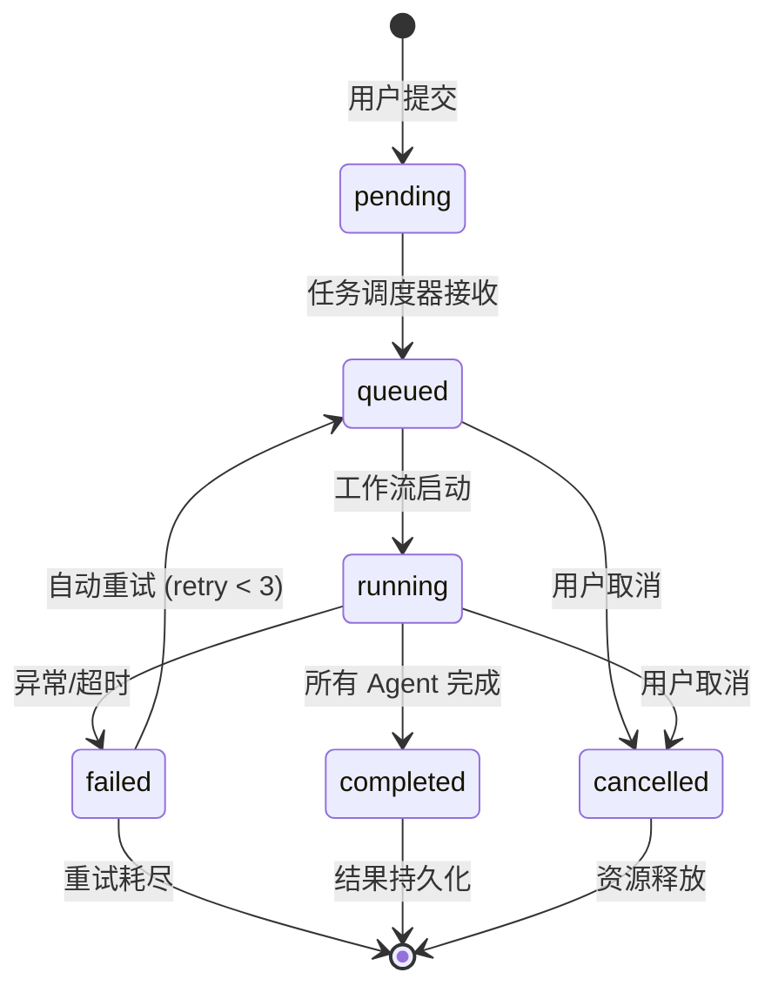
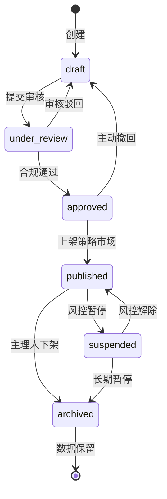

# 中萨数字科技交易所 · 量化交易模块
# 数据库 ER 图 + API 接口数学规格

> **文档版本**：v1.0  
> **数据库**：PostgreSQL 15+（主库）+ Redis 7+（缓存/队列）+ ClickHouse（时序/分析）  
> **ORM**：GORM v2（Go）/ SQLAlchemy 2.0（Python）  
> **API 规范**：OpenAPI 3.0 + 数学规格（输入域、输出域、状态机、限流模型）

---

## 目录

1. [数据库实体关系图（ER Diagram）](#1-数据库实体关系图er-diagram)
2. [表结构详细定义](#2-表结构详细定义)
3. [API 接口数学规格](#3-api-接口数学规格)
4. [状态机形式化定义](#4-状态机形式化定义)
5. [限流与并发控制数学模型](#5-限流与并发控制数学模型)
6. [数据一致性模型](#6-数据一致性模型)

---

## 1. 数据库实体关系图（ER Diagram）

### 1.1 全局 ER 图（Mermaid 语法）

```mermaid
erDiagram
    %% 交易所全局核心表
    users ||--o{ user_roles : "has"
    users ||--o{ user_assets : "owns"
    users ||--o{ cex_orders : "places"
    users ||--o{ quant_portfolios : "manages"
    users ||--o{ quant_subscriptions : "subscribes"
    users ||--o{ quant_analysis_tasks : "submits"
    users ||--o{ audit_logs : "generates"

    roles ||--o{ user_roles : "assigned_to"
    roles ||--o{ role_permissions : "has"
    permissions ||--o{ role_permissions : "granted_to"

    %% 量化模块专用表
    quant_strategies ||--o{ quant_analysis_tasks : "analyzed_by"
    quant_strategies ||--o{ quant_signals : "generates"
    quant_strategies ||--o{ quant_subscriptions : "subscribed_as"
    quant_strategies ||--o{ quant_backtests : "validated_by"
    quant_strategies ||--o{ quant_strategy_versions : "evolves_to"

    quant_analysis_tasks ||--o{ quant_signals : "produces"
    quant_analysis_tasks ||--o{ quant_agent_reasonings : "contains"

    quant_signals ||--o{ quant_portfolio_decisions : "drives"
    quant_signals ||--o{ quant_copy_trades : "triggers"

    quant_portfolios ||--o{ quant_portfolio_positions : "contains"
    quant_portfolios ||--o{ quant_portfolio_decisions : "receives"
    quant_portfolios ||--o{ quant_copy_trades : "executes"

    quant_agents ||--o{ quant_agent_reasonings : "produces"
    quant_agents ||--o{ quant_analysis_tasks : "participates"

    cex_orders ||--o{ quant_copy_trades : "fulfills"

    %% 财务与审计
    quant_subscriptions ||--o{ quant_subscription_payments : "billed_as"
    quant_copy_trades ||--o{ quant_profit_shares : "generates"

    %% 安全与风控
    users ||--o{ risk_profiles : "has"
    quant_strategies ||--o{ strategy_risk_scores : "evaluated_by"

    %% 定义表（简化展示关键字段）
    users {
        uuid id PK
        varchar email UK
        varchar phone
        varchar kyc_status
        int vip_level
        varchar preferred_language
        varchar timezone
        timestamp created_at
        timestamp updated_at
        bool is_active
        bool is_deleted
    }

    roles {
        int id PK
        varchar name UK
        varchar description
        jsonb permissions_snapshot
    }

    user_roles {
        uuid id PK
        uuid user_id FK
        int role_id FK
        uuid granted_by
        timestamp granted_at
        timestamp expires_at
    }

    user_assets {
        uuid id PK
        uuid user_id FK
        varchar asset_type
        varchar symbol
        decimal total_balance
        decimal available_balance
        decimal frozen_balance
        decimal usd_value
        timestamp last_sync
    }

    cex_orders {
        uuid id PK
        uuid user_id FK
        varchar order_type
        varchar symbol
        varchar side
        decimal quantity
        decimal price
        varchar status
        varchar strategy_tag
        timestamp created_at
        timestamp filled_at
    }

    quant_strategies {
        uuid id PK
        uuid creator_id FK
        varchar name
        varchar description
        varchar status
        varchar visibility
        decimal subscription_fee
        decimal profit_share_rate
        jsonb parameters
        int max_subscribers
        int current_subscribers
        decimal max_capacity_usd
        decimal current_aum_usd
        timestamp created_at
        timestamp published_at
        bool is_active
    }

    quant_strategy_versions {
        uuid id PK
        uuid strategy_id FK
        int version_number
        jsonb parameters
        text change_log
        uuid approved_by
        timestamp approved_at
    }

    quant_analysis_tasks {
        uuid id PK
        uuid user_id FK
        uuid strategy_id FK
        varchar status
        jsonb symbols
        jsonb selected_agents
        jsonb date_range
        int priority
        timestamp submitted_at
        timestamp started_at
        timestamp completed_at
        decimal llm_cost_usd
        int retry_count
        varchar error_message
    }

    quant_agents {
        uuid id PK
        varchar name UK
        varchar display_name
        varchar agent_type
        varchar persona_style
        varchar llm_provider
        varchar model_name
        decimal temperature
        jsonb system_prompt
        bool is_active
        decimal accuracy_score
        int total_calls
    }

    quant_agent_reasonings {
        uuid id PK
        uuid task_id FK
        uuid agent_id FK
        varchar symbol
        varchar signal
        decimal confidence
        text reasoning
        jsonb metrics_used
        decimal processing_time_ms
        int tokens_used
        decimal cost_usd
    }

    quant_signals {
        uuid id PK
        uuid task_id FK
        uuid strategy_id FK
        varchar symbol
        varchar signal_type
        decimal confidence
        decimal suggested_quantity
        decimal suggested_price
        varchar risk_level
        jsonb risk_adjustment
        text final_reasoning
        timestamp generated_at
        bool is_published
    }

    quant_portfolios {
        uuid id PK
        uuid user_id FK
        varchar portfolio_type
        decimal total_value_usd
        decimal cash_balance_usd
        decimal day_pnl_usd
        decimal total_pnl_usd
        decimal max_drawdown
        decimal sharpe_ratio
        timestamp last_rebalanced_at
        timestamp created_at
    }

    quant_portfolio_positions {
        uuid id PK
        uuid portfolio_id FK
        varchar symbol
        varchar asset_type
        decimal quantity
        decimal cost_basis
        decimal current_price
        decimal unrealized_pnl
        decimal weight
        timestamp last_price_update
    }

    quant_portfolio_decisions {
        uuid id PK
        uuid portfolio_id FK
        uuid signal_id FK
        varchar action
        decimal quantity
        decimal confidence
        text reason
        varchar status
        timestamp created_at
        timestamp executed_at
    }

    quant_subscriptions {
        uuid id PK
        uuid user_id FK
        uuid strategy_id FK
        varchar status
        decimal copy_ratio
        bool auto_execute
        decimal max_single_order_usd
        decimal stop_loss_pct
        timestamp subscribed_at
        timestamp expires_at
        timestamp cancelled_at
    }

    quant_copy_trades {
        uuid id PK
        uuid subscription_id FK
        uuid portfolio_id FK
        uuid signal_id FK
        uuid cex_order_id FK
        varchar symbol
        varchar side
        decimal quantity
        decimal executed_price
        decimal slippage_pct
        decimal pnl_usd
        varchar status
        timestamp signal_received_at
        timestamp executed_at
    }

    quant_backtests {
        uuid id PK
        uuid strategy_id FK
        uuid approved_by FK
        varchar status
        jsonb parameters
        date start_date
        date end_date
        decimal initial_capital
        decimal final_value
        decimal total_return_pct
        decimal annualized_return_pct
        decimal sharpe_ratio
        decimal max_drawdown_pct
        decimal win_rate_pct
        jsonb trades
        jsonb monthly_returns
        text report_url
        timestamp created_at
        timestamp completed_at
    }

    quant_profit_shares {
        uuid id PK
        uuid copy_trade_id FK
        uuid strategy_id FK
        uuid subscriber_id FK
        uuid creator_id FK
        decimal gross_pnl_usd
        decimal platform_fee_usd
        decimal creator_share_usd
        decimal subscriber_net_pnl_usd
        varchar status
        timestamp calculated_at
        timestamp settled_at
    }

    strategy_risk_scores {
        uuid id PK
        uuid strategy_id FK
        decimal volatility_score
        decimal drawdown_score
        decimal concentration_score
        decimal leverage_score
        decimal liquidity_score
        decimal composite_score
        varchar risk_level
        timestamp calculated_at
    }

    audit_logs {
        uuid id PK
        uuid user_id FK
        varchar action_type
        varchar resource_type
        uuid resource_id
        jsonb before_state
        jsonb after_state
        varchar ip_address
        varchar user_agent
        timestamp created_at
    }
```



### 1.2 核心表关系说明

| 关系 | 类型 | 说明 | 级联规则 |
|------|------|------|---------|
| users → quant_portfolios | 1:N | 一个用户可拥有多个投资组合（实盘/模拟盘） | 用户删除时软删除，保留历史 |
| users → quant_subscriptions | 1:N | 一个用户可订阅多个策略 | 用户删除时取消所有订阅 |
| quant_strategies → quant_analysis_tasks | 1:N | 一个策略可触发多次分析任务 | 策略删除时保留历史任务 |
| quant_analysis_tasks → quant_signals | 1:N | 一个分析任务产生多个信号（每股票一个） | 任务删除时级联删除信号 |
| quant_signals → quant_portfolio_decisions | 1:1 | 一个信号对应一个投资决策 | 信号删除时保留决策记录 |
| quant_subscriptions → quant_copy_trades | 1:N | 一个订阅产生多次跟单交易 | 订阅取消时保留历史跟单 |
| quant_portfolios → quant_portfolio_positions | 1:N | 一个组合包含多个持仓 | 组合清算时保留历史持仓 |
| cex_orders → quant_copy_trades | 1:1 | 一个 CEX 订单对应一次跟单 | 订单删除时保留跟单记录 |

---

## 2. 表结构详细定义

### 2.1 交易所全局核心表

#### `users` — 用户主表

```sql
CREATE TABLE users (
    id                  UUID PRIMARY KEY DEFAULT gen_random_uuid(),
    email               VARCHAR(255) NOT NULL UNIQUE,
    phone               VARCHAR(50),
    password_hash       VARCHAR(255) NOT NULL,
    kyc_status          VARCHAR(20) NOT NULL DEFAULT 'pending' 
                        CHECK (kyc_status IN ('pending', 'submitted', 'approved', 'rejected', 'expired')),
    kyc_level           INT NOT NULL DEFAULT 0 CHECK (kyc_level >= 0 AND kyc_level <= 3),
    vip_level           INT NOT NULL DEFAULT 0 CHECK (vip_level >= 0 AND vip_level <= 5),
    preferred_language  VARCHAR(10) NOT NULL DEFAULT 'zh-CN',
    timezone            VARCHAR(50) NOT NULL DEFAULT 'Asia/Shanghai',
    country_code        VARCHAR(5),  -- ISO 3166-1 alpha-2
    is_tax_us_person    BOOLEAN NOT NULL DEFAULT FALSE,
    referral_code       VARCHAR(20) UNIQUE,
    referred_by         UUID REFERENCES users(id),
    is_active           BOOLEAN NOT NULL DEFAULT TRUE,
    is_deleted          BOOLEAN NOT NULL DEFAULT FALSE,
    deleted_at          TIMESTAMP,
    created_at          TIMESTAMP NOT NULL DEFAULT NOW(),
    updated_at          TIMESTAMP NOT NULL DEFAULT NOW()
);

CREATE INDEX idx_users_email ON users(email);
CREATE INDEX idx_users_kyc ON users(kyc_status, kyc_level);
CREATE INDEX idx_users_vip ON users(vip_level) WHERE vip_level > 0;
CREATE INDEX idx_users_country ON users(country_code);
CREATE INDEX idx_users_referral ON users(referral_code);
```

#### `roles` — 角色表

```sql
CREATE TABLE roles (
    id                  SERIAL PRIMARY KEY,
    name                VARCHAR(50) NOT NULL UNIQUE,
    description         TEXT,
    permissions_snapshot JSONB NOT NULL DEFAULT '{}',
    is_system           BOOLEAN NOT NULL DEFAULT FALSE,
    created_at          TIMESTAMP NOT NULL DEFAULT NOW()
);

-- 初始数据
INSERT INTO roles (name, description, is_system) VALUES
    ('super_admin', '超级管理员', TRUE),
    ('exchange_ops', '交易所运营', TRUE),
    ('quant_strategist', '量化策略师', TRUE),
    ('risk_officer', '风控合规官', TRUE),
    ('vip_trader', 'VIP交易者', TRUE),
    ('viewer', '查看者', TRUE);
```

#### `user_roles` — 用户角色关联表

```sql
CREATE TABLE user_roles (
    id                  UUID PRIMARY KEY DEFAULT gen_random_uuid(),
    user_id             UUID NOT NULL REFERENCES users(id) ON DELETE CASCADE,
    role_id             INT NOT NULL REFERENCES roles(id) ON DELETE CASCADE,
    granted_by          UUID REFERENCES users(id),
    granted_at          TIMESTAMP NOT NULL DEFAULT NOW(),
    expires_at          TIMESTAMP,
    UNIQUE(user_id, role_id)
);

CREATE INDEX idx_user_roles_user ON user_roles(user_id);
CREATE INDEX idx_user_roles_role ON user_roles(role_id);
```

#### `user_assets` — 用户资产表（交易所全局）

```sql
CREATE TABLE user_assets (
    id                  UUID PRIMARY KEY DEFAULT gen_random_uuid(),
    user_id             UUID NOT NULL REFERENCES users(id) ON DELETE CASCADE,
    asset_type          VARCHAR(20) NOT NULL CHECK (asset_type IN ('fiat', 'crypto', 'stock')),
    symbol              VARCHAR(50) NOT NULL,
    total_balance       DECIMAL(36, 18) NOT NULL DEFAULT 0,
    available_balance   DECIMAL(36, 18) NOT NULL DEFAULT 0,
    frozen_balance      DECIMAL(36, 18) NOT NULL DEFAULT 0,
    usd_value           DECIMAL(36, 18) NOT NULL DEFAULT 0,
    last_sync           TIMESTAMP NOT NULL DEFAULT NOW(),
    created_at          TIMESTAMP NOT NULL DEFAULT NOW(),
    updated_at          TIMESTAMP NOT NULL DEFAULT NOW(),
    UNIQUE(user_id, asset_type, symbol)
);

CREATE INDEX idx_user_assets_user ON user_assets(user_id);
CREATE INDEX idx_user_assets_symbol ON user_assets(symbol);
```

#### `cex_orders` — CEX 订单表（交易所全局）

```sql
CREATE TABLE cex_orders (
    id                  UUID PRIMARY KEY DEFAULT gen_random_uuid(),
    user_id             UUID NOT NULL REFERENCES users(id) ON DELETE CASCADE,
    order_type          VARCHAR(20) NOT NULL CHECK (order_type IN ('market', 'limit', 'stop_limit', 'twap', 'vwap')),
    symbol              VARCHAR(50) NOT NULL,
    side                VARCHAR(10) NOT NULL CHECK (side IN ('buy', 'sell')),
    quantity            DECIMAL(36, 18) NOT NULL,
    price               DECIMAL(36, 18),
    filled_quantity     DECIMAL(36, 18) NOT NULL DEFAULT 0,
    filled_price        DECIMAL(36, 18),
    status              VARCHAR(20) NOT NULL DEFAULT 'pending' 
                        CHECK (status IN ('pending', 'partially_filled', 'filled', 'cancelled', 'expired', 'rejected')),
    strategy_tag        VARCHAR(100),  -- 标记是否来自量化策略
    source              VARCHAR(50) NOT NULL DEFAULT 'manual',  -- manual, quant_copy, api
    created_at          TIMESTAMP NOT NULL DEFAULT NOW(),
    filled_at           TIMESTAMP,
    updated_at          TIMESTAMP NOT NULL DEFAULT NOW()
);

CREATE INDEX idx_cex_orders_user ON cex_orders(user_id);
CREATE INDEX idx_cex_orders_symbol ON cex_orders(symbol);
CREATE INDEX idx_cex_orders_status ON cex_orders(status);
CREATE INDEX idx_cex_orders_strategy ON cex_orders(strategy_tag) WHERE strategy_tag IS NOT NULL;
CREATE INDEX idx_cex_orders_created ON cex_orders(created_at);
```

### 2.2 量化模块专用表

#### `quant_strategies` — 策略主表

```sql
CREATE TABLE quant_strategies (
    id                  UUID PRIMARY KEY DEFAULT gen_random_uuid(),
    creator_id          UUID NOT NULL REFERENCES users(id),
    name                VARCHAR(200) NOT NULL,
    description         TEXT,
    status              VARCHAR(20) NOT NULL DEFAULT 'draft' 
                        CHECK (status IN ('draft', 'under_review', 'approved', 'published', 'suspended', 'archived')),
    visibility          VARCHAR(20) NOT NULL DEFAULT 'private' 
                        CHECK (visibility IN ('private', 'public', 'vip_only')),
    category            VARCHAR(50) NOT NULL CHECK (category IN ('value', 'growth', 'technical', 'macro', 'crypto', 'multi_factor')),
    subscription_fee    DECIMAL(18, 8) NOT NULL DEFAULT 0,  -- 月订阅费 USD
    profit_share_rate   DECIMAL(5, 4) NOT NULL DEFAULT 0 CHECK (profit_share_rate >= 0 AND profit_share_rate <= 0.5),
    parameters          JSONB NOT NULL DEFAULT '{}',  -- 策略参数（JSON）
    max_subscribers     INT NOT NULL DEFAULT 1000,
    current_subscribers INT NOT NULL DEFAULT 0,
    max_capacity_usd    DECIMAL(36, 18) NOT NULL DEFAULT 1000000,
    current_aum_usd     DECIMAL(36, 18) NOT NULL DEFAULT 0,
    min_vip_level       INT NOT NULL DEFAULT 0 CHECK (min_vip_level >= 0),
    backtest_required   BOOLEAN NOT NULL DEFAULT TRUE,
    sim_trading_days    INT NOT NULL DEFAULT 90,  -- 模拟盘验证天数
    is_active           BOOLEAN NOT NULL DEFAULT TRUE,
    created_at          TIMESTAMP NOT NULL DEFAULT NOW(),
    updated_at          TIMESTAMP NOT NULL DEFAULT NOW(),
    published_at        TIMESTAMP
);

CREATE INDEX idx_quant_strategies_creator ON quant_strategies(creator_id);
CREATE INDEX idx_quant_strategies_status ON quant_strategies(status);
CREATE INDEX idx_quant_strategies_visibility ON quant_strategies(visibility);
CREATE INDEX idx_quant_strategies_category ON quant_strategies(category);
CREATE INDEX idx_quant_strategies_published ON quant_strategies(published_at) WHERE published_at IS NOT NULL;
```

#### `quant_strategy_versions` — 策略版本表

```sql
CREATE TABLE quant_strategy_versions (
    id                  UUID PRIMARY KEY DEFAULT gen_random_uuid(),
    strategy_id         UUID NOT NULL REFERENCES quant_strategies(id) ON DELETE CASCADE,
    version_number      INT NOT NULL,
    parameters          JSONB NOT NULL,
    change_log          TEXT,
    approved_by         UUID REFERENCES users(id),
    approved_at         TIMESTAMP,
    created_at          TIMESTAMP NOT NULL DEFAULT NOW(),
    UNIQUE(strategy_id, version_number)
);

CREATE INDEX idx_quant_strategy_versions_strategy ON quant_strategy_versions(strategy_id);
```

#### `quant_analysis_tasks` — 分析任务表

```sql
CREATE TABLE quant_analysis_tasks (
    id                  UUID PRIMARY KEY DEFAULT gen_random_uuid(),
    user_id             UUID NOT NULL REFERENCES users(id),
    strategy_id         UUID REFERENCES quant_strategies(id),
    status              VARCHAR(20) NOT NULL DEFAULT 'pending' 
                        CHECK (status IN ('pending', 'queued', 'running', 'completed', 'failed', 'cancelled')),
    symbols             JSONB NOT NULL,  -- ["AAPL", "BTC-USD"]
    selected_agents     JSONB NOT NULL,  -- ["buffett", "graham", "technical"]
    date_range          JSONB NOT NULL,  -- {"start": "2024-01-01", "end": "2024-06-01"}
    priority            INT NOT NULL DEFAULT 5 CHECK (priority >= 1 AND priority <= 10),
    llm_cost_usd        DECIMAL(18, 8) NOT NULL DEFAULT 0,
    retry_count         INT NOT NULL DEFAULT 0 CHECK (retry_count <= 3),
    error_message       TEXT,
    submitted_at        TIMESTAMP NOT NULL DEFAULT NOW(),
    started_at          TIMESTAMP,
    completed_at        TIMESTAMP,
    created_at          TIMESTAMP NOT NULL DEFAULT NOW(),
    updated_at          TIMESTAMP NOT NULL DEFAULT NOW()
);

CREATE INDEX idx_quant_analysis_tasks_user ON quant_analysis_tasks(user_id);
CREATE INDEX idx_quant_analysis_tasks_status ON quant_analysis_tasks(status);
CREATE INDEX idx_quant_analysis_tasks_strategy ON quant_analysis_tasks(strategy_id);
CREATE INDEX idx_quant_analysis_tasks_submitted ON quant_analysis_tasks(submitted_at);
CREATE INDEX idx_quant_analysis_tasks_priority ON quant_analysis_tasks(priority, submitted_at) 
    WHERE status IN ('pending', 'queued');
```

#### `quant_agents` — AI 智能体表

```sql
CREATE TABLE quant_agents (
    id                  UUID PRIMARY KEY DEFAULT gen_random_uuid(),
    name                VARCHAR(100) NOT NULL UNIQUE,
    display_name        VARCHAR(200) NOT NULL,
    agent_type          VARCHAR(50) NOT NULL CHECK (agent_type IN ('fundamental', 'technical', 'sentiment', 'valuation', 'persona', 'risk_manager', 'portfolio_manager')),
    persona_style       VARCHAR(100),  -- "value_investing", "growth_investing", etc.
    llm_provider        VARCHAR(50) NOT NULL CHECK (llm_provider IN ('openai', 'anthropic', 'google', 'local', 'azure')),
    model_name          VARCHAR(100) NOT NULL,
    temperature         DECIMAL(3, 2) NOT NULL DEFAULT 0.0 CHECK (temperature >= 0 AND temperature <= 2),
    max_tokens          INT NOT NULL DEFAULT 4096,
    system_prompt       JSONB NOT NULL,
    tools_enabled       JSONB NOT NULL DEFAULT '[]',  -- ["calculator", "news_search", "financial_data"]
    is_active           BOOLEAN NOT NULL DEFAULT TRUE,
    accuracy_score      DECIMAL(5, 4) NOT NULL DEFAULT 0.5,
    total_calls         INT NOT NULL DEFAULT 0,
    avg_latency_ms      INT NOT NULL DEFAULT 0,
    created_at          TIMESTAMP NOT NULL DEFAULT NOW(),
    updated_at          TIMESTAMP NOT NULL DEFAULT NOW()
);

CREATE INDEX idx_quant_agents_type ON quant_agents(agent_type);
CREATE INDEX idx_quant_agents_active ON quant_agents(is_active) WHERE is_active = TRUE;
```

#### `quant_agent_reasonings` — 智能体推理记录表

```sql
CREATE TABLE quant_agent_reasonings (
    id                  UUID PRIMARY KEY DEFAULT gen_random_uuid(),
    task_id             UUID NOT NULL REFERENCES quant_analysis_tasks(id) ON DELETE CASCADE,
    agent_id            UUID NOT NULL REFERENCES quant_agents(id),
    symbol              VARCHAR(50) NOT NULL,
    signal              VARCHAR(20) NOT NULL CHECK (signal IN ('bullish', 'bearish', 'neutral')),
    confidence          DECIMAL(5, 4) NOT NULL DEFAULT 0.5 CHECK (confidence >= 0 AND confidence <= 1),
    reasoning           TEXT,
    metrics_used        JSONB NOT NULL DEFAULT '{}',  -- {"pe_ratio": 15.2, "rsi": 45}
    processing_time_ms  INT NOT NULL DEFAULT 0,
    tokens_used         INT NOT NULL DEFAULT 0,
    cost_usd            DECIMAL(18, 8) NOT NULL DEFAULT 0,
    created_at          TIMESTAMP NOT NULL DEFAULT NOW()
);

CREATE INDEX idx_quant_agent_reasonings_task ON quant_agent_reasonings(task_id);
CREATE INDEX idx_quant_agent_reasonings_agent ON quant_agent_reasonings(agent_id);
CREATE INDEX idx_quant_agent_reasonings_symbol ON quant_agent_reasonings(symbol);
CREATE INDEX idx_quant_agent_reasonings_signal ON quant_agent_reasonings(signal);
```

#### `quant_signals` — 信号表

```sql
CREATE TABLE quant_signals (
    id                  UUID PRIMARY KEY DEFAULT gen_random_uuid(),
    task_id             UUID NOT NULL REFERENCES quant_analysis_tasks(id) ON DELETE CASCADE,
    strategy_id         UUID REFERENCES quant_strategies(id),
    symbol              VARCHAR(50) NOT NULL,
    signal_type         VARCHAR(20) NOT NULL CHECK (signal_type IN ('buy', 'sell', 'hold', 'strong_buy', 'strong_sell')),
    confidence          DECIMAL(5, 4) NOT NULL DEFAULT 0.5 CHECK (confidence >= 0 AND confidence <= 1),
    suggested_quantity  DECIMAL(36, 18),
    suggested_price     DECIMAL(36, 18),
    risk_level          VARCHAR(20) NOT NULL DEFAULT 'medium' 
                        CHECK (risk_level IN ('low', 'medium', 'high', 'extreme')),
    risk_adjustment     JSONB NOT NULL DEFAULT '{}',  -- {"max_position": 0.2, "stop_loss": 0.05}
    final_reasoning     TEXT,
    is_published        BOOLEAN NOT NULL DEFAULT FALSE,
    published_at        TIMESTAMP,
    generated_at        TIMESTAMP NOT NULL DEFAULT NOW(),
    expires_at          TIMESTAMP  -- 信号有效期
);

CREATE INDEX idx_quant_signals_task ON quant_signals(task_id);
CREATE INDEX idx_quant_signals_strategy ON quant_signals(strategy_id);
CREATE INDEX idx_quant_signals_symbol ON quant_signals(symbol);
CREATE INDEX idx_quant_signals_type ON quant_signals(signal_type);
CREATE INDEX idx_quant_signals_published ON quant_signals(is_published, published_at) WHERE is_published = TRUE;
CREATE INDEX idx_quant_signals_expires ON quant_signals(expires_at);
```

#### `quant_portfolios` — 投资组合表

```sql
CREATE TABLE quant_portfolios (
    id                  UUID PRIMARY KEY DEFAULT gen_random_uuid(),
    user_id             UUID NOT NULL REFERENCES users(id) ON DELETE CASCADE,
    portfolio_type      VARCHAR(20) NOT NULL DEFAULT 'live' 
                        CHECK (portfolio_type IN ('live', 'simulated', 'copy_trading')),
    name                VARCHAR(200) NOT NULL DEFAULT '默认组合',
    total_value_usd     DECIMAL(36, 18) NOT NULL DEFAULT 0,
    cash_balance_usd    DECIMAL(36, 18) NOT NULL DEFAULT 0,
    day_pnl_usd         DECIMAL(36, 18) NOT NULL DEFAULT 0,
    total_pnl_usd       DECIMAL(36, 18) NOT NULL DEFAULT 0,
    max_drawdown        DECIMAL(10, 6) NOT NULL DEFAULT 0,
    sharpe_ratio        DECIMAL(10, 6) NOT NULL DEFAULT 0,
    last_rebalanced_at  TIMESTAMP,
    created_at          TIMESTAMP NOT NULL DEFAULT NOW(),
    updated_at          TIMESTAMP NOT NULL DEFAULT NOW()
);

CREATE INDEX idx_quant_portfolios_user ON quant_portfolios(user_id);
CREATE INDEX idx_quant_portfolios_type ON quant_portfolios(portfolio_type);
```

#### `quant_portfolio_positions` — 组合持仓表

```sql
CREATE TABLE quant_portfolio_positions (
    id                  UUID PRIMARY KEY DEFAULT gen_random_uuid(),
    portfolio_id        UUID NOT NULL REFERENCES quant_portfolios(id) ON DELETE CASCADE,
    symbol              VARCHAR(50) NOT NULL,
    asset_type          VARCHAR(20) NOT NULL CHECK (asset_type IN ('stock', 'crypto', 'fiat')),
    quantity            DECIMAL(36, 18) NOT NULL DEFAULT 0,
    cost_basis          DECIMAL(36, 18) NOT NULL DEFAULT 0,  -- 平均成本
    current_price       DECIMAL(36, 18) NOT NULL DEFAULT 0,
    unrealized_pnl      DECIMAL(36, 18) NOT NULL DEFAULT 0,
    weight              DECIMAL(5, 4) NOT NULL DEFAULT 0 CHECK (weight >= 0 AND weight <= 1),
    last_price_update   TIMESTAMP NOT NULL DEFAULT NOW(),
    created_at          TIMESTAMP NOT NULL DEFAULT NOW(),
    updated_at          TIMESTAMP NOT NULL DEFAULT NOW(),
    UNIQUE(portfolio_id, symbol)
);

CREATE INDEX idx_quant_portfolio_positions_portfolio ON quant_portfolio_positions(portfolio_id);
CREATE INDEX idx_quant_portfolio_positions_symbol ON quant_portfolio_positions(symbol);
```

#### `quant_portfolio_decisions` — 组合决策表

```sql
CREATE TABLE quant_portfolio_decisions (
    id                  UUID PRIMARY KEY DEFAULT gen_random_uuid(),
    portfolio_id        UUID NOT NULL REFERENCES quant_portfolios(id),
    signal_id           UUID NOT NULL REFERENCES quant_signals(id),
    action              VARCHAR(20) NOT NULL CHECK (action IN ('buy', 'sell', 'hold', 'rebalance')),
    quantity            DECIMAL(36, 18),
    confidence          DECIMAL(5, 4) NOT NULL DEFAULT 0,
    reason              TEXT,
    status              VARCHAR(20) NOT NULL DEFAULT 'pending' 
                        CHECK (status IN ('pending', 'approved', 'rejected', 'executed', 'expired')),
    approved_by         UUID REFERENCES users(id),
    created_at          TIMESTAMP NOT NULL DEFAULT NOW(),
    executed_at         TIMESTAMP
);

CREATE INDEX idx_quant_portfolio_decisions_portfolio ON quant_portfolio_decisions(portfolio_id);
CREATE INDEX idx_quant_portfolio_decisions_status ON quant_portfolio_decisions(status);
```

#### `quant_subscriptions` — 策略订阅表

```sql
CREATE TABLE quant_subscriptions (
    id                  UUID PRIMARY KEY DEFAULT gen_random_uuid(),
    user_id             UUID NOT NULL REFERENCES users(id) ON DELETE CASCADE,
    strategy_id         UUID NOT NULL REFERENCES quant_strategies(id) ON DELETE CASCADE,
    status              VARCHAR(20) NOT NULL DEFAULT 'active' 
                        CHECK (status IN ('active', 'paused', 'cancelled', 'expired')),
    copy_ratio          DECIMAL(5, 4) NOT NULL DEFAULT 0.1 CHECK (copy_ratio > 0 AND copy_ratio <= 1),
    auto_execute        BOOLEAN NOT NULL DEFAULT FALSE,
    max_single_order_usd DECIMAL(36, 18) NOT NULL DEFAULT 1000,
    stop_loss_pct       DECIMAL(5, 4) NOT NULL DEFAULT 0.1 CHECK (stop_loss_pct >= 0 AND stop_loss_pct <= 1),
    take_profit_pct     DECIMAL(5, 4),
    subscribed_at       TIMESTAMP NOT NULL DEFAULT NOW(),
    expires_at          TIMESTAMP,
    cancelled_at        TIMESTAMP,
    created_at          TIMESTAMP NOT NULL DEFAULT NOW(),
    updated_at          TIMESTAMP NOT NULL DEFAULT NOW(),
    UNIQUE(user_id, strategy_id, status)
);

CREATE INDEX idx_quant_subscriptions_user ON quant_subscriptions(user_id);
CREATE INDEX idx_quant_subscriptions_strategy ON quant_subscriptions(strategy_id);
CREATE INDEX idx_quant_subscriptions_status ON quant_subscriptions(status);
```

#### `quant_copy_trades` — 跟单交易表

```sql
CREATE TABLE quant_copy_trades (
    id                  UUID PRIMARY KEY DEFAULT gen_random_uuid(),
    subscription_id     UUID NOT NULL REFERENCES quant_subscriptions(id),
    portfolio_id        UUID NOT NULL REFERENCES quant_portfolios(id),
    signal_id           UUID NOT NULL REFERENCES quant_signals(id),
    cex_order_id        UUID REFERENCES cex_orders(id),
    symbol              VARCHAR(50) NOT NULL,
    side                VARCHAR(10) NOT NULL CHECK (side IN ('buy', 'sell')),
    quantity            DECIMAL(36, 18) NOT NULL,
    executed_price      DECIMAL(36, 18),
    slippage_pct        DECIMAL(10, 6) NOT NULL DEFAULT 0,
    pnl_usd             DECIMAL(36, 18) NOT NULL DEFAULT 0,
    status              VARCHAR(20) NOT NULL DEFAULT 'pending' 
                        CHECK (status IN ('pending', 'executed', 'failed', 'cancelled')),
    signal_received_at  TIMESTAMP NOT NULL DEFAULT NOW(),
    executed_at         TIMESTAMP,
    created_at          TIMESTAMP NOT NULL DEFAULT NOW(),
    updated_at          TIMESTAMP NOT NULL DEFAULT NOW()
);

CREATE INDEX idx_quant_copy_trades_subscription ON quant_copy_trades(subscription_id);
CREATE INDEX idx_quant_copy_trades_portfolio ON quant_copy_trades(portfolio_id);
CREATE INDEX idx_quant_copy_trades_status ON quant_copy_trades(status);
CREATE INDEX idx_quant_copy_trades_symbol ON quant_copy_trades(symbol);
```

#### `quant_backtests` — 回测记录表

```sql
CREATE TABLE quant_backtests (
    id                  UUID PRIMARY KEY DEFAULT gen_random_uuid(),
    strategy_id         UUID NOT NULL REFERENCES quant_strategies(id) ON DELETE CASCADE,
    approved_by         UUID REFERENCES users(id),
    status              VARCHAR(20) NOT NULL DEFAULT 'pending' 
                        CHECK (status IN ('pending', 'running', 'completed', 'failed', 'rejected')),
    parameters          JSONB NOT NULL,  -- 回测参数
    start_date          DATE NOT NULL,
    end_date            DATE NOT NULL,
    initial_capital     DECIMAL(36, 18) NOT NULL DEFAULT 100000,
    final_value         DECIMAL(36, 18),
    total_return_pct    DECIMAL(10, 6),
    annualized_return_pct DECIMAL(10, 6),
    sharpe_ratio        DECIMAL(10, 6),
    max_drawdown_pct    DECIMAL(10, 6),
    win_rate_pct        DECIMAL(10, 6),
    total_trades        INT,
    avg_trade_return_pct DECIMAL(10, 6),
    trades              JSONB,  -- 详细交易记录（大字段，可存对象存储）
    monthly_returns     JSONB,  -- 月度收益
    equity_curve        JSONB,  -- 净值曲线（可存对象存储）
    report_url          VARCHAR(500),  -- 对象存储链接
    created_at          TIMESTAMP NOT NULL DEFAULT NOW(),
    completed_at        TIMESTAMP
);

CREATE INDEX idx_quant_backtests_strategy ON quant_backtests(strategy_id);
CREATE INDEX idx_quant_backtests_status ON quant_backtests(status);
CREATE INDEX idx_quant_backtests_dates ON quant_backtests(start_date, end_date);
```

#### `quant_profit_shares` — 收益分成表

```sql
CREATE TABLE quant_profit_shares (
    id                  UUID PRIMARY KEY DEFAULT gen_random_uuid(),
    copy_trade_id       UUID NOT NULL REFERENCES quant_copy_trades(id),
    strategy_id         UUID NOT NULL REFERENCES quant_strategies(id),
    subscriber_id       UUID NOT NULL REFERENCES users(id),
    creator_id          UUID NOT NULL REFERENCES users(id),
    gross_pnl_usd       DECIMAL(36, 18) NOT NULL DEFAULT 0,
    platform_fee_pct    DECIMAL(5, 4) NOT NULL DEFAULT 0.1,  -- 平台抽成 10%
    platform_fee_usd    DECIMAL(36, 18) NOT NULL DEFAULT 0,
    creator_share_pct   DECIMAL(5, 4) NOT NULL DEFAULT 0.2,  -- 策略主理人 20%
    creator_share_usd   DECIMAL(36, 18) NOT NULL DEFAULT 0,
    subscriber_net_pnl_usd DECIMAL(36, 18) NOT NULL DEFAULT 0,
    status              VARCHAR(20) NOT NULL DEFAULT 'pending' 
                        CHECK (status IN ('pending', 'calculated', 'settled', 'disputed')),
    calculated_at       TIMESTAMP,
    settled_at          TIMESTAMP,
    created_at          TIMESTAMP NOT NULL DEFAULT NOW()
);

CREATE INDEX idx_quant_profit_shares_trade ON quant_profit_shares(copy_trade_id);
CREATE INDEX idx_quant_profit_shares_strategy ON quant_profit_shares(strategy_id);
CREATE INDEX idx_quant_profit_shares_status ON quant_profit_shares(status);
```

#### `strategy_risk_scores` — 策略风险评分表

```sql
CREATE TABLE strategy_risk_scores (
    id                  UUID PRIMARY KEY DEFAULT gen_random_uuid(),
    strategy_id         UUID NOT NULL REFERENCES quant_strategies(id) ON DELETE CASCADE,
    volatility_score    DECIMAL(5, 4) NOT NULL DEFAULT 0.5 CHECK (volatility_score >= 0 AND volatility_score <= 1),
    drawdown_score      DECIMAL(5, 4) NOT NULL DEFAULT 0.5,
    concentration_score DECIMAL(5, 4) NOT NULL DEFAULT 0.5,
    leverage_score      DECIMAL(5, 4) NOT NULL DEFAULT 0.5,
    liquidity_score     DECIMAL(5, 4) NOT NULL DEFAULT 0.5,
    composite_score     DECIMAL(5, 4) NOT NULL DEFAULT 0.5,
    risk_level          VARCHAR(20) NOT NULL DEFAULT 'medium' 
                        CHECK (risk_level IN ('low', 'medium', 'high', 'extreme')),
    calculated_at       TIMESTAMP NOT NULL DEFAULT NOW(),
    UNIQUE(strategy_id)
);

CREATE INDEX idx_strategy_risk_scores_strategy ON strategy_risk_scores(strategy_id);
CREATE INDEX idx_strategy_risk_scores_level ON strategy_risk_scores(risk_level);
```

#### `audit_logs` — 审计日志表

```sql
CREATE TABLE audit_logs (
    id                  UUID PRIMARY KEY DEFAULT gen_random_uuid(),
    user_id             UUID REFERENCES users(id),
    action_type         VARCHAR(50) NOT NULL,  -- CREATE, UPDATE, DELETE, LOGIN, ANALYSIS_RUN, etc.
    resource_type       VARCHAR(50) NOT NULL,  -- strategy, order, portfolio, signal, etc.
    resource_id         UUID,
    before_state        JSONB,
    after_state         JSONB,
    ip_address          INET,
    user_agent          VARCHAR(500),
    session_id          UUID,
    request_id          UUID,  -- 链路追踪
    created_at          TIMESTAMP NOT NULL DEFAULT NOW()
);

CREATE INDEX idx_audit_logs_user ON audit_logs(user_id);
CREATE INDEX idx_audit_logs_action ON audit_logs(action_type);
CREATE INDEX idx_audit_logs_resource ON audit_logs(resource_type, resource_id);
CREATE INDEX idx_audit_logs_created ON audit_logs(created_at);
CREATE INDEX idx_audit_logs_request ON audit_logs(request_id);

-- 分区：按 created_at 月分区
-- CREATE TABLE audit_logs_2026_01 PARTITION OF audit_logs
--     FOR VALUES FROM ('2026-01-01') TO ('2026-02-01');
```

---

## 3. API 接口数学规格

### 3.1 接口通用数学框架

#### 输入域定义

对于每个 API 接口，定义输入域 `D_in` 为所有合法输入的集合：

```
D_in = { (headers, path_params, query_params, body) | ∀ constraints satisfied }
```

约束条件包括：
- 类型约束：`type(x) ∈ {string, number, integer, boolean, array, object}`
- 范围约束：`x ∈ [min, max]` 或 `x ∈ enum_set`
- 长度约束：`len(x) ∈ [min_len, max_len]`
- 关系约束：`x₁ + x₂ ≤ limit` 或 `x₁ < x₂`
- 权限约束：`RBAC(user, resource, action) = true`
- 速率约束：`RateLimit(user, endpoint) ≤ threshold`

#### 输出域定义

输出域 `D_out` 为所有可能响应的集合：

```
D_out = { (status_code, headers, body) | status_code ∈ {200, 201, 400, 401, 403, 404, 409, 422, 429, 500, 503} }
```

#### 接口函数映射

```
f: D_in → D_out
f(input) = output
```

函数 `f` 必须是**确定性的**（相同输入在相同系统状态下产生相同输出），除以下例外：
- 时间相关操作（如 `NOW()`）
- 随机数生成（如 UUID）
- 外部服务调用（如 LLM 推理）

---

### 3.2 核心接口数学规格

#### 接口 1：`POST /api/v1/quant/analysis` — 提交分析任务

**输入域 `D_in^analysis`**：

```
D_in^analysis = {
    headers: {
        Authorization: string,  -- "Bearer {JWT}"，|JWT| ∈ [100, 5000]
        Content-Type: "application/json"
    },
    body: {
        symbols: array[string],  -- 1 ≤ |symbols| ≤ 50, ∀s ∈ symbols: |s| ∈ [1, 20]
        agents: array[string],  -- 1 ≤ |agents| ≤ 10, ∀a ∈ agents: a ∈ AgentRegistry
        date_range: {
            start: string,  -- ISO 8601 date, start ≥ "2000-01-01", start ≤ end
            end: string     -- ISO 8601 date, end ≤ TODAY
        },
        priority: integer,  -- optional, default 5, priority ∈ [1, 10]
        strategy_id: UUID   -- optional, 若提供则校验 ownership(strategy_id, user_id)
    }
}
```

**前置条件 `Pre`**：

```
Pre(user_id, body) = 
    Authenticated(user_id) ∧
    Authorized(user_id, "quant:analysis:create") ∧
    RateLimit(user_id, "analysis", window=60s) < 5 ∧
    ConcurrentTasks(user_id) < 3 ∧
    (∀s ∈ body.symbols: ValidSymbol(s)) ∧
    (∀a ∈ body.agents: ActiveAgent(a)) ∧
    (body.strategy_id ≠ null → Owner(body.strategy_id, user_id)) ∧
    body.date_range.end - body.date_range.start ≤ 365 days
```

**状态转换 `State → State'`**：

```
State' = State ∪ { task }
where task = {
    id: UUID,
    user_id: user_id,
    status: "pending",
    symbols: body.symbols,
    agents: body.agents,
    date_range: body.date_range,
    priority: body.priority,
    submitted_at: NOW(),
    queue_position: QueueLength("quant_analysis") + 1
}

QueuePush("quant_analysis", task.id, priority=body.priority)
```

**输出域 `D_out^analysis`**：

```
D_out^analysis = {
    202: {
        task_id: UUID,
        status: "pending",
        queue_position: integer ≥ 1,
        estimated_wait_seconds: integer ≥ 0,
        estimated_completion_seconds: integer ≥ 30
    },
    400: { error: "INVALID_SYMBOLS", details: array[string] },
    401: { error: "UNAUTHORIZED" },
    403: { error: "FORBIDDEN", reason: "insufficient_vip_level" | "rate_limit_exceeded" },
    422: { error: "VALIDATION_ERROR", field: string, message: string },
    429: { error: "RATE_LIMITED", retry_after: integer }
}
```

**后置条件 `Post`**：

```
Post(State, State') = 
    ∃ task ∈ State'.quant_analysis_tasks: 
        task.user_id = user_id ∧
        task.status = "pending" ∧
        QueueContains("quant_analysis", task.id)
```

---

#### 接口 2：`GET /api/v1/quant/analysis/{task_id}` — 获取分析结果

**输入域 `D_in^result`**：

```
D_in^result = {
    headers: {
        Authorization: string
    },
    path_params: {
        task_id: UUID  -- 有效的 UUID v4
    }
}
```

**前置条件 `Pre`**：

```
Pre(user_id, task_id) = 
    Authenticated(user_id) ∧
    (∃ task ∈ quant_analysis_tasks: task.id = task_id) ∧
    (task.user_id = user_id ∨ Authorized(user_id, "quant:analysis:read_all"))
```

**输出域 `D_out^result`**：

```
D_out^result = {
    200: {
        task_id: UUID,
        status: "pending" | "queued" | "running" | "completed" | "failed" | "cancelled",
        progress_pct: integer ∈ [0, 100],  -- 仅 status ∈ {running, completed}
        signals: array[Signal] | null,     -- 仅 status = "completed"
        final_decision: Decision | null,   -- 仅 status = "completed"
        risk_adjustment: RiskAdjustment | null,
        error: ErrorInfo | null,            -- 仅 status = "failed"
        llm_cost_usd: decimal ≥ 0,
        processing_time_seconds: integer ≥ 0
    },
    404: { error: "TASK_NOT_FOUND" }
}
```

其中：

```
Signal = {
    symbol: string,
    agent: string,
    signal: "bullish" | "bearish" | "neutral",
    confidence: decimal ∈ [0, 1],
    reasoning: string,  -- |reasoning| ≤ 5000 chars
    metrics: object
}

Decision = {
    action: "buy" | "sell" | "hold",
    quantity: decimal ≥ 0,
    confidence: decimal ∈ [0, 1],
    reason: string
}

RiskAdjustment = {
    max_position_pct: decimal ∈ [0, 1],
    stop_loss_pct: decimal ∈ [0, 1],
    risk_level: "low" | "medium" | "high" | "extreme"
}
```

---

#### 接口 3：`POST /api/v1/quant/strategies` — 创建策略

**输入域 `D_in^strategy`**：

```
D_in^strategy = {
    headers: { Authorization: string },
    body: {
        name: string,  -- 3 ≤ |name| ≤ 200
        description: string,  -- |description| ≤ 5000
        category: "value" | "growth" | "technical" | "macro" | "crypto" | "multi_factor",
        visibility: "private" | "public" | "vip_only",
        subscription_fee: decimal ≥ 0,  -- USD
        profit_share_rate: decimal ∈ [0, 0.5],
        parameters: object,  -- JSON, |parameters| ≤ 100KB
        max_subscribers: integer ∈ [1, 100000],
        max_capacity_usd: decimal ≥ 0,
        min_vip_level: integer ∈ [0, 5]
    }
}
```

**前置条件 `Pre`**：

```
Pre(user_id, body) = 
    Authenticated(user_id) ∧
    Authorized(user_id, "quant:strategy:create") ∧
    RateLimit(user_id, "strategy_create", window=3600s) < 10 ∧
    UniqueStrategyName(user_id, body.name) ∧
    (body.visibility = "public" → KYCApproved(user_id) ∧ VIPLevel(user_id) ≥ 2)
```

**状态转换**（简化）：

```
State' = State ∪ { strategy }
where strategy = {
    id: UUID,
    creator_id: user_id,
    status: "draft",
    ...body fields,
    created_at: NOW()
}
```

**输出域**:

```
D_out^strategy = {
    201: { strategy_id: UUID, status: "draft", created_at: timestamp },
    400: { error: "DUPLICATE_NAME" | "INVALID_PARAMETERS" },
    403: { error: "INSUFFICIENT_KYC" | "INSUFFICIENT_VIP" }
}
```

---

#### 接口 4：`POST /api/v1/quant/copy-trading` — 订阅跟单

**输入域 `D_in^copy`**：

```
D_in^copy = {
    headers: { Authorization: string },
    body: {
        strategy_id: UUID,
        copy_ratio: decimal ∈ [0.01, 1.0],  -- 1% ~ 100%
        auto_execute: boolean,
        max_single_order_usd: decimal ∈ [10, 1000000],
        stop_loss_pct: decimal ∈ [0, 0.5],  -- 0% ~ 50%
        take_profit_pct: decimal ∈ [0, 1.0]   -- optional
    }
}
```

**前置条件 `Pre`**：

```
Pre(user_id, body) = 
    Authenticated(user_id) ∧
    Authorized(user_id, "quant:copy:subscribe") ∧
    (∃ strategy: strategy.id = body.strategy_id ∧ strategy.status = "published") ∧
    VIPLevel(user_id) ≥ strategy.min_vip_level ∧
    UserAssetBalance(user_id, "USD") ≥ strategy.subscription_fee ∧
    body.copy_ratio ≤ MaxCopyRatio(user_id, strategy.risk_level) ∧
    NotAlreadySubscribed(user_id, body.strategy_id) ∧
    strategy.current_subscribers < strategy.max_subscribers
```

**状态转换**（含财务操作）：

```
State' = State ∪ { subscription } ∪ { payment }
where:
    subscription = {
        id: UUID,
        user_id: user_id,
        strategy_id: body.strategy_id,
        status: "active",
        copy_ratio: body.copy_ratio,
        auto_execute: body.auto_execute,
        ...
    }
    payment = {
        id: UUID,
        user_id: user_id,
        amount: strategy.subscription_fee,
        currency: "USD",
        type: "subscription_fee",
        status: "completed"
    }
    UserAssetBalance'(user_id, "USD") = UserAssetBalance(user_id, "USD") - strategy.subscription_fee
```

**输出域**:

```
D_out^copy = {
    201: { subscription_id: UUID, status: "active", next_billing_date: timestamp },
    400: { error: "ALREADY_SUBSCRIBED" | "STRATEGY_FULL" | "INVALID_RATIO" },
    402: { error: "INSUFFICIENT_BALANCE", required: decimal, available: decimal },
    403: { error: "INSUFFICIENT_VIP", required: integer, current: integer }
}
```

---

#### 接口 5：`GET /api/v1/quant/portfolio` — 获取投资组合

**输入域 `D_in^portfolio`**：

```
D_in^portfolio = {
    headers: { Authorization: string },
    query_params: {
        portfolio_type: "live" | "simulated" | "copy_trading" | null,  -- optional filter
        include_history: boolean  -- default false
    }
}
```

**前置条件 `Pre`**：

```
Pre(user_id, query) = 
    Authenticated(user_id) ∧
    Authorized(user_id, "quant:portfolio:read")
```

**输出域**（数据来自交易所主库 + 量化专用库联合查询）：

```
D_out^portfolio = {
    200: {
        portfolios: array[Portfolio],
        total_value_usd: decimal ≥ 0,  -- 所有组合加总
        day_pnl_usd: decimal
    }
}

Portfolio = {
    id: UUID,
    portfolio_type: string,
    name: string,
    total_value_usd: decimal ≥ 0,
    cash_balance_usd: decimal ≥ 0,
    day_pnl_usd: decimal,
    total_pnl_usd: decimal,
    max_drawdown: decimal ∈ [0, 1],
    sharpe_ratio: decimal,
    positions: array[Position],
    history: array[PortfolioSnapshot] | null  -- 仅 include_history=true
}

Position = {
    symbol: string,
    asset_type: string,
    quantity: decimal,
    cost_basis: decimal ≥ 0,
    current_price: decimal ≥ 0,
    unrealized_pnl: decimal,
    weight: decimal ∈ [0, 1],
    day_change_pct: decimal
}
```

**数据一致性保证**：

```
|Portfolio.total_value_usd - Σ(Position.quantity × Position.current_price) - cash_balance_usd| < 0.01
```

---

### 3.3 接口幂等性规格

| 接口 | 方法 | 幂等键 | 幂等窗口 | 重复请求处理 |
|------|------|--------|---------|------------|
| 提交分析任务 | POST | `Idempotency-Key` header | 24h | 返回相同 task_id，不创建新任务 |
| 创建策略 | POST | `Idempotency-Key` header | 24h | 返回已创建策略，不重复创建 |
| 订阅跟单 | POST | `Idempotency-Key` header | 24h | 返回已存在订阅，不重复扣费 |
| 取消订阅 | POST | 订阅 ID + 用户 ID | 永久 | 已取消则返回成功，不报错 |
| 获取分析结果 | GET | 无（天然幂等） | N/A | 缓存 5s |
| 获取投资组合 | GET | 无（天然幂等） | N/A | 缓存 1s |

幂等性数学定义：

```
∀ req₁, req₂: IdempotencyKey(req₁) = IdempotencyKey(req₂) ∧ Timestamp(req₂) - Timestamp(req₁) < T_window
    → Response(req₁) = Response(req₂) ∧ SideEffect(req₁) = SideEffect(req₂)
```

---

## 4. 状态机形式化定义

### 4.1 分析任务状态机



**形式化定义**：

```
States = { pending, queued, running, completed, failed, cancelled }
Initial = pending
Final = { completed, failed, cancelled }

Transitions = {
    (pending, queued, event=enqueue),
    (queued, running, event=start_workflow),
    (queued, cancelled, event=user_cancel),
    (running, completed, event=all_agents_done),
    (running, failed, event=exception ∨ timeout),
    (running, cancelled, event=user_cancel),
    (failed, queued, event=auto_retry ∧ retry_count < 3),
    (failed, cancelled, event=retry_exhausted)
}

Transition Guards:
    enqueue → QueueLength() < MaxQueueSize
    start_workflow → WorkerAvailable() ∧ RateLimitOK()
    all_agents_done → ∀ agent ∈ task.agents: agent.status ∈ {completed, failed}
    timeout → NOW() - task.started_at > 300s
```

**状态转换函数**：

```
δ: States × Events → States
δ(s, e) = s'  if (s, s', e) ∈ Transitions
         = ⊥  otherwise (非法转换)
```

---

### 4.2 策略生命周期状态机



**形式化定义**：

```
States = { draft, under_review, approved, published, suspended, archived }
Initial = draft
Final = { archived }

Transitions = {
    (draft, under_review, event=submit_review),
    (under_review, approved, event=compliance_pass),
    (under_review, draft, event=compliance_reject),
    (approved, published, event=publish),
    (approved, draft, event=withdraw),
    (published, suspended, event=risk_alert),
    (published, archived, event=owner_archive),
    (suspended, published, event=risk_cleared),
    (suspended, archived, event=auto_archive_after_30d)
}

Transition Guards:
    submit_review → KYCApproved(creator) ∧ strategy.backtest_required → ∃ backtest: backtest.status = "completed"
    compliance_pass → RiskScore(strategy) ≤ 0.7 ∧ BacktestSharpe(strategy) ≥ 1.0
    risk_alert → RiskScore(strategy) > 0.8 ∨ MaxDrawdown(strategy) > 0.3
    publish → strategy.subscription_fee ≥ 0 ∧ strategy.profit_share_rate ≤ 0.5
```

---

### 4.3 跟单交易状态机

```
States = { pending, validated, order_created, executed, failed, cancelled }
Initial = pending
Final = { executed, failed, cancelled }

Transitions = {
    (pending, validated, event=signal_received ∧ validate_ok),
    (pending, failed, event=signal_received ∧ validate_fail),
    (validated, order_created, event=create_cex_order),
    (validated, cancelled, event=user_stop_loss_triggered),
    (order_created, executed, event=order_filled),
    (order_created, failed, event=order_rejected),
    (order_created, cancelled, event=user_cancel_before_fill)
}

Validation Rules:
    validate_ok = 
        UserBalance(subscriber, symbol) ≥ RequiredMargin ∧
        CopyRatio × SignalQuantity ≤ MaxSingleOrder(subscriber) ∧
        StopLossNotTriggered(subscriber, symbol) ∧
        MarketHoursOK(symbol) ∧
        SlippageEstimate(symbol) < 0.02
```

---

## 5. 限流与并发控制数学模型

### 5.1 令牌桶限流算法

对每类接口定义令牌桶参数 `(capacity, refill_rate, refill_interval)`：

| 接口类别 | 容量 (capacity) |  refill_rate | refill_interval | 适用范围 |
|---------|----------------|-------------|----------------|---------|
| 分析任务提交 | 5 | 5 | 60s | 每用户 |
| 策略创建 | 10 | 10 | 3600s | 每用户 |
| 跟单订阅 | 20 | 20 | 3600s | 每用户 |
| 行情查询 | 100 | 100 | 60s | 每用户 |
| 全局分析任务 | 5 | 5 | 1s | 全系统 |

**令牌桶数学模型**：

```
Bucket(t) = min(capacity, Bucket(t-1) + refill_rate × Δt / refill_interval - consumed)

RequestAllowed(user, endpoint, t) = Bucket_user_endpoint(t) ≥ 1

若 RequestAllowed = true:
    Bucket(t) = Bucket(t) - 1
    返回 200
若 RequestAllowed = false:
    返回 429 Retry-After = ceil((1 - Bucket(t)) / (refill_rate / refill_interval))
```

**Redis 实现**（原子操作）：

```lua
-- 令牌桶 Lua 脚本（原子执行）
local key = KEYS[1]           -- "rate_limit:{user_id}:{endpoint}"
local capacity = tonumber(ARGV[1])  -- 5
local refill_rate = tonumber(ARGV[2])  -- 5
local refill_interval = tonumber(ARGV[3])  -- 60
local now = tonumber(ARGV[4])  -- 当前时间戳（毫秒）

local bucket = redis.call('HMGET', key, 'tokens', 'last_refill')
local tokens = tonumber(bucket[1]) or capacity
local last_refill = tonumber(bucket[2]) or now

-- 计算 refill
local elapsed = now - last_refill
local refill = elapsed / (refill_interval * 1000) * refill_rate
tokens = math.min(capacity, tokens + refill)

if tokens >= 1 then
    tokens = tokens - 1
    redis.call('HMSET', key, 'tokens', tokens, 'last_refill', now)
    redis.call('EXPIRE', key, refill_interval * 2)
    return {1, tokens}  -- 允许，返回剩余令牌
else
    redis.call('HMSET', key, 'tokens', tokens, 'last_refill', now)
    local retry_after = math.ceil((1 - tokens) / (refill_rate / refill_interval))
    return {0, retry_after}  -- 拒绝，返回等待时间
end
```

---

### 5.2 并发控制模型

**分析任务并发控制**：

```
MaxConcurrentTasks = 5  -- 全系统最大并发分析任务
MaxConcurrentPerUser = 3  -- 每用户最大并发

TaskAdmission(task, t) = 
    Count({τ ∈ quant_analysis_tasks | τ.status ∈ {queued, running}}) < MaxConcurrentTasks
    ∧
    Count({τ ∈ quant_analysis_tasks | τ.user_id = task.user_id ∧ τ.status ∈ {queued, running}}) < MaxConcurrentPerUser

若 TaskAdmission = true:
    task.status = queued
    WorkerPool.Assign(task)
若 TaskAdmission = false:
    task.status = pending
    PriorityQueue.Enqueue(task, priority=task.priority)
```

**工作池调度算法**（优先级 + 公平性）：

```
Score(task) = α × task.priority + β × (1 / WaitTime(task)) + γ × VIPBoost(task.user_id)

where:
    α = 0.5, β = 0.3, γ = 0.2
    WaitTime(task) = NOW() - task.submitted_at
    VIPBoost(user_id) = VIPLevel(user_id) / 5  -- VIP5 = 1.0, VIP0 = 0.0

WorkerPool 每次选择 Score(task) 最高的任务执行
```

---

### 5.3 数据库连接池数学模型

```
PoolSize = min(MaxPoolSize, Max(InitialSize, ceil(AvgActiveConnections × 1.5)))

其中：
    MaxPoolSize = 100  -- 量化模块专用连接池上限
    InitialSize = 10
    AvgActiveConnections = 过去 60s 平均活跃连接数

连接获取超时：
    Timeout = 5s
    若 WaitTime > Timeout:
        返回 503 Service Unavailable
        触发连接池扩容告警

连接生命周期：
    MaxLifetime = 30min  -- 防止连接泄漏
    IdleTimeout = 10min  -- 空闲连接回收
```

---

## 6. 数据一致性模型

### 6.1 一致性级别定义

| 数据类型 | 一致性要求 | 实现方式 | 允许延迟 |
|---------|-----------|---------|---------|
| 用户资产余额 | 强一致性 | 事务 + 悲观锁 | 0ms |
| 持仓数量 | 强一致性 | 事务 + 乐观锁（version） | 0ms |
| 分析任务状态 | 最终一致性 | 状态机 + 事件驱动 | < 1s |
| 信号数据 | 最终一致性 | 写入主库 + 异步缓存 | < 5s |
| 投资组合估值 | 最终一致性 | 异步计算 + 缓存 | < 10s |
| 回测结果 | 弱一致性 | 异步任务 + 对象存储 | < 5min |
| 审计日志 | 弱一致性 | 异步写入 + 分区表 | < 1s |
| 大屏指挥台数据 | 弱一致性 | 流计算 + 窗口聚合 | < 30s |

### 6.2 双写一致性协议

量化模块持仓与交易所主库持仓的双写：

```
WriteProtocol(user_id, symbol, delta_quantity):
    1. 开启分布式事务（Saga 模式）
    2. 步骤 1: 更新 quant_portfolio_positions
       - UPDATE ... SET quantity = quantity + delta_quantity, version = version + 1
       - WHERE portfolio_id = ? AND symbol = ? AND version = ?
       - 若影响行数 = 0: 乐观锁冲突，重试（最多 3 次）
    3. 步骤 2: 发送 Kafka Event: "quant.position.changed"
       - 若发送失败: 记录本地补偿日志，定时重试
    4. 步骤 3: CEX 订单系统消费 Event，更新 user_assets
       - 若更新失败: 进入死信队列（DLQ），人工介入
    5. 步骤 4: 对账服务每小时全量校验
       - |quant_portfolio_positions.quantity - user_assets.total_balance| < ε
       - 若不一致: 触发告警，以 user_assets 为准修正 quant_portfolio_positions
```

**补偿事务**：

```
Compensate(transaction_id):
    若步骤 1 成功，步骤 2 失败:
        不补偿（步骤 1 已持久化，步骤 2 异步重试即可）
    若步骤 1 成功，步骤 3 失败:
        发送补偿 Event: "quant.position.rollback"
        步骤 1 回滚: UPDATE quantity = quantity - delta_quantity
    若步骤 3 成功，步骤 4 失败:
        不补偿（最终一致性，对账服务修复）
```

### 6.3 缓存一致性模型

```
CachePolicy(key, data_type):
    若 data_type = "user_assets":
        TTL = 1s  -- 高频变更，短缓存
        Invalidation = 写时失效（Write-Through）
    若 data_type = "quant_signals":
        TTL = 300s  -- 信号 5 分钟内有效
        Invalidation = 过期自动淘汰（TTL）
    若 data_type = "strategy_metadata":
        TTL = 3600s  -- 策略元数据变更少
        Invalidation = 发布/更新时主动失效

CacheConsistencyCheck:
    每 5 分钟抽样检查: CacheValue(key) == DBValue(key)
    不一致率 > 0.1%: 触发全量缓存刷新
```

---

> **文档结束**
