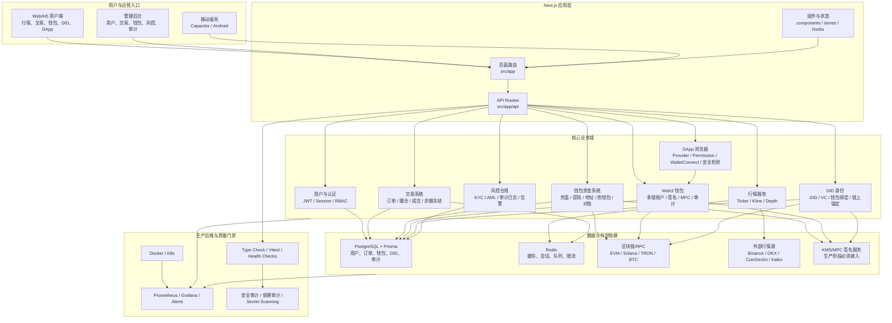
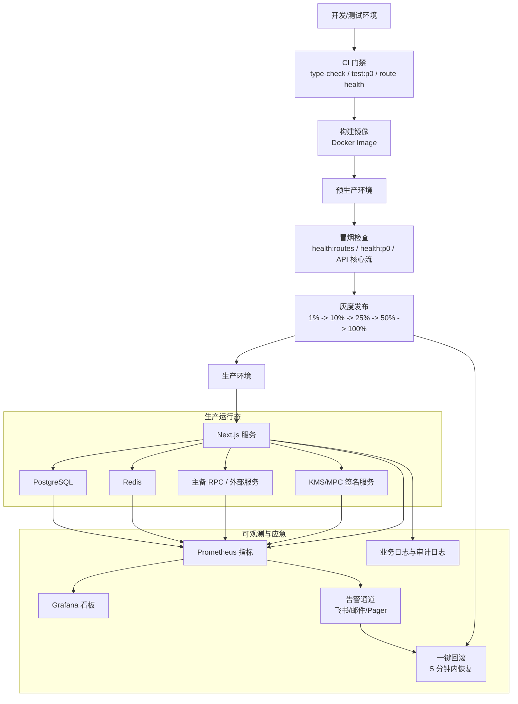

# ZS Exchange 交付工作包：董事局报备与技术团队交接

编制日期：2026-06-30  
适用对象：董事局、项目负责人、技术负责人、产品负责人、测试与运维团队  
项目范围：Stock Exchange dapp / ZS Exchange 数字资产交易平台、钱包、交易、DID、DApp 浏览器、后台管理、生产上线与上链准备

---

## 0. 董事局摘要

当前项目已经不是概念稿或空仓库，而是一个具备较完整工程资产的交易所级 Web3 应用工程。仓库中已经形成 Next.js + TypeScript + Prisma 的主应用，包含交易、钱包、Web3 钱包、DID 身份、DApp 浏览器、管理后台、Solana 接口、生产上链检查、KMS mock 联调、Docker/部署与测试脚本等资产。

但从董事局角度，当前状态应定义为：**工程资产已成型，MVP 主干接近可联调；尚未达到生产上线、主网上链、真实资金大规模承载标准。**

建议对外表述为：

> 项目已完成核心架构、主要业务模块代码、数据库模型、页面与 API 骨架建设，具备交付技术团队继续工程化落地的条件。当前完成度按 100 分制评估为 **67/100**。剩余 33 分主要集中在真实资金链路、生产安全、全量测试、运维监控、灰度上线与合规审计。

董事局需要关注的不是“有没有代码”，而是“能否进入生产经营”。当前答案是：**可以进入技术团队接管与冲刺阶段，不建议直接对外生产发布。**

---

## 1. 交付工程清单

### 1.1 已形成的核心工程资产

| 类别 | 已交付内容 | 证据位置 | 当前评价 |
|---|---|---|---|
| 主应用框架 | Next.js 14、React 18、TypeScript、Tailwind、Ant Design、Zustand、React Query | `package.json`、`src/app`、`src/components` | 已成型 |
| 数据层 | Prisma schema 覆盖用户、交易、钱包、DID/Web3、合约、审计、NFT、DeFi 等模型 | `prisma/schema.prisma` | 已具备主数据模型 |
| API 层 | 用户、行情、交易、钱包、提现、Solana、DID、后台管理等路由 | `src/app/api` | 已具备主干，需补权限与联调 |
| 前端页面 | 用户端、钱包、交易、后台、DID、DApp、内容、电商、链上管理等页面 | `src/app` | 页面多，质量不均，需要核心流程验收 |
| 交易能力 | 现货订单、成交、深度、撮合、永续合约相关代码 | `src/lib/matching`、`src/lib/spot`、`src/lib/perp`、`src/app/api/v1/spot` | 现货主干可继续推进，perp 需专项修复 |
| 钱包能力 | 充值、提现、地址、余额、流水、热钱包、链监听、广播、风控、审计 | `src/lib/wallet`、`src/lib/wallet-transfer`、`src/app/api/v1/wallet` | 框架完整，真实链路需生产级验证 |
| Web3 钱包 | 钱包账户、链配置、交易、签名、MPC、DApp 会话、审计 | `src/modules/web3-wallet` | 工程模块存在，需接入主流程 |
| DID 身份 | did:key / did:pkh / did:web / did:ethr / did:sol、VC、钱包绑定、锚定设计 | `src/modules/did-identity`、`docs/10-DID身份` | 能力丰富，生产签名与鉴权是重点 |
| DApp 浏览器 | EIP-1193 Provider、权限、会话、URL 安全、WalletConnect | `src/modules/dapp-browser`、`docs/09-DApp 浏览器` | 框架存在，需端到端产品化 |
| 移动端包装 | Capacitor、Android 工程、APK 指南 | `android`、`capacitor.config.ts`、`docs/APK_PACKAGING_GUIDE.md` | 可作为移动端壳基础 |
| 合约资产 | 福建老酒分润合约及 Web3 hook | `contracts`、`src/lib/web3/fujian-wine` | 特定业务合约已入仓 |
| 运维部署 | Docker、K8s SOP、Prometheus/Grafana 配置、健康检查脚本 | `docker-compose.yml`、`deploy`、`docs/02-技术规范`、`scripts` | 有基础，生产运行态需验收 |
| 测试与门禁 | type-check、P0 测试、route health、P0 API health | `package.json`、`tests`、`scripts/health-p0-check.cjs` | P0 可用，全量测试需治理 |
| 文档体系 | 技术文档、功能文档、实施计划、MVP 路线图、生产上链检查、审计报告 | `docs` | 文档丰富，需统一成交接版 |

### 1.2 技术框架确认

| 层级 | 技术选型 | 交接说明 |
|---|---|---|
| 前端 | Next.js 14、React 18、TypeScript、Tailwind、Ant Design | 技术团队继续沿用，不建议短期换栈 |
| 状态与请求 | Zustand、TanStack React Query | 用于页面状态和服务端数据缓存 |
| 数据库 | PostgreSQL + Prisma | 当前 schema 已扩展到交易/钱包/Web3/合约等域 |
| Web3 | Wagmi、Viem、Solana Web3.js、noble crypto | 覆盖 EVM 与 Solana，生产密钥管理需加强 |
| 移动端 | Capacitor + Android 工程 | 可先作为 WebView 包装，原生能力后续迭代 |
| 运维 | Docker、K8s、Prometheus/Grafana | 需要从“配置存在”推进到“运行态可证明” |
| 测试 | Vitest、TypeScript gates、健康检查脚本 | 先保 P0 门禁，再拆分 wallet/perp/integration 门禁 |

### 1.3 技术架构图

#### 1.3.1 总体技术架构图

这张图适合放在董事局报备材料中，用来说明项目不是单点页面，而是由用户端、API、交易、钱包、Web3、数据、运维共同组成的平台型系统。

#### 1.3.2 交易与钱包核心闭环图

这张图适合给技术团队，重点说明下一阶段要优先跑通的 MVP 主链路。

```mermaid
flowchart LR
  Register["注册 / 登录"] --> AuthGate["认证与会话"]
  AuthGate --> DepositAddress["生成充值地址"]
  DepositAddress --> ChainDeposit["链上充值交易"]
  ChainDeposit --> Listener["充值监听<br/>确认数 / 幂等 / 重试"]
  Listener --> Credit["入账与余额增加"]
  Credit --> PlaceOrder["用户下单"]
  PlaceOrder --> Freeze["冻结可用余额"]
  Freeze --> Match["撮合引擎"]
  Match --> TradeRows["生成成交记录"]
  TradeRows --> Settle["清结算<br/>更新可用/冻结/手续费"]
  Settle --> WithdrawApply["提现申请"]
  WithdrawApply --> AdminReview["后台审核 / 风控"]
  AdminReview --> Sign["KMS/MPC 签名"]
  Sign --> Broadcast["链上广播"]
  Broadcast --> Confirm["确认 / 失败恢复"]
  Confirm --> Reconcile["资金对账 / 审计日志"]

  RiskCheck["风控规则<br/>限额、黑名单、异常行为"] --> AdminReview
  RiskCheck --> PlaceOrder
  Reconcile --> AuditLog["审计报表"]
```

#### 1.3.3 生产部署与监控架构图

这张图适合技术交接和上线评审，核心是说明生产上线不能只看功能，还要看监控、告警、回滚和安全门禁。

### 1.4 交付给技术团队的文件包

建议技术团队接收时按以下目录验收：

| 交付包 | 目录/文件 | 接收负责人 |
|---|---|---|
| 工程主仓 | `src`、`prisma`、`package.json`、`tsconfig*.json` | 技术负责人 |
| 数据库模型 | `prisma/schema.prisma`、`prisma/migrations` | 后端负责人 |
| API 主干 | `src/app/api` | 后端/API 负责人 |
| 交易系统 | `src/lib/matching`、`src/lib/spot`、`src/lib/perp` | 交易引擎负责人 |
| 钱包充提 | `src/lib/wallet`、`src/lib/wallet-transfer`、`src/repositories/*wallet*` | 钱包负责人 |
| Web3/DID/DApp | `src/modules/web3-wallet`、`src/modules/did-identity`、`src/modules/dapp-browser` | Web3 负责人 |
| 前端页面 | `src/app`、`src/components`、`src/features` | 前端负责人 |
| 运维部署 | `docker-compose.yml`、`Dockerfile`、`deploy`、`infra` | SRE/运维负责人 |
| 验收脚本 | `scripts/health-p0-check.cjs`、`scripts/route-health-check.cjs`、`vitest.p0.config.ts` | 测试负责人 |
| 参考文档 | `docs/ZS_EXCHANGE_TECHNICAL_DOC.md`、`docs/ZS_EXCHANGE_FUNCTIONAL_DOC.md`、`docs/02-技术规范`、`docs/10-DID身份`、`docs/09-DApp 浏览器` | PM/架构 |

---

## 2. 工作进度表：100 分制

### 2.1 当前总评分

| 维度 | 权重 | 当前得分 | 已完成表现 | 未完成事项 |
|---|---:|---:|---|---|
| 基础工程与技术栈 | 10 | 9 | 主工程、依赖、脚本、目录结构完整 | 依赖漏洞与版本治理 |
| 数据库与模型 | 12 | 10 | Prisma 已覆盖交易、钱包、Web3、审计、合约等 | 迁移回放、索引、分区、生产数据策略 |
| API 主干 | 12 | 8 | 多业务 API route 已存在 | 权限、DTO、异常、审计、接口契约需统一 |
| 交易闭环 | 12 | 7 | 现货/撮合/订单/深度已有主干，P0 health 有证据 | 高并发、撮合一致性、perp 专项修复 |
| 钱包充提与资金安全 | 15 | 8 | 地址、充值、提现、热钱包、监听、广播框架存在 | 真实 RPC、签名托管、对账、风控、灰度资金演练 |
| DID / Web3 / DApp | 10 | 6 | 模块丰富，文档完整 | 鉴权、私钥隔离、主网策略、端到端绑定 |
| 前端与后台 | 10 | 6 | 页面数量多，后台覆盖广 | 核心流程真实交互、空壳页面清理 |
| 测试与质量门禁 | 8 | 5 | P0 type-check/test/route health 有脚本与通过记录 | 全量测试、钱包/合约/安全测试不足 |
| 运维监控与上线 | 7 | 4 | Docker、Prometheus、K8s 文档存在 | 运行态验证、告警通知、回滚演练、72h 稳定性 |
| 合规、安全与审计 | 4 | 4 | 已有审计报告和风险清单 | P0 安全项必须逐项关闭 |
| **合计** | **100** | **67** | **可交接、可冲刺、可内测准备** | **不建议直接生产上线** |

### 2.2 为什么是 67 分

给 67 分的原因是：工程资产、数据库模型、API 轮廓、页面和核心模块已经形成，项目具备继续开发和交接价值；但真实交易所上线必须以资金安全、链上签名、真实充值提现、撮合一致性、生产监控、合规审计为门槛，这些还没有达到“可对外运营”的证据标准。

换句话说，项目不是 30 分的原型，也不是 90 分的生产系统。当前最准确的定位是：**工程建设中后段，进入系统联调与生产加固阶段。**

### 2.3 剩余 33 分怎么补齐

| 剩余事项 | 分值 | 交付标准 | 建议负责人 |
|---|---:|---|---|
| 真实充值监听、提币广播、余额对账闭环 | 7 | ETH/BSC/TRON/Solana 至少 2 条链端到端通过，支持确认数、失败重试、幂等 | 钱包负责人 |
| 生产级密钥与签名体系 | 5 | 明文私钥清零，KMS/MPC/keyRef 接入，签名审计可追踪 | Web3/安全负责人 |
| 交易撮合与资金冻结一致性 | 5 | 下单、撮合、成交、撤单、冻结/释放、手续费全链路通过 | 交易负责人 |
| API 权限与管理员 RBAC | 3 | admin API 全部使用管理员权限；用户 API 最小权限；敏感响应白名单 | 后端负责人 |
| 前端核心流程真实化 | 3 | 注册、登录、行情、下单、钱包、充值、提现、后台审核可操作 | 前端负责人 |
| 测试门禁拆分与补全 | 3 | P0、wallet、trade、perp、integration、security 测试分层 | 测试负责人 |
| 生产监控告警 | 3 | Prometheus 规则加载、Grafana 图、告警通道、P0/P1 告警 1 分钟触达 | SRE |
| 安全审计与依赖漏洞修复 | 2 | critical/high 依赖漏洞清零或有隔离说明；JWT/secret scanning 完成 | 安全负责人 |
| 灰度发布与回滚演练 | 2 | 1% -> 10% -> 25% -> 50% -> 100% 灰度方案，5 分钟回滚验证 | PM + SRE |

### 2.4 阶段目标

| 阶段 | 目标分数 | 时间建议 | 目标 |
|---|---:|---|---|
| 当前交接 | 67 | 现在 | 交付技术团队，启动专项冲刺 |
| 内测可演示 | 75 | 2-3 周 | 核心交易、钱包、后台流程跑通 |
| 预生产准入 | 85 | 4-6 周 | 真实链路、权限、安全、监控基本达标 |
| 生产灰度 | 92 | 6-8 周 | 小流量、可回滚、可观测、可审计 |
| 正式运营 | 100 | 8-12 周 | 安全审计关闭、72h 稳定、资金演练通过、董事局批准上线 |

---

## 3. 商业计划书：价值与团队帮助

### 3.1 项目商业定位

ZS Exchange 的商业定位不是单一交易页面，而是“合规数字资产交易 + Web3 身份 + 钱包资金系统 + 企业级后台 + 链上应用入口”的复合平台。其价值来自四个方向：

1. **交易基础设施价值**：现货、合约、订单、行情、钱包、充提等能力构成交易所基础盘。
2. **合规与身份价值**：DID、VC、KYC、审计日志、链上存证为未来合规和机构合作提供基础。
3. **资产入口价值**：钱包、充值、提现、热钱包、Web3 钱包、DApp 浏览器构成用户资产入口。
4. **业务扩展价值**：DeFi、NFT、福建老酒分润合约、电商、内容、企业服务等模块为多业务线扩展预留空间。

### 3.2 对团队的帮助

| 团队 | 直接帮助 | 管理价值 |
|---|---|---|
| 技术团队 | 有现成代码、目录、模型、脚本、文档，不需从 0 开始 | 可按模块分包接手，减少沟通损耗 |
| 产品团队 | 已有大量页面与业务文档，可快速筛选 MVP 范围 | 把“大平台愿景”压缩为可验收流程 |
| 测试团队 | 已有 P0 health 与 route health，可扩展为测试矩阵 | 从人工验收转成脚本化门禁 |
| 运维团队 | Docker/K8s/Prometheus 文档与配置已存在 | 可进入预生产运行态验证 |
| 管理层 | 可以按 100 分制跟踪，不再只听技术描述 | 投入、风险、里程碑可量化 |
| 董事局 | 能看到资产沉淀、剩余风险、商业方向 | 便于判断继续投入与上线节奏 |

### 3.3 商业价值主张

| 价值主张 | 说明 | 变现路径 |
|---|---|---|
| 数字资产交易入口 | 提供行情、交易、资产管理、钱包充提 | 交易手续费、提现手续费、上币服务 |
| 合规身份基础设施 | DID、VC、钱包绑定、审计日志 | 企业认证、合规服务、机构接入 |
| Web3 资产入口 | Web3 钱包、DApp 浏览器、WalletConnect | DApp 分发、生态合作、资产管理服务 |
| 机构后台能力 | 管理后台、风控、审计、财务、链上监控 | B2B 系统服务、白标交易所、托管运营 |
| 多业务扩展 | DeFi、NFT、内容、电商、福建老酒链上权益 | 发行服务、分润、会员、营销活动 |

### 3.4 投入建议

董事局下一步投入不应平均撒到所有模块，而应集中投入四条主线：

| 主线 | 投入优先级 | 原因 |
|---|---|---|
| 交易 + 钱包 MVP | P0 | 这是交易所能否成立的基本闭环 |
| 生产安全 + 密钥体系 | P0 | 资金系统没有安全边界不能上线 |
| 运维监控 + 回滚 | P0 | 上线后必须能发现、止损、恢复 |
| DID/Web3 差异化 | P1 | 用于形成特色，但不能压过交易与资金主线 |

### 3.5 董事局应做的三项决策

1. **确认 MVP 边界**：先做“注册、行情、下单、撮合、充值、提现、余额、后台审核”，暂缓 NFT、复杂 DeFi、完整 DApp 生态、专业级合约交易。
2. **确认上线红线**：明文私钥、默认 JWT、未鉴权 admin、未验证充值提现、无监控告警、无回滚演练，任一存在不得生产上线。
3. **确认专项负责人**：交易、钱包、安全、前端、SRE、测试必须各有负责人，不建议由一个人同时扛所有 P0。

---

## 4. 业务 + 落地计划

### 4.1 落地总策略

采用“先跑通闭环，再扩展生态”的策略。不要把所有页面、所有 Web3 能力、所有后台菜单同时作为上线目标。第一阶段只证明交易所最小闭环成立。

最小闭环如下：

### 4.2 30 天落地计划

| 时间 | 目标 | 交付物 | 验收方式 |
|---|---|---|---|
| 第 1 周 | 技术团队接管与 P0 范围冻结 | 模块负责人、MVP 清单、风险清单、环境基线 | 能复跑 type-check:p0、health:routes、health:p0 |
| 第 2 周 | 交易闭环联调 | 下单、撮合、成交、撤单、余额冻结释放 | 自动化脚本 + 前端操作录屏 |
| 第 3 周 | 钱包充提闭环联调 | 充值地址、链监听、到账、提现申请、审核、广播 | 测试链真实交易 + 对账表 |
| 第 4 周 | 前端/后台/MVP 演示 | 用户端、后台端、钱包端核心流程 | 董事局演示 + 技术验收报告 |

### 4.3 60 天落地计划

| 时间 | 目标 | 交付物 |
|---|---|---|
| 第 5-6 周 | 安全与权限加固 | admin RBAC、JWT 策略、API 响应白名单、secret scanning |
| 第 7 周 | 监控与灰度 | Prometheus/Grafana、告警、运行手册、回滚脚本 |
| 第 8 周 | 预生产验收 | 72h 稳定性、资金演练、异常演练、预生产审计报告 |

### 4.4 90 天落地计划

| 时间 | 目标 | 交付物 |
|---|---|---|
| 第 9-10 周 | 小流量灰度 | 白名单用户、小额资金、限额交易、每日审计 |
| 第 11 周 | 商业试运营 | 交易对、用户、活动、客服、风控值班上线 |
| 第 12 周 | 正式运营评审 | 上线复盘、运营指标、技术债清单、第二阶段预算 |

### 4.5 技术团队分工建议

| 角色 | 人数 | 重点职责 |
|---|---:|---|
| 项目经理/交付经理 | 1 | 范围冻结、进度跟踪、会议纪要、董事局汇报 |
| 技术负责人/架构师 | 1 | 架构把关、代码合并策略、质量门禁 |
| 后端/API 工程师 | 2 | API、权限、Repository、DTO、业务联调 |
| 交易引擎工程师 | 1 | 撮合、订单、余额、成交、手续费 |
| 钱包/Web3 工程师 | 1-2 | 充提、链监听、签名、DID、DApp |
| 前端工程师 | 2 | 用户端、后台端、核心流程真实化 |
| 测试工程师 | 1 | 自动化、回归、测试报告 |
| SRE/安全 | 1 | 生产配置、监控、告警、回滚、漏洞治理 |

### 4.6 管理看板

建议每周向董事局报四个数字：

| 指标 | 当前值 | 目标 |
|---|---:|---:|
| 总完成度 | 67/100 | 100/100 |
| P0 阻断项 | 需专项确认 | 0 |
| 核心闭环通过数 | 交易/钱包/DID 分别验收 | 100% |
| 生产门禁通过数 | 类型、测试、安全、监控、回滚 | 100% |

每周技术团队报五个状态：

1. 本周关闭了哪些 P0。
2. 哪些流程已经能端到端跑通。
3. 哪些问题阻塞上线。
4. 哪些风险需要董事局决策。
5. 下周要把分数从多少推进到多少。

---

## 5. 当前风险清单

| 风险 | 等级 | 说明 | 处理建议 |
|---|---|---|---|
| 生产密钥与签名 | P0 | DID/链上签名历史审计指出存在明文私钥、模拟模式、devnet 等风险 | 接入 KMS/MPC，生产禁用模拟 |
| 权限边界 | P0 | 管理接口、DID 创建/锚定、API key 响应需要白名单和 RBAC | 统一鉴权中间件，补权限测试 |
| 真实资金闭环 | P0 | 充值监听、提币广播、对账、幂等、失败恢复必须真实验证 | 先测试链，再小额主网 |
| 全量质量门禁 | P1 | P0 门禁可用，但全量测试和 perp 类型仍需治理 | 拆分测试套件，perp 独立修复 |
| 生产运行态 | P1 | 配置存在不等于生产可运行 | 完成 Prometheus、告警、日志、回滚演练 |
| 范围膨胀 | P1 | 当前页面和模块很多，容易拖慢 MVP | 先冻结 MVP，其他模块进入第二阶段 |

---

## 6. 建议会议话术

### 6.1 给董事局的表述

> 本阶段交付的不是一个简单页面，而是一套数字资产交易平台的工程底座。代码、数据库模型、API、钱包、DID、DApp、后台、部署与测试材料已经形成资产。按 100 分制评估，当前完成度为 67 分，已经具备交付技术团队继续冲刺的条件，但仍未达到生产上线和主网上链标准。下一阶段重点不是继续扩页面，而是补齐真实交易、资金安全、生产监控和合规审计，把系统从“工程资产”推进到“可运营系统”。

### 6.2 给技术团队的表述

> 接手后不要重写框架，先复用现有 Next.js/TypeScript/Prisma 主干。第一优先级是跑通注册、行情、充值、余额、下单、撮合、提现、后台审核、对账审计这一条最小闭环。DID、Web3 钱包、DApp 浏览器作为差异化模块保留，但必须先解决鉴权、私钥隔离、主网策略和审计链路。

---

## 7. 结论

本项目当前已经具备较高工程沉淀，适合进入“技术团队接管 + MVP 冲刺 + 生产加固”阶段。董事局应批准下一阶段以 **67 -> 85 -> 100** 为目标推进：

- 67 分：当前状态，工程资产可交接。
- 75 分：MVP 可演示，核心流程跑通。
- 85 分：预生产准入，安全与监控基本达标。
- 92 分：小流量灰度，可回滚、可观测、可审计。
- 100 分：正式运营，所有生产红线关闭。

最终交付目标不是“文档说完成”，而是“脚本可跑、流程可演示、资金可对账、风险可止损、董事局可追责”。
