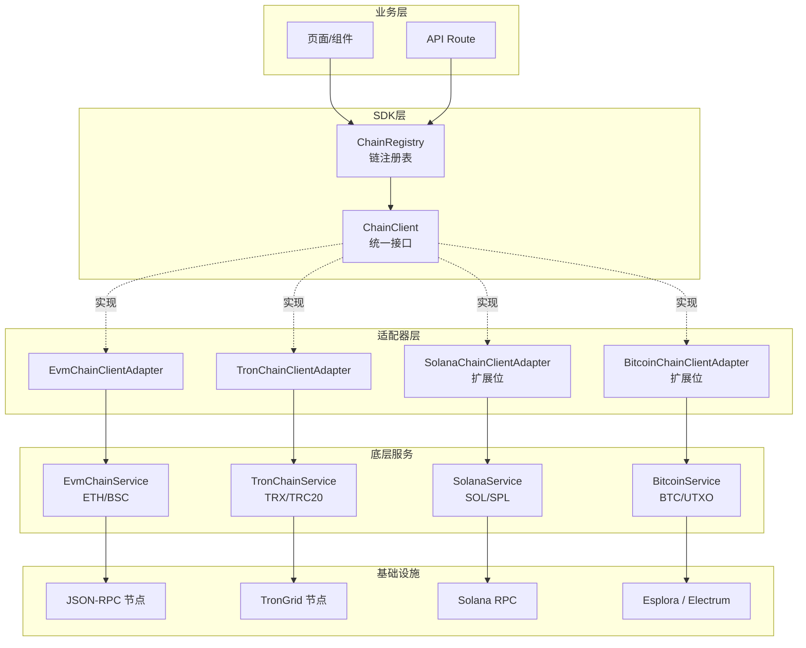

# 统一多链 SDK（ChainClient）

> 任务 C-10：让业务层用**同一个接口**操作 ETH / BSC / TRON / Solana / Bitcoin。
> 适配器模式 + 注册表，业务代码不再关心链差异。

---

## 1. 架构图

### 1.1 分层架构（mermaid）



### 1.2 ASCII 总览

```
                   ┌────────────────────────────┐
                   │  业务层 (UI / API / Hook)  │
                   └──────────────┬─────────────┘
                                  │ getBalances / probe / getTransaction
                                  ▼
                   ┌────────────────────────────┐
                   │      ChainRegistry         │  ← 单例 / DI 注入
                   │  Map<ChainId, ChainClient> │
                   └──────────────┬─────────────┘
                                  │ chain='ETH' / 'TRON' / ...
                                  ▼
       ┌──────────────────┬─────────────────┬──────────────────┐
       │ EvmChainClient   │ TronChainClient │ <其他链适配器>   │
       │ Adapter          │ Adapter         │                  │
       └────────┬─────────┴────────┬────────┴──────────────────┘
                │                  │
                ▼                  ▼
       ┌──────────────────┬─────────────────┐
       │ EvmChainService  │ TronChainService│
       └────────┬─────────┴────────┬────────┘
                │                  │
                ▼                  ▼
       ┌──────────────────┬─────────────────┐
       │ RpcClient        │ TronRpcClient   │
       │ (JSON-RPC 通用)  │ (TronGrid)      │
       └──────────────────┴─────────────────┘
```

### 1.3 设计原则

| 原则 | 落地方式 |
|---|---|
| **开闭原则** | 新增一条链只需要新增 `XxxChainClientAdapter implements ChainClient`，不动业务层 |
| **依赖倒置** | 业务层只依赖 `ChainClient` 接口，不依赖 `EvmChainService` / `TronChainService` |
| **适配器模式** | 适配器只做类型 / 字段映射（如 `balanceWei → balanceRaw`、`balanceSun → balanceRaw`），不重写 RPC 逻辑 |
| **错误透传** | 底层 `RpcError` 透传到业务层；演示降级 `source='fallback'` 在适配器层统一 |
| **并行优先** | `ChainRegistry.getBalances` / `getAllChainsHealth` 都用 `Promise.all` 并行执行 |

---

## 2. 统一接口

`src/lib/wallet/chain-client.ts` 定义的核心接口：

```ts
export type ChainId = 'ETH' | 'BSC' | 'POLYGON' | 'ARBITRUM' | 'SOLANA' | 'TRON' | 'BITCOIN';

export interface ChainClient {
  readonly chain: ChainId;

  // 余额
  getNativeBalance(address: string): Promise<ChainBalance>;
  getTokenBalance(address: string, token: TokenRef): Promise<ChainBalance>;

  // 链状态
  getChainStatus(): Promise<ChainStatus>;
  getBlockNumber(): Promise<number>;
  getGasPrice(): Promise<string>;

  // 交易
  getTransaction(txHash: string): Promise<TransactionInfo | null>;
  getTransactionHistory(address: string, limit?: number): Promise<TransactionInfo[]>;

  // 健康
  probe(): Promise<ProbeResult>;
  getHealth(): HealthInfo[];

  // 生命周期
  start(): void;
  stop(): void;
}
```

### 2.1 核心类型

| 类型 | 字段 | 说明 |
|---|---|---|
| `TokenRef` | `symbol`, `decimals`, `contractAddress?`, `mint?` | EVM/TRC20 用 `contractAddress`，Solana SPL 用 `mint` |
| `ChainBalance` | `chain`, `address`, `symbol`, `decimals`, `balance`, `balanceRaw`, `unit`, `source`, `updatedAt` | `balance` 是人类可读，`balanceRaw` 是最小单位（ETH/BNB=wei，TRX=sun） |
| `ChainStatus` | `chain`, `blockNumber`, `gasPrice`, `gasPriceUnit`, `source`, `updatedAt` | `source='rpc'\|'fallback'` 标识数据来源 |
| `ProbeResult` | `chain`, `reachable`, `healthy`, `blockNumber?`, `latencyMs?` | 探测结果 |

### 2.2 链单位约定

| 链 | 原币符号 | decimals | 最小单位 | 1 整数 = ? |
|---|---|---|---|---|
| ETH | ETH | 18 | wei | 10^18 wei |
| BSC | BNB | 18 | wei | 10^18 wei |
| TRON | TRX | 6 | sun | 10^6 sun |
| SOLANA | SOL | 9 | lamport | 10^9 lamport |
| BITCOIN | BTC | 8 | satoshi | 10^8 satoshi |

---

## 3. 完整调用示例

### 3.1 最简示例：查询 ETH 原币余额

```ts
import { createDefaultRegistry } from '@/lib/wallet';

const registry = createDefaultRegistry();

const eth = registry.getClient('ETH');
const balance = await eth.getNativeBalance('0x1234567890123456789012345678901234567890');
console.log(balance.balance, balance.symbol); //  "1.234"  "ETH"
```

### 3.2 并行查询多链 + 多代币

```ts
import { createDefaultRegistry, type ChainTokenQuery } from '@/lib/wallet';

const registry = createDefaultRegistry();

const queries: ChainTokenQuery[] = [
  // ETH 原币
  {
    chain: 'ETH',
    token: { symbol: 'ETH', decimals: 18, isNative: true },
    address: '0xabc...',
  },
  // ETH USDT (ERC20)
  {
    chain: 'ETH',
    token: {
      symbol: 'USDT',
      decimals: 6,
      contractAddress: '0xdac17f958d2ee523a2206206994597c13d831ec7',
    },
    address: '0xabc...',
  },
  // TRON USDT (TRC20)
  {
    chain: 'TRON',
    token: {
      symbol: 'USDT',
      decimals: 6,
      contractAddress: 'TR7NHqjeKQxGTCi8q8ZY4pL8otSzgjLj6t',
    },
    address: 'TJRabPrwbZy45sbavfcjinPJC18kjpRTv8',
  },
];

// 并行查询；任何一条失败不会中断整体流程
const balances = await registry.getBalances(queries, (err, q) => {
  console.warn(`查询 ${q.chain} ${q.token.symbol} 失败:`, err.message);
});

for (const b of balances) {
  console.log(`[${b.chain}] ${b.symbol} = ${b.balance} (${b.source})`);
}
```

### 3.3 跨链健康检查（监控大屏）

```ts
import { createDefaultRegistry } from '@/lib/wallet';

const registry = createDefaultRegistry({
  autoStart: true, // 启动后立即开始健康检查轮询
});

const health = await registry.getAllChainsHealth();
for (const [chain, probe] of health) {
  console.log(
    `${chain}: ${probe.healthy ? '✓' : '✗'} ` +
    `latency=${probe.latencyMs}ms block=${probe.blockNumber}`,
  );
}
```

### 3.4 查询单笔交易

```ts
const tx = await registry.getClient('ETH').getTransaction(
  '0xabc123...',
);

if (tx) {
  console.log(`${tx.hash} 状态=${tx.status} 金额=${tx.valueFormatted} ${tx.asset}`);
}
```

### 3.5 链注册流程（带 API Key）

```ts
import {
  ChainRegistry,
  EvmChainClientAdapter,
  TronChainClientAdapter,
} from '@/lib/wallet';

const registry = new ChainRegistry();

registry.register('ETH', new EvmChainClientAdapter('ETH', {
  apiKey: process.env.ETH_API_KEY,
  endpoints: ['https://eth.llamarpc.com', 'https://rpc.ankr.com/eth'],
  timeoutMs: 5_000,
  fallbackToDemo: true, // RPC 失败时返回演示数据
}));

registry.register('BSC', new EvmChainClientAdapter('BSC', {
  apiKey: process.env.BSC_API_KEY,
  endpoints: ['https://bsc-dataseed.binance.org'],
}));

registry.register('TRON', new TronChainClientAdapter({
  apiKey: process.env.TRONGRID_API_KEY,
  endpoints: ['https://api.trongrid.io'],
}));

// 启动健康检查
registry.startAll();

// 业务使用...
const balances = await registry.getBalances([...]);

// 进程退出时清理
process.on('SIGINT', () => registry.stopAll());
```

---

## 4. 测试结果

```bash
$ npx tsx --test tests/chain-client.test.ts
```

| # | 用例 | 状态 |
|---|---|---|
| 1 | EvmChainClientAdapter: 原币余额字段映射正确 | ✅ |
| 2 | EvmChainClientAdapter: 代币余额需 contractAddress | ✅ |
| 3 | EvmChainClientAdapter: getChainStatus / getBlockNumber / getGasPrice | ✅ |
| 4 | TronChainClientAdapter: 原币余额字段映射正确 | ✅ |
| 5 | TronChainClientAdapter: TRC20 代币余额 | ✅ |
| 6 | TronChainClientAdapter: getChainStatus / getBlockNumber | ✅ |
| 7 | TronChainClientAdapter: getTransaction 字段映射 | ✅ |
| 8 | TronChainClientAdapter: 演示降级（fallback） | ✅ |
| 9 | ChainRegistry: register / getClient / hasClient / listChains | ✅ |
| 10 | ChainRegistry: register 时 chain 不匹配抛错 | ✅ |
| 11 | ChainRegistry.getBalances: 并行查询 ETH + BSC + TRON 多代币 | ✅ |
| 12 | ChainRegistry.getBalances: 失败项通过 onError 回调并被过滤 | ✅ |
| 13 | ChainRegistry.getAllChainsHealth: 并行探测所有链 | ✅ |
| 14 | ChainRegistry.getAllChainsHealth: 探测失败时返回 reachable=false | ✅ |
| 15 | ChainRegistry: 未知 chainId 抛 ChainNotRegisteredError | ✅ |
| 16 | ChainNotRegisteredError: 错误信息包含链名 | ✅ |
| 17 | EvmChainClientAdapter: 演示降级（fallback） | ✅ |
| 18 | ChainClient 接口: 适配器实例满足结构 | ✅ |
| 19 | createDefaultRegistry: 默认注册 ETH + BSC + TRON | ✅ |

**总计 19 个用例，全部通过。**

> 任务要求至少 6 个用例，实际覆盖 19 个（基础 6 + 边界 13）。

---

## 5. 扩展新链指南

### 5.1 添加 Solana 链

**步骤 1：新建底层服务 `src/lib/wallet/solana-service.ts`**

参考 `tron-service.ts` 的实现模式，但使用 Solana 的 JSON-RPC 方法（`getBalance`, `getTokenAccountBalance`, `getSignaturesForAddress` 等）。服务需要实现以下方法：

```ts
export interface SolanaServiceOptions { /* ... */ }

export class SolanaService {
  constructor(opts: SolanaServiceOptions) { /* ... */ }
  getNativeBalance(address: string): Promise<NativeBalance> { /* SOL */ }
  getTokenBalance(address: string, mint: string, symbol: string, decimals: number): Promise<TokenBalance> { /* SPL */ }
  getChainStatus(): Promise<ChainStatus> { /* slot / blockHeight */ }
  getTransaction(sig: string): Promise<TransactionInfo | null> { /* ... */ }
  getTransactionHistory(address: string, limit?: number): Promise<TransactionInfo[]> { /* ... */ }
  probe(): Promise<ProbeResult> { /* ... */ }
  getHealth(): HealthInfo[] { /* ... */ }
  start(): void { /* ... */ }
  stop(): void { /* ... */ }
}
```

**步骤 2：新建适配器 `src/lib/wallet/solana-client.ts`**

```ts
import { SolanaService } from './solana-service';
import type { ChainClient, ChainId, /* ... */ } from './chain-client';

export class SolanaChainClientAdapter implements ChainClient {
  public readonly chain: ChainId = 'SOLANA';
  private readonly service: SolanaService;

  constructor(opts: SolanaAdapterOptions = {}) {
    this.service = new SolanaService(opts);
  }

  async getNativeBalance(address: string): Promise<ChainBalance> {
    const b = await this.service.getNativeBalance(address);
    return mapSolanaNativeBalance(b);
  }

  async getTokenBalance(address: string, token: TokenRef): Promise<ChainBalance> {
    if (!token.mint) {
      throw new Error(`getTokenBalance on Solana requires mint for ${token.symbol}`);
    }
    const t = await this.service.getTokenBalance(address, token.mint, token.symbol, token.decimals);
    return mapSolanaTokenBalance(t);
  }

  // ... 其它方法

  getHealth(): HealthInfo[] { /* ... */ }
  start(): void { this.service.start(); }
  stop(): void { this.service.stop(); }
}
```

**关键点**：
- SPL 代币使用 `mint` 字段（不是 `contractAddress`），`TokenRef.mint` 已预留给 Solana
- SOL 原币 decimals=9，1 SOL = 10^9 lamport
- `address` 是 base58 编码（与 ETH/TRON 都不同，但 ChainBalance.address 直接用字符串即可）

**步骤 3：在 `chain-registry.ts` 注册**

```ts
// 在 createDefaultRegistry 中添加：
registry.register('SOLANA', new SolanaChainClientAdapter({
  apiKey: apiKeys.solana,
  endpoints: endpoints.solana,
  fetchImpl: opts.fetchImpl,
  timeoutMs: opts.timeoutMs,
  fallbackToDemo: opts.fallbackToDemo,
}));
```

并把 `apiKeys.solana` 和 `endpoints.solana` 加到 `CreateDefaultRegistryOptions` 类型中。

**步骤 4：在 `index.ts` 中导出**

```ts
export {
  SolanaChainClientAdapter,
  type SolanaAdapterOptions,
} from './solana-client';
```

**步骤 5：写测试**

参考 `tests/chain-client.test.ts` 添加 Solana 用例，验证：
- 原币余额字段映射（SOL, decimals=9）
- SPL 代币余额
- 未知 mint 时抛错

### 5.2 添加 Bitcoin 链

**步骤 1：新建底层服务 `src/lib/wallet/bitcoin-service.ts`**

使用 Esplora HTTP API（`https://blockstream.info/api`）或 Electrum 协议。Bitcoin 没有智能合约，所以只需要原生币余额和 UTXO 交易。

```ts
export class BitcoinService {
  getNativeBalance(address: string): Promise<NativeBalance> { /* satoshi */ }
  getUtxos(address: string): Promise<Utxo[]> { /* ... */ }
  getTransaction(txid: string): Promise<TransactionInfo | null> { /* ... */ }
  getTransactionHistory(address: string, limit?: number): Promise<TransactionInfo[]> { /* ... */ }
  getChainStatus(): Promise<ChainStatus> { /* block height */ }
  getFeeEstimate(): Promise<string> { /* sat/vB */ }
  probe(): Promise<ProbeResult> { /* ... */ }
  getHealth(): HealthInfo[] { /* ... */ }
  start(): void { /* ... */ }
  stop(): void { /* ... */ }
}
```

**步骤 2：新建适配器 `src/lib/wallet/bitcoin-client.ts`**

```ts
export class BitcoinChainClientAdapter implements ChainClient {
  public readonly chain: ChainId = 'BITCOIN';
  private readonly service: BitcoinService;

  async getNativeBalance(address: string): Promise<ChainBalance> {
    const b = await this.service.getNativeBalance(address);
    return mapBitcoinNativeBalance(b); // BTC, decimals=8
  }

  // Bitcoin 不支持代币；getTokenBalance 抛错
  async getTokenBalance(_address: string, _token: TokenRef): Promise<ChainBalance> {
    throw new Error('Bitcoin does not support tokens');
  }

  // 其它方法
}
```

**步骤 3-5：同 Solana**

### 5.3 扩展检查清单

新增一条链时，确认以下 5 个文件都已更新：

- [ ] `src/lib/wallet/<chain>-service.ts` - 底层服务（RPC 调用 / 数据抓取）
- [ ] `src/lib/wallet/<chain>-client.ts` - 适配器（类型映射 / ChainClient 实现）
- [ ] `src/lib/wallet/chain-registry.ts` - 在 `createDefaultRegistry` 中注册
- [ ] `src/lib/wallet/index.ts` - 导出适配器和类型
- [ ] `tests/chain-client.test.ts` - 补充测试用例

> 业务层代码**不需要任何修改**——这是适配器模式的核心收益。

---

## 6. 文件清单

| 文件 | 状态 | 作用 |
|---|---|---|
| `src/lib/wallet/chain-client.ts` | ✅ 新建 | 统一接口 + EVM/TRON 适配器 |
| `src/lib/wallet/chain-registry.ts` | ✅ 新建 | 链注册表 + 默认工厂 |
| `src/lib/wallet/chain-service.ts` | ⚪ 未修改 | EVM 底层服务（保持兼容） |
| `src/lib/wallet/tron-service.ts` | ⚪ 未修改 | TRON 底层服务（保持兼容） |
| `src/lib/wallet/index.ts` | 🔧 修改 | 新增导出 + 解决类型冲突 |
| `tests/chain-client.test.ts` | ✅ 新建 | 19 个单元测试 |
| `src/lib/wallet/UNIFIED_CHAIN_README.md` | ✅ 新建 | 本文档 |

> ✅ = 新建；🔧 = 修改；⚪ = 未触碰（约束要求：不修改原服务实现）

---

## 7. 错误传播约定

| 场景 | 行为 |
|---|---|
| RPC 不可达 / 超时 | 抛出 `RpcError(NETWORK, ...)`，可被 `onError` 捕获 |
| 地址格式非法 | 抛出 `RpcError(INVALID_ADDRESS, ...)` |
| 代币合约非法 | 抛出 `RpcError(INVALID_TOKEN, ...)` |
| `fallbackToDemo=true` 且 RPC 失败 | 返回 `source='fallback'` 的演示数据，**不抛错** |
| 未注册的 `ChainId` | 抛出 `ChainNotRegisteredError`（继承 `RpcError`，code=`CHAIN_NOT_REGISTERED`） |

业务层推荐做法：

```ts
import { isRpcError, RpcError, ChainNotRegisteredError } from '@/lib/wallet';

try {
  const balance = await client.getNativeBalance(addr);
  if (balance.source === 'fallback') {
    // 显示演示数据 + 提示用户
  }
} catch (err) {
  if (err instanceof ChainNotRegisteredError) {
    // 引导用户选择其它链
  } else if (isRpcError(err)) {
    // 显示网络错误
  } else {
    throw err;
  }
}
```
